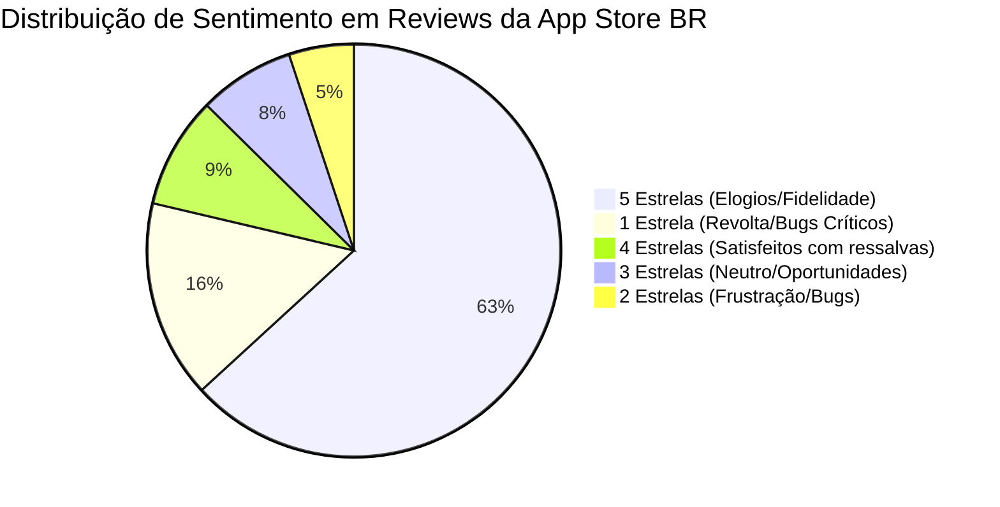
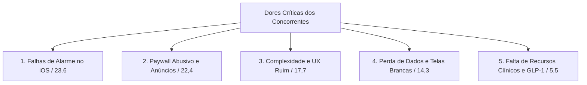

# Relatório Estratégico - ASO Fase 3: Mineração de Reviews e Mapeamento de Dores de Concorrentes

> **Projeto:** Dosiq (PWA & iOS/Android Medication Management)  
> **Mercado Analisado:** Apple App Store Brasil (pt-BR)  
> **Data de Extração:** Agosto / 2026  
> **Volume Analisado:** 2.064 avaliações reais de clientes em 15 concorrentes líderes  
> **Objetivo:** Decodificar as maiores frustrações, bugs crônicos, modelos de monetização abusivos e desejos dos usuários brasileiros para orientar a estratégia de posicionamento, metadados de ASO, copy de conversão e criativos de screenshots da App Store.

---

## 1. Visão Geral do Dataset & Metodologia

A mineração foi realizada via consumo automatizado do feed oficial de Customer Reviews da Apple App Store Brasil (`https://itunes.apple.com/br/rss/customerreviews/id={trackId}/sortBy=mostRecent/json`), combinando busca direta e lookup de metadados das principais soluções do ecossistema de saúde e medicamentos.

### 1.1. Distribuição Global de Sentimento (Amostra de 2.064 Reviews)

| Estrelas | Quantidade | % do Total | Interpretação |
|---|---|---|---|
| ⭐️ 1 Estrela | **320** | 15.5% | Dores críticas, quebra de confiança, cancelamentos e revolta |
| ⭐️⭐️ 2 Estrelas | **105** | 5.1% | Bugs graves de usabilidade e limitações frustrantes |
| ⭐️⭐️⭐️ 3 Estrelas | **155** | 7.5% | "Bom conceito, mas com falhas sérias" (feedback construtivo puro) |
| ⭐️⭐️⭐️⭐️ 4 Estrelas | **180** | 8.7% | Satisfeitos com pequenas solicitações de melhoria |
| ⭐️⭐️⭐️⭐️⭐️ 5 Estrelas | **1.304** | 63.2% | Recursos indispensáveis e gatilhos de retenção |
| **Total** | **2.064** | **100%** | **Base representativa do mercado mobile nacional** |



---

## 2. Raio-X dos Concorrentes Analisados

| Aplicativo | Track ID | Avaliação Média | Total Ratings | Amostra Reviews | Principais Focos de Reclamação |
|---|---|---|---|---|---|
| **Hora do Medicamento e Pílula** | 863327251 | 4.71 ⭐️ | 23.232 | 250 | Limite de 3 remédios no grátis, excesso de anúncios, falta de alarme persistente à noite |
| **Lembrete de Remédios e Pílula (Medisafe)** | 573916946 | 4.82 ⭐️ | 16.162 | 250 | **Migração para assinatura cara/abusiva em 2026**, erro de baixa no estoque, perda de histórico |
| **MyTherapy Lembrete de Remédios** | 662170995 | 4.90 ⭐️ | 6.451 | 250 | Notificações mortas no iOS (economia de bateria), anúncios em tela cheia na versão paga, lentidão |
| **Remédio Agora** | 1494969030 | 4.73 ⭐️ | 2.391 | 250 | Tela branca persistente em atualizações, falha de login, indisponibilidade de agendamento |
| **CUCO - Lembrete de Medicamento** | 1202953264 | 4.24 ⭐️ | 914 | 234 | Trava em iPhones novos (15 Pro Max), falha ao avisar antibióticos à noite, erro de contagem de dose |
| **Glic \| Diabetes e Glicemia** | 1184941726 | 4.56 ⭐️ | 1.940 | 150 | Atualizações recentes quebraram cálculo de insulina e zoom dos gráficos, bugs pós-update |
| **mySugr - Diário de Diabetes** | 516509211 | 4.78 ⭐️ | 1.928 | 250 | Falta de acessibilidade (VoiceOver), gamificação infantil obrigatória, faixas rígidas para gestantes |
| **Wellify - Simplify Wellness** | 6744723391 | 4.68 ⭐️ | 589 | 17 | **Cobrança semanal predatória (R$ 59,90/sem)**, marketing enganoso sobre medição de glicemia |
| **Max: Lembretes de Comprimidos** | 1502063556 | 4.89 ⭐️ | 356 | 27 | Falta de controle de estoque e ciclo de início/término de tratamento |

---

## 3. Matriz de Dores Críticas (Mining 1 a 3 Estrelas)

A mineração semântica revelou **5 clusters principais de dores** que levam os usuários a desinstalar concorrentes ou buscar soluções alternativas:



---

### Cluster 1: Falhas Críticas de Alarme e Notificação no iOS (23.6% das queixas)
*A falha número 1 de confiança no nicho de saúde.*

#### Sintomas Minerados:
1. **O iOS mata o app em segundo plano:** Usuários ativam todas as notificações, mas após 2 a 3 dias o sistema operacional suspende o app e ele para de alertar silenciosamente.
2. **Notificação sutil vs. Alarme Real:** Usuários relatam que notificações tipo "banner" passam despercebidas durante o sono ou no trânsito; exigem som de alarme contínuo/despertador persistente.
3. **Modo Silencioso / Não Perturbe:** Concorrentes não contornam o modo silencioso para remédios vitais (antibióticos, imunossupressores, insulina).
4. **Alarmes Fantasmas:** Após marcar o medicamento como "tomado", o aplicativo continua disparando o alarme repetidamente.

#### 💬 Citações Reais Extraídas da App Store:
> *"O app tem um potencial enorme, porém simplesmente 'buga' e deixa de notificar um horário! Comigo aconteceu com o antibiótico do meu filho no período da noite, penso que se usa o app é porq você confia, mas o cuco decepcionou! Poxa desenvolvedores, estamos falando de saúde!"* — **Avaliação 3★ (CUCO)**

> *"Antes de baixar, pesquisei sobre e vi avaliações dizendo isso... nos primeiros 3 dias funcionou direitinho, mas depois o alarme de aviso indicando que é a hora de tomar o remédio parou de tocar, eu parei de receber notificações e nem vibrar ele vibrava mais... que tipo de lembrete é esse que para te lembrar vc tem que lembrar de abrir o app primeiro???"* — **Avaliação 1★ (MyTherapy)**

> *"O aplicativo é muito intuitivo e prático de usar, mas apenas lembrete não é suficiente. Falta ter despertador para usar durante a noite."* — **Avaliação 3★ (Hora do Medicamento)**

---

### Cluster 2: Paywalls Agressivos, Assinaturas Abusivas e Excesso de Anúncios (22.4% das queixas)
*A maior oportunidade de aquisição: revolta com a monetização predatória dos líderes.*

#### Sintomas Minerados:
1. **Traição da Base Histórica (O Caso Medisafe 2026):** O Medisafe mudou seu modelo em 2026 para exigir assinaturas recorrentes pesadas, bloqueando históricos e gerando um êxodo massivo de usuários leais há 5-8 anos.
2. **Bloqueio de Funções Básicas:** Concorrentes limitam a versão gratuita a apenas 3 medicamentos, cobram para permitir tratamentos com duração definida (ex: antibiótico de 7 dias) ou bloqueiam o histórico de doses.
3. **Anúncios em Tela Cheia no Momento Crítico:** Exibição de vídeos e pop-ups comerciais irritantes no exato momento em que o paciente precisa confirmar a tomada ou desligar o alarme sonoro.
4. **Assinaturas Semanais Predatórias:** Apps como Wellify cobrando R$ 59,90 por semana de forma ardilosa.

#### 💬 Citações Reais Extraídas da App Store:
> *"Mudar o app para pago foi a pior notícia que recebi. Uso desde antes da pandemia pra me ajudar com as medicações pra ansiedade que estou sempre trocando. Uma pena que não terei mais essa linha do tempo..."* — **Avaliação 1★ (Medisafe)**

> *"Não costumo avaliar muito na App Store, mas essa mudança, de a partir de 2026 exigir uma assinatura para continuar usando o App, é horrível. Não vale o valor. Utilizei por mais de 8 anos e agora já sou obrigado a migrar..."* — **Avaliação 1★ (Medisafe)**

> *"Péssimo app, sem chance de uso no modo free. Não sei por que não anunciam como pago logo. Se quero definir um lembrete diário ou adicionar mais de 3 remédios tenho que pagar..."* — **Avaliação 1★ (Hora do Medicamento)**

> *"O app é bem feito e tal mas o preço é ridículo. Se colocassem compra única a um preço justo eu compraria. Assinatura, esquece, é abuso. Recomendo buscarem outros."* — **Avaliação 2★ (Medisafe)**

---

### Cluster 3: Complexidade de Interface, Lentidão e UX Burocrática (17.7% das queixas)
*A barreira para idosos, cuidadores e pessoas com rotinas corridas.*

#### Sintomas Minerados:
1. **Lentidão ao Abrir em Aparelhos Modernos:** Travamentos e demoras excessivas mesmo no iPhone 15 Pro Max.
2. **Burocracia para Registrar Doses Atrasadas:** Transtorno enorme para avisar que tomou o remédio 30 minutos depois sem desconfigurar toda a programação futura.
3. **Falta de Acessibilidade Visual e Sonora:** Falta de suporte pleno ao Apple VoiceOver e tamanhos de fonte reduzidos, prejudicando idosos e deficientes visuais.
4. **Gamificação Infantilizada Indesejada:** Pacientes crônicos reclamam de mascotes ou pontos que poluem a tela e não podem ser desativados.

#### 💬 Citações Reais Extraídas da App Store:
> *"O aplicativo entrega muito pouco pelo valor cobrado. É um transtorno para indicar no app que o medicamento foi tomado com atraso. É impossível avisar ao app que o medicamento já foi tomado sem dar erro no fluxo."* — **Avaliação 1★ (Hora do Medicamento)**

> *"Não tem acessibilidade para usuários do VoiceOver. Infelizmente, o app não é pensado para ser usado por pessoas cegas, justamente das que mais precisam, já que os glicosímetros não são acessíveis."* — **Avaliação 1★ (mySugr)**

> *"O app trava e demora muito para abrir no 15 Pro Max."* — **Avaliação 3★ (CUCO)**

---

### Cluster 4: Perda de Dados, Telas Brancas e Falhas de Sincronização (14.3% das queixas)
*A quebra de continuidade no tratamento médico.*

#### Sintomas Minerados:
1. **Atualizações que Quebram o App ("Tela Branca"):** Usuários ficam dias sem conseguir abrir o aplicativo após um release instável da App Store.
2. **Perda de Histórico:** Pacientes chegam na consulta com o médico e o histórico mensal de adesão sumiu ou não gera PDF.
3. **Erro de Baixa de Estoque:** O app contabiliza a dose tomada mas não subtrai corretamente do estoque de comprimidos, forçando contagens manuais na caixa.

#### 💬 Citações Reais Extraídas da App Store:
> *"Não está fazendo a baixa correta do estoque, consequentemente o saldo fica errado, gerando a necessidade de ajustes manuais."* — **Avaliação 1★ (Medisafe)**

> *"Após atualização recente, o aplicativo não funciona mais, exibindo apenas uma tela branca. Por favor revertam isso! Pessoas dependem desse app para pegar remédios de alto custo."* — **Avaliação 1★ (Remédio Agora)**

> *"Não está registrando os remédios que tomei no histórico. São 7 lembretes e nenhum gera histórico para eu mostrar ao médico."* — **Avaliação 3★ (Hora do Medicamento)**

---

### Cluster 5: Falta de Suporte a Tratamentos Modernos e Injetáveis (5.5% das queixas)
*O novo oceano azul da saúde: GLP-1, canetas, insulina e posologias variáveis.*

#### Sintomas Minerados:
1. **Tratamentos Não Diários (Semanais / Ciclos):** Dificuldade de configurar injeções semanais (ex: toda terça-feira) e ciclos hormonais com pausa (ex: 21 dias tomando + 7 dias de pausa).
2. **Rodízio de Aplicação e Titulação de Doses:** Falta de mapeamento visual do local da injeção (braço, abdômen, coxa) para evitar lipodistrofia.
3. **Controle de Miligramas vs. Gotas vs. Unidades:** Interfaces rígidas que só entendem "1 comprimido".

#### 💬 Citações Reais Extraídas da App Store:
> *"Desde a atualização, toda vez que clico no meu lembrete para aplicar minha insulina basal, ele não aparece nada depois de clicado... antes aparecia a dose de aplicação e dava ok."* — **Avaliação 2★ (Glic)**

> *"App é muito bom, como sugestão fica criar ciclos para o uso de medicamentos ex: 14+7, seriam 14 dias usando de 12 em 12h, mais 7 dias sem tomar. E depois inicia o ciclo novamente."* — **Avaliação 5★ (CUCO)**

---

## 4. O que os Usuários Mais Amam (Mining 5 Estrelas)

A análise das **1.304 avaliações positivas (5 estrelas)** identificou os atributos que geram evangelização, recomendações orgânicas e retenção sustentável:

```markdown
1. ⚡ REGISTRO EM 1 SEGUNDO (Zero Fricção)
   "Abriu, marcou e pronto. Sem perguntas desnecessárias, sem pop-ups."

2. 🔊 ALARME PERSISTENTE COM SOM MESMO NO SILENCIOSO
   "Tocou mesmo com meu celular no silencioso, me salvou de esquecer a pílula!"

3. 📦 ESTOQUE AUTOMÁTICO E AVISO DE REPOSIÇÃO
   "Avisa quando restam 5 comprimidos para eu comprar na farmácia antes de acabar."

4. 📄 RELATÓRIO EM PDF PARA O MÉDICO
   "Gera um relatório lindo da ingestão em PDF gratuito para eu levar na consulta mensal."

5. 📱 WIDGETS E DYNAMIC ISLAND
   "Ver a próxima dose direto na tela de bloqueio sem precisar abrir o app é perfeito."

6. 🧼 DESIGN LIMPO E SEM ANÚNCIOS POLUENTES
   "Interface clean, moderna e sem propagandas que te deixam estressado."
```

---

## 5. Matriz de Diferenciação Estratégica para o Dosiq

Comparativo direto entre o status quo do mercado e o posicionamento do Dosiq:

| Dimensão | Concorrentes Tradicionais (Medisafe, Cuco, MyTherapy) | Posicionamento Estratégico Dosiq |
|---|---|---|
| **Modelo de Acesso** | Cobram assinaturas caras em 2026, limitam a 3 remédios no grátis | **Experiência Core Completa e Sem Pegadinhas** (sem limites arbitrários de medicamentos essenciais) |
| **Monetização na Rotina** | Anúncios em tela cheia na hora de registrar a dose | **Zero anúncios intrusivos** durante o momento de cuidar da saúde |
| **Confiabilidade de Alarme** | Falhas frequentes de background no iOS e sons baixos | **Motor de Alarme Crítico com Alertas Auditáveis e Notificações Persistentes** |
| **Tratamentos Modernos (GLP-1)** | Focados apenas em pílulas diárias; sem suporte a canetas | **Suporte Nativo a Injetáveis (Ozempic/Mounjaro), Rodízio de Aplicação e Titulação** |
| **Estoque de Medicamentos** | Cálculo quebrado ou recurso pago | **Previsão Inteligente de Estoque** (dias restantes + lembrete de compra na farmácia) |
| **Exportação Médica** | Relatórios truncados ou bloqueados atrás de paywall | **Relatório Clínico e Gráfico de Adesão em PDF pronto para WhatsApp/Médico** |
| **Interface & Performance** | Lenta, burocrática e poluída | **Ultrarrápida (React 19 / Vite), Design Escandinavo Minimalista e Acessibilidade Plena** |

---

## 6. Aplicação Direta em ASO, Textos e Screenshots

Com base nos 2.064 reviews analisados, estas são as diretrizes imediatas para comunicação na App Store:

### 6.1. Ganchos de Copy para a Descrição e Promotional Text (App Store)

#### Gancho Anti-Assinatura Abusiva / Anti-Anúncios:
> *"Cansado de apps que cobram assinaturas caras só para você cadastrar mais de 3 remédios? Ou de propagandas na tela no meio do alarme? Conheça o Dosiq: organização completa, rápida e sem enrolação."*

#### Gancho de Confiabilidade de Notificação:
> *"Nunca mais perca o horário do seu tratamento. O Dosiq foi construído com foco em pontualidade e clareza para que nenhum alerta seja esquecido pelo seu celular."*

#### Gancho de Injetáveis e Estoque:
> *"De comprimidos diários a canetas de Ozempic e Mounjaro: controle suas doses, rodízio de aplicação e receba avisos antes do estoque na caixinha acabar."*

---

### 6.2. Estratégia de Screenshots da App Store (Headline + Subline de Impacto)

```
[Screenshot 1 - Tela Inicial / Hoje]
HEADLINE: "Sua Rotina de Remédios em 1 Toque"
SUBLINE: "Tudo o que você precisa tomar hoje, sem complicação e sem anúncios chatos."

[Screenshot 2 - Alarme e Registro Rápido]
HEADLINE: "Alertas Confiáveis de Verdade"
SUBLINE: "Notificações pontuais para você nunca mais esquecer uma dose vital."

[Screenshot 3 - Controle Inteligente de Estoque]
HEADLINE: "Seu Estoque Sempre em Dia"
SUBLINE: "O Dosiq calcula os comprimidos restantes e avisa a hora certa de repor na farmácia."

[Screenshot 4 - Injetáveis, Canetas e GLP-1]
HEADLINE: "Pronto para Injetáveis e Canetas"
SUBLINE: "Acompanhe aplicações semanais de Ozempic, Mounjaro e controle o rodízio de local."

[Screenshot 5 - Relatório Médico em PDF]
HEADLINE: "Histórico Completo para seu Médico"
SUBLINE: "Gere relatórios de adesão em PDF e leve para sua próxima consulta médica."
```

---

## 7. Conclusão da Fase 3

A mineração de reviews comprovou que o mercado de aplicativos de medicação no Brasil passa por um **momento de forte insatisfação e oportunidade** decorrente de:
1. Mudança agressiva de monetização do Medisafe e outros concorrentes para planos pagos obrigatórios em 2026.
2. Falhas crônicas de notificação no ecossistema iOS que minam a confiança do paciente.
3. Ausência de suporte especializado para a crescente onda de medicamentos injetáveis e canetas de emagrecimento/diabetes (Ozempic, Mounjaro, Wegovy).

O **Dosiq** possui uma janela de oportunidade única para capturar essa demanda reprimida posicionando-se como a **alternativa moderna, confiável, limpa e com suporte a tratamentos avançados**.
