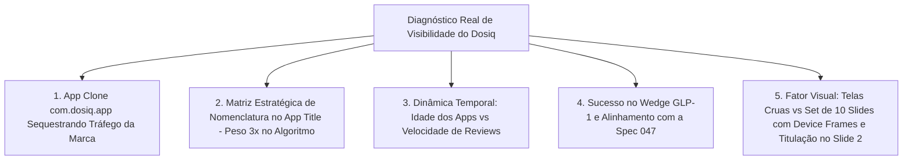

# 📊 Relatório Diagnóstico & Benchmark Consolidado (Fase 5) - ASO Dosiq (Revisão 4.1 Consolidada)

> **Data de Emissão:** 20 de Agosto de 2026  
> **Status:** Diagnóstico Consolidado com Provas Oficiais (GoDaddy + App Store Connect), Denúncia de Copycat Protocolada (Guideline 4.1), Review Velocity, Spec 047, Raio-X Visual das 9 Telas e Matriz Estratégica de Decisão de Nomes/Textos  
> **App Legítimo do Dosiq:** `com.coelhotv.dosiq` (Antonio Coelho / Track ID `6762740948` / Domínio `dosiq.app` de 11/05/2026 / Publicação App Store em 26/05/2026)  
> **App Clone Identificado:** `com.dosiq.app` (Aura Management LLC / Track ID `6772805693` — Infrator de Marca e Usurpador de Domínio sob Guideline 4.1)  
> **Fontes:** Apple iTunes Search API Oficial, Google Trends Brasil, Apple Search Hints, RSS de Customer Reviews (2.064 minerados), Spec 047, Recibo GoDaddy Nº 4069265086, Histórico App Store Connect e Inspeção Visual dos Screenshots  
> **Local do Arquivo:** `.agent/drafts/aso_benchmark_analysis_2026/ASO_FASE_5_DIAGNOSTICO_E_BENCHMARK_CONSOLIDADO.md`

---

## 🎯 1. Sumário Executivo: A Realidade Temporal e Algorítmica do Dosiq

A análise cruzada das 4 frentes de inteligência de mercado, o histórico documental e o teardown visual completo revelaram com **precisão matemática e algorítmica** os 5 fatores que explicam o posicionamento atual do Dosiq na Apple App Store Brasil:

---

## 🔬 2. Diagnóstico Profundo dos 5 Fatores Críticos

### 🚨 Fator 1: Apropriação Indevida de Marca e Usurpação de Domínio (`com.dosiq.app`)
* **Evidências Documentais Irrefutáveis:**
  1. **Domínio Raiz (GoDaddy):** Antonio Coelho registrou oficialmente os domínios `dosiq.app` e `dosiq.org` em **11/05/2026** (Recibo GoDaddy Nº 4069265086).
  2. **Histórico App Store Connect:** O app legítimo `com.coelhotv.dosiq` foi submetido em **06/05/2026** e liberado para distribuição pública em **26/05/2026** (v0.5.0 até a atual v0.30.0).
* **A Infração & Má-Fé da Aura Management LLC:**
  - A empresa estrangeira registrou o bundle ID **`com.dosiq.app`** em agosto/2026 (usurpando diretamente a notação de domínio do titular) e opera sob o domínio de contorno `getdosiq.com`.
  - Passou a ranquear temporariamente em **#1** na busca de marca `dosiq`, sequestrando downloads e interceptando o tráfego legítimo.
* **Status das Ações:**
  - ✅ **Apple Legal:** Notificação protocolada com envio dos PDFs e PNGs comprobatórios à Caroline (`appstorenotices@apple.com`).
  - ✅ **App Review Team:** Denúncia protocolada perante a equipe de moderação sob a **Diretriz 4.1 (Copycats)** e **Diretriz 5.6.3 (Developer Code of Conduct / Impersonation)** via portal oficial.

---

### ⏱️ Fator 2: A Realidade Temporal — Idade dos Apps vs. Velocidade de Avaliações (*Review Velocity*)

O volume de avaliações brutas dos concorrentes reflete principalmente o **tempo acumulado de mercado**, e não superioridade funcional:

| Aplicativo | Ano de Lançamento | Tempo no Ar (Meses) | Volume Total de Reviews | Velocidade Média (Reviews/Mês) | Perfil Competitivo |
| :--- | :---: | :---: | :---: | :---: | :--- |
| **Hora do Medicamento e Pílula** | **2014** | ~144 meses | 23.232 | **~161 / mês** | Dinossauro nacional; 12 anos acumulando base orgânica. |
| **Medisafe** | **2012** | ~168 meses | 16.162 (Global) | **~96 / mês** | Líder global antigo; sofrendo revolta por cobranças em 2026. |
| **MyTherapy** | **2014** | ~144 meses | 6.451 (Global) | **~45 / mês** | Internacional consolidado. |
| **CUCO - Lembrete** | **2017** | ~108 meses | 914 | **~8,5 / mês** | Nacional com ritmo de crescimento modesto. |
| **Monju: Emagrecer com GLP-1** | **2024** | ~18 meses | 4.492 | **~250 / mês** 🔥 | **Wedge GLP-1 em hiper-crescimento no Brasil**. |
| **Dosiq Original** | **2026** | **~3 meses** | 2 | *(Início)* | **Recência natural** — produto recém-nascido no mercado. |

#### Insights Decisivos da Dinâmica Temporal:
1. O volume de 23k do *Hora do Medicamento* decorre de **12 anos de acumulação ininterrupta**. A recência do Dosiq é uma condição cronológica natural, e não uma rejeição de produto.
2. O fenômeno do *Monju* (4.5k reviews em 18 meses = ~250 reviews/mês) comprova que o **nicho de GLP-1 / Canetas / Injetáveis converte avaliações em um ritmo 10x mais acelerado que o de remédios genéricos**.
3. O Dosiq não precisa de anos para romper a barreira algorítmica: alcançar **50 a 100 avaliações 5 estrelas nos primeiros 60 dias** já o posicionará no topo dos rankings de conversão.

---

### ⭐ Fator 3: Refinamento Estratégico da Spec 047 (`inapp-review-prompt`)

Avaliamos a especificação da feature de avaliação in-app (`plans/specs/047-inapp-review-prompt/spec.md`):

* **Pontos Fortes da Spec:**
  - Uso estrito de `SKStoreReviewController`, supressão inteligente em contextos de estresse (sessão iniciada por alarme ou dose atrasada), conformidade com os limites do iOS (3 prompts/ano) e cooldown de 90 dias.
* **Ajuste Crítico Proposto (Dual-Trigger para Injetáveis Semanais):**
  - **O Gargalo da Regra Atual:** A regra de `streak ≥ 7 dias` + `≥ 10 doses registradas` funciona para comprimidos diários. No entanto, o usuário de **caneta semanal (Ozempic, Mounjaro, Wegovy)** registra **1 dose por semana**, levando **70 dias (10 semanas!)** para ser qualificado ao prompt.
  - **A Solução (Dual-Trigger):**
    - *Gatilho A (Remédios Diários):* `streak ≥ 7 dias` + `≥ 7 doses registradas`.
    - *Gatilho B (Canetas GLP-1 / Injetáveis Semanais):* **`3 aplicações semanais consecutivas confirmadas` (21 dias)**. Na 3ª aplicação, o usuário já dominou a rotina e está no ápice do alívio com o tratamento.
  - **Segundo Gatilho "Uau":** Disparo após a exportação com sucesso do **Relatório Médico em PDF** (momento de alta percepção de valor clínico).

---

### 🏷️ Fator 4: Título do App (App Name) & Estratégia de Nomenclatura

* **O Peso Algorítmico do Título:** O campo **App Name (30 caracteres)** tem peso **3x superior** ao Subtítulo.
* **Mecânica de Pontuação (`:` vs `–`):** O motor de busca da Apple trata caracteres de pontuação como delimitadores normais de palavras (`word boundaries`). A marca `Dosiq` recebe match 100% exato independente do `:`. O uso de dois pontos (`: `) economiza 1 caractere útil em comparação com o travessão (` – `).
* **Nomenclatura Oficial Aprovada:**
  * **Nome do App (23 ch):** `Dosiq: Doses e Remédios` — Frase natural e elegante com conectivo `e`, eliminando risco de keyword stuffing (Diretriz 2.3.7).
  * **Subtítulo (30 ch):** `Canetas, tratamentos e alarmes` — Abrange canetas (GLP-1/insulina), tratamentos crônicos e a utilidade de alarmes.

---

### 🎨 Fator 5: Teardown Visual dos Screenshots & Raio-X das 9 Telas Reais do Dosiq

A inspeção visual aprofundada das 9 telas reais do Dosiq original e dos concorrentes líderes (Monju, GlipOne, Medisafe, MyTherapy) revelou a causa da baixa conversão visual e o caminho da solução:

1. **O Gargalo da Vitrine Atual:**
   - O Slide 1 atual (`ios-max-landing.png`) utiliza a captura crua da landing page. Em miniaturas no feed do iPhone (1,5 cm), os textos de 14pt são ilegíveis, fazendo o app parecer uma página web responsiva em vez de um aplicativo iOS nativo premium.
2. **A Descoberta da "Jóia da Coroa" do Dosiq:**
   - O **Slide 5 (`ios-max-tratamento-titulacao.png`)** exibe a timeline de evolução do tratamento do Mounjaro (2,5mg ➔ 5mg ➔ 7,5mg). **Essa tela é um divisor de águas competitivo** que nenhum concorrente (nem o Monju, que foca apenas em dieta/calorias) possui com esse nível de acabamento clínico.
3. **Plano de Rediagramação para o Set de 10 Slides:**
   - **Slide 1 (Core):** Dashboard "Hoje" (`ios-max-dashboard.png`) com o card verde esmeralda `[ TOMAR AGORA: Lantus ]` em Device Frame iPhone 16 Pro com a headline *"SUA ROTINA DE REMÉDIOS EM 1 TOQUE"*.
   - **Slide 2 (Wedge GLP-1):** Tela de Titulação (`ios-max-tratamento-titulacao.png`) com a headline *"ESPECIAL PARA CANETAS E INJETÁVEIS"*.
   - **Slide 3 (Estoque):** Gestão de Estoque (`ios-max-stock-detail.png`) com o badge vermelho `[ ⚠️ CRÍTICO · 4 dias ]` e headline *"NUNCA FIQUE SEM SEU MEDICAMENTO"*.
   - **Slides 4 a 10:** Alarme de Tela Cheia (UI/ml), Diário de Glicemia (102 mg/dL), Chatbot Dosiq IA, Central de Polifarmácia, Widgets iOS, Relatórios em PDF e Segurança de Dados.

---

## 🚀 3. Matriz Tática Consolidada de Execução

| Frente | Ação & Decisão Estratégica | Canal / Local | Status |
| :--- | :--- | :--- | :---: |
| **1. Takedown Clone** | Acompanhamento do protocolo Apple Legal + Denúncia Guideline 4.1 no App Review | Apple Legal / App Review | ✅ Protocolado |
| **2. Nomenclatura Aprovada** | Cadastrar Nome: `Dosiq: Doses e Remédios` (23 ch) e Subtítulo: `Canetas, tratamentos e alarmes` (30 ch) | App Store Connect | 🟢 Aprovado & Pronto |
| **3. Keywords Field (100 Chars)** | Inserir 100 caracteres exatos: `lembrete,medicamento,diabetes,glicemia,insulina,semaglutida,tirzepatida,titulacao,glp1,pressao,saude` | App Store Connect | 🟢 Pronto para Colar |
| **4. Texto Promocional** | Escolha entre as 3 opções naturais (sem "rotina"): Horários/Tratamento (163 ch), Simplicidade/Alívio (159 ch) ou Clínico/Precisão (168 ch) | App Store Connect | 🟡 Opções Calibradas |
| **5. Spec 047** | Implementar `inapp-review-prompt` com **Dual-Trigger** (3 aplicações semanais para GLP-1 vs 7 dias para diários) | Codebase / Swift | 🟡 Spec Pronta |
| **6. Novos Criativos** | Produzir e publicar o novo Set Oficial de 10 Screenshots em Device Frames iPhone 16 Pro (Titulação no Slide 2) | Design / App Store Connect | 🟡 Layout Definido |
