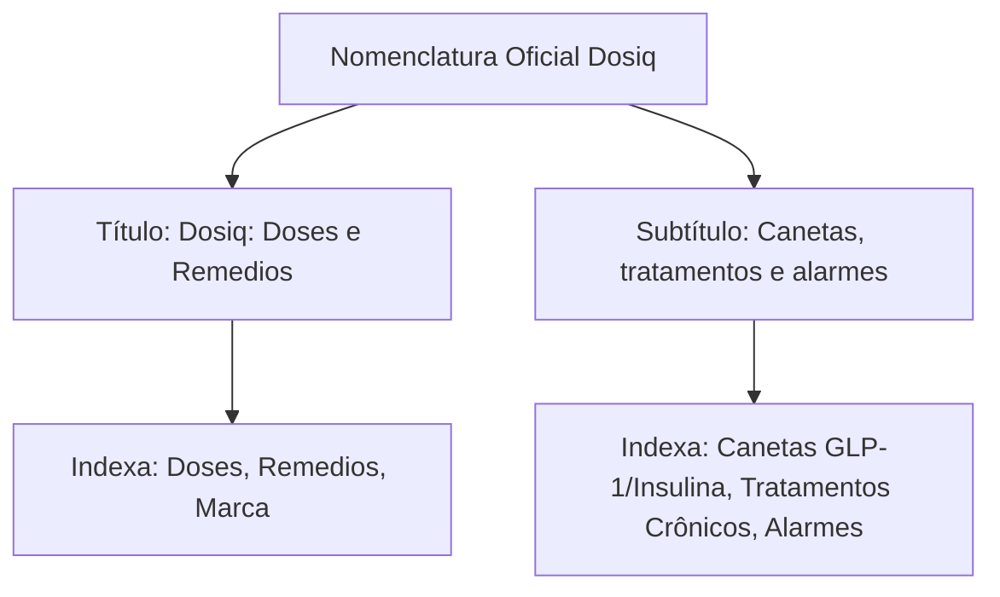

# 🚀 Plano de Ação Tático ASO 2.0 (Fase 6) - Dosiq App Store Brasil (Revisão Completa & Equilibrada)

> **Data de Emissão:** 20 de Agosto de 2026  
> **Escopo:** Apple App Store Brasil (`pt-BR`)  
> **App Legítimo Alvo:** `Dosiq – inteligencia em doses` (`com.coelhotv.dosiq` / Track ID `6762740948` / Antonio Coelho)  
> **Status:** Matriz Estratégica de Decisão, Descrição Equilibrada (Crônicos + GLP-1), Spec 047 (Dual-Trigger), Spec 048 (SEO Landing) e Set de 10 Screenshots  
> **Local do Arquivo:** `.agent/drafts/aso_benchmark_analysis_2026/ASO_FASE_6_PLANO_DE_ACAO_TATICO_ASO_DOSIQ.md`

---

## 🎯 1. Resumo Executivo das Mudanças

Este plano tático integra todas as frentes de inteligência e resolve os 5 gargalos identificados no diagnóstico algorítmico:
1. **Defesa da Marca:** Processo de Takedown formal protocolado contra o clone `com.dosiq.app` perante a Apple Legal e App Review Team.
2. **Potencialização do Título (App Name):** Matriz de 3 caminhos com inserção de termos com alto volume e relevância no Nome do App, onde o algoritmo da Apple tem peso 3x maior.
3. **Subtítulo Especializado:** Fixação do diferencial competitivo de GLP-1, injetáveis e tratamentos contínuos.
4. **Keywords Cirúrgicas (100 Chars):** Cobertura do termo oceano azul `titulacao` e das substâncias em ascensão (`semaglutida`, `tirzepatida`, `insulina`).
5. **Descrição Completa Equilibrada:** Balanceamento 50/50 entre pacientes de uso crônico (idosos, polifarmácia, hipertensão, diabetes) e tratamentos avançados (canetas GLP-1), com restauração da seção estratégica *"Para quem é o Dosiq?"*.
6. **Set de 10 Screenshots em Device Frames:** Eliminação do screenshot cru da landing page e promoção da tela de Titulação (`ios-max-tratamento-titulacao.png`) para o Slide 2.
7. **Sinergia com Specs 047 & 048:** Diretrizes táticas para o prompt in-app (Dual-Trigger) e para a nova landing estática de SEO.

---

## 🧭 2. Nomenclatura Oficial Aprovada (App Name & Subtitle)

Após testes rigorosos de caracteres, diretrizes da Apple (Diretriz 2.3.7 anti-keyword stuffing) e análise de linguagem natural em português brasileiro, a configuração oficial para o App Store Connect é:

* **Nome do App (App Name — Limite: 30 caracteres):**  
  `Dosiq: Doses e Remedios` *(23 caracteres — limpo, elegante e memorável)*
* **Subtítulo (Subtitle — Limite: 30 caracteres):**  
  `Canetas, tratamentos e alarmes` *(30 caracteres cravados — máxima densidade de valor)*



### Por que essa configuração é a melhor escolha:
1. **Linguagem 100% Natural:** Ambas as frases utilizam a conjunção aditiva **`e`**, eliminando qualquer risco de rejeição por *keyword stuffing* (Diretriz 2.3.7 da Apple).
2. **Cobertura dos 3 Pilares Fundamentais:**
   * 💉 **Canetas:** Captura o público de GLP-1, emagrecedores e insulinas.
   * 🩺 **Tratamentos:** Captura o público crônico, polifarmácia e adesão terapêutica.
   * ⏰ **Alarmes:** Captura a dor de utilidade nº 1 dos usuários brasileiros.
3. **Sinergia Algorítmica com o Campo de Keywords:** Ao colocar `lembrete` nas keywords, o motor da Apple combina automaticamente `lembrete` (Keywords) com `remedios` (Título), gerando **peso 3x na busca `lembrete de remédios`**.

---

## 🔬 3. Análise Técnica de Pontuação: Dois Pontos (`: `) vs. Travessão/Em-Dash (` – `)

* **Comportamento no Motor de Busca da Apple:**  
  O tokenizador da Apple App Store trata caracteres de pontuação como **delimitadores de palavras (word boundaries)**.  
  * Ao cadastrar `Dosiq: Doses e Remédios`, o motor indexa: `["dosiq", "doses", "e", "remedios"]`.  
  * A busca exata pela marca `dosiq` resulta em **100% de correspondência (exact match)**. O `:` **nunca** fica fundido ao nome da marca.
* **Consumo de Caracteres no Limite de 30:**
  * **Com Dois Pontos (`: `):** Consome **2 caracteres** (`:` + espaço). Economiza 1 caractere útil no limite estrito de 30.
  * **Com Em-Dash (` – ` / ` — `):** Consome **3 caracteres** (espaço + `–` + espaço).

---

## 📝 4. Metadados Detalhados para o App Store Connect

### 4.1. Campo de Palavras-Chave (Keywords Field — Limite: 100 caracteres)

> [!IMPORTANT]
> **Regra Algorítmica da Apple:** O motor combina as palavras do Título, Subtítulo e Keywords. Não repetir palavras já presentes no Título ou Subtítulo (`dosiq`, `doses`, `remedios`, `canetas`, `tratamentos`, `alarmes`). Não usar espaços após as vírgulas.

#### 💡 Racional Clínico de Calibração das Keywords:
* ❌ **Removido `estoque`:** Ninguém busca o termo técnico "estoque" na App Store brasileira.
* ❌ **Removido `pilula`:** Evita atrair usuárias que buscam calendários anticoncepcionais/menstruais (público que o Dosiq não foca atualmente, prevenindo desinstalações precoces).
* ✅ **Adicionado `diabetes` & `glicemia`:** Cobertura do maior cluster de pacientes crônicos e de uso de insulina/GLP-1 do país.
* ✅ **Adicionado `pressao`:** Cobertura de pacientes hipertensos (biomarcador PA nativo no app).

* **Combinação Cirúrgica Final (100 Caracteres Cravados):**
```text
lembrete,medicamento,diabetes,glicemia,insulina,semaglutida,tirzepatida,titulacao,glp1,pressao,saude
```

* **Auditoria Caractere por Caractere (100/100):**
  - `lembrete` (8) + `,` + `medicamento` (11) + `,` + `diabetes` (8) + `,` + `glicemia` (8) + `,` + `insulina` (8) + `,` + `semaglutida` (11) + `,` + `tirzepatida` (11) + `,` + `titulacao` (9) + `,` + `glp1` (4) + `,` + `pressao` (7) + `,` + `saude` (5) = **100 caracteres exatos**.

---

### 4.2. Texto Promocional (Promotional Text — Limite: 170 caracteres)

*(Campo com edição em tempo real no App Store Connect, sem necessidade de nova versão do app. Focado em conversão humana imediata).*

A partir da evidência da mineração de reviews (onde os termos espontâneos mais citados foram *"meus remédios"*, *"meus horários"* e *"meu tratamento"*, em detrimento do termo abstrato *"rotina"*), disponibilizamos 3 opções calibradas:

#### Opção 1: Foco em Horários & Tratamento (163 caracteres)
```text
Organize seus remédios e canetas injetáveis no horário certo. Alarmes confiáveis, titulação de doses GLP-1, rodízio de aplicação e controle inteligente de estoque.
```

#### Opção 2: Foco em Simplicidade & Alívio (159 caracteres)
```text
Nunca mais perca o horário dos seus medicamentos e canetas GLP-1. Alarmes fáceis, titulação de doses, rodízio de injeção e aviso antes do remédio acabar.
```

#### Opção 3: Foco Clínico & Precisão (168 caracteres)
```text
Controle completo dos seus medicamentos, doses diárias e canetas injetáveis (GLP-1 e insulina) com alarmes pontuais, titulação e cálculo inteligente de estoque.
```

---

### 4.3. Descrição Completa Equilibrada (Description — Limite: 4.000 caracteres)

> [!NOTE]
> **Compatibilidade Estrita (App Store Connect & Google Play):** Gramática impecável em português brasileiro (pt-BR) com acentuação correta, 100% livre de emojis e caracteres especiais decorativos.

```text
Dosiq é o aplicativo definitivo para organizar seus remédios, doses diárias e tratamentos injetáveis no iPhone.

Seja para gerenciar medicamentos de uso contínuo, não esquecer antibióticos ou acompanhar a evolução de canetas emagrecedoras e insulinas, o Dosiq oferece uma experiência limpa, inteligente e sem complicações.

========================================
PARA QUEM É O DOSIQ?
========================================

1. QUEM TOMA MEDICAMENTOS CONTÍNUOS E POLIFARMÁCIA:
Perfeito para quem toma 2 ou mais remédios por dia (pressão, colesterol, tireoide, antidepressivos, diabetes). Visualize sua agenda do dia dividida por Manhã, Tarde e Noite, com confirmação rápida em 1 toque.

2. USUÁRIOS DE CANETAS E INJETÁVEIS (GLP-1 / INSULINA):
Feito sob medida para tratamentos semanais ou diários com Semaglutida, Tirzepatida, Liraglutida e Insulinas. Acompanhe a titulação gradual de doses e receba a indicação do rodízio dos locais de injeção.

3. CUIDADORES E FAMILIARES:
Ajude pais, avós e dependentes a manterem o tratamento em dia. Acompanhe a taxa de adesão e receba alertas claros para evitar esquecimentos ou doses duplicadas.

4. QUEM TOMA SUPLEMENTOS E VITAMINAS:
Organize sua suplementação diária, creatina, ômega 3 e vitaminas com lembretes pontuais que se adaptam à sua rotina.

========================================
RECURSOS QUE FAZEM A DIFERENÇA
========================================

- ALARMES CONFIÁVEIS QUE VOCÊ NÃO PERDE:
Notificações persistentes no horário exato, com indicação clara do nome do remédio e da dosagem (comprimidos, gotas ou UI/ml). Botão de confirmação instantânea e opção de soneca inteligente.

- CONTROLE AUTOMÁTICO DE ESTOQUE:
Nunca mais seja pego de surpresa com a caixa vazia na hora de tomar seu remédio. O Dosiq calcula quantos dias de tratamento você ainda tem e avisa com antecedência quando for hora de comprar ou retirar nova caixa no posto.

- HISTÓRICO DE TITULAÇÃO E EVOLUÇÃO (GLP-1):
Visualize toda a sua jornada de aumento de doses em uma linha do tempo clara, sabendo exatamente em qual etapa do tratamento você está.

- DIÁRIO DE BIOMARCADORES E GLICEMIA:
Registre medições de glicose no sangue (em jejum e pós-prandial), pressão arterial e peso corporal, correlacionando seus índices com a adesão aos medicamentos.

- ASSISTENTE INTELIGENTE DOSIQ IA:
Tire dúvidas rápidas sobre horários, consulte seus estoques e receba orientações práticas sobre seu plano terapêutico com nossa inteligência artificial integrada.

- RELATÓRIOS COMPLETOS PARA SEU MÉDICO:
Exporte relatórios em PDF com seu histórico de tomadas, taxa de adesão semanal e curva de medidas para compartilhar na consulta médica.

========================================
PRIVACIDADE E CONFIABILIDADE
========================================

- Sem anúncios invasivos e sem assinaturas abusivas
- Funciona 100% offline — seus dados ficam protegidos com você
- Widgets interativos para a Tela de Início e Tela de Bloqueio do iOS
- Interface moderna, rápida e acessível

Baixe o Dosiq agora e tenha a tranquilidade de manter seu tratamento de saúde sempre sob controle.
```

---

## 🎨 5. Conjunto Mestre de 10 Screenshots para a Loja

| Slide | Posição | Tela Base do Dosiq | Headline (32pt) | Subheadline (16pt) |
| :---: | :--- | :--- | :--- | :--- |
| **1** | **Feed (Core)** | Dashboard "Hoje" (`ios-max-dashboard.png`) | `Sua rotina de remédios em 1 toque` | `Lembretes inteligentes com confirmação instantânea` |
| **2** | **Feed (Wedge)** | Titulação GLP-1 (`ios-max-tratamento-titulacao.png`) | `Especial para canetas e injetáveis` | `Doses semanais, titulação e histórico de evolução` |
| **3** | **Feed (Estoque)** | Estoque Metoprolol (`ios-max-stock-detail.png`) | `Nunca fique sem seu medicamento` | `Avisos automáticos antes da sua caixa acabar` |
| **4** | Página | Tela Cheia Alarme (`ios-max-alarme-v2.png`) | `Alarmes persistentes e precisos` | `Doses exatas, soneca e confirmação sem erro` |
| **5** | Página | Modal Glicemia (`ios-max-measure-glucose.png`) | `Monitore glicemia, peso e pressão` | `Entenda o impacto real do seu tratamento` |
| **6** | Página | Chatbot Dosiq IA (`ios-max-chatbot.png`) | `Assistente IA dedicada à sua saúde` | `Tire dúvidas e organize seu tratamento` |
| **7** | Página | Central de Avisos (`ios-max-inbox.png`) | `Todos os seus tratamentos em ordem` | `Comprimidos, injeções e suplementos juntos` |
| **8** | Página | Mockup iOS Widgets | `Suas doses na Tela de Início` | `Confirme seus remédios sem abrir o app` |
| **9** | Página | Exportação de PDF | `Histórico completo para seu médico` | `Exporte relatórios clínicos em PDF` |
| **10** | Página | Selo de Privacidade | `Seus dados médicos 100% seguros` | `Sem anúncios, offline e com total privacidade` |

---

## ⚙️ 6. Diretrizes de Refinamento da Spec 047 (`inapp-review-prompt`)

Com base nas evidências de Review Velocity e na mineração dos concorrentes, a **Spec 047** deve ser ajustada com as seguintes regras de negócio:

1. **Dual-Trigger Logic (Remédios Diários vs. Injetáveis Semanais):**
   * **Gatilho A (Tratamentos Diários):** `streak >= 7 dias` + `total_doses >= 7`. (Qualifica o paciente crônico em ~1 semana).
   * **Gatilho B (Tratamentos Semanais GLP-1 / Injetáveis):** `3 aplicações semanais consecutivas confirmadas com sucesso` (21 dias).
     * *Racional:* O usuário semanal registra apenas 1 dose a cada 7 dias. A regra anterior (`total_doses >= 10`) forçaria um atraso de 70 dias (10 semanas), desperdiçando o momento de maior empolgação do paciente na 3ª semana de titulação.
2. **Segundo Momento "Uau" — Exportação do Relatório Médico em PDF:**
   * Disparar o prompt imediatamente após o usuário gerar e salvar/compartilhar com sucesso o Relatório PDF para o médico (respeitando o cooldown global de 90 dias e o limite de 3x/ano da Apple).
3. **Supressões Críticas (Conforto do Paciente):**
   * Manter supressão estrita se a sessão foi aberta a partir de notificação de alarme de emergência, se há doses atrasadas no dia ou se o usuário acabou de reportar um erro/falha no app.

---

## 🌐 7. Avaliação e Recomendações Estratégicas para a Spec 048 (`landing-glp1`)

Avaliamos a especificação `plans/specs/048-landing-glp1/spec.md` (`dosiq.app/glp-1`) à luz de toda a inteligência coletada neste benchmark:

### 7.1. Diagnóstico Geral da Spec 048:
* ✅ **Arquitetura Impecável:** Uso de HTML estático em `apps/web/public/glp-1.html` sem criar novas funções serverless no Vercel (respeitando R-090).
* ✅ **Estratégia AEO/GEO de Vanguarda:** Formato *answer-first* (FR-007), JSON-LD `FAQPage` + `MedicalWebPage` (FR-008) e `llms.txt` (FR-009) para dominar respostas de IA no Perplexity, ChatGPT e Google AI Overviews.
* ✅ **Fortalecimento do Domínio Canônico:** Ao indexar `dosiq.app/glp-1` e publicar o `llms.txt` no domínio registrado em 11/05/2026, consolidamos a autoridade da marca e enfraquecemos o clone infrator (`getdosiq.com`).

### 7.2. Ajustes e Melhorias Recomendadas para a Spec 048:
1. **Sincronização dos Screenshots da Landing:**
   * A Spec 048 original citava o uso de screenshots brutos (posição 3 = titulação).
   * **Recomendação:** A landing page `dosiq.app/glp-1` deve utilizar as imagens renderizadas nos **Device Frames de iPhone 16 Pro** especificadas no **Slide 2 da Fase 4** (`ios-max-tratamento-titulacao.png`). Isso garante 100% de consistência visual entre a busca web/IA e a App Store.
2. **Inclusão da Palavra-Chave Oceano Azul `titulacao`:**
   * Como comprovamos que o termo `titulacao` tem demanda crescente e baixíssima concorrência no Brasil (apenas 6 apps), um dos blocos principais de FAQ da landing deve ser: *"Como funciona a titulação de doses em canetas de semaglutida e tirzepatida?"*.
3. **Harmonização de Promessa (FR-012):**
   * O rebalanceamento da landing web principal e mobile para exibir comprimidos + canetas injetáveis casa perfeitamente com a descrição 50/50 da App Store que definimos neste plano.
