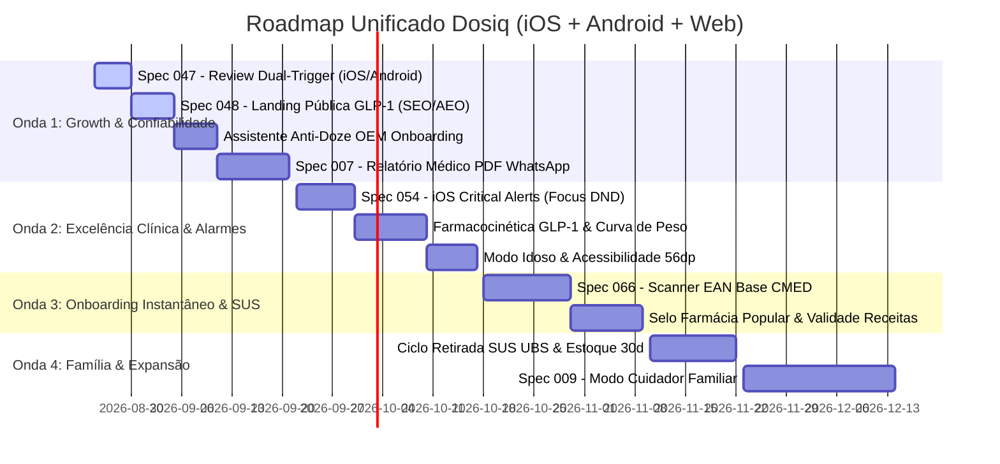

# 🧭 Roadmap Estratégico de Produto & Matriz ICE Integrada (2026–2027) — Dosiq

> **Data de Emissão:** Agosto de 2026  
> **Perfil do Documento:** Gestão Estratégica de Produto, Engenharia Unificada & Growth (CPO / Head of Product)  
> **Pilares Arquiteturais:** Monorepo TypeScript 5.9 Cross-Platform (React Native 19 + Expo para iOS/Android + React 19 PWA Web + `@dosiq/core` compartilhado)  
> **Fontes de Dados Empíricas:** 
> 1. Status Real do Codebase Dosiq (`plans/specs/README.md` — Specs 001 a 067).
> 2. Mineração de 2.064 Reviews da Apple App Store Brasil (Fase 3 iOS: Medisafe, MyTherapy, Hora do Medicamento, Monju, Cuco).
> 3. Mineração de 1.892 Reviews da Google Play Store Brasil (Fase 3 Android: 281 apps mapeados, dores de Doze Mode e jornada SUS).
> 4. Inteligência de Demanda de Busca no Brasil (Fases 1 e 2: Google Trends, Google Play Autocomplete e Apple Hints).

---

## 🎯 1. Princípio Arquitetural: O Dosiq como Plataforma Cross-Platform Unificada

Um dos maiores erros estratégicos no desenvolvimento mobile é tratar iOS e Android como "duas aplicações separadas". No Dosiq, **a arquitetura é rigorosamente unificada em um Monorepo 100% TypeScript**:

```
┌──────────────────────────────────────────────────────────────────────────────────────────────────┐
│                            ARQUITETURA UNIFICADA DO DOSIQ (MONOREPO TS)                          │
├──────────────────────────────────────────────────────────────────────────────────────────────────┤
│                                  @dosiq/core (Business Logic)                                    │
│  • Schemas Zod de Validação (medicines, protocols, stock, titrations, biomarkers, consent)      │
│  • Motores Clínicos: Titulação N2, Cálculo de Adesão, Farmacocinética de Meia-Vida, Outbox      │
│  • Repositórios Locais e Persistência de Sessão Segura                                           │
├──────────────────────────────────────────────────────────────────────────────────────────────────┤
│                               @dosiq/design-tokens & Shared UI                                   │
│  • Cores Oficiais: Verde Esmeralda (#0D5C46 / #10B981), Dark Slate (#0F172A), Âmbar (#F59E0B)   │
│  • Componentes Compartilhados: BodyMapSelector, Gráficos de Titulação e Biomarcadores            │
├────────────────────────────────┬────────────────────────────────┬────────────────────────────────┤
│    apps/mobile (iOS Engine)    │   apps/mobile (Android Engine) │      apps/web (PWA Web)        │
│ • Notifee Time-Sensitive       │ • Notifee Canal HIGH v3 / v2   │ • Service Worker Cache         │
│ • Live Activities / Island     │ • Full Screen Intent Anti-Doze │ • SWR Local Storage            │
│ • Critical Alerts (Spec 054)   │ • Assistente OEM Onboarding    │ • Landing SEO / AEO (Spec 048) │
└────────────────────────────────┴────────────────────────────────┴────────────────────────────────┘
```

### 💡 Implicações Estratégicas para o Roadmap:
1. **Regra de Ouro (80/20):** 80% do esforço de desenvolvimento de qualquer funcionalidade (regras de negócio, schemas, cálculos clínicos, validações e persistência) ocorre no `@dosiq/core` e beneficia **imediatamente iOS, Android e Web**.
2. **Camada Específica de Plataforma (20%):** Restringe-se exclusivamente aos adaptadores de sistema operacional nativo:
   - No **iOS:** Concessão de *Critical Alerts* da Apple, *Live Activities* na tela bloqueada e *Dynamic Island*.
   - No **Android:** Bypass de *Doze Mode* via *Full Screen Intent*, permissões de *Exact Alarm* e guia assistido de bateria para fabricantes (Xiaomi/MIUI, Samsung OneUI, Motorola).
   - Na **Web:** Responsividade, SSR/SSG para indexação SEO e Progressive Web App (PWA).

---

## 🔍 2. Diagnóstico de Produto 360°: Onde o Dosiq Já é Forte vs Onde Estão os Gaps

O cruzamento das mineradoras da App Store (público de maior renda, foco em GLP-1 e estética) com a Play Store (público massivo, foco em alarme alto, 100% offline, remédios contínuos e SUS) revela o mapa completo de maturidade do Dosiq:

```
┌──────────────────────────────────────────────────────────────────────────────────────────────────┐
│                             MATRIZ DE MATURIDADE DE PRODUTO DO DOSIQ                             │
├──────────────────────────────────────┬───────────────────────────────────────────────────────────┤
│ 🟢 CAPACIDADES EM PRODUÇÃO HOJE      │ 🟡 GAPS DE OPORTUNIDADE (ROADMAP ESTRATÉGICO)             │
├──────────────────────────────────────┼───────────────────────────────────────────────────────────┤
│ • Alarme com Som Alto e Tela Cheia   │ • Assistente Anti-Doze OEM no Onboarding Android          │
│   (Canais Notifee v3 e v2 em prod)   │ • Validade de Receitas Médicas (alertas preditivos 15/7d) │
│ • 100% Offline-First sem Paywalls    │ • Scanner EAN-13 com base CMED e Selo SUS (Spec 066)      │
│ • Auth persistente (SecureStore)     │ • Relatório Médico Estruturado em PDF/WhatsApp (Spec 007) │
│ • Escada de Titulação N2 (Spec 029)  │ • Alertas Críticos no iOS furando mudo (Spec 054)         │
│ • Histórico de Sítios de Injeção     │ • Curva Farmacocinética de Meia-Vida & Peso (GLP-1)       │
│ • Diário de Glicemia, Pressão e Peso │ • Ciclo de Retirada na UBS e Farmácia Popular             │
│ • Consent Gate Offline (PR #755)     │ • Modo Cuidador Familiar Multiusuário (Spec 009)          │
│ • Assistente IA Integrada (Spec 015) │ • Modo Idoso de Alta Legibilidade (Touch 56dp / Zoom)     │
└──────────────────────────────────────┴───────────────────────────────────────────────────────────┘
```

---

## 📊 3. Matriz Consolidada de Cobertura de Dores (Brasil: iOS + Android)

| Segmento / Domínio | Dor Real dos Usuários (Minerada nos Reviews) | Status no Codebase Dosiq Hoje | Classificação Estratégica |
| :--- | :--- | :---: | :--- |
| **Growth & Prova Social** | Poucas avaliações na loja impedem o algoritmo de recomendar o app. | 🟡 Spec 047 Pronta (`plans/specs/047-inapp-review-prompt/`) | **Oportunidade Imediata:** Review Prompt Dual-Trigger (3 semanas GLP-1 vs 7d diários). |
| **Growth & Aquisição** | Concorrentes dominam buscas na Web de "titulação semaglutida". | 🟡 Spec 048 Pronta (`plans/specs/048-landing-glp1/`) | **Oportunidade Imediata:** Landing pública `dosiq.app/glp-1` otimizada para AEO/GEO. |
| **Validação Médica** | Paciente não tem como provar adesão para o médico na consulta. | 🟡 Spec 007 Pronta (`plans/specs/007-medical-pdf-report/`) | **Oportunidade Imediata:** Motor PDF local com adesão + biomarcadores + titulação. |
| **Confiabilidade Android** | Xiaomi/Samsung/Motorola fecham o app e silenciam o alarme diário. | 🟢 Notifee v3/v2 em prod / 🟡 Falta Guia Onboarding | **Gap de Produto:** Assistente de Onboarding Anti-Doze detectando `Build.MANUFACTURER`. |
| **Confiabilidade iOS** | Chave de silencioso ou modo Focus/DND silencia remédio de pressão/insulina. | 🟢 Time-Sensitive em prod / 🟡 Spec 054 Pronta | **Gap de Produto:** Implementação de iOS Critical Alerts (Spec 054). |
| **Onboarding & Cadastro** | Digitação manual de nomes de remédios e dosagens é lenta e exaustiva. | 🟡 Spec 066 Pronta (`plans/specs/066-camera-medicine-scan/`) | **Gap de Produto:** Scanner de Código de Barras EAN-13 com base CMED compacta. |
| **Saúde Pública & SUS** | Paciente perde prazo da receita de controle especial e viagem ao posto. | 🟢 Campo `end_date` no BD / 🟡 Falta Módulo | **Gap de Produto:** Alertas de validade de receitas (30/60/180d) e ciclo de retirada na UBS. |
| **Farmácia Popular** | Paciente não sabe se seu remédio contínuo tem distribuição 100% gratuita. | 🟡 Integrável à Spec 066 | **Gap de Produto:** Selo verde de Gratuidade Farmácia Popular ao escanear a caixa. |
| **Wedge GLP-1 / Obesidade**| Paciente não sabe se a medicação ainda está ativa no 6º ou 7º dia. | 🔴 Não Iniciado (Nova Oportunidade) | **Gap de Produto:** Gráfico de Farmacocinética de Meia-Vida (~168h Semaglutida / ~120h Tirzepatida). |
| **Família & Cuidadores** | Filho não tem como monitorar remotamente se a mãe idosa tomou o remédio. | 🟡 Spec 009 Pronta (`plans/specs/009-caregiver-mode/`) | **Gap de Produto:** Círculo de Cuidado e push de dose não tomada para o cuidador. |
| **Acessibilidade & Idosos**| Idosos não enxergam botões pequenos e abandonam o aplicativo. | 🟢 Tokens WCAG AA em prod / 🟡 Falta Toggle UI | **Gap de Produto:** Modo Idoso com áreas de toque ampliadas (56x56dp) e textos grandes. |
| **Higiene de Estoque** | Tratamentos encerrados continuam consumindo previsão de estoque. | 🟡 Spec 064 Pronta (`plans/specs/064-stock-burn-rate/`) | **Gap de Produto:** Ajuste de vigência de estoque para tratamentos ativos. |

---

## 🧮 4. Priorização Estratégica via Matriz ICE Consolidada

A Matriz ICE avalia cada iniciativa considerando o impacto no ecossistema completo (iOS + Android + Web), a confiança nos dados minerados e a facilidade técnica dentro do Monorepo TypeScript:

* **Impact (I — 1 a 10):** Impacto agregado em aquisição orgânica (ASO/SEO), retenção D30, autoridade clínica ou diferencial competitivo.
* **Confidence (C — 1 a 10):** Nível de certeza baseado nas 3.956 reviews mineradas (App Store + Play Store) e na maturidade das specs já existentes no monorepo.
* **Ease (E — 1 a 10):** Facilidade de desenvolvimento no monorepo (10 = entrega rápida em poucos dias; 1 = projeto complexo com backend e múltiplos fluxos).
* **Score ICE:** $\text{Score} = \frac{I \times C \times E}{10}$

```
┌──────────────────────────────────────────────────────────────────────────────────────────────────┐
│                              MATRIZ ICE CONSOLIDADA (RANKING OFICIAL)                            │
├──────┬────────────────────────────────────────────┬─────┬─────┬─────┬───────────┬────────────────┤
│ RANK │ INICIATIVA / SPEC                          │  I  │  C  │  E  │ SCORE ICE │ ESCOPO TÉCNICO │
├──────┼────────────────────────────────────────────┼─────┼─────┼─────┼───────────┼────────────────┤
│  #1  │ Spec 047 — In-App Review Dual-Trigger      │  9  │ 10  │  9  │   81.0    │ Mobile Cross   │
│  #2  │ Spec 007 — Relatório Médico em PDF         │ 10  │  9  │  8  │   72.0    │ Core + Mobile  │
│  #3  │ Spec 048 — Landing GLP-1 SEO (AEO/GEO)     │  8  │  9  │  9  │   64.8    │ Web PWA        │
│  #4  │ Assistente Anti-Doze OEM no Onboarding     │  9  │  9  │  8  │   64.8    │ Mobile Android │
│  #5  │ Spec 066 — Scanner EAN + Selo Farmácia Pop │ 10  │  9  │  7  │   63.0    │ Core + Mobile  │
│  #6  │ Gestor de Validade de Receitas Médicas     │  9  │  9  │  7  │   56.7    │ Core + Mobile  │
│  #7  │ Spec 054 — iOS Critical Alerts (Focus/DND) │  9  │  9  │  7  │   56.7    │ Mobile iOS     │
│  #8  │ Curva Farmacocinética GLP-1 & Peso         │  8  │  8  │  8  │   51.2    │ Core + Shared  │
│  #9  │ Ciclo Retirada SUS & Alerta Lote UBS       │  8  │  8  │  7  │   44.8    │ Core + Mobile  │
│ #10  │ Modo Idoso & Acessibilidade Dinâmica       │  8  │  8  │  7  │   44.8    │ Tokens + UI    │
│ #11  │ Spec 009 — Modo Cuidador Familiar          │  9  │  8  │  5  │   36.0    │ Core + Supabase│
│ #12  │ Spec 064 — Vigência de Estoque & Offline30d│  7  │  8  │  6  │   33.6    │ Core Offline   │
└──────┴────────────────────────────────────────────┴─────┴─────┴─────┴───────────┴────────────────┘
```

### Racional Detalhado dos Destaques do Ranking ICE:
* **Rank #1 (Spec 047 — ICE 81.0):** É a chave de ignição do crescimento orgânico em ambas as lojas. Com código mínimo em React Native, converte o sucesso clínico do paciente no momento exato em notas 5 estrelas.
* **Rank #2 (Spec 007 — ICE 72.0):** O recurso de maior valor percebido por pacientes e médicos. Desenvolvido no `@dosiq/core`, gera PDFs no cliente (zero custo de servidor) para compartilhar no WhatsApp da consulta.
* **Rank #4 (Assistente Anti-Doze — ICE 64.8):** Resolve a maior causa de notas 1 estrela no Android (Xiaomi/Samsung matando alarmes). Implementação 100% frontend com componentes informativos de onboarding.
* **Rank #5 (Spec 066 + Selo Farmácia Popular — ICE 63.0):** Elimina o atrito do cadastro manual de remédios e estabelece a maior diferenciação de utilidade pública do Brasil (aviso de gratuidade no SUS ao escanear a caixa).

---

## 🗺️ 5. Roadmap Sequenciado de Execução Integrada (2026.Q3 ➔ 2027.Q1)

O roadmap está organizado em **quatro ondas estruturadas de entrega**, balanceando vitórias rápidas de aquisição com diferenciais profundos de retenção e saúde pública:



---

### 📅 ONDA 1: Desbloqueio de Growth, Confiabilidade & Prova Social (Semanas 1 a 4)
> **Objetivo Central:** Quebrar a inércia algorítmica nas duas lojas, blindar o alarme no Android e entregar a ferramenta médica mais desejada.

1. **Sprint 1.1 — Spec 047 (`inapp-review-prompt` — Cross-Platform):**
   - Motor `reviewPromptService` no `@dosiq/core` com **Dual-Trigger**:
     - *Usuários GLP-1/Semanais:* Disparo na 3ª aplicação semanal registrada com sucesso.
     - *Usuários Diários/Crônicos:* Disparo ao atingir 7 dias consecutivos de adesão (Streak 7d).
     - *Momento "Uau" Adicional:* Disparo logo após a exportação bem-sucedida do primeiro Relatório PDF.
   - *Meta:* Atingir **>100 avaliações 5★** combinadas (App Store + Play Store) em 60 dias.
2. **Sprint 1.2 — Spec 048 (`landing-glp1` — Web PWA):**
   - Publicação de `dosiq.app/glp-1` (HTML estático com CSS inlined, zero JS externo, Schema JSON-LD `MedicalWebPage`/`FAQPage` e `llms.txt`).
   - Captura de tráfego de busca do Google e autoridade em IA generativa (Perplexity/ChatGPT) para *titulação de semaglutida*.
3. **Sprint 1.3 — Assistente Anti-Doze OEM no Onboarding (Android Mobile):**
   - Detecção automática de fabricantes com encerramento agressivo de apps (`Build.MANUFACTURER === 'Xiaomi' | 'samsung' | 'motorola'`).
   - Modal gráfico simples e acolhedor ensinando o paciente a marcar *"Sem Restrições de Bateria"*, garantindo nota 5★ no Android.
4. **Sprint 1.4 — Spec 007 (`medical-pdf-report` — Core + Mobile/Web):**
   - Geração de relatório clínico em PDF no cliente compilando:
     - Taxa de adesão global e por medicamento (% no horário).
     - Histórico de titulação e doses aplicadas.
     - Gráfico integrado de Biomarcadores (Glicemia em Jejum + Pressão Arterial + Peso).
     - Botão nativo de compartilhamento em 1 toque no WhatsApp do médico.

---

### 📅 ONDA 2: Excelência Clínica, Alarmes Infalíveis & Wedge GLP-1 (Semanas 5 a 8)
> **Objetivo Central:** Aniquilar as falhas de alarme no iOS e consolidar hegemonia sobre concorrentes de GLP-1 (*Monju*, *Shotsy*, *GlipOne*).

1. **Sprint 2.1 — Spec 054 (`critical-alerts` — iOS Mobile):**
   - Ativação do *entitlement* de Alertas Críticos da Apple para medicamentos classificados como `critical_alarm: true` (insulinas, anti-hipertensivos, imunossupressores), tocando som alto mesmo com o iPhone na chave física de mudo.
2. **Sprint 2.2 — Curva Farmacocinética de Meia-Vida & Correlação de Peso (Core + UI):**
   - Algoritmo matemático no `@dosiq/core` modelando o acúmulo sérico e o decaimento exponencial do fármaco ao longo dos 7 dias pós-dose (meia-vida de ~168h para Semaglutida e ~120h para Tirzepatida).
   - Visualização gráfica intuitiva correlacionando a concentração estimada no corpo com o gráfico de redução de peso corporal e os degraus de titulação (Spec 029).
3. **Sprint 2.3 — Modo Idoso & Acessibilidade Dinâmica (Tokens + UI):**
   - Toggle nas configurações de perfil ativando áreas de toque ampliadas (mínimo de 56x56dp), tipografia escalonada e botões de confirmação simplificados para pacientes da terceira idade.

---

### 📅 ONDA 3: Onboarding Instantâneo por Câmera & Diferenciação SUS (Semanas 9 a 16)
> **Objetivo Central:** Reduzir o tempo de cadastro de 5 medicamentos para menos de 1 minuto e liderar as buscas de Farmácia Popular e SUS.

1. **Sprint 3.1 — Spec 066 (`camera-medicine-scan` via Base CMED/Anvisa):**
   - Scanner de código de barras (EAN-13) na câmera do celular com consulta offline instantânea ao banco CMED/Anvisa (26.000 apresentações farmacêuticas em base compactada ~600 KB gzip).
   - Preenchimento automático instantâneo: Nome Comercial, Princípio Ativo, Dosagem e Forma Farmacêutica.
2. **Sprint 3.2 — Selo Farmácia Popular & Gestão de Validade de Receitas (Core + Mobile):**
   - *Selo Farmácia Popular:* Ao escanear ou buscar um medicamento na base CMED, o Dosiq exibe automaticamente o selo: *"💡 Este medicamento tem retirada 100% gratuita no SUS / Farmácia Popular"*.
   - *Validade da Receita:* Alertas antecipados inteligentes (15 dias, 7 dias e 48 horas antes de expirar) para receitas simples (180d), controle especial (30/60d) e antibióticos (10d).

---

### 📅 ONDA 4: Cuidado Familiar, Gestão de Estoque 30d & Expansão (Semanas 17 a 24)
> **Objetivo Central:** Dominar o nicho de famílias/cuidadores e garantir resiliência para usuários sem internet.

1. **Sprint 4.1 — Ciclos de Retirada na UBS & Projeção Offline Estendida (Core + Mobile):**
   - Calculadora de ciclo de liberação na UBS (avisa o paciente exatamente quando a próxima cota de remédios gratuitos está disponível para retirada no posto de saúde).
   - Projeção local antecipada de `dose_instances` para 30 dias no SQLite/IndexedDB, garantindo que o alarme toque mesmo se o aparelho ficar semanas sem conexão à internet.
2. **Sprint 4.2 — Spec 009 (`caregiver-mode` / Círculo de Cuidado — Core + Supabase):**
   - Conexão segura entre paciente e cuidador (filhos monitorando a medicação de pais idosos à distância).
   - Push de alerta para o cuidador caso uma dose vital permaneça pendente após 45 minutos do horário agendado.

---

## 📈 6. Matriz de Metas e OKRs Globais do Produto (90 e 180 Dias)

```
┌──────────────────────────────────────────────────────────────────────────────────────────────────┐
│                                METAS ESTRATÉGICAS DE PRODUTO (OKRs)                              │
├─────────────────────────────────────┬──────────────────────────┬────────────────┬────────────────┤
│ DIMENSÃO / OBJETIVO                 │ MÉTRICA CHAVE (KR)       │ META (90 DIAS) │ META (180 DIAS)│
├─────────────────────────────────────┼──────────────────────────┼────────────────┼────────────────┤
│ 1. Prova Social & Reputação Loja    │ Total Avaliações 5★ (iOS)│ ≥ 100 reviews  │ ≥ 300 reviews  │
│                                     │ Total Avaliações 5★ (And)│ ≥ 150 reviews  │ ≥ 500 reviews  │
├─────────────────────────────────────┼──────────────────────────┼────────────────┼────────────────┤
│ 2. Domínio Orgânico de ASO          │ Rank 'lembrete doses'    │ Top 3 (iOS)    │ Top 1 (iOS)    │
│                                     │ Rank 'alarme de remédio' │ Top 5 (Android)│ Top 1-2 (Andr) │
│                                     │ Rank 'farmácia popular'  │ Top 3 (Android)│ Top 1 (Android)│
├─────────────────────────────────────┼──────────────────────────┼────────────────┼────────────────┤
│ 3. Retenção Clínica de Pacientes    │ Retenção D30 (Crônicos)  │ ≥ 50.0%        │ ≥ 62.0%        │
│                                     │ Retenção D30 (GLP-1)     │ ≥ 65.0%        │ ≥ 75.0%        │
├─────────────────────────────────────┼──────────────────────────┼────────────────┼────────────────┤
│ 4. Engajamento Médico               │ Relatórios PDF Gerados   │ ≥ 1.000 / mês  │ ≥ 5.000 / mês  │
├─────────────────────────────────────┼──────────────────────────┼────────────────┼────────────────┤
│ 5. Estabilidade Técnica (Vitals)    │ Crash Rate Geral         │ < 0.30%        │ < 0.15%        │
│                                     │ ANR Rate (Android)       │ < 0.15%        │ < 0.05%        │
└─────────────────────────────────────┴──────────────────────────┴────────────────┴────────────────┘
```

---

## 🏁 7. Diretrizes Finais de Governança e Execução

1. **Protocolo DEVFLOW Mandatório:** Cada sprint deve ser executada sob o protocolo `/devflow coding` com checklist C1-C4, testes críticos (`validate:agent`) e registro SQP em `CHANGELOG.md` e memória C5.
2. **Priorização Rígida pelo Score ICE:** Nenhuma iniciativa de baixo ICE deve furar a fila das entregas da Onda 1. O foco imediato é **desbloquear a prova social (Spec 047), lançar a Landing SEO (Spec 048) e entregar o Relatório Médico em PDF (Spec 007)**.
3. **Harmonia de Marca e Plataforma:** Manter a consistência total de identidade visual nos criativos e telas utilizando os tokens oficiais de `@dosiq/design-tokens`, tratando o Dosiq como uma solução coesa, moderna e indispensável para a saúde de milhões de brasileiros.

