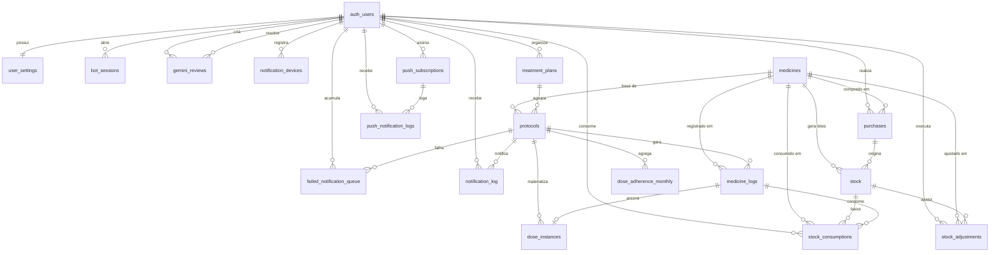

# 🗄️ Esquema do Banco de Dados

O banco de dados do **Dosiq** roda em **Supabase (PostgreSQL)** e usa `auth.users` como origem canônica de identidade. As tabelas do schema `public` armazenam os dados de negócio, preferências do usuário, estoque, notificações e integrações auxiliares.

> **Última atualização**: 2026-06-01 (adicionadas `dose_instances` + `dose_adherence_monthly`; novas colunas em `protocols` e `medicine_logs` — refactor de doses persistidas, ver [`DOSE_INSTANCES.md`](./DOSE_INSTANCES.md))
> **Fonte**: exportação real do schema atual do Supabase (DDL colado manualmente)
> **Escopo desta documentação**: tabelas, colunas, FKs e `CHECK constraints` presentes no DDL. Índices, triggers, políticas RLS, views e funções não foram incluídos porque não aparecem no SQL de origem desta revisão.

## Visão Geral

### Schema `auth`

- `auth.users`: tabela padrão do Supabase para autenticação. Todas as referências `user_id` apontam para `auth.users(id)` quando a FK existe.

### Schema `public`

## Resumo por Domínio

| Domínio | Tabelas |
|--------|---------|
| Usuário e preferências | `user_settings`, `bot_sessions` |
| Catálogo e tratamento | `medicines`, `treatment_plans`, `protocols`, `medicine_logs` |
| Doses materializadas | `dose_instances`, `dose_adherence_monthly` |
| Compras e estoque | `purchases`, `stock`, `stock_adjustments`, `stock_consumptions` |
| Notificações | `notification_devices`, `notification_log`, `failed_notification_queue`, `push_subscriptions`, `push_notification_logs` |
| Revisão de código | `gemini_reviews`, `gemini_reviews_backup_20260222` |

## Tabelas

> *Nota: Tabelas e colunas geradas automaticamente via Supabase MCP.*

### `beta_signups`

| Campo | Tipo | Nullable | Default |
|------|------|----------|---------|
| `id` | `uuid` | No | `gen_random_uuid()` |
| `email` | `text` | No | `None` |
| `feature` | `text` | No | `'android'::text` |
| `created_at` | `timestamp with time zone` | No | `now()` |

---

### `biomarkers_log`

| Campo | Tipo | Nullable | Default |
|------|------|----------|---------|
| `id` | `uuid` | No | `gen_random_uuid()` |
| `user_id` | `uuid` | No | `None` |
| `type` | `text` | No | `'glicemia'::text` |
| `value` | `numeric` | No | `None` |
| `value_secondary` | `numeric` | Yes | `None` |
| `unit` | `text` | No | `None` |
| `measured_at` | `timestamp with time zone` | No | `now()` |
| `context` | `text` | Yes | `None` |
| `source` | `text` | No | `'manual'::text` |
| `notes` | `text` | Yes | `None` |
| `created_at` | `timestamp with time zone` | No | `now()` |

---

### `bot_sessions`

| Campo | Tipo | Nullable | Default |
|------|------|----------|---------|
| `id` | `uuid` | No | `gen_random_uuid()` |
| `user_id` | `uuid` | No | `None` |
| `chat_id` | `bigint` | No | `None` |
| `context` | `jsonb` | No | `'{}'::jsonb` |
| `expires_at` | `timestamp with time zone` | No | `None` |
| `created_at` | `timestamp with time zone` | Yes | `now()` |
| `updated_at` | `timestamp with time zone` | Yes | `now()` |

---

### `dose_adherence_monthly`

| Campo | Tipo | Nullable | Default |
|------|------|----------|---------|
| `user_id` | `uuid` | No | `None` |
| `protocol_id` | `uuid` | No | `None` |
| `month` | `date` | No | `None` |
| `expected` | `integer` | No | `None` |
| `taken` | `integer` | No | `None` |
| `missed` | `integer` | No | `None` |

---

### `dose_instances`

| Campo | Tipo | Nullable | Default |
|------|------|----------|---------|
| `id` | `uuid` | No | `gen_random_uuid()` |
| `user_id` | `uuid` | No | `None` |
| `protocol_id` | `uuid` | No | `None` |
| `scheduled_for` | `timestamp with time zone` | No | `None` |
| `expected_dose` | `numeric` | No | `None` |
| `status` | `text` | No | `'pending'::text` |
| `medicine_log_id` | `uuid` | Yes | `None` |
| `tolerance_minutes` | `integer` | No | `120` |
| `notified_at` | `timestamp with time zone` | Yes | `None` |
| `snoozed_until` | `timestamp with time zone` | Yes | `None` |
| `created_at` | `timestamp with time zone` | Yes | `now()` |
| `critical_alarm` | `boolean` | No | `false` |

---

### `failed_notification_queue`

| Campo | Tipo | Nullable | Default |
|------|------|----------|---------|
| `id` | `uuid` | No | `gen_random_uuid()` |
| `user_id` | `uuid` | No | `None` |
| `protocol_id` | `uuid` | Yes | `None` |
| `correlation_id` | `uuid` | No | `None` |
| `notification_type` | `character varying` | No | `None` |
| `notification_payload` | `jsonb` | No | `None` |
| `error_code` | `character varying` | Yes | `None` |
| `error_message` | `text` | Yes | `None` |
| `error_category` | `character varying` | No | `'unknown'::character varying` |
| `retry_count` | `integer` | Yes | `0` |
| `max_retries` | `integer` | Yes | `3` |
| `created_at` | `timestamp with time zone` | Yes | `now()` |
| `updated_at` | `timestamp with time zone` | Yes | `now()` |
| `resolved_at` | `timestamp with time zone` | Yes | `None` |
| `status` | `character varying` | No | `'failed'::character varying` |
| `resolution_notes` | `text` | Yes | `None` |

---

### `feedback_stats`

| Campo | Tipo | Nullable | Default |
|------|------|----------|---------|
| `total_count` | `integer` | Yes | `None` |
| `pending_count` | `integer` | Yes | `None` |
| `avg_rating` | `numeric` | Yes | `None` |

---

### `feedbacks`

| Campo | Tipo | Nullable | Default |
|------|------|----------|---------|
| `id` | `uuid` | No | `gen_random_uuid()` |
| `user_id` | `uuid` | No | `None` |
| `subject` | `text` | No | `None` |
| `comment` | `text` | No | `None` |
| `rating` | `integer` | Yes | `None` |
| `platform` | `text` | No | `None` |
| `device` | `text` | Yes | `None` |
| `app_version` | `text` | Yes | `None` |
| `is_resolved` | `boolean` | No | `false` |
| `created_at` | `timestamp with time zone` | No | `now()` |
| `updated_at` | `timestamp with time zone` | No | `now()` |

---

### `gemini_reviews`

| Campo | Tipo | Nullable | Default |
|------|------|----------|---------|
| `id` | `uuid` | No | `gen_random_uuid()` |
| `pr_number` | `integer` | No | `None` |
| `commit_sha` | `text` | No | `None` |
| `file_path` | `text` | No | `None` |
| `line_start` | `integer` | Yes | `None` |
| `line_end` | `integer` | Yes | `None` |
| `issue_hash` | `text` | No | `None` |
| `title` | `text` | Yes | `None` |
| `description` | `text` | Yes | `None` |
| `suggestion` | `text` | Yes | `None` |
| `created_at` | `timestamp with time zone` | Yes | `now()` |
| `updated_at` | `timestamp with time zone` | Yes | `now()` |
| `resolved_at` | `timestamp with time zone` | Yes | `None` |
| `resolved_by` | `uuid` | Yes | `None` |
| `user_id` | `uuid` | Yes | `None` |
| `status` | `text` | Yes | `None` |
| `priority` | `text` | Yes | `None` |
| `category` | `text` | Yes | `None` |
| `github_issue_number` | `integer` | Yes | `None` |
| `resolution_type` | `text` | Yes | `None` |

---

### `in_app_nudges`

| Campo | Tipo | Nullable | Default |
|------|------|----------|---------|
| `id` | `uuid` | No | `gen_random_uuid()` |
| `version` | `integer` | No | `1` |
| `title` | `text` | No | `None` |
| `body` | `text` | No | `None` |
| `target_view` | `text` | No | `None` |
| `action_type` | `text` | No | `None` |
| `action_payload` | `jsonb` | Yes | `None` |
| `min_app_version` | `text` | Yes | `None` |
| `max_app_version` | `text` | Yes | `None` |
| `platform` | `text` | No | `'all'::text` |
| `priority` | `integer` | No | `0` |
| `is_active` | `boolean` | No | `true` |
| `start_at` | `timestamp with time zone` | Yes | `None` |
| `end_at` | `timestamp with time zone` | Yes | `None` |
| `created_at` | `timestamp with time zone` | No | `now()` |

---

### `medicine_logs`

| Campo | Tipo | Nullable | Default |
|------|------|----------|---------|
| `id` | `uuid` | No | `gen_random_uuid()` |
| `protocol_id` | `uuid` | Yes | `None` |
| `medicine_id` | `uuid` | Yes | `None` |
| `taken_at` | `timestamp with time zone` | Yes | `now()` |
| `quantity_taken` | `numeric` | No | `None` |
| `notes` | `text` | Yes | `None` |
| `user_id` | `uuid` | No | `'00000000-0000-0000-0000-000000000001'::uuid` |
| `dose_instance_id` | `uuid` | Yes | `None` |

---

### `medicine_stock_summary`

| Campo | Tipo | Nullable | Default |
|------|------|----------|---------|
| `medicine_id` | `uuid` | Yes | `None` |
| `user_id` | `uuid` | Yes | `None` |
| `total_quantity` | `numeric` | Yes | `None` |
| `stock_entries_count` | `bigint` | Yes | `None` |
| `oldest_entry_date` | `date` | Yes | `None` |
| `newest_entry_date` | `date` | Yes | `None` |

---

### `medicines`

| Campo | Tipo | Nullable | Default |
|------|------|----------|---------|
| `id` | `uuid` | No | `gen_random_uuid()` |
| `name` | `text` | No | `None` |
| `laboratory` | `text` | Yes | `None` |
| `active_ingredient` | `text` | Yes | `None` |
| `dosage_per_pill` | `numeric` | Yes | `None` |
| `price_paid` | `numeric` | Yes | `None` |
| `created_at` | `timestamp with time zone` | Yes | `now()` |
| `user_id` | `uuid` | No | `'00000000-0000-0000-0000-000000000001'::uuid` |
| `type` | `text` | Yes | `'medicine'::text` |
| `dosage_unit` | `text` | Yes | `'mg'::text` |
| `therapeutic_class` | `text` | Yes | `None` |
| `regulatory_category` | `text` | Yes | `None` |
| `units_per_ml` | `numeric` | Yes | `None` |
| `presentation` | `text` | Yes | `'comprimido'::text` |
| `shelf_life_days` | `integer` | Yes | `None` |
| `concentration_volume_ml` | `numeric` | Yes | `None` |

---

### `notification_devices`

| Campo | Tipo | Nullable | Default |
|------|------|----------|---------|
| `id` | `uuid` | No | `gen_random_uuid()` |
| `user_id` | `uuid` | No | `None` |
| `app_kind` | `text` | No | `None` |
| `platform` | `text` | No | `None` |
| `provider` | `text` | No | `None` |
| `push_token` | `text` | No | `None` |
| `device_name` | `text` | Yes | `None` |
| `device_fingerprint` | `text` | Yes | `None` |
| `app_version` | `text` | Yes | `None` |
| `is_active` | `boolean` | No | `true` |
| `last_seen_at` | `timestamp with time zone` | No | `now()` |
| `created_at` | `timestamp with time zone` | No | `now()` |
| `updated_at` | `timestamp with time zone` | No | `now()` |
| `native_alarm_enabled` | `boolean` | No | `false` |

---

### `notification_log`

| Campo | Tipo | Nullable | Default |
|------|------|----------|---------|
| `id` | `uuid` | No | `gen_random_uuid()` |
| `user_id` | `uuid` | No | `None` |
| `protocol_id` | `uuid` | Yes | `None` |
| `notification_type` | `text` | No | `None` |
| `sent_at` | `timestamp with time zone` | Yes | `now()` |
| `created_at` | `timestamp with time zone` | Yes | `now()` |
| `status` | `character varying` | Yes | `'enviada'::character varying` |
| `telegram_message_id` | `bigint` | Yes | `None` |
| `mensagem_erro` | `text` | Yes | `None` |
| `provider_metadata` | `jsonb` | Yes | `'{}'::jsonb` |
| `title` | `text` | Yes | `None` |
| `body` | `text` | Yes | `None` |
| `medicine_name` | `text` | Yes | `None` |
| `protocol_name` | `text` | Yes | `None` |
| `channels` | `jsonb` | Yes | `'[]'::jsonb` |
| `treatment_plan_id` | `uuid` | Yes | `None` |
| `treatment_plan_name` | `text` | Yes | `None` |

---

### `protocols`

| Campo | Tipo | Nullable | Default |
|------|------|----------|---------|
| `id` | `uuid` | No | `gen_random_uuid()` |
| `medicine_id` | `uuid` | Yes | `None` |
| `name` | `text` | No | `None` |
| `frequency` | `text` | Yes | `None` |
| `time_schedule` | `jsonb` | Yes | `None` |
| `dosage_per_intake` | `numeric` | Yes | `None` |
| `notes` | `text` | Yes | `None` |
| `active` | `boolean` | Yes | `true` |
| `created_at` | `timestamp with time zone` | Yes | `now()` |
| `user_id` | `uuid` | No | `'00000000-0000-0000-0000-000000000001'::uuid` |
| `treatment_plan_id` | `uuid` | Yes | `None` |
| `target_dosage` | `numeric` | Yes | `None` |
| `titration_status` | `text` | Yes | `'estável'::text` |
| `titration_schedule` | `jsonb` | Yes | `'[]'::jsonb` |
| `current_stage_index` | `integer` | Yes | `0` |
| `stage_started_at` | `timestamp with time zone` | Yes | `None` |
| `last_notified_at` | `timestamp with time zone` | Yes | `None` |
| `last_soft_reminder_at` | `timestamp with time zone` | Yes | `None` |
| `status_ultima_notificacao` | `character varying` | Yes | `None` |
| `start_date` | `date` | No | `None` |
| `end_date` | `date` | Yes | `None` |
| `weekdays` | `ARRAY` | Yes | `'{}'::text[]` |
| `generated_through` | `timestamp with time zone` | Yes | `None` |
| `paused_at` | `timestamp with time zone` | Yes | `None` |
| `critical_alarm` | `boolean` | No | `false` |
| `intake_unit` | `text` | Yes | `None` |

---

### `purchases`

| Campo | Tipo | Nullable | Default |
|------|------|----------|---------|
| `id` | `uuid` | No | `gen_random_uuid()` |
| `user_id` | `uuid` | No | `None` |
| `medicine_id` | `uuid` | No | `None` |
| `quantity_bought` | `numeric` | No | `None` |
| `unit_price` | `numeric` | No | `0` |
| `purchase_date` | `date` | No | `None` |
| `expiration_date` | `date` | Yes | `None` |
| `pharmacy` | `text` | Yes | `None` |
| `laboratory` | `text` | Yes | `None` |
| `notes` | `text` | Yes | `None` |
| `legacy_stock_id` | `uuid` | Yes | `None` |
| `created_at` | `timestamp with time zone` | No | `now()` |
| `injection_container` | `text` | Yes | `None` |

---

### `push_notification_logs`

| Campo | Tipo | Nullable | Default |
|------|------|----------|---------|
| `id` | `uuid` | No | `gen_random_uuid()` |
| `user_id` | `uuid` | Yes | `None` |
| `subscription_id` | `uuid` | Yes | `None` |
| `notification_type` | `text` | No | `None` |
| `title` | `text` | No | `None` |
| `body` | `text` | No | `None` |
| `sent_at` | `timestamp with time zone` | Yes | `now()` |
| `delivered` | `boolean` | Yes | `false` |
| `error_message` | `text` | Yes | `None` |

---

### `push_subscriptions`

| Campo | Tipo | Nullable | Default |
|------|------|----------|---------|
| `id` | `uuid` | No | `gen_random_uuid()` |
| `user_id` | `uuid` | Yes | `None` |
| `endpoint` | `text` | No | `None` |
| `keys_p256dh` | `text` | No | `None` |
| `keys_auth` | `text` | No | `None` |
| `device_info` | `jsonb` | Yes | `'{}'::jsonb` |
| `created_at` | `timestamp with time zone` | Yes | `now()` |
| `updated_at` | `timestamp with time zone` | Yes | `now()` |

---

### `stock`

| Campo | Tipo | Nullable | Default |
|------|------|----------|---------|
| `id` | `uuid` | No | `gen_random_uuid()` |
| `medicine_id` | `uuid` | Yes | `None` |
| `quantity` | `numeric` | No | `None` |
| `purchase_date` | `date` | Yes | `None` |
| `expiration_date` | `date` | Yes | `None` |
| `created_at` | `timestamp with time zone` | Yes | `now()` |
| `user_id` | `uuid` | No | `'00000000-0000-0000-0000-000000000001'::uuid` |
| `unit_price` | `numeric` | Yes | `0` |
| `notes` | `text` | Yes | `None` |
| `purchase_id` | `uuid` | Yes | `None` |
| `original_quantity` | `numeric` | Yes | `None` |
| `entry_type` | `text` | Yes | `None` |
| `updated_at` | `timestamp with time zone` | Yes | `now()` |
| `opened_at` | `timestamp with time zone` | Yes | `None` |
| `injection_container` | `text` | Yes | `None` |

---

### `stock_adjustments`

| Campo | Tipo | Nullable | Default |
|------|------|----------|---------|
| `id` | `uuid` | No | `gen_random_uuid()` |
| `user_id` | `uuid` | No | `None` |
| `medicine_id` | `uuid` | No | `None` |
| `stock_id` | `uuid` | Yes | `None` |
| `quantity_delta` | `numeric` | No | `None` |
| `reason` | `text` | No | `None` |
| `reference_id` | `uuid` | Yes | `None` |
| `notes` | `text` | Yes | `None` |
| `created_at` | `timestamp with time zone` | No | `now()` |

---

### `stock_consumptions`

| Campo | Tipo | Nullable | Default |
|------|------|----------|---------|
| `id` | `uuid` | No | `gen_random_uuid()` |
| `user_id` | `uuid` | No | `None` |
| `medicine_log_id` | `uuid` | No | `None` |
| `medicine_id` | `uuid` | No | `None` |
| `stock_id` | `uuid` | No | `None` |
| `quantity_consumed` | `numeric` | No | `None` |
| `reversed_at` | `timestamp with time zone` | Yes | `None` |
| `created_at` | `timestamp with time zone` | No | `now()` |

---

### `treatment_plans`

| Campo | Tipo | Nullable | Default |
|------|------|----------|---------|
| `id` | `uuid` | No | `uuid_generate_v4()` |
| `name` | `text` | No | `None` |
| `description` | `text` | Yes | `None` |
| `objective` | `text` | Yes | `None` |
| `created_at` | `timestamp with time zone` | Yes | `now()` |
| `user_id` | `uuid` | No | `None` |
| `emoji` | `text` | Yes | `'💊'::text` |
| `color` | `text` | Yes | `'#6366f1'::text` |

---

### `user_emails`

| Campo | Tipo | Nullable | Default |
|------|------|----------|---------|
| `id` | `uuid` | Yes | `None` |
| `email` | `character varying` | Yes | `None` |

---

### `user_settings`

| Campo | Tipo | Nullable | Default |
|------|------|----------|---------|
| `id` | `uuid` | No | `uuid_generate_v4()` |
| `user_id` | `uuid` | No | `None` |
| `telegram_chat_id` | `text` | Yes | `None` |
| `created_at` | `timestamp with time zone` | Yes | `now()` |
| `updated_at` | `timestamp with time zone` | Yes | `now()` |
| `timezone` | `text` | Yes | `'America/Sao_Paulo'::text` |
| `verification_token` | `text` | Yes | `None` |
| `onboarding_completed` | `boolean` | Yes | `false` |
| `emergency_card` | `jsonb` | Yes | `None` |
| `display_name` | `text` | Yes | `None` |
| `birth_date` | `date` | Yes | `None` |
| `city` | `text` | Yes | `None` |
| `state` | `text` | Yes | `None` |
| `notification_preference` | `text` | Yes | `None` |
| `quiet_hours_start` | `time without time zone` | Yes | `None` |
| `quiet_hours_end` | `time without time zone` | Yes | `None` |
| `notification_mode` | `text` | Yes | `'realtime'::text` |
| `digest_time` | `time without time zone` | Yes | `'09:00:00'::time without time zone` |
| `channel_mobile_push_enabled` | `boolean` | No | `true` |
| `channel_web_push_enabled` | `boolean` | No | `false` |
| `channel_telegram_enabled` | `boolean` | No | `false` |
| `quiet_hours_enabled` | `boolean` | Yes | `false` |
| `complexity_override` | `text` | Yes | `None` |
| `phone` | `text` | Yes | `None` |

---

### `v_adherence_heatmap`

| Campo | Tipo | Nullable | Default |
|------|------|----------|---------|
| `user_id` | `uuid` | Yes | `None` |
| `day_of_week` | `integer` | Yes | `None` |
| `period_index` | `integer` | Yes | `None` |
| `expected_doses` | `bigint` | Yes | `None` |
| `taken_doses` | `bigint` | Yes | `None` |
| `adherence_percentage` | `numeric` | Yes | `None` |

---

### `v_daily_adherence`

| Campo | Tipo | Nullable | Default |
|------|------|----------|---------|
| `user_id` | `uuid` | Yes | `None` |
| `log_date` | `date` | Yes | `None` |
| `expected_doses` | `bigint` | Yes | `None` |
| `taken_doses` | `bigint` | Yes | `None` |
| `adherence_percentage` | `numeric` | Yes | `None` |

---
## Constraints Relevantes

### Enums e `CHECK` do schema atual

| Tabela | Campo | Valores aceitos |
|--------|-------|-----------------|
| `dose_instances` | `status` | `pending`, `taken`, `missed`, `skipped_paused`, `skipped_user` |
| `dose_adherence_monthly` | `month` | dia = 1 (1º dia do mês) |
| `failed_notification_queue` | `status` | `failed`, `pending`, `retrying`, `resolved`, `discarded` |
| `medicines` | `type` | `medicamento`, `suplemento` |
| `notification_devices` | `app_kind` | `native`, `pwa` |
| `notification_devices` | `platform` | `ios`, `android`, `web` |
| `notification_devices` | `provider` | `expo`, `webpush` |
| `notification_log` | `status` | `pendente`, `enviada`, `falhou`, `entregue` |
| `protocols` | `frequency` | `diário`, `dias_alternados`, `semanal`, `personalizado`, `quando_necessário` |
| `protocols` | `status_ultima_notificacao` | `pendente`, `enviada`, `falhou`, `tentando_novamente` |
| `purchases` | `quantity_bought` | `> 0` |
| `purchases` | `unit_price` | `>= 0` |
| `stock` | `entry_type` | `purchase`, `adjustment`, `legacy_unrecoverable` |
| `stock_adjustments` | `quantity_delta` | `<> 0` |
| `stock_consumptions` | `quantity_consumed` | `> 0` |
| `user_settings` | `notification_preference` | `telegram`, `mobile_push`, `both`, `none` |
| `gemini_reviews` | `status` | `detected`, `reported`, `assigned`, `resolved`, `partial`, `wontfix`, `duplicate`, `pendente`, `em_progresso`, `corrigido`, `descartado` |
| `gemini_reviews` | `priority` | `critica`, `alta`, `media`, `baixa` |
| `gemini_reviews` | `category` | `estilo`, `bug`, `seguranca`, `performance`, `manutenibilidade` |

## Observações Arquiteturais

- Existem dois modelos de push no schema atual: `push_subscriptions`/`push_notification_logs` e o modelo mais novo `notification_devices`. Eles coexistem e a documentação precisa preservar essa distinção.
- Algumas tabelas de domínio ainda usam `user_id` com default para UUID fixo sem FK explícita no DDL (`medicines`, `protocols`, `medicine_logs`, `stock`). Isso é importante para evitar assumir constraints que não estão realmente aplicadas no banco.
- `treatment_plans` e `user_settings` também não exibem FK explícita no SQL colado, apesar de semanticamente dependerem do usuário autenticado.
- Esta revisão removeu referências antigas a objetos não presentes no DDL atual, como view materializada `medicine_stock_summary` e função `get_dlq_stats()`.
- O elo log↔ocorrência é **bidirecional mas com FK única**: só `dose_instances.medicine_log_id` tem FK (`ON DELETE SET NULL`); `medicine_logs.dose_instance_id` é um espelho aplicacional sem FK explícita. `dose_instances.user_id` segue o mesmo padrão das demais tabelas de domínio (sem FK explícita).

## Sincronização com a Aplicação

Ao alterar esse schema, revisar em conjunto:

- [`src/schemas`](/Users/coelhotv/git/dosiq/src/schemas)
- [`src/features`](/Users/coelhotv/git/dosiq/src/features)
- [`src/services`](/Users/coelhotv/git/dosiq/src/services)
- [`src/shared/services`](/Users/coelhotv/git/dosiq/src/shared/services)

Regras DEVFLOW mais relevantes para mudanças de schema:

- `R-020`: tratar datas locais corretamente
- `R-021`: enums Zod em português
- `R-022`: `quantity_taken` em unidades/pílulas, não em mg
- `R-082`: manter Zod e banco sincronizados
- `R-089`: verificar colunas reais antes de escrever queries/INSERTs
