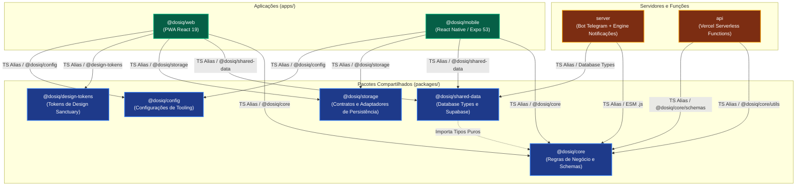
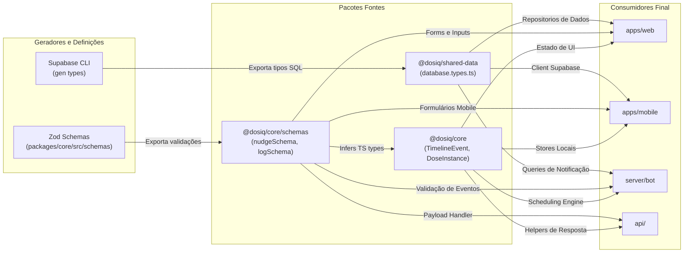
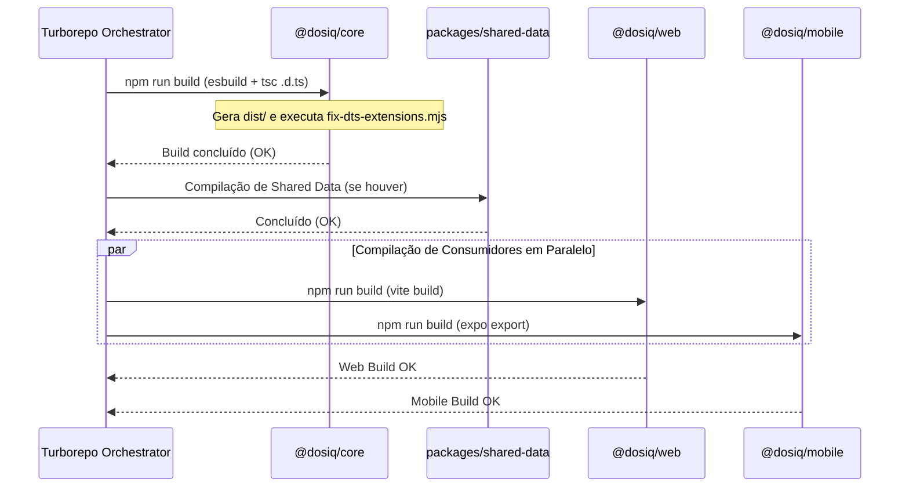

# 🕸️ Grafo de Dependências do Monorepo

## Visão Geral

Este documento apresenta o mapa técnico das dependências internas do monorepo Dosiq. Ele descreve como os workspaces se conectam, compartilham código e garantem isolamento de responsabilidades.

O monorepo Dosiq é organizado em três categorias de workspaces: aplicações cliente em `apps/`, serviços de backend em `server/` e `api/`, e bibliotecas compartilhadas em `packages/`. Compreender essas conexões é fundamental para prever o impacto de alterações de código.

Alterações no pacote `@dosiq/core` afetam todos os consumidores do sistema. Modificações em pacotes de infraestrutura exigem validações específicas para evitar regressões em produção.

```
       ┌─────────────────────────────────────────────────────────┐
       │             Aplicações e Servidores (Consumidores)       │
       │       apps/web  •  apps/mobile  •  server  •  api        │
       └────────────────────────────┬────────────────────────────┘
                                    │
                                    ▼  (importa de)
       ┌─────────────────────────────────────────────────────────┐
       │             Pacotes Compartilhados (Base)               │
       │  packages/core  •  packages/shared-data  •  storage...  │
       └─────────────────────────────────────────────────────────┘
```

---

## Grafo Principal de Dependências

O diagrama a seguir ilustra o grafo direcionado de dependências entre todos os workspaces do repositório. As setas indicam a direção do consumo de código: a origem da seta importa módulos do destino.



### Legenda do Grafo

A tabela abaixo descreve a semântica das conexões e restrições de cada camada do monorepo:

| Tipo de Nó | Cor no Diagrama | Responsabilidade Principal | Restrição de Importação |
| :--- | :--- | :--- | :--- |
| **Aplicações** | Verde (`#065f46`) | Interface de usuário e experiência Web/Mobile | Pode importar de qualquer `packages/*`. Nunca importa de `server/` ou `api/`. |
| **Servidores** | Laranja (`#7c2d12`) | Processamento assíncrono, bot e serverless | Importa de `packages/core` e `packages/shared-data`. NUNCA inclui UI ou React. |
| **Pacotes** | Azul (`#1e3a8a`) | Lógica pura,schemas Zod, tipos Supabase e UI tokens | `core` é 100% isolado. Outros pacotes importam apenas tipos do `core`. |

---

## Fluxo de Tipos e Schemas

O ecossistema Dosiq adota o pacote `@dosiq/core` como a fonte única da verdade para validação em runtime e tipagem estática. Tipos de banco de dados são gerados pelo CLI do Supabase no pacote `@dosiq/shared-data`.

O diagrama a seguir descreve a propagação de tipos e schemas Zod desde a definição até o consumo nas camadas executáveis:



### Exemplos Reais de Consumo no Código

Os trechos a seguir exemplificam a importação de tipos e schemas extraídos diretamente do repositório:

#### 1. Consumo no PWA Web (`apps/web`)

```typescript
// apps/web/src/services/api/timelineService.ts
import { 
  createTimelineService, 
  TIMELINE_ORDER, 
  biomarkersToEvents, 
  buildTimeline 
} from '@dosiq/core'
import type { TimelineEvent } from '@dosiq/core'

export async function fetchUserTimeline(userId: string): Promise<{ events: TimelineEvent[]; tz: string }> {
  // Implementação delegada para as funções puras do core
  return buildTimeline(userId)
}
```

#### 2. Consumo no Bot Telegram (`server/bot`)

```typescript
// server/notifications/repositories/notificationLogRepository.ts
import { notificationLogCreateSchema } from '@dosiq/core/schemas'

export function validateNotificationPayload(payload: unknown) {
  const result = notificationLogCreateSchema.safeParse(payload)
  if (!result.success) {
    throw new Error('Payload de notificação inválido')
  }
  return result.data
}
```

#### 3. Consumo em Vercel Serverless Functions (`api/`)

```typescript
// api/admin/_handlers/versionGate.ts
import { validateVersionGateUpdate } from '@dosiq/core/schemas'
import { getServerTimestamp } from '@dosiq/core/utils'

export async function handleVersionGateUpdate(req: Request) {
  const body = await req.json()
  const validated = validateVersionGateUpdate.parse(body)
  const timestamp = getServerTimestamp()
  
  return { status: 'ok', data: validated, processedAt: timestamp }
}
```

---

## Dependências por Workspace

A tabela a seguir resume as dependências internas consumidas por cada workspace do monorepo:

| Workspace | Depende de `@dosiq/core` | Depende de `@dosiq/shared-data` | Depende de `@dosiq/storage` | Depende de `@dosiq/design-tokens` | Depende de `@dosiq/config` |
| :--- | :---: | :---: | :---: | :---: | :---: |
| `apps/web` | Sim | Sim | Sim | Sim | Sim |
| `apps/mobile` | Sim | Sim | Sim | Não | Sim |
| `server` | Sim | Sim | Não | Não | Não |
| `api` | Sim | Não | Não | Não | Não |
| `packages/shared-data` | Sim (Tipos) | Não | Não | Não | Não |

### Detalhamento dos Workspaces

#### `apps/web`
O PWA em React 19 é o maior consumidor do monorepo. Ele utiliza:
- `@dosiq/core`: Lógica de timeline, formatação de doses, cálculo de titulação, validação Zod e utilitários de timezone.
- `@dosiq/shared-data`: Constantes `CACHE_KEYS`, utilitário `generateCacheKey` e fábrica `createSupabaseClient`.
- `@dosiq/storage`: Adaptador `createWebStorageAdapter` para persistência em `localStorage`.
- `@dosiq/design-tokens`: Variáveis de cores HSL, espaçamentos e tipografia da linguagem Sanctuary.
- `@dosiq/config`: Configurações compartilhadas de linter e compilação.

#### `apps/mobile`
O aplicativo móvel desenvolvido com Expo 53 e React Native consome:
- `@dosiq/core`: Regras de cálculo de adesão, repositórios de instâncias de dose e regras de negócios de estoque.
- `@dosiq/shared-data`: Mapeamento de tipos `database.types.ts` para consultas do cliente Supabase.
- `@dosiq/storage`: Adaptadores compatíveis com `AsyncStorage` e `expo-secure-store`.
- `@dosiq/config`: Definições comuns de ambiente e compilação.

#### `server` (Bot Telegram e Engine de Notificações)
Serviço em Node.js focado em automações e envio de alertas:
- `@dosiq/core`: Regras de cálculo de streak, repositório de instâncias de dose e formatadores de notificação.
- `@dosiq/shared-data`: Estruturas de banco de dados para disparo e registros de logs.
- *Nota de conformidade (R-282)*: Imports relativos na camada de servidor usam extensão `.js` explícita em ambiente ESM.

#### `api` (Vercel Serverless Functions)
Handlers leves executados em ambiente serverless na Vercel:
- `@dosiq/core`: Importa exclusivamente módulos específicos como `@dosiq/core/schemas` e `@dosiq/core/utils`.
- Evita carregar componentes desnecessários para otimizar o tempo de inicialização (cold start).

---

## Regras de Dependência

Para preservar a arquitetura e evitar acoplamento circular, o monorepo impõe quatro regras estritas de dependência:

```mermaid
graph TD
    L3["Camada 3: Aplicações & Servidores<br/>(apps/web, apps/mobile, server, api)"]
    L2["Camada 2: Dados Compartilhados<br/>(packages/shared-data)"]
    L1["Camada 1: Lógica Core & Persistência<br/>(packages/core, packages/storage)"]
    L0["Camada 0: Fundamentos<br/>(packages/design-tokens, packages/config)"]

    L3 -->|Permitido| L2
    L3 -->|Permitido| L1
    L3 -->|Permitido| L0
    L2 -->|Permitido (apenas tipos)| L1
    L1 -->|Permitido| L0

    L1 -.-x|PROIBIDO| L3
    L2 -.-x|PROIBIDO| L3
    L0 -.-x|PROIBIDO| L1
```

### Descrição das Regras Estritas

#### Regra 1: Isolamento dos Pacotes Compartilhados
Arquivos localizados em `packages/` NUNCA importam módulos de `apps/`, `server/` ou `api/`. Pacotes representam a base da pirâmide e não podem depender de consumidores.

#### Regra 2: Pureza do Core
O pacote `@dosiq/core` NUNCA importa bibliotecas de interface com o usuário (React, React Native, DOM) ou clientes da plataforma (como o SDK cliente do Supabase). Ele é composto por TypeScript puro executável em qualquer runtime Node.js, Web ou Mobile.

#### Regra 3: Resolução ESM com Extensão Explícita (R-282)
As camadas `server/` e `api/` executam sob resolução Node.js ESM nativa. Todos os imports relativos dentro dessas pastas devem obrigatoriamente incluir a extensão `.js` explícita (exemplo: `import { helper } from './utils.js'`).

#### Regra 4: Restrição de Acesso no Shared Data
O pacote `packages/shared-data` pode importar definições de tipos do `@dosiq/core`, mas jamais deve importar implementações de UI ou lógica de componentes dos aplicativos.

---

## Build Order e Cache

O Turborepo orquestra as tarefas de build e validação garantindo que as dependências sejam compiladas antes dos consumidores.

### Ordem de Execução do Build



### Otimização por Cache

O Turborepo analisa o hash de entrada de cada workspace (arquivos-fonte, dependências e variáveis de ambiente). Se o pacote `@dosiq/core` não sofrer alterações entre execuções, o Turborepo restaura o resultado diretamente do cache em milissegundos.

#### Exemplo Real de Logs com Cache Hit

```bash
$ npx turbo run build
• Running build in 7 packages/apps
• Remote computation caching enabled

@dosiq/core:build: cache hit, replaying logs 234aef81
@dosiq/core:build: > @dosiq/core@0.20.0 build
@dosiq/core:build: > rm -rf dist && esbuild src/index.ts src/schemas/index.ts src/utils/index.ts --bundle --format=esm --platform=node --packages=external --outdir=dist --entry-names=[dir]/[name] --log-level=warning && tsc -p tsconfig.declarations.json && node scripts/fix-dts-extensions.mjs
@dosiq/core:build: [fix-dts-extensions] 14 arquivos .d.ts ajustados

@dosiq/web:build: cache miss, executing
@dosiq/web:build: > @dosiq/web@4.22.0 build
@dosiq/web:build: > vite build
@dosiq/web:build: ✓ 1422 modules transformed.
@dosiq/web:build: dist/index.html                   0.45 kB │ gzip:  0.29 kB
@dosiq/web:build: dist/assets/index-D8x2a1.js     412.30 kB │ gzip: 118.40 kB

 Tasks:    2 successful, 2 total
  Cached:    1 cached, 50% total
    Time:    3.124s
```

---

## Impacto de Mudanças (Blast Radius)

A tabela abaixo detalha a matriz de impacto quando um determinado workspace é modificado. O raio de impacto determina o nível de regressão potencial e a suite de testes obrigatória antes de submeter um Pull Request:

| Workspace Modificado | Consumidores Afetados | Nível de Risco | Suíte de Validação Obrigatória |
| :--- | :--- | :---: | :--- |
| **`packages/core`** | `apps/web`, `apps/mobile`, `server`, `api` | **CRÍTICO** | `npm run validate:agent` e `npm run test:critical` |
| **`packages/shared-data`** | `apps/web`, `apps/mobile`, `server` | **ALTO** | `npm run test:services` |
| **`packages/storage`** | `apps/web`, `apps/mobile` | **MÉDIO** | `npm run test:unit` |
| **`packages/design-tokens`** | `apps/web`, `apps/mobile` | **MÉDIO** | `npm run build` |
| **`packages/config`** | Todos (Tooling & Linting) | **MÉDIO** | `npm run lint` |
| **`server`** | Bot Telegram & Push Notifications | **MÉDIO** | `cd server && npm run test` |
| **`api`** | Vercel Serverless Functions | **BAIXO** | `npm run test:smoke-server` |

---

## Conclusão e Diretrizes de Manutenção

Manter a arquitetura de dependências limpa é essencial para a estabilidade contínua do Dosiq. Ao criar um novo serviço ou utilitário:

1. Avalie se a lógica pertence ao domínio genérico (`packages/core`) ou a um cliente específico.
2. Certifique-se de expor novos schemas em `@dosiq/core/schemas` para reaproveitamento em todas as pontas.
3. Execute `npm run validate:agent` antes de abrir qualquer PR para garantir que as alterações no core não quebraram nenhum consumidor downstream.
