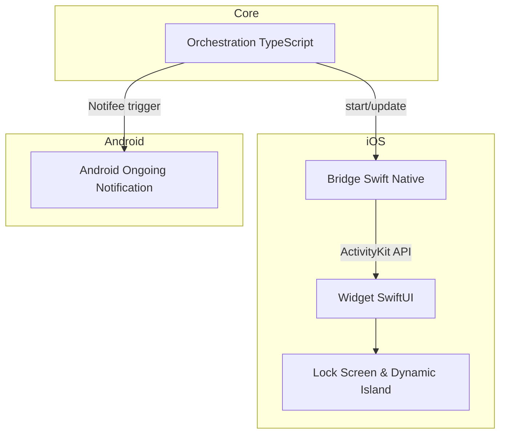
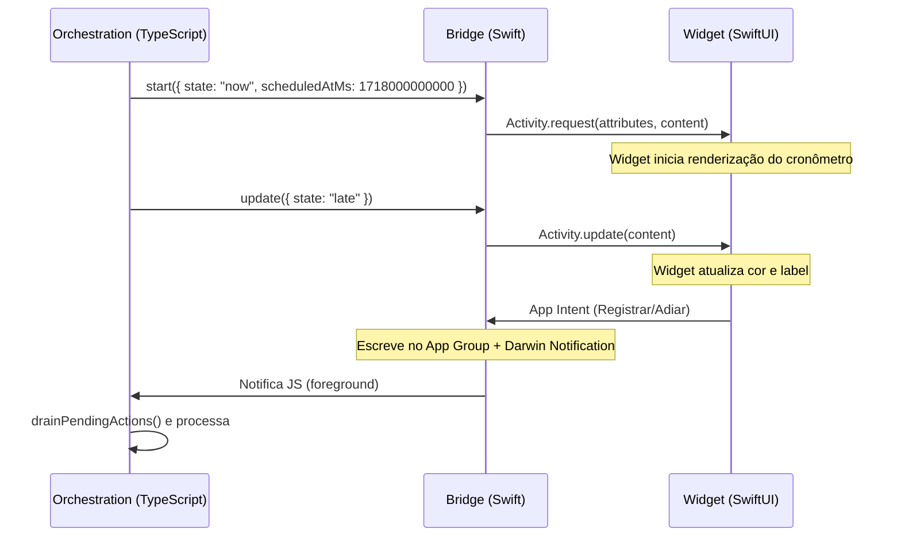
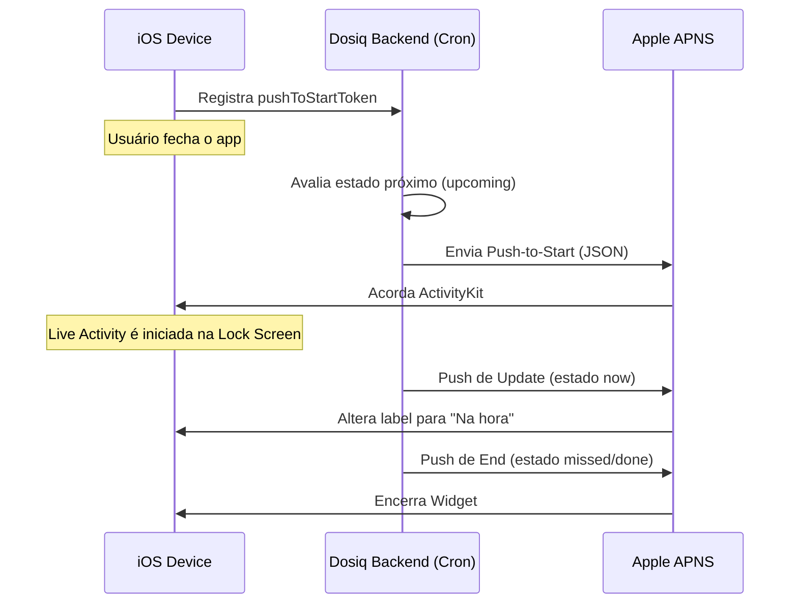

# Arquitetura de Live Activities (Dose Activity)

## Visão Geral

As Live Activities no iOS são widgets dinâmicos que exibem informações em tempo real na Lock Screen e na Dynamic Island. No ecossistema Dosiq, a **Dose Activity** é a representação contínua da próxima dose crítica de um paciente. 

O Dosiq adota Live Activities para promover engajamento passivo. O paciente consegue acompanhar o status de uma dose pendente (antecipada, no horário ou atrasada) e interagir com ela (marcar como tomada ou adiar) sem precisar desbloquear o telefone ou abrir o aplicativo. Essa superfície de visualização funciona como uma extensão do alerta crítico.

Como o React Native não tem acesso direto à API do ActivityKit, a arquitetura do Dosiq divide a implementação em três camadas fundamentais, garantindo comunicação eficiente entre a interface gráfica no iOS e a lógica de negócio em TypeScript. O Android resolve o mesmo problema funcional através de uma notificação persistente interativa (ongoing notification), orquestrada pelas mesmas engrenagens TypeScript.



## Arquitetura das 3 Camadas

O isolamento em três camadas separa a orquestração do domínio (TypeScript) da apresentação visual dependente de plataforma (SwiftUI). 

| Camada | Linguagem | Runtime | Diretório Base | Responsabilidade |
|---|---|---|---|---|
| **Orchestration** | TypeScript | React Native JS Thread | `platform/doseActivity/` | Avaliar qual dose exibir, orquestrar transições e escutar fila de ações. |
| **Native Bridge** | Swift | iOS App Process | `ios-native/` | Expor métodos para o JS, traduzir dicionários e persistir token APNS. |
| **Widget UI** | Swift | iOS App Extension | `targets/dose-activity/` | Renderizar a Live Activity usando os atributos recebidos via ActivityKit. |



## Widget SwiftUI (`targets/dose-activity/`)

A interface nativa da Live Activity é implementada usando SwiftUI. O projeto utiliza o plugin `@bacons/apple-targets` (configurado no `app.config.js` via `appleTeamId`) para provisionar de forma reprodutível o App Extension no EAS Build, evitando gerenciar arquivos Xcode `.pbxproj` diretamente.

### Modelo de Dados: `DoseActivityAttributes`

O arquivo `DoseActivityAttributes.swift` define a estrutura de dados (contrato) compartilhada entre o aplicativo principal e a extensão do widget. Ele é o único arquivo incluído nos dois *targets*.

```swift
// apps/mobile/targets/dose-activity/DoseActivityAttributes.swift
import ActivityKit
import Foundation

struct DoseActivityAttributes: ActivityAttributes {
    public struct ContentState: Codable, Hashable {
        var state: String        // later|upcoming|now|late|done
        var scheduledAt: Date    // instante-alvo da dose
        var doneAtLabel: String  // "19:02" 
    }

    var medicineName: String
    var doseLabel: String
    var scheduledTime: String
    var discreet: Bool           // oculta nome na lock screen
    var instanceId: String       
    var treatmentId: String      
    var groupSize: Int           
}
```

### Apresentação: `DoseActivityWidget`

O componente visual decide como renderizar o estado estático e dinâmico. Um aspecto vital do widget é que o cronômetro visual é **server-free** e **JS-free**. Ele utiliza o componente nativo `Text(timerInterval:)`, que continua rodando regressiva ou progressivamente sem necessidade de atualizações via push ou do React Native.

```swift
// apps/mobile/targets/dose-activity/DoseActivityWidget.swift
// ... (restante do arquivo)
@available(iOS 16.2, *)
@ViewBuilder
private func timerView(_ s: DoseActivityAttributes.ContentState) -> some View {
    let st = displayState(s)
    let now = Date()
    if st == "upcoming" || st == "now" {
        if s.scheduledAt > now {
            Text(timerInterval: now...s.scheduledAt, countsDown: true)
                .monospacedDigit().lineLimit(1)
        } else {
            Text("agora").lineLimit(1).accessibilityLabel("hora da dose")
        }
    } else if st == "late" {
        let elapsedMin = now.timeIntervalSince(s.scheduledAt) / 60.0
        if elapsedMin <= 120 {
            Text(timerInterval: s.scheduledAt...s.scheduledAt.addingTimeInterval(120 * 60),
                 countsDown: false).monospacedDigit().lineLimit(1)
        } else {
            Text(daysAgoLabel(s.scheduledAt, now)).lineLimit(1)
        }
    } else {
        EmptyView()
    }
}
// ... (restante do arquivo)
```

### Interações: `DoseActivityIntents`

Os botões exibidos na Lock Screen e Dynamic Island invocam App Intents. Como a extensão do widget muitas vezes executa quando o aplicativo principal está suspenso ou morto, o intent enfileira a ação em um `UserDefaults` compartilhado via App Group (`group.com.coelhotv.dosiq`). O aplicativo principal (TypeScript) então consome essa fila quando acordado, garantindo que o registro da dose ocorra dentro do ambiente autenticado e vivo do React Native.

```swift
// apps/mobile/targets/dose-activity/DoseActivityIntents.swift
// ... (restante do arquivo)
@available(iOS 17.0, *)
struct DoseRegisterIntent: LiveActivityIntent {
    static var title: LocalizedStringResource = "Registrar dose"
    static var description = IntentDescription("Abre o app para registrar a dose.")
    static var openAppWhenRun: Bool = true

    @Parameter(title: "instanceId") var instanceId: String
    @Parameter(title: "treatmentId") var treatmentId: String

    init() {}
    init(instanceId: String, treatmentId: String) {
        self.instanceId = instanceId
        self.treatmentId = treatmentId
    }

    func perform() async throws -> some IntentResult {
        DoseActivityActionQueue.enqueue(action: "register", instanceId: instanceId, treatmentId: treatmentId)
        return .result()
    }
}
// ... (restante do arquivo)
```

A renderização da logo utiliza o `DosiqMark.swift`, onde os caminhos vetoriais do SVG são portados para primitivas absolutas nativas `M/L/C/Z`, uma vez que o target do widget não suporta a biblioteca `react-native-svg`.

## Bridge Swift (`ios-native/DoseActivityBridge.swift`)

A ponte nativa (Bridge) reside no processo principal do aplicativo. Ela expõe métodos objetivos C/Swift invocáveis pelo lado TypeScript (React Native). Esta camada traduz `NSDictionary` para as estruturas fortemente tipadas requisitadas pelo `ActivityKit`.

Um mecanismo chave aqui é o `staleDate`. O iOS exige que o sistema acorde a Live Activity para que ela re-processe sua interface sem receber um push silencioso. Enviamos o instante da próxima mudança de estado de dose (`staleDateMs`) para que a transição ocorra de forma agendada no SO local.

```swift
// apps/mobile/ios-native/DoseActivityBridge.swift
// ... (restante do arquivo)
    @objc(start:resolver:rejecter:)
    func start(_ params: NSDictionary,
               resolver resolve: @escaping RCTPromiseResolveBlock,
               rejecter reject: @escaping RCTPromiseRejectBlock) {
        guard #available(iOS 16.2, *) else { reject("unsupported", "Live Activities exigem iOS 16.2+", nil); return }
        
        let attributes = buildAttributes(params)
        let contentState = buildState(params)
        let instanceId = params["instanceId"] as? String ?? ""
        
        Task {
            // Garante uma Live Activity ativa por vez
            for activity in Activity<DoseActivityAttributes>.activities {
                await activity.end(nil, dismissalPolicy: .immediate)
            }
            do {
                let content = ActivityContent(state: contentState, staleDate: staleDate(params, contentState))
                let activity: Activity<DoseActivityAttributes>
                
                if #available(iOS 17.2, *) {
                    activity = try Activity.request(attributes: attributes, content: content, pushType: .token)
                    DoseActivityBridge.observeActivityPushToken(activity, instanceId: instanceId)
                } else {
                    activity = try Activity.request(attributes: attributes, content: content, pushType: nil)
                }
                resolve(activity.id)
            } catch {
                reject("request_failed", error.localizedDescription, error)
            }
        }
    }
// ... (restante do arquivo)
```

A ponte também escuta o token per-Activity gerado pelo ActivityKit. Esse token hexadecimal é guardado no App Group, e o TypeScript realiza um `pull` periodicamente para registrar esse endpoint (Activity Push Token) na base do Supabase.

## Bridges TypeScript (`platform/doseActivity/`)

O lado JavaScript orquestra a máquina de estado originada pelo `@dosiq/core`. Diferentes arquivos atuam dependendo da plataforma ativa, apesar de terem propósitos unificados de apresentar a interface ao usuário.

### `DoseActivityBridge.ts`

Este módulo orquestra a superfície visual contínua, mas é específico para o Android (usando o `doseActivitySurfaceService` implementado sobre o `notifee`). Ele deriva qual dose crítica pendente é a candidata a ser visualizada e comanda a exibição ou o encerramento.

```typescript
// apps/mobile/src/platform/doseActivity/DoseActivityBridge.ts
// ... (restante do arquivo)
async function deriveAndRender({ userId, protocols, tz, prevInstanceId }) {
  if (!userId) {
    if (prevInstanceId) await endDoseActivity(prevInstanceId)
    return null
  }
  const repo = createDoseInstanceRepository({ client: supabase as any })
  const now = getRawNow()
  const instances = await repo.getWindow(userId, addDays(now, -3), addDays(now, 3))
  const items = buildDoseItemsFromInstances(instances, protocols, tz).filter(
    (it) => it.status === 'pending' && it.critical
  )

  const active = selectActiveDoseActivity(items, now)
  if (prevInstanceId && (!active || active.instanceId !== prevInstanceId)) {
    await endDoseActivity(prevInstanceId)
  }
  if (!active) return null

  const doseItem = items.find((it) => it.instanceId === active.instanceId) || null
  await armDoseActivity(active, doseItem, { now, discreet: active.isCritical })
  return active.instanceId
}
// ... (restante do arquivo)
```

### `DoseLiveActivityBridge.ts`

A contraparte para iOS, especializada em governar a Live Activity. Diferentemente do Android (que confia em triggers encadeados do Notifee para acordar em background), a Live Activity usa um relógio vivo nativo. 

Este script implementa o loop principal de ciclo de vida para derivar a próxima dose e empurrá-la à ponte nativa (`startLiveActivity`, `updateLiveActivity`, `endLiveActivity`). Ele também é responsável por drenar a fila do App Group (App Intents interativos) e invocar ações seguras sob uma sessão validada.

```typescript
// apps/mobile/src/platform/doseActivity/DoseLiveActivityBridge.ts
// ... (restante do arquivo)
async function processPendingActions(tz) {
  const queue = await drainPendingActions()
  if (queue.length === 0) return
  const uid = await liveUserId()
  if (!uid) return 
  let protocols = null
  for (const item of queue) {
    if (item.action === 'register') {
      if (!protocols) protocols = await fetchEnrichedProtocols(uid, tz).catch(() => [])
      const doseItem = await resolveDoseItem(uid, protocols, tz, item.instanceId).catch(() => null)
      const params = buildRegisterParams(doseItem, item.treatmentId)
      if (params) navigateTodayWithRetry(params)
    } else if (item.action === 'snooze') {
      if (!protocols) protocols = await fetchEnrichedProtocols(uid, tz).catch(() => [])
      const doseItem = await resolveDoseItem(uid, protocols, tz, item.instanceId).catch(() => null)
      if (doseItem) {
        await scheduleSnooze({
          doseInstanceId: item.instanceId,
          medicineName: doseItem.medicineName,
          scheduledFor: doseItem.scheduledFor,
          toleranceMinutes: doseItem.toleranceMinutes ?? null,
          isCritical: doseItem.critical ?? true,
          data: { /* ... */ },
        })
      }
    }
  }
}
// ... (restante do arquivo)
```

## Orchestration Layer

Os módulos de baixo nível (serviços e agendadores) executam as lógicas granulares por trás das pontes.

### `doseActivityScheduler.ts`

Esse módulo é exclusivo para a abordagem Android de Trigger-Driven. Ele agenda as transições de estado (upcoming, now, late) gerando novos agendamentos via Notifee local. Cada boundary dispara uma repintura da notificação, carregando a inteligência inteira no seu payload (`buildRegistrationData`).

```typescript
// apps/mobile/src/platform/doseActivity/doseActivityScheduler.ts
// ... (restante do arquivo)
export async function advanceDoseActivity(data, now = getRawNow()) {
  if (!data || data.__surface !== 'true' || !data.doseInstanceId) return
  const doseItem = reconstructDoseItem(data)
  if (!doseItem.scheduledFor) return
  await scheduleNextBoundary(doseItem, now.getTime(), data.discreet === 'true')
}
// ... (restante do arquivo)
```

### `doseActivitySurfaceService.ts`

O serviço envelopa o uso do Notifee e garante o cumprimento do contrato visual (cor `STATE_ACCENT` e label `STATE_BODY`) na persistente notificação do Android. O ID da notificação utiliza um sufixo estrito `surfaceId` para não anular o alarme principal focado em despertar o usuário.

```typescript
// apps/mobile/src/platform/doseActivity/doseActivitySurfaceService.ts
// ... (restante do arquivo)
export function buildSurfaceNotification(activity, { now, discreet, doseItem }) {
  const doseLabel = doseItem ? formatDoseItem(doseItem) : ''
  const title = doseLabel ? `${activity.medicineLabel || 'Dose'} · ${doseLabel}` : activity.medicineLabel || 'Dose'
  const time = doseItem?.scheduledTime || ''
  const { body, chrono } = resolveBodyAndChrono(activity, now, time)

  const showActions = activity.state !== DOSE_ACTIVITY_STATES.LATER
  const actions = showActions
    ? [
        { title: 'Registrar', pressAction: { id: SURFACE_ACTION.REGISTER, launchActivity: 'default' } },
        { title: 'Adiar', pressAction: { id: SURFACE_ACTION.SNOOZE } },
      ]
    : undefined

  return {
    id: surfaceId(activity.instanceId),
    title,
    body,
    data: buildRegistrationData(activity, doseItem, discreet),
    android: {
      channelId: DOSE_ACTIVITY_CHANNEL_ID,
      importance: AndroidImportance.HIGH,
      visibility: discreet ? AndroidVisibility.PRIVATE : AndroidVisibility.PUBLIC,
      color: STATE_ACCENT[activity.state] ?? colors.neutral[400],
      smallIcon: 'ic_dosiq_mark',
      ongoing: true,
      autoCancel: false,
      onlyAlertOnce: true,
      ...(actions ? { actions } : {}),
      ...chrono,
    },
  }
}
// ... (restante do arquivo)
```

### `liveActivityService.ts`

A faceta JavaScript isolada do NativeModules que invoca a ponte em Swift. Possui guarda de falha (`Platform.OS === 'ios' && !!native`) e gerencia a conversão de parâmetros (TypeScript strings para os dicionários da bridge).

### `doseActivityRefreshBus.ts`

Um barramento simples e síncrono. O registro em-app de uma dose (ex. pelo botão da tela Hoje) ocorre num momento em que a camada visual da Live Activity pode estar desatualizada (pois o iOS não possui listeners em background contínuo). O core aciona `triggerDoseActivityRefresh()` no `doseService`, que é interceptado pelo `DoseLiveActivityBridge` para iniciar o re-derive, alterando imediatamente a Live Activity para o card "done".

## Ciclo de Vida via APNS (Push-to-Start)

Para operar Live Activities enquanto o aplicativo está totalmente encerrado (morto), a plataforma utiliza o padrão **Push-to-Start** (iOS 17.2+). O sistema operacional produz um `pushToStartToken` único que é associado ao banco de dados no backend Supabase.



A comunicação server-side usa JSON estruturado no cabeçalho exigido pela Apple (APS).

**Exemplo: Payload APNS Push-to-Start**
```json
{
  "aps": {
    "timestamp": 1718000000,
    "event": "start",
    "content-state": {
      "state": "upcoming",
      "scheduledAtMs": 1718003600000,
      "doneAtLabel": ""
    },
    "attributes-type": "DoseActivityAttributes",
    "attributes": {
      "medicineName": "Lantus",
      "doseLabel": "10 UI",
      "scheduledTime": "19:00",
      "discreet": false,
      "instanceId": "dose_instance_abc123",
      "treatmentId": "treat_plan_987",
      "groupSize": 1
    }
  }
}
```

**Exemplo: Payload APNS Update**
```json
{
  "aps": {
    "timestamp": 1718003600,
    "event": "update",
    "content-state": {
      "state": "now",
      "scheduledAtMs": 1718003600000,
      "doneAtLabel": ""
    }
  }
}
```

**Exemplo: Payload APNS End**
```json
{
  "aps": {
    "timestamp": 1718007200,
    "event": "end",
    "dismissal-date": 1718007380,
    "content-state": {
      "state": "done",
      "scheduledAtMs": 1718003600000,
      "doneAtLabel": "19:02"
    }
  }
}
```

## Paridade Android

O modelo mental das interfaces é idêntico em ambas plataformas. O Dosiq provê a mesma funcionalidade de "janela" por meio de diferentes construções.

| Capacidade | iOS (Live Activity) | Android (Notificação Persistente) |
|---|---|---|
| **Renderização base** | Widget UI via Swift/ActivityKit. | Canal de Notificação com importância HIGH. |
| **Relógio** | View nativa `Text(timerInterval:)`. | `chrono` options nativos em Notifee. |
| **Ações** | App Intents gravam no App Group `UserDefaults`. | Handlers de Notification Press (Headless JS). |
| **Transição de Status** | Re-render via `staleDate` (OS reavalia a Data). | Handlers de Background via AlarmManager triggers. |
| **Card de Finalização** | `dismissalPolicy: .after(Date)` (3 min). | `timeoutAfter: DONE_CARD_TIMEOUT_MS`. |
| **Privacidade da UI** | Controle manual via `discreet: true`. | `visibility: PRIVATE` (SO cuida da ofuscação). |

## Debugging e Troubleshooting

Ao lidar com Live Activities, falhas podem ocorrer tanto no pipeline de tokens quanto em desserializações binárias na Bridge. Consulte as dicas de triagem:

| Sintoma | Camada Afetada | Diagnóstico |
|---|---|---|
| Live Activity não aparece na tela | Target iOS (Swift) | Verifique se `Live Activities` estão habilitadas nos Ajustes do iOS. Para Push-to-Start, confirme o `appleTeamId` no `app.config.js`. |
| Relógio de atraso mostrando negativo | UI (SwiftUI) | `staleDate` está atrasado ou backend perdeu um frame de push. O SwiftUI renderiza regressivo a menos que `state="late"`. |
| Notificação não apaga após "Tomar" | TS Bridge (RefreshBus) | O `doseService` pode estar falhando silenciosamente no cancelamento (`_cancelAlarmBestEffort`). Habilite `__DEV__` logs. |
| Botão "Registrar" inerte (sem ação) | App Intents / App Group | Entitlement `com.apple.security.application-groups` incorreto. O App Intent não está logando na fila correta. |
| Token não chega no Supabase | Auth / RLS | O TS orquestrador está disparando RPC sem ter uma sessão de usuário ativa (Live Session Block). |

---

*Fim do documento.* Todos os construtos acima podem ser validados diretamente explorando o diretório `apps/mobile/targets/dose-activity/` e os respectivos logs analíticos atrelados na infraestrutura Firebase.
