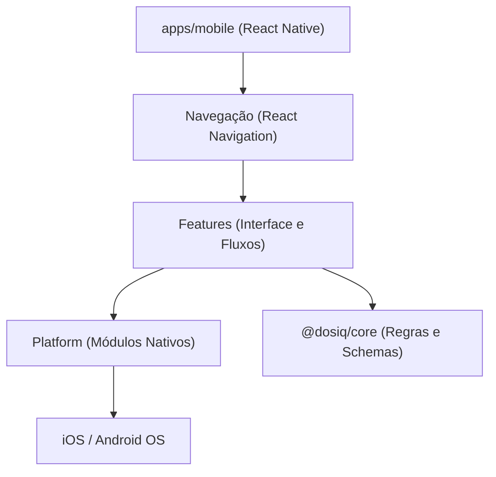
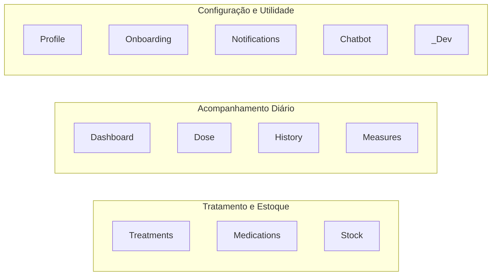
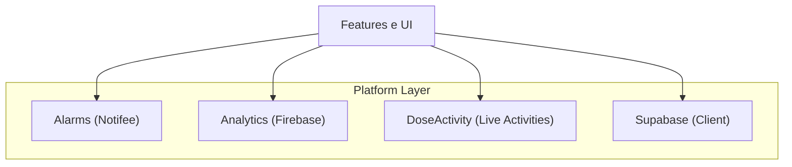
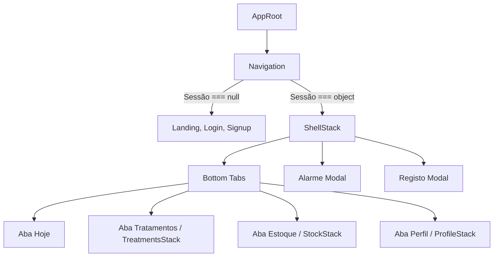

# Arquitetura do App Mobile 📱

## Visão Geral

O Dosiq Mobile é o cliente nativo do ecossistema Dosiq, desenvolvido para fornecer funcionalidades restritas aos dispositivos iOS e Android. Enquanto o PWA (`apps/web`) atende o acesso via browser, o app móvel explora APIs do sistema operativo para garantir confiabilidade em cenários críticos — como alarmes locais (Notifee) que ignoram o modo silencioso, widgets interativos (Live Activities no iOS) e persistência segura em hardware.

A aplicação é construída com **React Native 0.79.6**, **Expo SDK 53** e **React 19**. Toda a camada mobile é essencialmente uma interface de apresentação avançada, pois delega a validação de regras de negócio estritas para os pacotes compartilhados (nomeadamente `@dosiq/core` e `@dosiq/shared-data`). O app importa lógicas de agendamento e schemas de validação diretamente do core, implementando localmente apenas o ciclo de vida nativo e a renderização.



## Estrutura de Pastas

A organização do código fonte (`apps/mobile/src/`) segue um modelo de camadas isoladas. A distinção mais importante é a separação entre `features/` (lógica de apresentação do negócio) e `platform/` (integração com o hardware e APIs do sistema).

```text
apps/mobile/src/
├── features/      # Lógica de interface agrupada por domínios (12 módulos)
├── navigation/    # Árvores de roteamento, tabs e stacks
├── platform/      # Envoltórios para APIs nativas do dispositivo (9 módulos)
├── screens/       # Telas raiz que não pertencem a uma feature (ex: Auth, Splash)
├── shared/        # Componentes visuais, hooks e tokens tipográficos agnósticos
└── types/         # Tipos globais da aplicação (ex: root params)
```

| Diretório | Propósito | Exemplo de Conteúdo | Equivalente Web |
|---|---|---|---|
| `features/` | Componentes e telas de domínios específicos. | `dose/screens/AlarmFullScreen.tsx` | `features/` |
| `platform/` | Conectores com bibliotecas nativas e sistema operacional. | `alarms/AlarmSchedulerBridge.ts` | (Inexistente) |
| `navigation/` | Definição das rotas e controladores de stack. | `RootTabs.tsx`, `routes.ts` | `src/App.tsx` (Router) |
| `shared/` | Blocos construtores visuais reutilizáveis. | `ui/ScreenContainer.tsx` | `shared/` |

## Features — Os 12 Domínios de Negócio

A arquitetura orientada a domínios organiza o código visual em 12 áreas independentes. Cada feature encapsula as suas telas, componentes específicos e serviços, expondo apenas o necessário para a navegação.



### 1. Dashboard
Ponto de aterrissagem do utilizador, concentra o resumo do dia e ações rápidas. Calcula métricas de adesão da semana e projeta as doses urgentes. A `TodayScreen` lida também com a "Heurística de Complexidade", adaptando a UI dependendo de quantos medicamentos ativos o utilizador possui (escondendo ou exibindo turnos inteiros vazios).
| Domínio | Telas Principais | Componentes |
|---|---|---|
| Dashboard | `TodayScreen.tsx` | `HeroDoseCard.tsx`, `AdherenceDayCard.tsx` |

### 2. Dose
Domínio crítico que gere a interação direta com a toma de medicamentos. Inclui a visualização de bloqueio de ecrã para alarmes e painéis para o registo em massa de múltiplas doses.
| Domínio | Telas Principais | Componentes |
|---|---|---|
| Dose | `AlarmFullScreen.tsx` | `DoseRegisterModal.tsx`, `BulkDoseRegisterModal.tsx` |

### 3. Treatments
Gestão dos protocolos de tratamento, associando horários e regras a um medicamento para um paciente.
| Domínio | Telas Principais | Componentes |
|---|---|---|
| Treatments | `TreatmentsScreen.tsx`, `ProtocolDetailScreen.tsx` | `ProtocolForm.tsx` |

### 4. Medications
Cadastro de medicamentos base, servindo como entidade central referenciada por tratamentos e estoque.
| Domínio | Telas Principais | Componentes |
|---|---|---|
| Medications | `MedicinesListScreen.tsx`, `MedicineDetailScreen.tsx` | `MedicineFormScreen.tsx` |

### 5. Stock
Controle de inventário de medicamentos. Processa alertas de fim de caixa e exibe fluxos independentes para entrada (compras) e ajustes manuais.
| Domínio | Telas Principais | Componentes |
|---|---|---|
| Stock | `StockScreen.tsx`, `StockDetailScreen.tsx` | `PurchaseFormScreen.tsx` |

### 6. Profile
Gestão da conta do utilizador, permissões de segurança e hubs de integração de dados e suporte.
| Domínio | Telas Principais | Componentes |
|---|---|---|
| Profile | `ProfileScreen.tsx`, `SettingsScreen.tsx` | `DeleteAccountScreen.tsx` |

### 7. Measures
Registo e acompanhamento de biomarcadores e dados fisiológicos independentes de medicamentos (pressão arterial, glicemia).
| Domínio | Telas Principais | Componentes |
|---|---|---|
| Measures | `MeasuresScreen.tsx` | `MeasureCard.tsx`, `MeasureLogSheet.tsx` |

### 8. History
Relatório cronológico e consolidação de adesão ao longo do tempo. Lista todas as ações do utilizador sobre tratamentos ativos.
| Domínio | Telas Principais | Componentes |
|---|---|---|
| History | `HistoryScreen.tsx` | `HistoryFilter.tsx` |

### 9. Notifications
Caixa de entrada interna do utilizador (inbox) para comunicados sistêmicos, e gestão das preferências de recebimento por canais.
| Domínio | Telas Principais | Componentes |
|---|---|---|
| Notifications | `NotificationInboxScreen.tsx` | `NotificationPreferencesScreen.tsx` |

### 10. Onboarding
Fluxo guiado interativo exibido apenas no primeiro acesso do utilizador após a criação da conta. Auxilia a configuração do primeiro tratamento e do saldo de estoque.
| Domínio | Telas Principais | Componentes |
|---|---|---|
| Onboarding | `OnboardingNavigator.tsx` | `OnboardingWelcome.tsx` |

### 11. Chatbot
Assistente integrado (IA) exibido em modal de ecrã inteiro. Utilizado para tirar dúvidas rápidas sobre a interação medicamentosa.
| Domínio | Telas Principais | Componentes |
|---|---|---|
| Chatbot | `ChatScreen.tsx` | `ChatEntryButton.tsx` |

### 12. _dev
Domínio exclusivo para ambientes de desenvolvimento (`__DEV__`). Contém laboratórios de UI e telas de diagnóstico para testar primitivas visuais antes da adoção.
| Domínio | Telas Principais | Componentes |
|---|---|---|
| _dev | `DevHubScreen.tsx`, `StockPrimitivesDemoScreen.tsx` | N/A |

## Platform — Os 9 Módulos Nativos

Os módulos em `platform/` são restritos ao uso de dependências nativas (iOS/Android). Nenhuma funcionalidade de negócio interage diretamente com o hardware sem passar por um destes conectores. Isso garante que a atualização do SDK do Expo ou a substituição de uma lib nativa afete apenas este diretório.



| Módulo | Dependência Nativa | Propósito | Arquivos-chave |
|---|---|---|---|
| **alarms** | `@notifee/react-native` | Registo de alarmes em background e notificações time-sensitive no iOS. | `AlarmSchedulerBridge.ts`, `registerAlarmBackgroundHandler.ts` |
| **analytics** | `@react-native-firebase/analytics` | Telemetria e tracking sem capturar identificadores pessoais (PII). | `firebaseAnalytics.ts` |
| **audit** | `@react-native-firebase/crashlytics` | Recolha automatizada de crashes nativos e exceções não tratadas no JS. | `crashlyticsSetup.ts` |
| **auth** | `expo-secure-store` | Fluxos de login, recuperação de conta e validação Zod. | `authService.ts`, `secureStoreAuthStorage.ts` |
| **config** | `expo-constants` | Resolução do ficheiro `app.config.js` e injecção de variáveis de ambiente no runtime. | `nativePublicAppConfig.ts` |
| **doseActivity** | `@bacons/apple-targets` | Controlo dos widgets dinâmicos na Dynamic Island (iOS) e Notificações contínuas (Android). | `DoseActivityBridge.tsx`, `DoseLiveActivityBridge.tsx` |
| **notifications** | `expo-notifications` | Push notifications remotas processadas quando a app está em execução. | `usePushNotifications.ts` |
| **storage** | `@react-native-async-storage` | Caches efêmeros e guardas de estado não-crítico. | `asyncStorageCache.ts` |
| **supabase** | `@supabase/supabase-js` | Cliente único com storage substituído pelo `secureStoreAuthStorage` para persistência segura. | `nativeSupabaseClient.ts` |

**Por que encapsular APIs nativas?**
No exemplo prático de `firebaseAnalytics.ts`, o módulo suprime exceções ativamente para que uma falha analítica não interrompa a navegação:

```typescript
// apps/mobile/src/platform/analytics/firebaseAnalytics.ts
import { logEvent as firebaseLogEvent } from '@react-native-firebase/analytics'

export async function logEvent(eventName, params = {}) {
  try {
    const a = getAnalyticsInstance()
    if (!a) return
    await firebaseLogEvent(a, eventName, params)
  } catch (error) {
    if (__DEV__) console.warn('[Analytics] logEvent error:', error.message)
  }
}
```

Outro ponto crítico é o `nativeSupabaseClient.ts`, que gere automaticamente o refresh de tokens com base no ciclo de vida da aplicação móvel:
```typescript
// apps/mobile/src/platform/supabase/nativeSupabaseClient.ts
// Pausa/retoma refresh automático com ciclo de vida do app
AppState.addEventListener('change', (state) => {
  if (state === 'active') {
    supabase.auth.startAutoRefresh()
  } else {
    supabase.auth.stopAutoRefresh()
  }
})
```

## Sistema de Navegação

A aplicação baseia-se num sistema hierárquico construído com o `React Navigation v7`. Para prevenir o erro `IndexOutOfBoundsException` (comum no `native-stack` em versões antigas do Android), todas as árvores principais usam rotas puramente em JavaScript via `createStackNavigator`.

### Arquitetura de Rotas

1. **AppRoot (`AppRoot.tsx`)**: Ponto de entrada que captura a telemetria inicial e inicializa o `SafeAreaProvider`. Também injeta os bridges nativos (como `AlarmSchedulerBridge` e `DoseActivityBridge`).
2. **Navigation (`Navigation.tsx`)**: Ouve o evento `onAuthStateChange` do Supabase e age como um switch. Renderiza as telas de autenticação se a sessão for `null`, ou as telas da aplicação se a sessão for válida.
3. **RootTabs (`RootTabs.tsx`)**: Controlador das bottom tabs principais (Hoje, Tratamentos, Estoque, Perfil).
4. **Stacks Específicos**: Sub-árvores para cada aba, como `StockStack` e `TreatmentsStack`. O re-tap numa tab ativa reinicia o stack associado.



### O Ponto de Entrada: `AppRoot.tsx`

O código no `AppRoot.tsx` exemplifica como medimos perfomance e solicitamos permissões antes da interface iniciar de facto. Usamos `Date.now()` no escopo do módulo para medir o **cold start**:

```typescript
// apps/mobile/src/navigation/AppRoot.tsx
const APP_START_TS = Date.now()

export default function AppRoot() {
  const [fontsLoaded] = useFonts({
    'Comfortaa-Regular': Comfortaa_400Regular,
    'Comfortaa-Bold': Comfortaa_700Bold,
  })

  // Cold start telemetry — dispara 1x quando fontes carregam (app interativo).
  useEffect(() => {
    if (!fontsLoaded) return
    const launchMs = Date.now() - APP_START_TS
    analytics().logEvent('cold_start', { duration_ms: launchMs }).catch(() => {})
  }, [fontsLoaded])
  
  // ... (restante do arquivo)
}
```

### Lista de Navegação Principal (`routes.ts`)

O arquivo `routes.ts` centraliza todas as chaves em constantes, proibindo o uso de strings soltas nos ficheiros. Isto evita erros difíceis de depurar em runtime:
```typescript
// apps/mobile/src/navigation/routes.ts
export const ROUTES = {
  // Shell do produto (tab navigator)
  TABS: 'Tabs',
  ALARM_FULLSCREEN: 'AlarmFullScreen',
  // Tabs principais
  TODAY: 'Hoje',
  TREATMENTS: 'Tratamentos',
  STOCK: 'Estoque',
  PROFILE: 'Perfil',
  // ... (restante do arquivo)
}
```

O `navigationRef.ts` expõe a referência global do contentor, permitindo a navegação programática a partir de módulos fora do contexto React (útil para cliques em push notifications que acordam o app).

## Fluxo de Autenticação

A transição do utilizador não autenticado para o dashboard de utilizador ocorre na `Navigation.tsx`. O app baseia-se em 3 estados precisos, eliminando saltos indesejados (flashes da tela de login):

1. **`undefined`**: O SecureStore está a ler a sessão inicial. Apresenta o `ActivityIndicator`.
2. **`null`**: Sem sessão. Apresenta a árvore pública (`LandingScreen`, `LoginScreen`).
3. **`object`**: Sessão ativa. Apresenta a árvore da aplicação.

O `authService.ts` acopla as regras do Zod diretamente nos métodos de signIn e signUp, sem deixar chegar solicitações inválidas ao Supabase:
```typescript
// apps/mobile/src/platform/auth/authService.ts
export async function signInWithEmail(email, password) {
  const validation = loginCredentialsSchema.safeParse({ email, password })

  if (!validation.success) {
    const errorMessage = validation.error.issues[0]?.message || 'Dados inválidos'
    return { success: false, error: errorMessage }
  }

  try {
    const { error: authError } = await supabase.auth.signInWithPassword({
      email: validation.data.email,
      password: validation.data.password,
    })
    // ...
  } catch {
    return { success: false, error: 'Erro inesperado ao fazer login' }
  }
}
```

Para a recuperação de senhas, deep links com PKCE (`dosiq://auth/callback`) são interceptados na raiz da navegação e resolvem o token. O `SmokeScreen` é uma rota transitória para testes iniciais de ambiente durante o desenvolvimento.

## Shared — Recursos Compartilhados

Todos os módulos de interface devem importar as suas cores e fontes do `shared/styles/tokens.ts` (variáveis nativas) para garantir uma UI padronizada. Em vez do Tailwind usado no PWA, aqui o `StyleSheet.create` compõe primitivas flexíveis.

- **Componentes (`ui`, `feedback`, `form`)**: Engloba o `ScreenContainer`, `Toast`, e `StaleBanner`.
- **States**: `LoadingState`, `EmptyState`, e `ErrorState` garantem que não haja estados órfãos numa feature, resolvendo o ecrã de carregamento ou erros inesperados de forma consistente.

## Diferenças Arquiteturais vs. Web (PWA)

O Dosiq é um monorepo. Partilha todo o `@dosiq/core` entre o site e a app nativa, mas as suas camadas de interface (e integrações periféricas) divergem obrigatoriamente. A Tabela abaixo expõe onde as plataformas tomam decisões arquiteturais distintas:

| Aspecto | Web (apps/web) | Mobile (apps/mobile) |
|---|---|---|
| **Navegação** | React Router DOM (Baseado em URLs da barra de navegação) | React Navigation (Baseado em Stacks na memória do dispositivo) |
| **Persistência Auth** | Cookies / LocalStorage padrão do navegador | SecureStore (Hardware Keychain / Keystore Encriptado) |
| **Notificações** | Web Push API (Limitado no iOS Safari) | `@notifee/react-native` (Alarmes Time Sensitive) e Expo Push |
| **Build & Bundle** | Vite (Rollup, ESModules nativos) | Metro Bundler e EAS Build (Prebuilds dinâmicos) |
| **Integração de SO** | Nenhuma | ActivityKit (iOS Live Activities) via `@bacons/apple-targets` |
| **Estilização** | TailwindCSS + Vanilla CSS modules | `StyleSheet.create` com tokens semânticos (`@shared/styles/tokens.ts`) |

**Por que a discrepância técnica existe?**
O maior distanciamento tático está no uso de **Background Tasks**. No mobile, processos pesados como a recalibração de agendas após uma ação no Widget (`DoseLiveActivityBridge.tsx`) requerem a inscrição de tarefas sem ecrã (headless JS) executadas no módulo nativo do aplicativo. No PWA, quando a tab do browser fecha, o processo morre, inviabilizando alarmes em horários rígidos que independem da presença online do utilizador.
