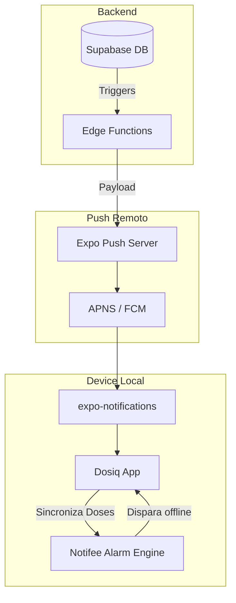
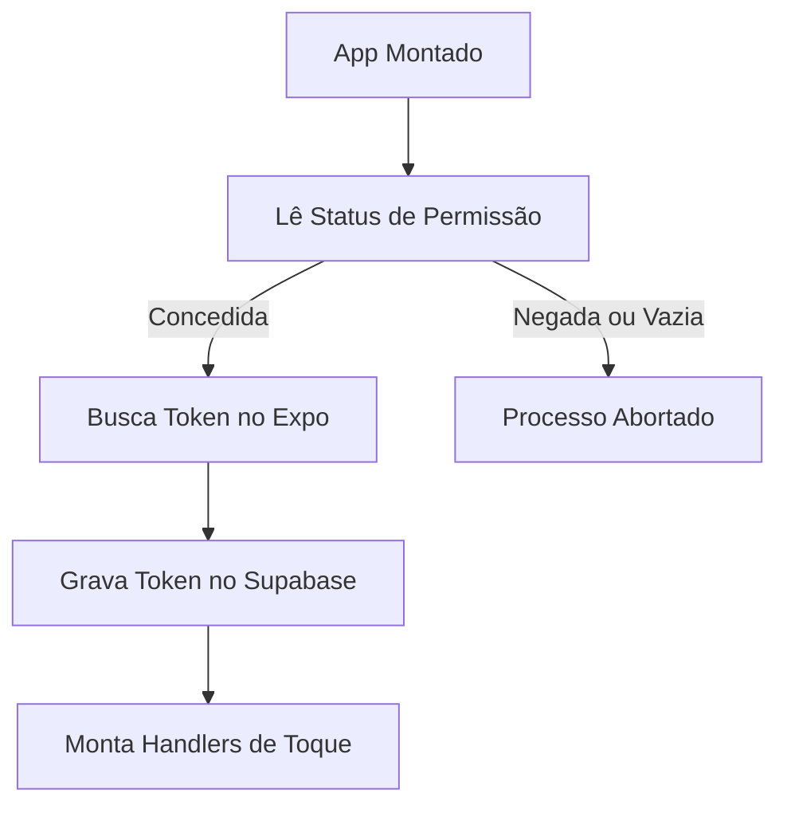
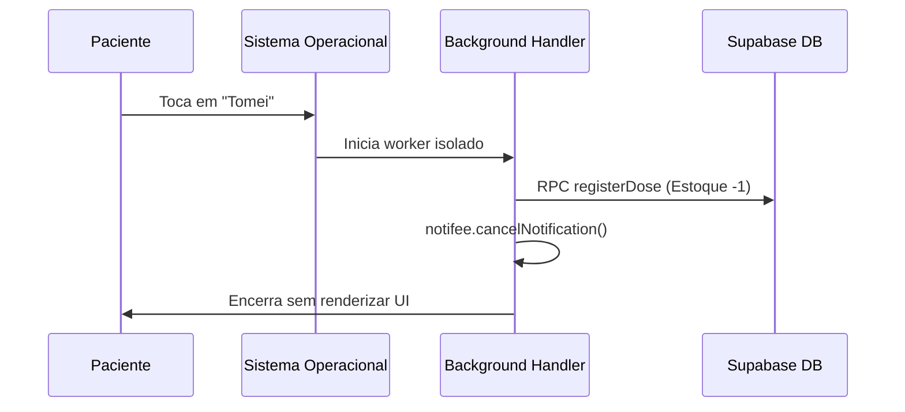

# 📱 Arquitetura de Notificações Mobile

## Visão Geral

O Dosiq precisa notificar os usuários sobre lembretes de dose, alertas de estoque e eventos promocionais. Para isso, utilizamos dois sistemas distintos que operam em paralelo: push remoto e alarmes locais.

O push remoto é acionado pelo servidor. Ele funciona via Expo Notifications e requer conectividade ativa com a internet. Utilizamos essa via para avisos sistêmicos, nudges comportamentais e alertas de estoque baixo.

Os alarmes locais operam 100% offline. Eles são baseados no Notifee e processados diretamente no dispositivo. Utilizamos alarmes nativos estritamente para os lembretes críticos de dose. O Notifee permite bypass do modo Não Perturbe, garante precisão no disparo e habilita ações customizadas na tela de bloqueio.



## Push Notifications (Remotas)

A arquitetura de push remoto trafega do Edge Function para o servidor do Expo. O Expo orquestra o envio final usando a rede nativa (APNS para iOS e FCM para Android) até alcançar o `expo-notifications` no cliente.

### Obtenção e Registro de Token

O aplicativo solicita um identificador exclusivo ao Expo e registra este valor na tabela `notification_devices` no Supabase. O registro amarra o dispositivo físico ao usuário atualmente autenticado.

```typescript
// apps/mobile/src/platform/notifications/getExpoPushToken.ts
import * as Notifications from 'expo-notifications'
import Constants from 'expo-constants'

export async function getExpoPushToken() {
  const projectId = Constants.expoConfig?.extra?.eas?.projectId
  if (!projectId) {
    throw new Error('EAS projectId não configurado em app.config.js')
  }

  const { data: token } = await Notifications.getExpoPushTokenAsync({ projectId })
  return token
}
```

```typescript
// apps/mobile/src/platform/notifications/registerPushToken.ts
import AsyncStorage from '@react-native-async-storage/async-storage'
import { getExpoPushToken } from './getExpoPushToken'
import { syncNotificationDevice } from './syncNotificationDevice'

export const PUSH_TOKEN_KEY = '@dosiq/expo-push-token'

export async function registerPushToken({ supabase, userId, nativeAlarmEnabled }) {
  const token = await getExpoPushToken()
  if (!token) return null

  let uid = userId || (await supabase.auth.getUser()).data?.user?.id
  if (!uid) return null

  const alarmFlag = nativeAlarmEnabled ?? true
  await syncNotificationDevice({ supabase, userId: uid, token, nativeAlarmEnabled: alarmFlag })
  await AsyncStorage.setItem(PUSH_TOKEN_KEY, token)
  return token
}
```

Quando o token é renovado, o cliente detecta a alteração e atualiza o backend automaticamente através do processo de sincronização.

### Permissões

O modelo de permissões do Dosiq é estritamente contextual. Nunca pedimos autorização no primeiro carregamento do aplicativo. Solicitamos a permissão apenas em pontos de intenção explícita do usuário. Se o usuário negar, o bloqueio torna-se permanente no nível do aplicativo. A função de verificação retorna `blocked: true`, instruindo a UI a oferecer um link direto para as configurações do sistema.

No iOS, as permissões são globais. No Android 13+, a permissão `POST_NOTIFICATIONS` atua de maneira semelhante.

### Canal de Notificação (Android)

O Android 8.0 introduziu canais obrigatórios. O som da notificação pertence ao canal e não pode ser modificado após a criação. 

Por isso, utilizamos a função `ensurePushChannel` para montar o canal `dosiq-default-v1` contendo o som de alerta personalizado. Se precisarmos alterar o som no futuro, precisamos incrementar o ID do canal (v2).

### Sincronização de Dispositivo

A sincronização salva o hardware atual no Supabase. Usamos um RPC idempotente para garantir que o dispositivo pertença apenas ao usuário que fez login mais recentemente. Quando ocorre um logout, a rotina de limpeza inativa o dispositivo remotamente.

| Campo de Dados | Fonte | Propósito Funcional |
|---|---|---|
| `push_token` | Expo SDK | Identificador de rota para envio |
| `platform` | SO Local | Diferenciar payloads iOS e Android |
| `device_fingerprint` | App Local | Estabilizar aparelho entre instalações |
| `is_active` | App Local | Filtrar disparos para contas deslogadas |

### Hook Principal: `usePushNotifications`

O `usePushNotifications` escuta eventos do ciclo de vida global. Ele monta os callbacks de foreground e trata a inicialização a frio do aplicativo. Ele registra o token na nuvem estritamente se o usuário já houver concedido a permissão do sistema operacional.



## Alarmes Nativos (Locais)

A arquitetura de alarmes locais isola a precisão temporal. O Notifee agenda alertas no dispositivo, eliminando o atraso de rede. Usamos essa estratégia por três motivos: precisão de segundos, operação em modo avião e ações em tela de bloqueio.

### `alarmService` — O Motor de Agendamento

A biblioteca `alarmService` calcula janelas temporais, monta o texto clínico exibido na notificação e cadastra os eventos no sistema operacional.

```typescript
// apps/mobile/src/platform/alarms/alarmService.ts
export async function scheduleAlarm({ doseInstanceId, medicineName, scheduledFor, toleranceMinutes, isCritical, data, fireAt }) {
  await ensureAlarmSetup()
  const timestamp = fireAt != null ? fireAt : parseISO(scheduledFor).getTime()
  if (Number.isNaN(timestamp) || timestamp <= Date.now()) return

  const notification = buildNotification({
    doseInstanceId,
    medicineName,
    notificationId: doseInstanceId,
    isCritical,
    data: { ...data, scheduledFor, toleranceMinutes, isCritical },
  })

  await notifee.createTriggerNotification(notification, {
    type: TriggerType.TIMESTAMP,
    timestamp,
    alarmManager: { allowWhileIdle: true },
  })
}
```

O motor extrai `toleranceMinutes` da própria dose instanciada, evitando prazos rígidos arbitrários no código.

### `AlarmSchedulerBridge` — A Ponte React ↔ Notifee

O `AlarmSchedulerBridge` traduz o mundo do React para as APIs imperativas do Notifee. Ele fica montado na raiz da aplicação. O componente monitora a sessão do Supabase, observa mudanças nos protocolos e ordena recalculos massivos de horários pendentes.

```typescript
// apps/mobile/src/platform/alarms/AlarmSchedulerBridge.tsx
// ... (restante do arquivo)
export default function AlarmSchedulerBridge() {
  const { user } = useAuth()
  const [protocols, setProtocols] = useState([])
  const [tz, setTz] = useState(DEFAULT_TZ)
  const userId = user?.id ?? null

  useEffect(() => {
    if (!userId) return
    load()
    flushCriticalAudit(userId)

    const sub = AppState.addEventListener('change', (s) => {
      if (s !== 'active') return
      load()
      flushCriticalAudit(userId)
      reconcileStaleDoseNotifications().then(() => {
        // Promove alarmes pendentes ao takeover de tela cheia
      })
    })
    return () => sub.remove()
  }, [userId, load])

  // ... (restante do arquivo)
}
```

### Background Handler

O Android desliga o processo principal do JavaScript quando o aplicativo não está em uso. O `registerAlarmBackgroundHandler` registra um executor independente que o SO consegue acionar mesmo com o app encerrado.

Se o paciente interagir com a notificação bloqueada, o evento entra nesse funil, registra a dose internamente e finaliza o executor sem instanciar a interface gráfica.

### Quick Dose Registration

Quando a ação rápida é disparada, processamos as baixas de forma atômica e cancelamos o alarme ativo instantaneamente.



```typescript
// apps/mobile/src/platform/alarms/quickDoseRegistration.ts
export async function registerTaken(data) {
  const { doseInstanceId } = data || {}
  if (!doseInstanceId) return { success: false }

  await alarmService.cancelAlarm(doseInstanceId)

  await registerDose(
    {
      protocol_id: data.protocolId || null,
      medicine_id: data.medicineId,
      taken_at: getRawNow().toISOString(),
      quantity_taken: Number(data.quantityTaken || 1),
    },
    { instanceId: doseInstanceId }
  )
  
  await invalidate(['@dosiq/today-snapshot', '@dosiq/stock-snapshot'])
  return { success: true }
}
```

### Gerenciamento de Estado dos Alarmes

O estado mestre do alarme mudou do cache local para as flags de banco de dados por-protocolo.
O `alarmResyncBus` é uma barra coletora de eventos. Toda vez que um tratamento sofre edição no app, disparamos um sinal nesse bus que obriga o scheduler a descartar alarmes e refazer as predições de disparo daquele dia.

As doses que permanecem ignoradas tornam-se velhas. O script `staleDoseNotifications` realiza um expurgo de notificações exibidas há muito tempo.

## Auditoria de Notificações

Garantir que um lembrete médico apite no momento correto é crucial. Implementamos uma auditoria em três tempos para mapear as falhas de ambiente.

O `criticalAuditBeacon` executa um snapshot do permissionamento de hardware do paciente exato no instante do disparo. O payload reporta se o canal de áudio estava reduzido a silêncio total.

O iOS restringe execuções no momento de disparo passivo. Resolvemos isso utilizando a tática retroativa do `deriveIosAlarmOutcome`. Lemos a central de notificações quando o paciente retorna ao aplicativo e derivamos qual notificação falhou.

| Rótulo do Evento | Gatilho de Disparo | Evidência Coletada |
|---|---|---|
| `alarm_scheduled` | Confirmação de agendamento | ID único da instância de dose |
| `alarm_fired` | Confirmação de renderização | Nível de acesso e importância |
| `alarm_suppressed` | Rejeição por bloqueio | Causa documentada do bloqueio |
| `snoozed` | Interação de adiamento | Contador de tentativas extras |

## Feature de Notificações do Usuário

Construímos um feed em painel para o paciente recuperar os últimos lembretes operacionais. A base dessa lista é o `useNotificationLog`.

O componente acessa remotamente a tabela `notification_log` e cruza os metadados brutos com a listagem ativa de protocolos para exibir o medicamento correto. Os últimos registros visualizados alimentam um snapshot em `AsyncStorage`. Se o paciente entrar num elevador, a tela consulta o cache local e esconde o ícone de carregamento.

## Troubleshooting

Os problemas de alarme concentram-se em restrições extremas de fabricantes Android e recuos de permissões na plataforma Apple.

| Comportamento Sintomático | Causa Definitiva Provável | Ferramenta de Diagnóstico |
|---|---|---|
| Tela cheia do alarme não abre | Falta permissão Android A14+ | Checar `needsFullScreenIntentAccess()` |
| iOS bloqueia o toque sonoro | Modo Silencioso global ativo | Exige certificado `critical-alerts` Apple |
| Push do Expo nunca chega | Conta trocada inutiliza token | Checar `is_active` em `notification_devices` |
| Xiaomi mata o executor | Bloqueio de auto-início MIUI | Verificar bloqueios agressivos em background |
