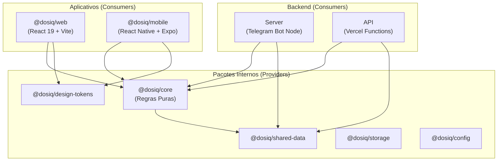
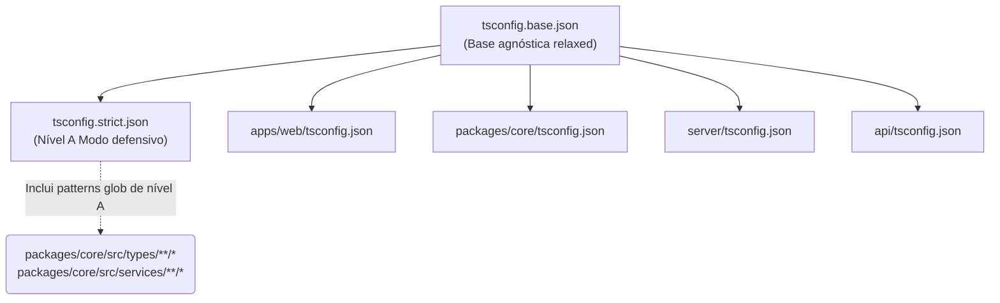

# 🏗️ Arquitetura do Monorepo

Este documento detalha a estrutura do monorepo Dosiq. Ele explica a topologia dos workspaces, o grafo de dependências interno, a herança de configurações do TypeScript e a execução via Turborepo.

O Dosiq utiliza uma arquitetura baseada em NPM Workspaces gerenciada pelo Turborepo. Essa abordagem centraliza o código fonte, garante a sincronia entre cliente e servidor e facilita o compartilhamento estrito de tipos e regras de negócio.

## Visão Geral

O monorepo divide responsabilidades entre aplicativos (consumidores finais) e pacotes internos (provedores). As lógicas de domínio residem no `@dosiq/core` e são consumidas via referência de diretório.

Por que usar essa arquitetura?
1. **Atomicidade de Pull Requests:** Modificações em um schema do banco de dados refletem no bot Telegram e no PWA no mesmo commit.
2. **Segurança de Tipos:** Alterações de contrato quebram a compilação de todos os consumidores imediatamente.
3. **Isolamento de Regras:** Lógicas de negócio operam agnósticas a frameworks de renderização (React/Vite ou React Native/Expo).



## Topologia do Monorepo

O mapeamento de workspaces ocorre por convenção nativa do NPM. O arquivo `package.json` na raiz define a fronteira delimitadora.

```json
// package.json (raiz)
{
  "name": "dosiq",
  "private": true,
  "workspaces": [
    "apps/*",
    "packages/*"
  ]
}
```

A estrutura suporta oito áreas principais isoladas:

| Workspace | Package Name | Propósito | Runtime Alvo |
|-----------|--------------|-----------|--------------|
| `apps/web/` | `@dosiq/web` | PWA web e interface central (React 19) | Browser / Vercel |
| `apps/mobile/` | `@dosiq/mobile` | Aplicativo nativo (React Native via Expo) | iOS / Android |
| `packages/core/` | `@dosiq/core` | Validação Zod, schemas e regras de negócio pura | Node / Browser |
| `packages/config/` | `@dosiq/config` | Configurações compartilhadas entre projetos | Build Time |
| `packages/design-tokens/` | `@dosiq/design-tokens` | Constantes visuais e temas unificados | Browser / Native |
| `packages/shared-data/` | `@dosiq/shared-data` | Tipos tipados exportados do Supabase | Node / Browser |
| `packages/storage/` | `@dosiq/storage` | Interfaces comuns de persistência local | Node / Browser |
| `server/` | (raiz interna) | Bot resiliente de notificações (Node.js) | Node.js |
| `api/` | (raiz interna) | Funções Vercel e endpoints serverless HTTP | Vercel Edge/Node |

> O diretório `server/` opera como um workspace isolado. Ele consome pacotes diretamente por imposição do container de deploy e não entra no wildcard do NPM.

## Grafo de Dependências

O compartilhamento de dependências ocorre via objeto `dependencies`. A resolução local processa os nomes dos pacotes internos apontando para arquivos de origem. 

O `@dosiq/web` declara o `@dosiq/core` como dependência. O Vite resolve caminhos de pacotes internos usando aliases estritos de path no TSConfig do projeto.

```json
// apps/web/tsconfig.json
{
  "compilerOptions": {
    "paths": {
      "@dosiq/core": ["../../packages/core/src"],
      "@dosiq/core/*": ["../../packages/core/src/*"],
      "@design-tokens/*": ["../../packages/design-tokens/src/*"]
    }
  }
}
```

Isso garante o acesso de tempo de desenvolvimento ao código-fonte TypeScript sem processo de transpilação paralela do núcleo.

O pacote base `@dosiq/core` adota empacotamento rápido local `esbuild` exportando sub-rotas:

```json
// packages/core/package.json
{
  "name": "@dosiq/core",
  "exports": {
    ".": {
      "types": "./dist/index.d.ts",
      "node": "./dist/index.js",
      "default": "./src/index.ts"
    },
    "./schemas": {
      "types": "./dist/schemas/index.d.ts",
      "node": "./dist/schemas/index.js",
      "default": "./src/schemas/index.ts"
    }
  }
}
```

```mermaid
flowchart LR
    A[app/web imports] -->|import { schema } from '@dosiq/core/schemas'| B{TS Paths Res}
    B -->|IDE e Dev Server| C[packages/core/src/schemas/index.ts]
    B -->|Build de Prod| D[packages/core/dist/schemas/index.js]
```

## Configuração do Turborepo

A raiz usa o Turborepo para coordenar a compilação paralela e em cache local dos arquivos subjacentes.

O `turbo.json` mapeia as três tarefas do ciclo de integração.

```json
// turbo.json
{
  "$schema": "https://turbo.build/schema.json",
  "tasks": {
    "lint": {},
    "test": {},
    "build": {}
  }
}
```

Por que isso otimiza o ciclo de compilação?
Quando a automação de implantação demanda um `npm run build`, o Turborepo utiliza hashes criptográficos dos artefatos de entrada baseados no Directed Acyclic Graph (DAG). Se a pasta de trabalho não foi tocada, o `turbo` injeta os arquivos compilados diretos do cache no sistema e não processa o pacote novamente.

## Herança de TSConfig

O projeto consolidou migração 100% TypeScript sob o épico 040. A estrutura se orienta sobre a lógica de `Strict Islands` combinada com catraca restritiva (Ratchet).

A herança injeta regras lenientes na maioria das áreas e enforça estrita nulidade apenas sobre domínios consolidados.



| Configuração | Herda De | Propósito |
|--------------|----------|-----------|
| `tsconfig.base.json` | - | Target `es2022`, module `esnext`. Configuração bundler liberal (`strict: false`). |
| `tsconfig.strict.json` | `tsconfig.base.json` | Ativa `strictNullChecks` e restrições semânticas. Destinado às áreas de alta consistência. |
| `apps/web/tsconfig.json` | `tsconfig.base.json` | Controla UI e Client Types via inclusão estrita na pasta `src/`. |
| `packages/core/tsconfig.json` | `tsconfig.base.json` | Tipifica negócio de base de diretório global. |
| `api/tsconfig.json` | `tsconfig.base.json` | Exclui diretórios de handlers Vercel de verificação massiva. |

### Regras de Vercel e Nodenext (R-282)

O diretório `api/` obedece a regras exclusivas de transpilação. A plataforma Vercel obriga que a sintaxe seja avaliada em ambiente Node ESM. Por causa disso, os caminhos relativos exigem sufixo descritivo.

```json
// api/tsconfig.json
{
  "extends": "../tsconfig.base.json",
  // NOTA (lição F3.1): Vercel (@vercel/node) roda Node ESM puro
  // Imports relativos em api/ DEVEM ter extensão .js explícita.
  "include": ["."],
  "exclude": ["node_modules", "admin/_handlers", "users/_handlers"]
}
```

Isso garante que o ecossistema restrinja conflitos de module resolution sem forçar regras node no `packages/core`.

### Controle de Dívida Técnica (Catraca Ratchet)

A barreira técnica opera pelo script `scripts/strict-island.sh`. Este binário bash valida níveis de código Nível A limpo sem relaxamento. A regra congela dívidas Nível B, forçando a descer com o tempo.

```bash
// scripts/strict-island.sh (Excerto)

# ── Tetos por bucket (baseline 2026-07-06, F6 Bloco 0; lotes abaixam teto) ──
MAX_B_PACKAGES=0          # packages/* transitivo
MAX_B_WEB=37              # apps/web nível-B transitivo
MAX_B_MOBILE=0            # apps/mobile nível-B transitivo
MAX_B_SERVER=36           # server/* nível-B transitivo
MAX_A_TESTS_CORE=0        # testes dos domínios A do core
```

Por que Catraca?
Sempre que um desenvolvedor soluciona erros em pastas obsoletas e re-avalia o script, os tetos `MAX_B_` decrecem fisicamente. Subir erros é proibido pelo CI, prevenindo envelhecimento de refatoração.

## Scripts e Comandos

O `package.json` de controle geral consolida invocação usando escopos diretos:

| Comando | Equivalente Local | Função |
|---------|-------------------|--------|
| `npm run dev` | `npm run dev --workspace @dosiq/web` | Inicia servidor local Vite com HMR ativo e hot swap na UI Web. |
| `npm run build` | `npm run build --workspace @dosiq/core && npm run build --workspace @dosiq/web` | Empacota e minifica interface e abstrações primárias sequencialmente. |
| `npm run test:critical` | `vitest run --config vitest.critical.config.js --bail=1` | Aciona a validação estrita sem interface visual voltada à core logic. |
| `npm run validate:agent`| `npm run validate:agent --workspace @dosiq/web` | Dispara suíte de checagem obrigatória antes de commits com timeout local. |
| `npm run bot` | `cd server && npm run dev` | Instancia o backend local do grammy na porta secundária para testes. |

Os comandos roteiam o contexto utilizando `--workspace`. Isso assegura caminhos base confiáveis sem requerer alternação explícita de subdiretório.

## Adicionando um Novo Workspace

O onboarding de novos utilitários deve seguir o esqueleto abaixo garantindo adesão automática ao Turbo:

1. **Geração de Diretório:**
   Suba o diretório correspondente em `packages/novo_nome/src`.

2. **Registro de Objeto (package.json):**
   ```json
   {
     "name": "@dosiq/novo_nome",
     "private": true,
     "version": "0.1.0",
     "type": "module",
     "exports": {
       ".": "./src/index.ts"
     }
   }
   ```

3. **TSConfig do Escopo Local:**
   Instancie a extensão da base local sem poluir configs avulsas.
   ```json
   {
     "extends": "../../tsconfig.base.json",
     "include": ["src"]
   }
   ```

4. **Registro de Consumo:**
   Siga para `apps/web/package.json` e informe o vínculo universal:
   ```json
   "dependencies": {
     "@dosiq/novo_nome": "*"
   }
   ```
   Para encerrar a conexão, aloque a referência final na malha Vite (`vite.config.js`) e no array de `paths` contido no `apps/web/tsconfig.json`.
