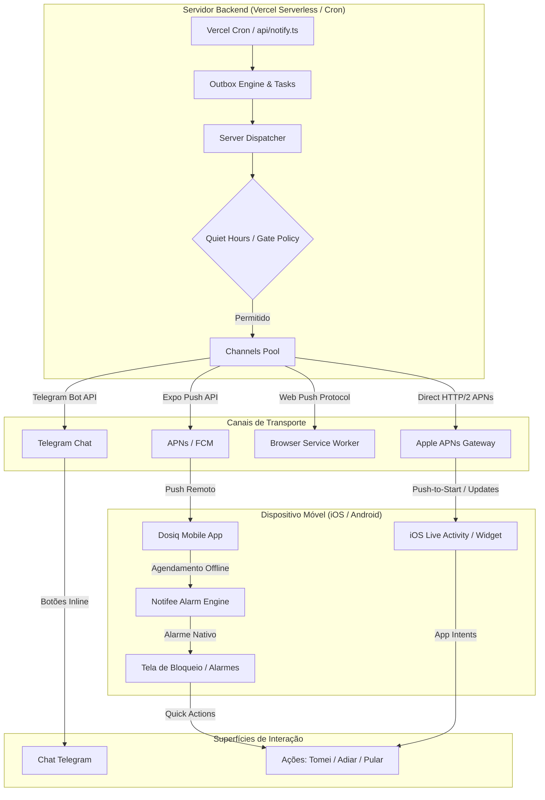
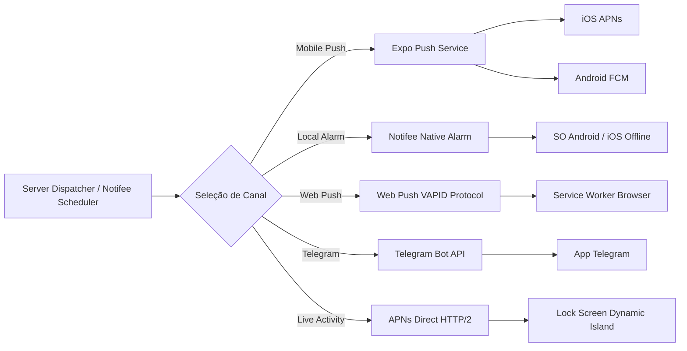
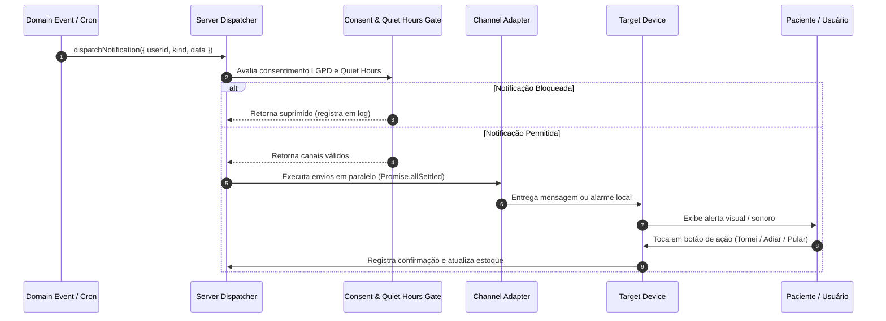

# 🔔 Visão Geral do Ecossistema de Notificações

O ecossistema de notificações do Dosiq orquestra a entrega de lembretes de dose, alertas de estoque e relatórios de adesão em múltiplas plataformas. O sistema combina processamento no servidor com motores de execução local nos dispositivos.

Este documento funciona como ponto de entrada unificado para a arquitetura de notificações. Ele apresenta os conceitos macro, os canais disponíveis e o mapa de navegação para a documentação especializada de cada subsistema.

---

## 🏗️ Visão Geral da Arquitetura

O Dosiq adota um modelo descentralizado de notificações. As notificações que dependem de agendamento preciso ou funcionam sem internet são executadas diretamente no aplicativo móvel. As comunicações agrupadas, relatórios periódicos e mensagens do Telegram são processadas pela engine do servidor.

O diagrama a seguir ilustra a distribuição de responsabilidades entre o servidor Vercel, o aplicativo móvel React Native e o bot do Telegram:



### Navegação Rápida do Ecossistema

| Domínio | Responsabilidade Principal | Mecanismo Principal | Documentação de Referência |
|---|---|---|---|
| **Engine do Servidor** | Orquestração backend, payloads e retentativas. | Vercel Cron, Outbox Pattern e DLQ. | [`SERVER_NOTIFICATIONS.md`](SERVER_NOTIFICATIONS.md) |
| **Notificações Mobile** | Push remoto e alarmes críticos locais. | Expo Push SDK e Notifee Engine. | [`MOBILE_NOTIFICATIONS.md`](MOBILE_NOTIFICATIONS.md) |
| **Live Activities** | Estado contínuo da dose em tempo real. | iOS ActivityKit e Android Ongoing. | [`DOSE_LIVE_ACTIVITY.md`](DOSE_LIVE_ACTIVITY.md) |
| **Bot Telegram** | Lembretes e gestão por chat. | Telegram Bot API e Callbacks. | [`TELEGRAM_BOT.md`](TELEGRAM_BOT.md) |

---

## 📦 Tipos de Notificação

Cada evento de comunicação no Dosiq é identificado por um `kind` estrito. O esquema Zod em `@dosiq/core` e no servidor valida os dados de entrada de cada notificação antes do envio.

```typescript
// server/notifications/payloads/_payloadSchemas.ts
export const kindSchema = z.enum([
  'dose_reminder',
  'dose_reminder_by_plan',
  'dose_reminder_misc',
  'stock_alert',
  'stock_expiry_alert',
  'daily_digest',
  'adherence_report',
  'weekly_adherence',
  'monthly_report',
  'titration_alert',
  'prescription_alert',
  'dlq_digest'
]);
```

### Catálogo de Notificações

| Kind | Disparador (Trigger) | Escopo e Conteúdo | Canais Suportados |
|---|---|---|---|
| `dose_reminder` | Horário agendado da dose. | Alerta individual de dose para um medicamento. | Mobile Push, Telegram, Alarme Local. |
| `dose_reminder_by_plan` | Horário agendado do plano. | Lembrete consolidado de doses de um plano de tratamento. | Mobile Push, Telegram. |
| `dose_reminder_misc` | Horário agendado avulso. | Agrupamento de doses individuais no mesmo minuto. | Mobile Push, Telegram. |
| `stock_alert` | Verificação diária (09:00). | Alerta de estoque baixo (restante < 7 dias de uso). | Mobile Push, Telegram, Web Push. |
| `stock_expiry_alert` | Verificação diária (09:00). | Alerta de validade pós-abertura (ex: colírios, insulinas). | Mobile Push, Telegram, Web Push. |
| `daily_digest` | Horário do resumo diário. | Resumo matinal consolidando todas as doses do dia. | Mobile Push, Telegram, Web Push. |
| `adherence_report` | Fechamento semanal (Domingo). | Percentual de adesão da semana e tendência. | Mobile Push, Telegram. |
| `monthly_report` | 1º dia do mês (09:00). | Relatório mensal completo de tratamento e economia. | Mobile Push, Telegram. |
| `titration_alert` | Troca de etapa do protocolo. | Instrução de transição de dose ou novo medicamento. | Mobile Push, Telegram. |
| `prescription_alert` | Vencimento de receita. | Aviso de vencimento próximo da receita médica. | Mobile Push, Telegram, Web Push. |
| `dlq_digest` | Evento administrativo (10:00). | Resumo de falhas na fila DLQ para administradores. | Telegram. |

---

## 📡 Canais de Entrega

O sistema suporta cinco canais de transporte com características operacionais distintas:



### Matriz de Canais de Transporte

| Canal | Plataforma Alvo | Provedor / API | Funciona Offline? | Documento Detalhado |
|---|---|---|---|---|
| **Mobile Push** | iOS / Android | Expo Push SDK (APNs / FCM) | Não | [`MOBILE_NOTIFICATIONS.md`](MOBILE_NOTIFICATIONS.md) |
| **Alarmes Locais** | iOS / Android | Notifee Engine (Nativo) | **Sim** | [`MOBILE_NOTIFICATIONS.md`](MOBILE_NOTIFICATIONS.md) |
| **Web Push** | PWA / Navegadores | Web Push API (VAPID Keys) | Não | [`SERVER_NOTIFICATIONS.md`](SERVER_NOTIFICATIONS.md) |
| **Telegram** | Cross-platform | Telegram Bot API | Não | [`TELEGRAM_BOT.md`](TELEGRAM_BOT.md) |
| **Live Activities** | iOS 16.2+ / Android | APNs Direct / Notifee Surface | Parcial (APNs / Trigger) | [`DOSE_LIVE_ACTIVITY.md`](DOSE_LIVE_ACTIVITY.md) |

---

## 🔄 Fluxo Geral de Notificação

O fluxo de notificação inicia no evento de domínio ou na rotina de agendamento e termina na confirmação da ação pelo usuário.



### Exemplo de Entrada no Dispatcher

O envio de qualquer notificação pelo backend utiliza o ponto de entrada único `dispatchNotification`:

```typescript
// server/notifications/dispatcher/dispatchNotification.ts
export async function dispatchNotification({
  userId,
  kind,
  data,
  channels,
  context,
  repositories
}: DispatchNotificationParams) {
  // 1. Validação de esquema
  const parsed = dispatchInputSchema.safeParse({ userId, kind, channels: channels ?? [] })
  if (!parsed.success) {
    throw new Error(`[dispatchNotification] Entrada inválida: ${parsed.error.message}`)
  }

  // 2. Verificação de consentimento e Quiet Hours
  const settings = await repositories.preferences.getSettingsByUserId(userId)
  if (isConsentSuppressed(settings)) {
    return normalizeChannelResults([])
  }

  // 3. Constrói o payload padronizado e dispara nos canais ativos
  const finalPayload = buildNotificationPayload({ kind, data, context })
  // ... (envio em paralelo e registro em log/DLQ)
}
```

---

## ⚙️ Preferências e Janelas do Usuário

O Dosiq respeita as configurações de privacidade e momento do usuário armazenadas na tabela `user_settings`. As regras são avaliadas antes da entrega de mensagens em tempo real.

```typescript
// server/notifications/utils/notificationGate.ts
export function shouldSendNow({ mode, quietHoursStart, quietHoursEnd, currentHHMM }: ShouldSendNowParams): boolean {
  if (mode === 'silent') return false
  if (mode === 'digest_morning') return false
  if (isInQuietHours(currentHHMM, quietHoursStart, quietHoursEnd)) return false
  return true
}
```

### Configurações de Notificação

| Configuração | Descrição | Comportamento no Sistema |
|---|---|---|
| **Modo Realtime** | Envio imediato das notificações. | Entrega contínua respeitando Quiet Hours. |
| **Modo Digest Morning** | Resumo único matinal. | Suprime notificações individuais e envia um digest às 08:00. |
| **Modo Silent** | Apenas registro na Inbox. | Desativa pushes remotos e mantém apenas o histórico no app. |
| **Quiet Hours** | Janela de silêncio (ex: 22:00 às 07:00). | Bloqueia alertas externos; trata janelas que cruzam a meia-noite. |
| **Flags por Canal** | Ativação individual por canal. | Permite ligar/desligar `mobile_push`, `web_push` ou `telegram`. |

---

## 🛡️ Garantias Globais do Ecossistema

O ecossistema de notificações do Dosiq garante a proteção de dados, a rastreabilidade das operações e a adaptação temporal em todas as plataformas.

### 🔒 Privacidade e Modo Discreto (`discreet: true`)
A saúde do paciente é tratada com sigilo por padrão. Quando o usuário ativa a opção de privacidade ou para tratamentos marcados como discretos, o sistema aplica regras de ofuscação:
- **Telas de Bloqueio:** O nome exato do medicamento é substituído por termos neutros (ex: `"💊 Lembrete de Dose"`).
- **Canais Nativos:** No Android (Notifee), o alarme utiliza `AndroidVisibility.PRIVATE`. No iOS, as Live Activities utilizam o atributo `discreet: true` em `DoseActivityAttributes`.

### 🔍 Rastreabilidade Fim a Fim (`correlationId`)
Toda requisição de notificação gera ou propaga um identificador único de correlação (`correlationId` em formato UUID):
- **Ciclo de Vida:** O ID nasce na chamada do dispatcher e navega pelos adaptadores de canais, logs de auditoria no Supabase (`notification_log`) e eventos da DLQ (`failed_notification_queue`).
- **Diagnóstico:** Permite que engenheiros e administradores rastreiem o percurso exato de uma notificação através dos logs da Vercel e da plataforma Supabase.

### 🌐 Consciência de Fuso Horário (Timezone Awareness)
O agendamento e o disparo consideram o fuso horário do usuário (`user_settings.timezone`), com padrão para `America/Sao_Paulo`:
- **Cálculo de Janelas:** Funções como `isInQuietHours` convertem os horários locais para minutos do dia, suportando janelas noturnas que cruzam a meia-noite (ex: `22:00` às `07:00`).
- **Outbox Determinístico:** A geração de chaves temporais no Outbox Pattern (`periodKey`) garante que resumos diários (`YYYY-MM-DD`) e semanais (`YYYY-Www`) sejam entregues no horário local correto.

---

## 🔗 Central de Documentação (Deep-Dives)

Para entender os detalhes técnicos de implementação de cada componente, acesse os guias especializados:

- 🖥️ **Backend & Server Engine:** [`docs/architecture/SERVER_NOTIFICATIONS.md`](SERVER_NOTIFICATIONS.md)  
  *Cobre a engine de 3 camadas, Vercel Cron, Outbox Pattern, Dead Letter Queue (DLQ), deduplicação e conexão HTTP/2 direta com APNs.*

- 📱 **Mobile Push & Alarmes Locais:** [`docs/architecture/MOBILE_NOTIFICATIONS.md`](MOBILE_NOTIFICATIONS.md)  
  *Cobre o registro de tokens via Expo SDK, permissões contextuais, canais Android e o agendamento offline de alarmes com Notifee.*

- 🏝️ **Live Activities & Ongoing Surface:** [`docs/architecture/DOSE_LIVE_ACTIVITY.md`](DOSE_LIVE_ACTIVITY.md)  
  *Cobre a renderização de widgets em SwiftUI (iOS ActivityKit), App Intents, Push-to-Start via APNs e a notificação persistente no Android.*

- 🤖 **Bot Telegram:** [`TELEGRAM_BOT.md`](TELEGRAM_BOT.md)  
  *Cobre a integração com o Telegram, comandos conversacionais, registro rápido de doses e respostas a callbacks inline.*
