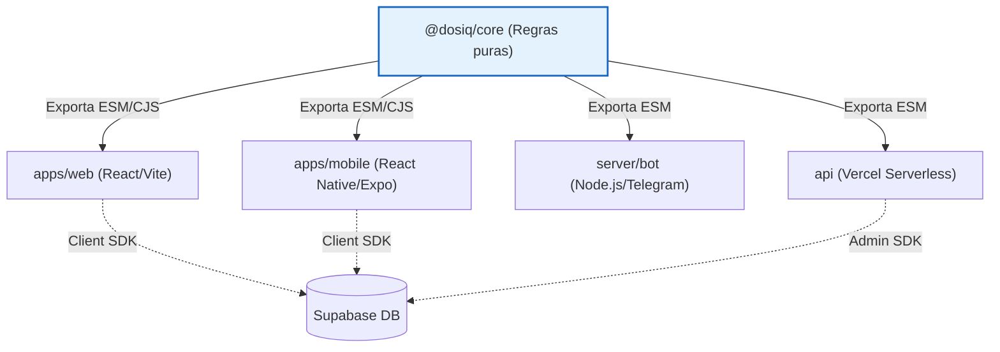
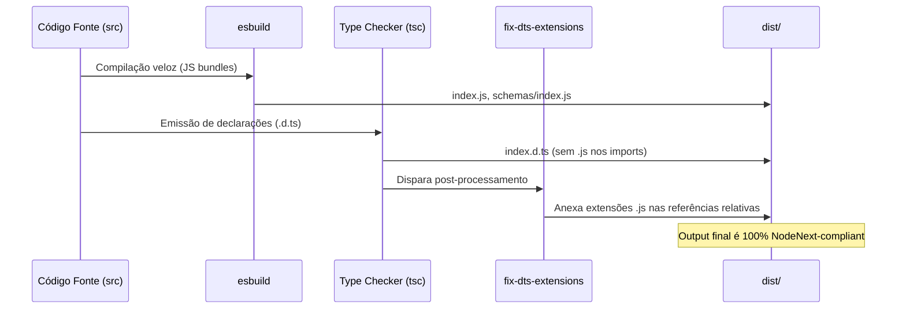

# Arquitetura do Pacote Core (@dosiq/core)

O pacote `@dosiq/core` é o coração do monorepo Dosiq. Ele centraliza todas as regras de negócio puras, validações, schemas estruturais e lógica de cálculo de adesão em um único ponto. Seu design visa garantir consistência absoluta entre as interfaces do sistema, assegurando que o PWA (web), o aplicativo (mobile), o bot do Telegram e as funções serverless processem os dados da mesma forma.

Esta documentação detalha a arquitetura técnica do módulo, como seus submódulos internos são organizados, os padrões exigidos para manter sua integridade e como o processo de build disponibiliza os artefatos de forma segura para os consumidores externos. A leitura completa deste documento é obrigatória para desenvolvedores que necessitam estender a lógica de negócio ou adicionar novas funcionalidades ao ecossistema Dosiq.

## Visão Geral e Filosofia

A filosofia central do `@dosiq/core` é a "pureza de execução". O módulo deve rodar de maneira idêntica em Node.js, React, React Native e ambientes serverless (Vercel Edge/Serverless functions). Para que isso seja possível, existe uma restrição de design inegociável: o pacote não pode depender de interfaces de usuário, acesso direto a banco de dados com credenciais hardcoded ou bibliotecas específicas de plataforma.

Qualquer dependência vinculada ao Document Object Model (DOM) do navegador, componentes React (`useState`, `useEffect`), ou clientes concretos de Supabase acoplados a contexto de requisição é proibida dentro de `src/`. As dependências externas devem ser passadas via injeção de dependência (como clientes do Supabase injetados em repositórios) ou devem se basear inteiramente em entradas primitivas e objetos genéricos.

Esta abordagem isola a complexidade de negócios. Por exemplo, a lógica para derivar instâncias de dose a partir de um log de medicamento independe de como essa dose será renderizada na tela. As validações via Zod executam no cliente (formulários) e no servidor (proteção de rotas da API) utilizando o mesmo schema original.



A tabela a seguir resume as restrições arquiteturais aplicadas ao desenvolvimento dentro deste pacote:

| Restrição Técnica | Motivo Arquitetural |
|---|---|
| Zero dependências React | Garantir que as funções possam ser executadas por scripts Node.js ou Edge Functions. |
| Timezones locais via `dateUtils` | Impedir o uso de `new Date('YYYY-MM-DD')` que gera objetos UTC problemáticos em fuso horário brasileiro. |
| Injeção de Supabase Client | Evitar o acoplamento global, permitindo que a web envie o cliente do usuário logado e o backend envie a service role. |
| Extensão explícita nas importações | Assegurar a compatibilidade com a resolução de módulos ECMAScript no Node.js puro sem quebrar bundlers como Vite e Metro. |

## Submódulos em Detalhe

O código está dividido em diretórios especializados sob `packages/core/src/`. Cada diretório representa uma frente de domínio e exporta suas funções, tipos ou instâncias através de um arquivo `index.ts` que funciona como barrel file principal para aquele domínio.

### Schemas (`src/schemas`)

O submódulo de schemas é responsável pela definição da estrutura de dados aceita pela aplicação e pelas regras de validação em runtime. Construído utilizando a biblioteca Zod, ele garante a integridade dos dados durante a criação e atualização de entidades.

Além de modelar tabelas do Supabase, os schemas contêm enumerações canônicas de domínio, como tipos de apresentações de medicamentos, unidades de dose e status de estoques. Estes valores garantem que toda a interface gráfica apresente exatamente as mesmas opções do banco de dados, utilizando rótulos amigáveis configurados no próprio arquivo de schema.

Os arquivos de schema aplicam validações específicas usando a função `friendlyMessage` de interceptação global configurada no sistema, oferecendo mensagens localizadas em português (PT-BR) amigáveis para os usuários finais.

```typescript
// packages/core/src/schemas/medicineSchema.ts
export const DOSAGE_UNITS = ['mg', 'mcg', 'g', 'mg/ml', 'ui/ml', 'ui', 'un']

const medicineObject = z.object({
  name: z
    .string()
    .min(2, 'O nome precisa de pelo menos 2 caracteres')
    .max(200, 'O nome pode ter no máximo 200 caracteres')
    .trim(),

  presentation: z.enum(PRESENTATIONS).default('comprimido'),
  
  // Tratamento de conversão em campos vazios via preprocess
  dosage_per_pill: z.preprocess(
    (val) => (val === '' ? null : val),
    z.coerce
      .number()
      .positive('A dose deve ser maior que zero')
      .max(10000, 'A dose parece muito alta. Verifique o valor')
      .nullable()
      .optional()
  ),
})
// ... (restante do arquivo)
```

| Arquivo Principal | Export Relevante | Descrição da Responsabilidade |
|---|---|---|
| `medicineSchema.ts` | `medicineCreateSchema` | Validação de formulários e APIs ao criar novos medicamentos. |
| `protocolSchema.ts` | `protocolFullSchema` | Definição rigorosa da frequência e horários de tratamentos ativos. |
| `stockSchema.ts` | `validateStockIncrease` | Validação lógica para adição de itens ao inventário do paciente. |
| `logSchema.ts` | `logBulkCreateSchema` | Definição para registro síncrono de múltiplas doses. |

### Utilitários (`src/utils`)

O submódulo de utilitários fornece funções matemáticas, tratativas de string e algoritmos focados nas regras da aplicação. Como as datas representam uma complexidade crítica na área da saúde (fusos horários), as lógicas de formatação e análise estão concentradas neste diretório.

Um aspecto fundamental deste módulo é a lógica de adesão (`adherenceLogic.ts`), que define como o sistema avalia se um protocolo está sendo seguido, lidando com tolerâncias temporais e janelas de esquecimento, além das regras para derivar se a prescrição ainda está dentro da validade clínica (`prescriptionStatus.ts`).

O acesso ao timezone brasileiro (GMT-3) é padronizado pelo uso da função `getUserTime` e evitado o uso instintivo de ferramentas nativas imprevisíveis do motor JavaScript.

```typescript
// packages/core/src/utils/dateUtils.ts
/**
 * Converte string de data (YYYY-MM-DD) para Date em timezone local
 * Isso evita o problema de new Date('2024-01-01') criar data em UTC (meia-noite UTC)
 * que pode aparecer como dia anterior em GMT-3.
 *
 * @param {string} dateStr - Data no formato YYYY-MM-DD
 * @returns {Date} Date object em timezone local (meia-noite local)
 */
export function parseLocalDate(dateStr: string): Date {
  return new Date(dateStr + 'T00:00:00')
}

/**
 * Adiciona dias a uma data e retorna em timezone local
 * @param {Date|string} date - Data base (Date object ou string YYYY-MM-DD)
 * @param {number} days - Número de dias a adicionar (pode ser negativo)
 * @returns {Date} Nova data em timezone local
 */
export function addDays(date: Date | string, days: number): Date {
  const baseDate = typeof date === 'string' ? parseLocalDate(date) : new Date(date)
  baseDate.setDate(baseDate.getDate() + days)
  return baseDate
}
```

| Arquivo Principal | Export Relevante | Descrição da Responsabilidade |
|---|---|---|
| `dateUtils.ts` | `parseLocalDate` | Previne falhas de conversão de string transformando datas no formato local. |
| `adherenceLogic.ts`| `calculateExpectedDoses`| Processa horários para identificar a quantidade de doses planejadas. |
| `doseUnit.ts` | `formatIntakeDose` | Transforma quantitativos técnicos em representações visuais legíveis. |
| `timeline.ts` | `buildTimeline` | Analisa os arrays de instâncias puras para organizar em ordem cronológica. |

### Repositórios (`src/repositories`)

Este submódulo gerencia o conceito abstrato de acesso a dados adotando o padrão Factory. Nenhuma instância real de banco de dados é criada no core. Em vez disso, funções criadoras recebem o cliente injetado (via argumento `client`) para realizar chamadas CRUD formatadas.

Esta injeção obriga o chamador a prover a dependência concreta, viabilizando que o bot do Telegram utilize a service role enquanto o PWA forneça a sessão de usuário. Além de abstrair a base Supabase, os repositórios garantem que as escritas sejam validadas via Zod antes de enviar payloads à rede, atuando como a primeira linha de defesa contra corrupção de dados.

```typescript
// packages/core/src/repositories/createMedicineRepository.ts
export function createMedicineRepository({
  client,
  getUserId,
  listSelect = '*',
  detailSelect = '*',
  listTransform = identity,
  detailTransform = identity,
}: CreateMedicineRepositoryDeps) {
  if (!client) throw new Error('createMedicineRepository: client é obrigatório')
  
  return {
    async create(medicine: Record<string, unknown>) {
      // Validação canônica Zod antes da injeção
      const validation = validateMedicineCreate(medicine)
      if (!validation.success || !validation.data) throw formatValidationError(validation.errors ?? [])

      const userId = await getUserId()
      const { data, error } = await client
        .from('medicines')
        .insert([{ ...validation.data, user_id: userId }])
        .select()
        .single()

      if (error) throw error
      return data
    },
    // ... (restante do arquivo)
  }
}
```

| Arquivo Principal | Export Relevante | Descrição da Responsabilidade |
|---|---|---|
| `createMedicineRepository.ts` | `createMedicineRepository`| Operações padronizadas para gestão de medicamentos (CRUD). |
| `createDoseInstanceRepository.ts` | `createDoseInstanceRepository`| Lógica avançada para buscar intervalos de doses na timeline do usuário. |
| `createProtocolRepository.ts` | `createProtocolRepository`| Consultas combinadas para gerenciar horários e doses ativas por tratamento. |

### Serviços (`src/services`)

Enquanto os repositórios cuidam da camada de dados elementar (tabelas e escritas diretas), os serviços orquestram múltiplos repositórios ou aplicam lógicas complexas de derivamento e composição. Um serviço no Dosiq recebe primitivas ou dados crus do banco e transforma em artefatos de alto nível, muitas vezes integrando as regras criadas nos utilitários.

Por exemplo, o `timelineService` é a única entidade do sistema que entende o estado real de uma dose baseando-se na sobreposição dos objetos de `dose_instances` contra registros isolados `medicine_logs`. A regra de desduplicação (um log associado a uma instância é retornado como apenas um único evento final ao invés de dois) fica totalmente contida aqui.

```typescript
// packages/core/src/services/timelineService.ts
export function createTimelineService({ client }: { client: SupabaseClient<Database> }) {
  if (!client) throw new Error('createTimelineService: client é obrigatório')
  const doseInstanceRepo = createDoseInstanceRepository({ client })

  return {
    async getTimeline({
      userId,
      fromTs,
      toTs,
      tz = 'America/Sao_Paulo',
      order = TIMELINE_ORDER.DESC,
      protocolsById = {},
    }: {
      userId: string
      fromTs: Date | string
      toTs: Date | string
      tz?: string
      order?: 'asc' | 'desc'
      protocolsById?: ProtocolsById
    }) {
      if (!userId) throw new Error('getTimeline: userId é obrigatório')
      
      const fromIso = parseISO(fromTs instanceof Date ? fromTs.toISOString() : fromTs).toISOString()
      const toTsIso = parseISO(toTs instanceof Date ? toTs.toISOString() : toTs).toISOString()

      const [instances, logs] = await Promise.all([
        doseInstanceRepo.getWindow(userId, fromIso, toTsIso),
        fetchLogsWindow(client, userId, fromIso, toTsIso),
      ])

      const events = doseInstancesToEvents(instances, logs, { protocolsById })
      return buildTimeline(events, { tz, order })
    },
  }
}
```

| Arquivo Principal | Export Relevante | Descrição da Responsabilidade |
|---|---|---|
| `timelineService.ts` | `createTimelineService` | Desduplica e consolida os arrays de registros e agendas. |
| `doseInstancePlanner.ts` | `doseInstancePlanner` | Avalia o avanço da adesão baseando-se no cruzamento da lógica com os eventos atuais. |
| `doseLogService.ts` | `doseLogService` | Orquestra a redução do estoque na hora da tomada. |

### Chatbot (`src/chatbot`)

O Dosiq integra um assistente inteligente. Como o contexto do Large Language Model (LLM) precisa possuir as informações de tratamento do usuário sem estourar a cota de tokens da nuvem e evitando qualquer tipo de Personally Identifiable Information (PII), as funções deste submódulo limpam a árvore de dados.

O `buildPatientContext` mapeia as instâncias concretas e os limites do cronograma de medicamentos, formatando-os num formato de texto plano reduzido. As informações clínicas de dias faltantes e estoque entram como texto direto. Essa estrutura compartilhada é utilizada tanto pelas Vercel Functions quanto pelo backend que responde pelo bot do Telegram, impedindo forks na qualidade da IA baseada na plataforma de acesso.

```typescript
// packages/core/src/chatbot/buildPatientContext.ts
export function buildPatientContext({ medicines, protocols, logs, stockSummary, stats, doseInstances, profile }: {
  medicines?: any[]; protocols?: any[]; logs?: any[]; stockSummary?: any[]; stats?: any; doseInstances?: any[]; profile?: any
} = {}) {
  const today = getTodayLocal('America/Sao_Paulo')
  const [y, m, d] = today.split('-').map(Number)
  const weekday = WEEKDAYS_PT[parseLocalDate(today).getDay()]
  const todayStr = `${weekday}, ${d.toString().padStart(2, '0')}/${m.toString().padStart(2, '0')}/${y}`

  // Apenas tratamentos ATIVOS com prescrição vigente no período hoje (exclui finalizados/pausados/futuros).
  const medsById = new Map((medicines || []).map((m) => [m.id, m]))
  const validProtocols = (protocols || [])
    .filter((p) => p.active && isProtocolInPeriod(p, today))
    .map((p) => ({ ...p, medicine: p.medicine ?? medsById.get(p.medicine_id) ?? null }))

  // ... (restante do arquivo)
}
```

| Arquivo Principal | Export Relevante | Descrição da Responsabilidade |
|---|---|---|
| `buildPatientContext.ts` | `buildPatientContext` | Monta o sumário em string para injeção via System Prompt do bot. |
| `fetchChatbotContextData.ts`| `fetchChatbotContextData`| Centraliza as buscas nas tabelas para obter inventários e logs atuais do paciente. |
| `chatbotUiText.ts` | `buildUiResponse` | Padroniza blocos de resposta visual entre frontends React. |

### Markdown (`src/markdown`)

A formatação de elementos textuais, principalmente originados do assistente virtual, necessita ser limpa e interpretada para renderização no app e na web. Este submódulo abriga parsers leves de texto para padronizar essa saída.

Diferente de bibliotecas pesadas de formatação e highlighting, este módulo prioriza apenas negritos essenciais e quebras de linhas úteis requeridas pelas interfaces do usuário, minimizando dependências complexas da linguagem e melhorando a segurança.

```typescript
// packages/core/src/markdown/parseMessageMarkdown.ts
export function parseMessageMarkdown(text: string): string {
  if (!text) return ''
  // Converte bullet points, quebras e negritos básicos.
  // ... (lógica de formatação omitida)
  return parsed
}
```

| Arquivo Principal | Export Relevante | Descrição da Responsabilidade |
|---|---|---|
| `parseMessageMarkdown.ts`| `parseMessageMarkdown` | Motor leve focado no parser de blocos limitados gerados pelo assistente. |

### Zod Setup (`src/zodSetup.ts`)

A biblioteca Zod nativamente apresenta erros em inglês e repletos de jargões voltados para o desenvolvedor. Para exibir os retornos diretamente em campos de validação de formulários sem mapeamento manual exaustivo na web e mobile, o pacote centraliza as definições do runtime.

A importação do locale PT-BR precisa incluir a extensão explícita `.js` a partir do `zod/v4/locales/pt.js`, pois o runtime de Edge da Vercel recusa módulos de Node puros sem extensão, mitigando a chance de exceções `ERR_MODULE_NOT_FOUND`.

```typescript
// packages/core/src/zodSetup.ts
import { z } from 'zod'
import pt from 'zod/v4/locales/pt.js'

function friendlyMessage(issue: z.core.$ZodRawIssue) {
  switch (issue.code) {
    case 'invalid_type': {
      if (issue.input === undefined || issue.input === null || issue.input === '') {
        return 'Este campo é obrigatório'
      }
      if (issue.expected === 'number') {
        return 'Use apenas números'
      }
      return 'Valor inválido'
    }
    // ... (restante do arquivo)
  }
}

const ptLocale = pt().localeError

z.config({
  customError: (issue) => {
    const friendly = friendlyMessage(issue)
    if (friendly) return friendly
    return ptLocale(issue)
  },
})
```

| Arquivo Principal | Export Relevante | Descrição da Responsabilidade |
|---|---|---|
| `zodSetup.ts` | *Efeito colateral* | Injeta o mapa global de descrições PT-BR em todas as chamadas `safeParse`. |

### Tipos (`src/types`)

O núcleo exporta apenas os contratos puramente locais. Tipagens mais densas associadas à formatação do client Supabase (`Database`) advém de outro pacote (`@dosiq/shared-data`). Em compensação, estados transitórios e objetos estruturados na memória habitam este diretório para proverem IntelliSense unificado para transição de dados entre pacotes.

```typescript
// packages/core/src/types/activeContext.ts
export interface ActiveContextBase {
  userId: string;
  timestamp: string;
}
```

| Arquivo Principal | Export Relevante | Descrição da Responsabilidade |
|---|---|---|
| `activeContext.ts` | `ActiveContextBase` | Tipagem base comum a rastreamentos de uso. |
| `identity.ts` | `IdentityMap` | Esquemas genéricos do modelo de identificação e sessão. |

## Pipeline de Build

A compilação do pacote `@dosiq/core` é um processo otimizado que produz artefatos em ECMAScript Modules (ESM) nativo e descritores de tipo (`.d.ts`). A construção prioriza o bundler `esbuild` devido à velocidade e usa o TypeScript compiler (`tsc`) estritamente de maneira secundária, focando apenas em transcrever os tipos por meio da flag `emitDeclarationOnly`.

Um desafio técnico crítico de monorepos TS envolvendo ESM é a resolução rígida no modo NodeNext, exigindo sufixos explícitos nos imports relativos de tipos. Para sanar isso, o pipeline invoca o script corretivo `fix-dts-extensions.mjs` no passo final.

### O problema das extensões .d.ts

No momento em que o compilador TS transpila as definições `d.ts`, ele não injeta extensões explícitas aos caminhos de specifiers relativos na arquitetura barrel de diretórios. Isto gerava erros como o código `TS2305` dentro dos ambientes de build da Vercel.

A solução atua no pós-processamento, caminhando recursivamente pelas saídas (`dist/`) e modificando via expressões regulares todas as exportações que apontam para diretórios internos anexando forçadamente a extensão `.js`.

```javascript
// packages/core/scripts/fix-dts-extensions.mjs
// ... (restante do arquivo)
let touched = 0
for (const file of walk(DIST)) {
  const src = readFileSync(file, 'utf8')
  // Expressão regular capta os imports relativos.
  const out = src.replace(RE, (m, pre, q, spec) =>
    /\.[cm]?js$/.test(spec) ? m : `${pre}${q}${spec}.js${q}`
  )
  if (out !== src) {
    writeFileSync(file, out)
    touched++
  }
}
console.log(`[fix-dts-extensions] ${touched} arquivos .d.ts ajustados`)
```

O fluxo completo interativo é representado no diagrama a seguir:



## Consumidores do Core

As interfaces e microsserviços consomem o core explorando o conceito de workspaces de forma modularizada, declarando caminhos otimizados no seu mapeamento local (`package.json`) ou em suas diretivas de resolução de bundler.

O pacote suporta de forma robusta o formato *subpath exports*, definindo chaves seletivas via arquivo `package.json` base: `"exports": { "./schemas": "./src/schemas/index.ts" }` para simplificar importações e melhorar otimização em ambiente de desenvolvimento (HMR).

O comportamento do import varia conforme as engines e restrições de cada consumidor:

| Consumidor | Mecanismo de Resolução | Particularidades Técnicas |
|---|---|---|
| **apps/web** | Vite + Workspace Protocol | Resolve módulos via plugin Vite mapeando diretamente arquivos TS root-source (hot-module replacement puro e instantâneo). |
| **apps/mobile** | Metro Bundler + Workspace | Depende da resolução do Metro, buscando as referências mapeadas globalmente e aplicando extensões padrão para os componentes React Native. |
| **server/api** | ESM + Node Runtime | Sujeito à regra NodeNext. Exige importações explícitas usando extensoes `.js` para evitar exceção de módulo não encontrado na nuvem serverless da Vercel (R-282). |

## Adicionando Código ao Core

Para incluir um novo módulo de utilidade ou regra de negócio dentro do `@dosiq/core`, os colaboradores devem adotar o design pautado pela pureza arquitetural estrita. Responda estas perguntas antes de abrir um PR modificando o conteúdo desta biblioteca central:

1. A lógica requer formatação baseada em DOM, ou carrega dependências como pacotes de UI nativos (exemplo: react-native-svg)? Se **sim**, a responsabilidade pertence à camada de feature local (web ou mobile). Se **não**, pode pertencer ao core de negócios.
2. A funcionalidade necessita injetar as configurações do app ou ler diretamente do cache em runtime? **Não**. O utilitário deve agir de forma previsível (transparente) ou esperar injeção externa passiva, agindo via passagem de argumentos.
3. O novo serviço de Supabase é construído na forma de Factory pattern retornando o pool de métodos CRUD? A injeção parametrizada propicia resiliência entre o Bot service-role-based e os clients logados baseados em RLS do Supabase.

### Checklist do Contributor

Antes de fazer o merge das alterações em `@dosiq/core`:
- [ ] Arquivo criado está livre de chamadas diretas a APIs do React (`useMemo`, `useContext`, `useState`).
- [ ] O tratamento matemático de datas emprega estritamente os utilitários blindados exportados pela pasta `utils` em vez do formato `new Date()` literal da linguagem.
- [ ] O serviço criado delega as obrigações estritas da tipagem para `src/types` e disponibiliza o alias seguro no `index.ts` raiz de cada módulo.
- [ ] Schemas complexos recém desenhados contêm o fallback de mensagens amigáveis embutidas (se destoantes do setup global em `friendlyMessage`).
- [ ] A execução do pacote passa intacta pelo script limitador de TypeScript (`scripts/strict-island.sh`), o que previne retrocessos de qualidade tipográfica no core.
