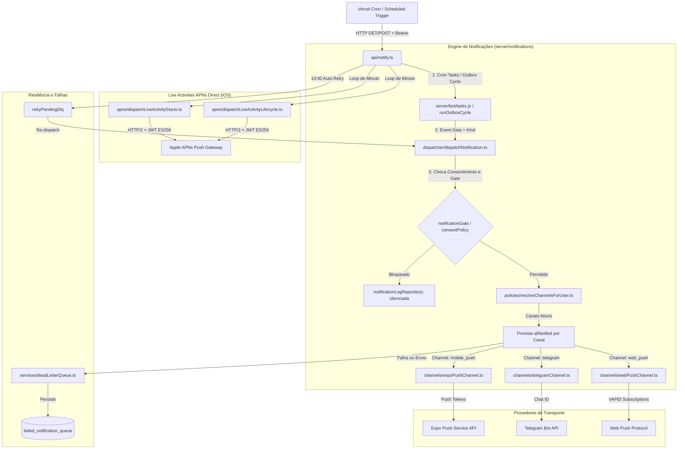
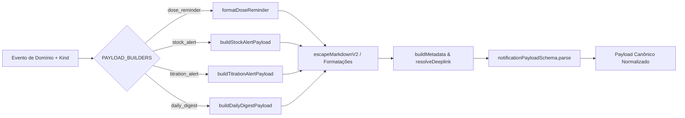
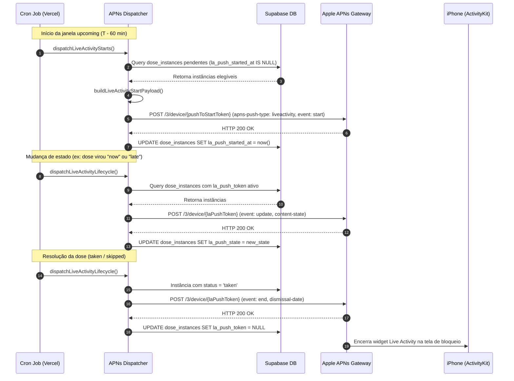
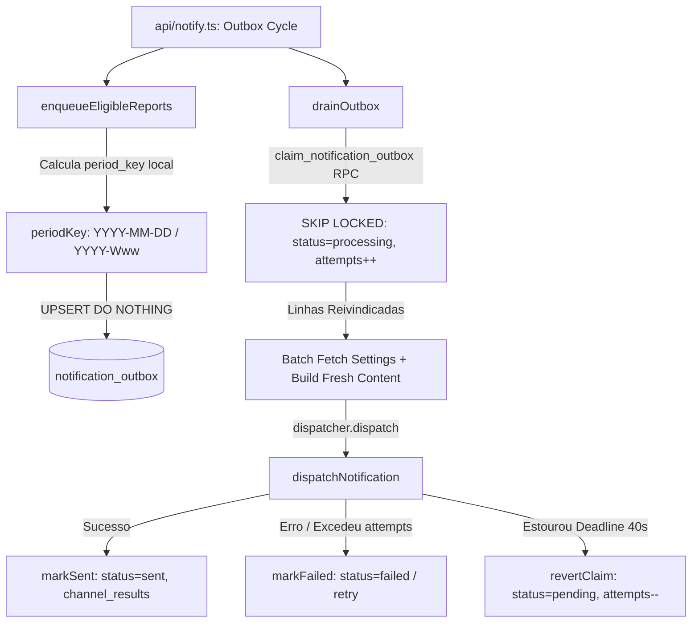

# 🔔 Arquitetura da Engine de Notificações do Servidor

## Visão Geral

A engine de notificações em background do Dosiq é responsável por processar, formatar, filtrar e entregar alertas de saúde no ambiente servidor. O sistema garante o envio de lembretes de dose, alertas de estoque, notificações da evolução do tratamento e relatórios de adesão com alta confiabilidade e baixa latência.

O acionamento principal da engine ocorre via cron job do Vercel, que invoca periodicamente o endpoint serverless [api/notify.ts](file:///Users/coelhotv/git/dosiq/api/notify.ts). A arquitetura foi desenhada em 3 camadas independentes (Dispatcher → Channels → Providers), isolando as regras de negócio dos detalhes de transporte de cada fornecedor de mensagens.



---

## Arquitetura de 3 Camadas

O pipeline de entrega de notificações divide a responsabilidade em três níveis funcionais:

1. **Camada de Orquestração (Dispatcher):** Recebe o evento de domínio, valida os dados de entrada, resolve a preferência de canais do usuário, constrói o payload normalizado, avalia as políticas de silenciamento e executa os envios em paralelo.
2. **Camada de Canais (Channels):** Modula o payload para o formato aceito por cada plataforma (Expo Push, Telegram, Web Push), gerencia retentativas específicas de transporte e sinaliza a invalidação de tokens mortos.
3. **Camada de Provedores (Providers):** Clientes HTTP/2 e bibliotecas de transporte (Expo SDK, Grammy/Telegram API, `web-push`, cliente raw APNs HTTP/2).

### Dispatcher

O arquivo [server/notifications/dispatcher/dispatchNotification.ts](file:///Users/coelhotv/git/dosiq/server/notifications/dispatcher/dispatchNotification.ts) serve como porta de entrada única para o envio de notificações. Ele aplica schema validation com Zod logo no início da execução.

```typescript
// server/notifications/dispatcher/dispatchNotification.ts
export async function dispatchNotification({
  userId,
  kind,
  data,
  channels,
  context,
  repositories,
  bot,
  expoClient
}: DispatchNotificationParams) {
  const parsed = dispatchInputSchema.safeParse({ userId, kind, channels: channels ?? [] })
  if (!parsed.success) {
    throw new Error(`[dispatchNotification] Entrada inválida: ${parsed.error.message}`)
  }

  const correlationId = context?.correlationId || `dispatch_${getNow().getTime()}`
  const ctx = { ...context, correlationId }

  // 1. Verificação centralizada de revogação de consentimento LGPD (R-292)
  const settings = await repositories.preferences.getSettingsByUserId(userId)
  if (isConsentSuppressed(settings)) {
    logger.info('Notificação suprimida — consentimento revogado', { correlationId, userId, kind })
    return normalizeChannelResults([])
  }

  // 2. Resolução de canais e tratamento de doses críticas
  let validChannels = parsed.data.channels
  const isCritical = ['dose_reminder', 'dose_reminder_by_plan', 'dose_reminder_misc'].includes(kind) 
    && data?.critical_alarm === true

  if (validChannels.length === 0) {
    validChannels = await resolveChannelsForUser({ userId, repositories, isCritical })
  }

  // 3. Construção do payload padronizado
  const finalPayload = buildNotificationPayload({ kind, data, context: ctx })

  // 4. Avaliação do gate de quiet hours e modo de notificação
  const isSuppressed = checkGatePolicy({ userId, kind, settings, currentHHMM: getCurrentTime(), correlationId })

  // 5. Disparo em paralelo via Promise.allSettled sem propagação de erro entre canais
  let results: ChannelResult[] = []
  if (!isSuppressed && validChannels.length > 0) {
    const settledResults = await Promise.allSettled(
      validChannels.map((channel) => 
        dispatchChannel({ channel, userId, payload: finalPayload, context: ctx, repositories, bot, expoClient })
      )
    )

    results = settledResults.map((r, i) => {
      if (r.status === 'rejected') {
        return {
          channel: validChannels[i],
          success: false,
          attempted: 0,
          delivered: 0,
          failed: 1,
          deactivatedTokens: [],
          errors: [{ message: String(r.reason) }]
        }
      }
      return r.value
    }).filter((r): r is ChannelResult => r !== null)
  }

  const normalized = normalizeChannelResults(results)

  // 6. Registro assíncrono do evento no banco e enfileiramento em DLQ se necessário
  logNotificationEvent({ userId, kind, finalPayload, results, validChannels, isSuppressed, correlationId, context: ctx })
  enqueueToDlq({ normalized, kind, data, finalPayload, userId, repositories, context: ctx, results, correlationId })

  return normalized
}
```

O uso de `Promise.allSettled` na linha de disparo garante que uma falha de conexão no Telegram não impeça o envio do Push Notification mobile para o mesmo usuário.

### Channels

Cada canal de notificação implementa sua própria lógica de formatação de mensagens, limites de concorrência e tratamento de erros de token.

| Canal | Arquivo Fonte | Provedor | Destino | Regra Especial / Fallback |
|---|---|---|---|---|
| `mobile_push` | `expoPushChannel.ts` | Expo Push SDK | Dispositivos iOS / Android | Filtra devices com `native_alarm_enabled` em doses críticas para evitar alerta duplo. |
| `telegram` | `telegramChannel.ts` | Telegram Bot API | Chat ID individual | Aplica escape MarkdownV2 e codifica botões de ação inline (`take`, `snooze`, `skip`). |
| `web_push` | `webPushChannel.ts` | Web Push Protocol | NAVEGADOR / Service Worker | Assina mensagens com chaves VAPID do ambiente e converte deeplinks nativos para URLs web. |

O trecho a seguir extraído de [server/notifications/channels/expoPushChannel.ts](file:///Users/coelhotv/git/dosiq/server/notifications/channels/expoPushChannel.ts) demonstra como a engine lida com a supressão de push quando o alarme nativo do aplicativo mobile já está ativo:

```typescript
// server/notifications/channels/expoPushChannel.ts
export async function sendExpoPushNotification({
  userId,
  payload,
  context,
  repositories,
  expoClient
}: SendExpoPushParams) {
  const correlationId = context?.correlationId || 'unknown'
  const allDevices = await repositories.devices.listActiveByUser(userId, 'expo')

  const isDoseReminder = DOSE_REMINDER_KINDS.has(payload?.metadata?.kind ?? '')
  const isCriticalDose = payload?.metadata?.critical_alarm === true

  // Gate per-dose-criticality (Spec 010 / ADR-056):
  // Doses críticas enviam push SOMENTE para dispositivos sem alarme nativo ativo.
  // Dispositivos com native_alarm_enabled disparam o alarme local diretamente no aparelho.
  const devices = isDoseReminder && isCriticalDose
    ? allDevices.filter((d) => !d.native_alarm_enabled)
    : allDevices

  if (devices.length === 0) {
    return { channel: 'mobile_push', success: true, attempted: 0, delivered: 0, failed: 0, deactivatedTokens: [], errors: [] }
  }

  const messages = _buildExpoMessages(devices, payload, isCriticalDose)
  const tickets = await _sendPushNotifications(expoClient, messages, correlationId, userId)

  return normalizeExpoResult({ devices, tickets, repositories, correlationId, userId })
}
```

### Providers

Os provedores realizam a conexão final com as APIs externas:
- **Expo SDK (`expo-server-sdk`):** Envia requisições HTTP para os servidores do Expo. Em caso de erro `All push notification messages in the same request must be for the same project`, a engine realiza fallback automático enviando cada mensagem individualmente para isolar e desativar apenas o token inválido.
- **Telegram Bot API:** Realiza chamadas HTTP POST diretas para `https://api.telegram.org/bot<token>/sendMessage`. Trata erros 403 (bot bloqueado pelo usuário) e 400 (Markdown inválido).
- **Web Push API (`web-push`):** Envia payloads criptografados VAPID para os endpoints do Chrome/Firefox/Safari. Trata status HTTP 404 e 410 desativando as inscrições expiradas do banco.

---

## Payloads — Construção de Mensagens

A construção dos conteúdos das notificações é desacoplada dos canais de transmissão. O construtor central [server/notifications/payloads/buildNotificationPayload.ts](file:///Users/coelhotv/git/dosiq/server/notifications/payloads/buildNotificationPayload.ts) recebe o tipo de notificação e gera o objeto final validado com Zod.



Os dados passam por builders específicos localizados em [server/notifications/payloads/_payloadBuilders.ts](file:///Users/coelhotv/git/dosiq/server/notifications/payloads/_payloadBuilders.ts). O exemplo abaixo ilustra a construção de uma notificação de mudança na evolução do tratamento (`titration_alert`):

```typescript
// server/notifications/payloads/_payloadBuilders.ts
export function buildTitrationAlertPayload(
  data: z.input<typeof titrationAlertDataSchema>
): NotificationPayload & { actions?: Array<z.input<typeof actionSchema>> } {
  const parsed = titrationAlertDataSchema.parse(data);
  const { medicineName, currentStage, totalStages, stepId, dose, intakeUnit, status } = parsed;

  const transition = parsed.transition
    ?? (parsed.requiresNewMedicine ? 'medicine_switch' : status === 'alvo_atingido' ? 'target_reached' : 'dose_change');

  const safeName = escapeMarkdownV2(medicineName);
  const doseLabel = _formatStepDose(dose, intakeUnit);

  if (transition === 'medicine_switch') {
    const title = `Etapa ${currentStage} começa hoje`;
    const rich = `*Etapa ${currentStage} começa hoje*\n\n${safeName}${doseLabel ? ` • ${escapeMarkdownV2(doseLabel)}` : ''}\n\nComo prescrito pelo seu médico\\.`;
    const plain = `Etapa ${currentStage} começa hoje\n${medicineName}${doseLabel ? ` • ${doseLabel}` : ''}\nComo prescrito pelo seu médico.`;
    return {
      title,
      body: rich,
      pushBody: plain,
      actions: stepId ? [
        { id: 'start_step', label: 'Iniciar etapa', params: { stepId } },
        { id: 'not_yet', label: 'Ainda não', params: { stepId } },
      ] : []
    };
  }

  const title = doseLabel ? `Dose ajustada para ${doseLabel}` : 'Dose ajustada';
  const rich = `*${escapeMarkdownV2(title)}*\n\n${safeName} • etapa ${currentStage} de ${totalStages} da evolução do tratamento, como prescrito\\.\n\nOs lembretes já estão na dose nova\\.`;
  const plain = `${title}\n${medicineName} • etapa ${currentStage} de ${totalStages} da evolução do tratamento, como prescrito.\nOs lembretes já estão na dose nova.`;

  return { title, body: rich, pushBody: plain, actions: [] };
}
```

---

## APNS e Live Activities (Server-Side)

Para suporte nativo às Live Activities do iOS (ActivityKit), o servidor não utiliza o Expo Push Service, pois o serviço gerenciado não expõe o cabeçalho `apns-push-type: liveactivity` nem suporta tokens do tipo `pushToStartToken`.

O módulo [server/notifications/apns/liveActivityPush.ts](file:///Users/coelhotv/git/dosiq/server/notifications/apns/liveActivityPush.ts) estabelece uma conexão HTTP/2 direta com o APNs da Apple usando autenticação via token JWT assinado com algoritmo ES256 (chave `.p8`).



Exemplo real de payload JSON enviado no `push-to-start` via HTTP/2 para a Apple:

```json
{
  "aps": {
    "timestamp": 1782820800,
    "event": "start",
    "content-state": {
      "state": "upcoming",
      "scheduledAt": 1782824400,
      "doneAtLabel": ""
    },
    "attributes-type": "DoseActivityAttributes",
    "attributes": {
      "medicineName": "Dipirona 500mg",
      "doseLabel": "1 comprimido",
      "scheduledTime": "14:00",
      "discreet": false,
      "instanceId": "d9b238e1-444d-4cc4-bd67-79d60645aebf",
      "treatmentId": "bfbdf084-27dc-4532-8fe6-fbdecf03b62e",
      "groupSize": 1
    },
    "stale-date": 1782828000,
    "alert": {
      "title": "",
      "body": ""
    }
  }
}
```

---

## Policies — Resolução de Canais

A decisão de por onde enviar uma notificação para um usuário é calculada pela função `resolveChannelsForUser` em [server/notifications/policies/resolveChannelsForUser.ts](file:///Users/coelhotv/git/dosiq/server/notifications/policies/resolveChannelsForUser.ts).

O sistema suporta duas lógicas:
1. **Wave N2 (Nova):** Flags explícitas por canal no banco (`channel_mobile_push_enabled`, `channel_web_push_enabled`, `channel_telegram_enabled`).
2. **Legada:** Coluna `notification_preference` (`telegram`, `mobile_push`, `both`, `none`).

```typescript
// server/notifications/policies/resolveChannelsForUser.ts
export async function resolveChannelsForUser({
  userId,
  repositories,
  isCritical = false
}: ResolveChannelsForUserParams): Promise<Channel[]> {
  const SYSTEM_USER_ID = '00000000-0000-0000-0000-000000000000'
  if (userId === SYSTEM_USER_ID) return ['telegram']

  const hasTelegram       = await repositories.preferences.hasTelegramChat(userId)
  const activeExpoDevices = await repositories.devices.listActiveByUser(userId, 'expo')
  const activeWebDevices  = await repositories.devices.listActiveByUser(userId, 'webpush')
  const settings          = await repositories.preferences.getSettingsByUserId?.(userId)

  let channels: Channel[] = []
  if (settings?.channel_mobile_push_enabled !== undefined && settings?.channel_telegram_enabled !== undefined) {
    channels = resolveWaveN2(settings, activeExpoDevices, activeWebDevices, hasTelegram)
  } else {
    const preference = await repositories.preferences.getByUserId(userId)
    channels = resolveLegacy(preference, hasTelegram, activeExpoDevices)
  }

  // Regra de override para doses críticas (R-056):
  // Restringe o disparo ao canal mobile_push se houver dispositivo ativo.
  // Evita duplicatas com o alarme nativo. Se não houver mobile, usa Telegram como fallback.
  if (isCritical) {
    if (activeExpoDevices.length > 0) return ['mobile_push']
    if (hasTelegram) return ['telegram']
    return []
  }

  return channels
}
```

As janelas de silêncio (Quiet Hours) são checadas por [server/notifications/utils/notificationGate.ts](file:///Users/coelhotv/git/dosiq/server/notifications/utils/notificationGate.ts), suportando horários que cruzam a meia-noite (ex: `22:00` às `07:00`):

```typescript
// server/notifications/utils/notificationGate.ts
export function isInQuietHours(current: string, start: string | null, end: string | null): boolean {
  if (!start || !end) return false
  const toMin = (hhmm: string): number => { const [h, m] = hhmm.split(':').map(Number); return h * 60 + m }
  const cur = toMin(current)
  const s   = toMin(start)
  const e   = toMin(end)
  if (s <= e) return cur >= s && cur < e   // Janela no mesmo dia
  return cur >= s || cur < e               // Janela cruza meia-noite
}
```

---

## Outbox — Fila de Processamento

Para garantir que relatórios e digests diários/semanais/mensais sejam entregues mesmo se um tick do cron atrasar ou falhar, o Dosiq implementa o **Outbox Pattern** em `server/notifications/outbox/`.

Em vez de enviar diretamente no momento do tick, o cron enfileira uma linha de referência na tabela `notification_outbox` com uma restrição `UNIQUE(user_id, kind, period_key)`.



### Componentes do Outbox

1. **`periodKey.ts`:** Gera chaves temporais determinísticas com base no fuso horário IANA do usuário (`user_settings.timezone`), prevenindo disparos duplicados no mesmo dia/semana/mês local.
   - `daily` → `"2026-07-30"` (baseado na data local do usuário via `Intl.DateTimeFormat`)
   - `weekly` → `"2026-W31"` (semana ISO-8601)
   - `monthly` → `"2026-07"`

```typescript
// server/notifications/outbox/periodKey.ts
export function periodKey(
  kind: OutboxKind,
  date: Date = new Date(),
  userTz = 'America/Sao_Paulo'
): string {
  const granularity = KIND_GRANULARITY[kind];
  const { year, month, day } = localYMD(date, userTz);

  switch (granularity) {
    case 'daily':
      return `${year}-${pad2(month)}-${pad2(day)}`;
    case 'monthly':
      return `${year}-${pad2(month)}`;
    case 'weekly': {
      const { isoYear, isoWeek: wk } = isoWeek(year, month, day);
      return `${isoYear}-W${pad2(wk)}`;
    }
  }
}
```

2. **`enqueueReports.ts`:** Varre os usuários elegíveis e enfileira relatórios dentro de uma janela de segurança de 10 minutos (ex: `09:00` às `09:09` local).
3. **`drainOutbox.ts`:** Drena a fila utilizando concorrência em lote (`poolSize = 8`) e proteção de tempo limite (`deadlineMs = 40_000` ms). O conteúdo da notificação é gerado no instante do envio, garantindo dados atualizados.

---

## Dead Letter Queue (DLQ)

Falhas persistentes de envio são capturadas pelo serviço de Dead Letter Queue em [server/services/deadLetterQueue.ts](file:///Users/coelhotv/git/dosiq/server/services/deadLetterQueue.ts) e persistidas na tabela `failed_notification_queue`.

### Categorias de Erros

A função `categorizeError` mapeia exceções para categorias gerenciáveis:
- `NETWORK_ERROR`: Falhas transitórias de conexão (`ETIMEDOUT`, `ECONNRESET`).
- `RATE_LIMIT`: Resposta HTTP 429 do Telegram ou Expo.
- `INVALID_CHAT`: Usuário bloqueou o bot (HTTP 403 / "bot was blocked by the user").
- `MESSAGE_TOO_LONG`: Corpo da mensagem excedeu o limite do canal (HTTP 400).

```typescript
// server/services/deadLetterQueue.ts
export async function enqueue(notificationData, error, retryCount, correlationId) {
  try {
    const errorCategory = categorizeError(error);
    const { data, error: upsertError } = await supabase
      .from('failed_notification_queue')
      .upsert({
        user_id: notificationData.userId,
        protocol_id: notificationData.protocolId,
        notification_type: notificationData.type,
        notification_payload: notificationData,
        error_code: error?.code || error?.error_code,
        error_message: error?.message || 'Unknown error',
        error_category: errorCategory,
        retry_count: retryCount,
        correlation_id: correlationId,
        status: DLQStatus.PENDING
      }, {
        onConflict: 'correlation_id',
        ignoreDuplicates: false
      })
      .select('id')
      .single();

    if (upsertError) throw upsertError;
    return { success: true, id: data.id };
  } catch (err) {
    logger.error('Failed to add to DLQ', err);
    return { success: false, error: err.message };
  }
}
```

### Operações Administrativas e Matriz de Status

| Status DLQ | Categoria Exemplo | Significado | Ação do Sistema / Admin |
|---|---|---|---|
| `pending` | `NETWORK_ERROR` | Notificação falhou e aguarda retentativa automática. | O job `dlq_auto_retry` em `api/notify.ts` tenta reprocessar às 10:00. |
| `retrying` | `RATE_LIMIT` | Notificação sendo reprocessada no momento. | Aguarda retorno do dispatcher. |
| `resolved` | N/A | Entregue com sucesso após retentativa. | Mantido por 30 dias para auditoria e limpo via `cleanupResolved`. |
| `discarded` | `INVALID_CHAT` | Mensagem descartada por impossibilidade de entrega. | Admin descarta manualmente via painel `/admin-dlq`. |
| `failed` | `MESSAGE_TOO_LONG` | Excedeu o limite máximo de retentativas. | Exibido no digest do administrador (`sendDLQDigest`). |

---

## Deduplicação e Métricas

### Deduplicação

Para prevenir o envio repetido da mesma notificação devido a crons concorrentes ou instabilidades no banco, o arquivo [server/services/notificationDeduplicator.ts](file:///Users/coelhotv/git/dosiq/server/services/notificationDeduplicator.ts) aplica uma janela de deduplicação de 5 minutos (`DEDUP_WINDOW_MINUTES = 5`).

```typescript
// server/services/notificationDeduplicator.ts
export async function shouldSendNotification(userId, protocolId, notificationType) {
  if (!userId) return true;
  const cutoffTime = addMinutes(-DEDUP_WINDOW_MINUTES).toISOString();

  try {
    let query = supabase
      .from('notification_log')
      .select('id')
      .eq('user_id', userId)
      .eq('notification_type', notificationType)
      .gte('sent_at', cutoffTime)
      .limit(1);
    
    if (protocolId) {
      query = query.eq('protocol_id', protocolId);
    } else {
      query = query.is('protocol_id', null);
    }

    const { data, error } = await query.single();
    if (data) {
      console.log(`[Deduplicator] Ignorando duplicata ${notificationType} para usuário ${userId}`);
      return false;
    }
    return true;
  } catch (err) {
    return true; // Fail open para não bloquear avisos de saúde em erro de dedup
  }
}
```

### Métricas em Memória

O módulo [server/services/notificationMetrics.ts](file:///Users/coelhotv/git/dosiq/server/services/notificationMetrics.ts) mantém contadores em memória (`MetricsStore`) para acompanhamento da saúde da engine durante chamadas quentes (warm invocations):
- **Contagem por Minuto:** Sucessos, falhas e tentativas de reenvio.
- **Percentis de Latência:** Calcula `p50`, `p95` e `p99` dos tempos de entrega dos canais.
- **Tamanho da DLQ:** Atualizado a cada inspeção para alimentar os alertas do sistema.

---

## Repositories de Notificações

A persistência de preferências, registros de dispositivos e logs de envio é isolada em repositórios dedicados.

| Repositório | Tabela Supabase | Operações Principais | Tratamento de Erro / Fallback |
|---|---|---|---|
| `notificationDeviceRepository` | `notification_devices` | `listActiveByUser`, `upsert`, `deactivateByToken`, `deactivateAllForUser` | Retorna lista vazia em falhas de busca; desativa tokens com erros permanentes. |
| `notificationLogRepository` | `notification_log` | `create`, `listByUserId` | Valida payload com Zod (`notificationLogCreateSchema`); lança erro se falhar no insert. |
| `notificationPreferenceRepository` | `notification_settings` / `user_settings` | `getByUserId`, `hasTelegramChat`, `setPreference`, `getSettingsByUserId` | Fallback para preferência `'telegram'` e marca `_read_failed: true` se o banco estiver indisponível. |

Os repositórios utilizam instâncias do Supabase configuradas com a chave `SUPABASE_SERVICE_ROLE_KEY`, garantindo permissão de leitura e escrita administrativa nas tabelas do sistema de notificações.
