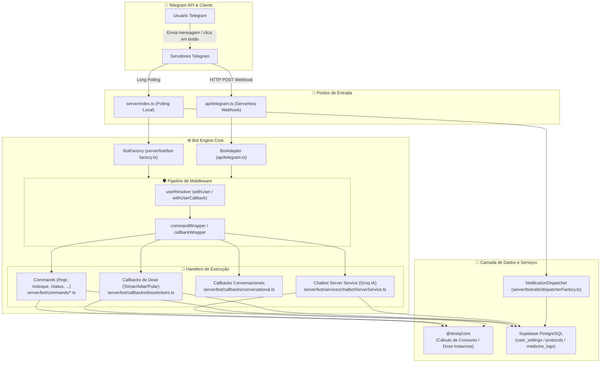
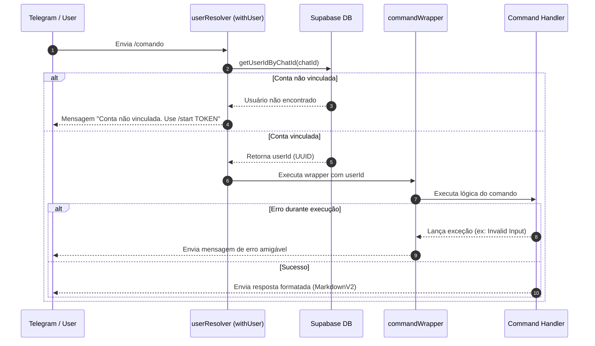
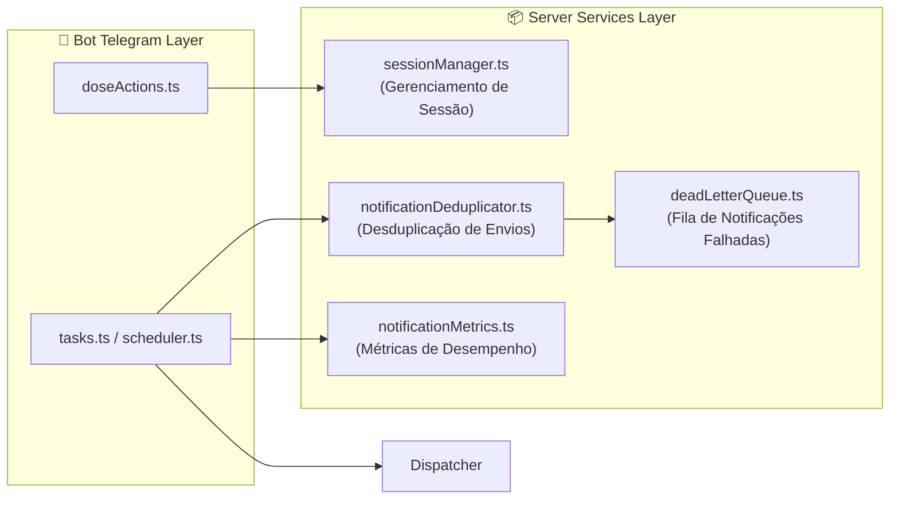

# 🤖 Bot Telegram — Dosiq Engine

Documentação de arquitetura técnica do bot Telegram do Dosiq. Cobre a estrutura 100% TypeScript pós-épico 040, o pipeline de middleware, o ciclo de vida dos comandos, a gestão interativa de doses e a integração com os serviços de servidor.

---

## 📋 Visão Geral

O bot Telegram do Dosiq oferece uma interface conversacional e reativa para a gestão diária de tratamentos de saúde. O bot permite ao paciente registrar doses, visualizar o cronograma do dia, receber lembretes automáticos e monitorar o nível de estoque sem abrir a aplicação web.

Desde o épico 040, a base de código do servidor e do bot foi totalmente migrada para **TypeScript 5.9**. O bot opera em dois modos distintos: **Polling Mode** (para desenvolvimento local via `server/index.ts`) e **Webhook Mode** (em produção serverless na Vercel via `api/telegram.ts`).

### Propósitos Principais

- **Lembretes Ativos**: Notificações diretas com botões inline para confirmação rápida.
- **Registro Interativo**: Baixa automática de estoque com consumo via RPC PostgreSQL (`consume_stock_fifo`).
- **Ancoragem de Doses**: Registro acoplado ao motor de `dose_instances` para calculadoras de adesão e streaks.
- **Monitoramento de Estoque**: Alertas preditivos baseados em consumo diário calculados pela biblioteca `@dosiq/core`.
- **Assistente Clínico IA**: Integração nativa com LLM via Groq SDK (`meta-llama/llama-4-scout-17b-16e-instruct`) com isolamento de contexto do paciente.

### Visão Geral da Arquitetura

O diagrama abaixo ilustra o fluxo de dados desde o recebimento de uma mensagem do Telegram até a execução nos handlers e persistência no banco de dados.



---

## 📁 Árvore de Arquivos (Atualizada)

A estrutura abaixo reflete a organização interna dos módulos do bot no diretório `server/bot/`. Todos os arquivos são implementados nativamente em TypeScript (`.ts`).

```
server/bot/
├── __tests__/                   # Suíte de testes automatizados do bot
├── _adherenceHelpers.ts         # Processamento de dados e relatórios de adesão
├── _reminderHelpers.ts          # Disparo de lembretes e agendamentos de doses
├── alerts.ts                    # Agendadores de alertas (estoque, titulação, relatórios)
├── bot-factory.ts               # Factory para instanciação e validação do bot Telegram
├── callbacks/                   # Handlers de botões inline interativos
│   ├── __tests__/              # Testes unitários de callbacks
│   ├── conversational.ts       # Fluxos conversacionais multi-etapas (/registrar)
│   └── doseActions.ts          # Ações diretas em lembretes (Tomar, Adiar, Pular)
├── commands/                    # Handlers dos 11 comandos de texto do bot
│   ├── adicionar_estoque.ts    # /adicionar_estoque e atalho /repor
│   ├── ajuda.ts                # /ajuda - Menu de instrução
│   ├── chatbot.ts              # /chatbot - Consulta com assistente clínico IA
│   ├── estoque.ts              # /estoque - Saldo e previsões de término
│   ├── historico.ts            # /historico - Registros recentes de doses
│   ├── hoje.ts                 # /hoje - Cronograma de doses do dia
│   ├── protocols.ts            # /protocols, /pausar e /retomar tratamentos
│   ├── proxima.ts              # /proxima - Detalhes do próximo horário
│   ├── registrar.ts            # /registrar - Ativação do fluxo conversacional
│   ├── start.ts                # /start - Vinculação de conta via token
│   └── status.ts               # /status - Listagem de protocolos ativos
├── correlationLogger.ts         # Logger com suporte a UUIDs de correlação (AsyncLocalStorage)
├── doseInstanceScheduler.ts     # Engine de geração diária da tabela dose_instances
├── health-check.ts              # Verificação de integridade do bot e dependências
├── inlineQuery.ts               # Suporte a buscas inline no chat do Telegram
├── logger.ts                    # Logger estruturado baseado em níveis (INFO/DEBUG/ERROR)
├── middleware/                  # Camada de interceptação e autenticação
│   ├── commandWrapper.ts       # Tratamento de exceções e padronização de respostas
│   └── userResolver.ts         # Mapeamento do Telegram Chat ID para Supabase User UUID
├── scheduler.ts                 # Configuração de cron jobs do servidor em background
├── services/                    # Serviços especializados do bot
│   ├── chatbotServerService.ts # Engine de integração com Groq SDK e contexto do paciente
│   └── stockTrackingGuard.ts   # Guard de proteção para modo de uso "dose-only"
├── state.ts                     # Interface de persistência de sessões de usuário
├── tasks.ts                     # Tarefas executadas periodicamente pelo scheduler
└── utils/                       # Utilitários de apoio do bot
    ├── __tests__/              # Testes de utilitários
    ├── commandWrapper.ts       # Utilitário legado de suporte a comandos
    ├── dispatcherFactory.ts    # Factory do NotificationDispatcher unificado
    ├── notificationHelpers.ts  # Formatadores de saudações e mensagens motivacionais
    └── partitionDoses.ts       # Agrupamento de doses por horário
```

---

## ⚙️ Inicialização e Bot Factory

A inicialização do bot depende do ambiente de execução. Em desenvolvimento local, `server/index.ts` inicializa um processo em modo polling contínuo.

### BotFactory (`server/bot/bot-factory.ts`)

A classe `BotFactory` é responsável por instanciar a biblioteca `node-telegram-bot-api`, configurar ouvintes de erro e gerenciar reconexões automáticas em falhas de rede.

```typescript
// server/bot/bot-factory.ts
import TelegramBot from 'node-telegram-bot-api';
import { createLogger } from './logger.js';

const logger = createLogger('BotFactory');

export class BotFactory {
  static createPollingBot(token: string) {
    logger.info('Creating polling bot...');
    
    const bot = new TelegramBot(token, { 
      polling: {
        interval: 300,
        autoStart: true,
        params: {
          timeout: 10
        }
      }
    });

    // Tratamento de erros no polling com reconexão automática
    bot.on('polling_error', (error: any) => {
      logger.error('Polling error', error, { code: error.code });
      
      if (error.code === 'ETIMEDOUT' || error.code === 'ECONNRESET') {
        logger.info('Attempting to restart polling...');
        setTimeout(() => {
          bot.stopPolling().then(() => {
            bot.startPolling();
            logger.info('Polling restarted');
          });
        }, 5000);
      }
    });

    bot.on('error', (error) => {
      logger.error('Bot error', error);
    });

    logger.info('Polling bot created successfully');
    return bot;
  }

  static async validateToken(token: string) {
    try {
      const testBot = new TelegramBot(token, { polling: false });
      const me = await testBot.getMe();
      logger.info('Token validated', { username: me.username });
      return { valid: true, botInfo: me };
    } catch (error: any) {
      logger.error('Token validation failed', error);
      return { valid: false, error: error.message };
    }
  }
}
```

### Inicialização do Servidor (`server/index.ts`)

O arquivo principal de execução realiza a validação do token, conecta o `NotificationDispatcher`, registra a checagem de saúde e inicia o agendador de tarefas.

```typescript
// server/index.ts
import dotenv from 'dotenv';
import path from 'path';
import { fileURLToPath } from 'url';

const __filename = fileURLToPath(import.meta.url);
const __dirname = path.dirname(__filename);
dotenv.config({ path: path.resolve(__dirname, '../.env') });

import { BotFactory } from './bot/bot-factory.js';
import { createLogger } from './bot/logger.js';
import { healthCheck, registerDefaultChecks } from './bot/health-check.js';
import { supabase } from './services/supabase.js';
import { getNotificationDispatcher } from './bot/utils/dispatcherFactory.js';

const logger = createLogger('BotApp');
const token = process.env.TELEGRAM_BOT_TOKEN;

if (!token) {
  throw new Error('TELEGRAM_BOT_TOKEN não definido no .env');
}

// Validação prévia do token no Telegram
const validation = await BotFactory.validateToken(token);
if (!validation.valid) {
  throw new Error(`Token validation failed: ${validation.error}`);
}

const bot = BotFactory.createPollingBot(token);
const notificationDispatcher = getNotificationDispatcher(bot);

registerDefaultChecks(bot, supabase);
await healthCheck.runAll();

logger.info('Bot de Remédios iniciado com sucesso!');
```

---

## 🛡️ Middleware Pipeline

O pipeline de middleware garante isolamento, autorização e tratamento padronizado de exceções em todas as interações com o bot.

### Fluxo do Pipeline de Middleware



### Resolução de Usuário (`server/bot/middleware/userResolver.ts`)

O módulo `userResolver` mapeia o `chat.id` do Telegram para o UUID do usuário cadastrado na tabela `user_settings` do Supabase.

```typescript
// server/bot/middleware/userResolver.ts
import { getUserIdByChatId } from '../../services/userService.js';

export async function resolveUser(chatId: number | string): Promise<string> {
  const userId = await getUserIdByChatId(chatId);
  return userId;
}

export function withUser(
  handler: (...args: any[]) => any, 
  options: { requiresAuth?: boolean } = {}
) {
  const { requiresAuth = true } = options;
  
  return async (bot: any, msg: any, ...args: any[]) => {
    const chatId = msg.chat?.id;
    
    if (!chatId) {
      console.error('No chat ID found in message');
      return;
    }
    
    try {
      let userId: string | null = null;
      
      if (requiresAuth) {
        userId = await resolveUser(chatId);
      }
      
      return await handler(bot, msg, userId, ...args);
      
    } catch (err: any) {
      if (err.message === 'User not linked') {
        return bot.sendMessage(chatId, 
          '❌ Conta não vinculada. Use /start TOKEN para vincular sua conta.\n\n' +
          'Você pode gerar um token no aplicativo web em Configurações.'
        );
      }
      
      throw err;
    }
  };
}
```

### Wrapper de Comando (`server/bot/middleware/commandWrapper.ts`)

O `commandWrapper` intercepta erros não tratados e fornece mensagens de retorno ao paciente sem derrubar o processo do servidor.

```typescript
// server/bot/middleware/commandWrapper.ts
import { createLogger } from '../logger.js';

const logger = createLogger('commandWrapper');

export const ERROR_MESSAGES = {
  USER_NOT_LINKED: '❌ Conta não vinculada. Use /start TOKEN para vincular sua conta.\n\nVocê pode gerar um token no aplicativo web em Configurações.',
  GENERIC_ERROR: '❌ Ocorreu um erro ao processar seu comando. Por favor, tente novamente.',
  NO_PROTOCOLS: 'Você não possui protocolos ativos no momento. Use o app web para cadastrar.',
  NO_MEDICINES: 'Você não possui medicamentos cadastrados. Use o app web para cadastrar.',
  INVALID_INPUT: '❌ Entrada inválida. Por favor, verifique e tente novamente.',
};

export function commandWrapper(
  commandName: string, 
  handler: (...args: any[]) => any, 
  options: { logUsage?: boolean } = {}
) {
  const { logUsage = true } = options;
  
  return async (bot: any, msg: any, ...args: any[]) => {
    const chatId = msg.chat?.id;
    const userId = msg.from?.id;
    const username = msg.from?.username || 'unknown';
    
    if (!chatId) {
      logger.error(`[${commandName}] No chat ID in message`);
      return;
    }
    
    try {
      if (logUsage) {
        logger.info(`[${commandName}] Command invoked by user ${userId} (@${username})`);
      }
      
      await handler(bot, msg, ...args);
      
    } catch (err: any) {
      logger.error(`[${commandName}] Error:`, err);
      
      if (err.message === 'User not linked') {
        return bot.sendMessage(chatId, ERROR_MESSAGES.USER_NOT_LINKED);
      }
      
      try {
        await bot.sendMessage(chatId, ERROR_MESSAGES.GENERIC_ERROR);
      } catch (sendErr) {
        logger.error(`[${commandName}] Failed to send error message:`, sendErr);
      }
    }
  };
}
```

---

## 💬 Catálogo de Comandos

O bot suporta 11 comandos principais de texto e atalhos parametrizados. Todos os comandos exigem autenticação do paciente, exceto a primeira execução do `/start`.

| Comando | Arquivo Fonte | Descrição | Exige Auth? |
| :--- | :--- | :--- | :--- |
| `/start` | `server/bot/commands/start.ts` | Vincula a conta do Telegram usando o token gerado no web app | ❌ Não |
| `/ajuda` | `server/bot/commands/ajuda.ts` | Exibe o guia de comandos e instruções de suporte | ❌ Não |
| `/hoje` | `server/bot/commands/hoje.ts` | Exibe a agenda detalhada de doses para a data atual no fuso de SP | ✅ Sim |
| `/proxima` | `server/bot/commands/proxima.ts` | Exibe o próximo medicamento agendado no dia | ✅ Sim |
| `/registrar` | `server/bot/commands/registrar.ts` | Inicia o fluxo conversacional para registrar dose avulsa | ✅ Sim |
| `/estoque` | `server/bot/commands/estoque.ts` | Apresenta o saldo e a estimativa de dias até o fim do estoque | ✅ Sim |
| `/adicionar_estoque` | `server/bot/commands/adicionar_estoque.ts` | Adiciona unidades de um medicamento ao estoque via wizard | ✅ Sim |
| `/repor` | `server/bot/commands/adicionar_estoque.ts` | Atalho rápido para repor estoque: `/repor Nome Quantidade` | ✅ Sim |
| `/historico` | `server/bot/commands/historico.ts` | Exibe os últimos registros de tomadas de dose | ✅ Sim |
| `/protocols` | `server/bot/commands/protocols.ts` | Gerencia os protocolos (suporta os subcomandos `/pausar` e `/retomar`) | ✅ Sim |
| `/chatbot` | `server/bot/commands/chatbot.ts` | Inicia consulta com a inteligência artificial clínica Groq | ✅ Sim |
| `/status` | `server/bot/commands/status.ts` | Lista os protocolos ativos com dosagem e horários | ✅ Sim |

### Exemplo 1: Comando `/hoje` (`server/bot/commands/hoje.ts`)

O comando `/hoje` busca os protocolos ativos do paciente, ajusta a janela do fuso horário de São Paulo (GMT-3) e avalia o status das tomadas recentes.

```typescript
// server/bot/commands/hoje.ts
import { supabase } from '../../services/supabase.js';
import { getUserIdByChatId } from '../../services/userService.js';
import { escapeMarkdownV2 } from '../../utils/formatters.js';
import { 
  getTodayLocal, 
  getCurrentTime, 
  parseLocalDate,
  getSaoPauloTime,
  addDays
} from '../../utils/dateUtils.js';
import { isProtocolActiveOnWeekday } from '../../utils/protocolActiveHelper.js';

export async function handleHoje(bot: any, msg: any) {
  const chatId = msg.chat.id;
  
  try {
    let userId: string;
    try {
      userId = await getUserIdByChatId(chatId);
    } catch {
      return await bot.sendMessage(chatId, '⚠️ Você precisa vincular sua conta primeiro\\. Use /start para instruções\\.');
    }

    const { data: protocols, error } = await supabase
      .from('protocols')
      .select('*, medicine:medicines(*)')
      .eq('user_id', userId)
      .eq('active', true);

    if (error) throw error;

    if (!protocols || protocols.length === 0) {
      return await bot.sendMessage(chatId, 'Você não possui protocolos ativos\\.');
    }

    const todayStr = getTodayLocal();
    const startOfDay = parseLocalDate(todayStr);

    // Consulta logs nas últimas 36 horas para cobrir o deslocamento de timezone
    const { data: allLogs } = await supabase
      .from('medicine_logs')
      .select('protocol_id, taken_at')
      .eq('user_id', userId)
      .gte('taken_at', addDays(startOfDay, -1).toISOString());

    const todayLogs = allLogs?.filter(log => {
      return getTodayLocal(getSaoPauloTime(log.taken_at)) === todayStr;
    }) || [];

    const schedule: Array<{ time: string; medicine: string; dosage: any; taken: boolean }> = [];
    const todayDateSP = getSaoPauloTime();
    const todayWeekdayIndex = todayDateSP.getDay();

    protocols.forEach(protocol => {
      if (!isProtocolActiveOnWeekday(protocol, todayWeekdayIndex, todayStr)) return;

      const protocolLogs = todayLogs.filter(l => l.protocol_id === protocol.id);
      
      (protocol.time_schedule as any[] || []).forEach(time => {
        const wasTaken = protocolLogs.some(log => {
          const logDate = getSaoPauloTime(log.taken_at);
          const logTime = logDate.getHours().toString().padStart(2, '0') + ':' + 
                          logDate.getMinutes().toString().padStart(2, '0');
          return logTime === time;
        });

        schedule.push({
          time,
          medicine: protocol.medicine?.name || protocol.name,
          dosage: protocol.dosage_per_intake,
          taken: wasTaken
        });
      });
    });

    schedule.sort((a, b) => a.time.localeCompare(b.time));

    const todayFormatted = todayStr.split('-').reverse().join('/');
    let message = `📅 *Doses de Hoje* \\(${escapeMarkdownV2(todayFormatted)}\\)\n\n`;

    schedule.forEach(item => {
      const status = item.taken ? '✅' : '⏱️';
      const medicineName = escapeMarkdownV2(item.medicine || 'Medicamento');
      const time = escapeMarkdownV2(item.time);
      const dosage = escapeMarkdownV2(String(item.dosage ?? 1));
      message += `${status} ${time} \\- ${medicineName} \\(${dosage}x\\)\n`;
    });

    await bot.sendMessage(chatId, message, { parse_mode: 'MarkdownV2' });
  } catch (err) {
    console.error('Erro ao buscar agenda:', err);
    await bot.sendMessage(chatId, 'Erro ao buscar agenda de hoje\\.');
  }
}
```

### Exemplo 2: Comando `/estoque` (`server/bot/commands/estoque.ts`)

O comando de estoque consulta o saldo de medicamentos e utiliza o calculador de consumo da biblioteca compartilhada `@dosiq/core`.

```typescript
// server/bot/commands/estoque.ts
import { supabase } from '../../services/supabase.js';
import { getUserIdByChatId } from '../../services/userService.js';
import { calculateDaysRemaining, formatStockStatus } from '../../utils/formatters.js';
import { calculateDailyIntake, stockDoseMetrics } from '@dosiq/core';
import { replyIfStockDisabled } from '../services/stockTrackingGuard.js';

export async function handleEstoque(bot: any, msg: any) {
  const chatId = msg.chat.id;

  try {
    const userId = await getUserIdByChatId(chatId);

    // Guard para usuários em modo dose-only
    if (await replyIfStockDisabled(bot, chatId, userId)) return;

    const { data: medicines, error: medError } = await supabase
      .from('medicines')
      .select(`
        *,
        stock(*),
        protocols!protocols_medicine_id_fkey(*)
      `)
      .eq('user_id', userId)
      .order('name');

    if (medError) throw medError;

    if (!medicines || medicines.length === 0) {
      return await bot.sendMessage(chatId, 'Você não possui medicamentos cadastrados\\.');
    }

    let message = '📦 *Estoque de Medicamentos:*\n\n';

    for (const medicine of medicines) {
      const activeProtocols = (medicine.protocols || []).filter((p: any) => p.active);
      if (activeProtocols.length === 0) continue;

      const totalQuantity = (medicine.stock || []).reduce((sum: number, s: any) => sum + s.quantity, 0);

      // Consumo diário calculado via core (suporta formas líquidas e conversão em ml)
      const dailyUsage = calculateDailyIntake(medicine.id, activeProtocols, medicine);
      const daysRemaining = calculateDaysRemaining(totalQuantity, dailyUsage);
      const doseMetrics = stockDoseMetrics(totalQuantity, activeProtocols, medicine);

      message += formatStockStatus(medicine, totalQuantity, daysRemaining, doseMetrics) + '\n';
    }

    await bot.sendMessage(chatId, message, { parse_mode: 'MarkdownV2' });
  } catch (err) {
    console.error('Erro ao buscar estoque:', err);
    await bot.sendMessage(chatId, 'Erro ao buscar estoque\\.');
  }
}
```

---

## 🔘 Callbacks e Fluxos Interativos

O bot responde a interações de botões embutidos (inline keyboards) enviados com lembretes ou menus.

### Mapeamento de Callbacks

| Callback Pattern | Handler Responsável | Função e Impacto |
| :--- | :--- | :--- |
| `take_:{protocolId}:{quantity}` | `doseActions.ts` | Registra a dose tomada, executa a RPC `consume_stock_fifo` e ancora na `dose_instance` |
| `snooze_:{protocolId}` | `doseActions.ts` | Adia a notificação do lembrete por 30 minutos |
| `skip_:{protocolId}` | `doseActions.ts` | Solicita confirmação para pular a dose agendada |
| `confirm_skip_:{protocolId}` | `doseActions.ts` | Marca a dose como pulada na tabela `dose_instances` |
| `reg_med_:{index}` | `conversational.ts` | Seleciona o medicamento no fluxo conversacional de registro |
| `reg_qty_:{quantity}` | `conversational.ts` | Seleciona a quantidade no fluxo conversacional |
| `pause_prot_:{index}` | `protocols.ts` | Alterna o status do protocolo selecionado para inativo (`active = false`) |
| `resume_prot_:{index}` | `protocols.ts` | Alterna o status do protocolo selecionado para ativo (`active = true`) |

### Registro de Dose em Callback (`server/bot/callbacks/doseActions.ts`)

Quando o paciente clica no botão "Tomar", o bot executa a gravação da dose, realiza a baixa em lote no estoque e ancora o registro à instância correspondente.

```typescript
// server/bot/callbacks/doseActions.ts (Trecho principal)
import { supabase } from '../../services/supabase.js';
import { getUserIdByChatId } from '../../services/userService.js';
import { escapeMarkdownV2 } from '../../utils/formatters.js';
import { getServerTimestamp } from '../../utils/dateUtils.js';
import { createDoseInstanceRepository } from '@dosiq/core';

const doseInstanceRepo = createDoseInstanceRepository({ client: supabase as any });

async function createLogAndConsumeStock(
  userId: string, 
  protocolId: string, 
  medicineId: string, 
  quantity: number
) {
  const takenAt = getServerTimestamp();
  
  // 1. Inserção do log de tomada
  const { data: createdLogs, error: logError } = await supabase
    .from('medicine_logs')
    .insert([{
      user_id: userId,
      protocol_id: protocolId,
      medicine_id: medicineId,
      quantity_taken: quantity,
      taken_at: takenAt
    }])
    .select('id')
    .single();

  if (logError) throw logError;

  // 2. Consumo de estoque transacional via RPC (FIFO)
  const { error: consumeError } = await supabase.rpc('consume_stock_fifo', {
    p_user_id: userId,
    p_medicine_id: medicineId,
    p_quantity: quantity,
    p_medicine_log_id: createdLogs.id
  });

  if (consumeError) {
    // Reversão do log caso o estoque falhe
    await supabase.from('medicine_logs').delete().eq('id', createdLogs.id).eq('user_id', userId);
    throw consumeError;
  }

  // 3. Ancoragem assíncrona do log à dose_instance
  await anchorLogToInstance(userId, protocolId, createdLogs.id, takenAt);
}

async function anchorLogToInstance(
  userId: string, 
  protocolId: string, 
  logId: string, 
  takenAt: string
) {
  try {
    const instance = await doseInstanceRepo.findAnchorInstance({ protocolId, takenAt });
    if (!instance) return;

    const marked = await doseInstanceRepo.markTaken(instance.id, logId);
    if (!marked) return;

    await supabase
      .from('medicine_logs')
      .update({ dose_instance_id: instance.id })
      .eq('id', logId)
      .eq('user_id', userId);
  } catch (anchorError) {
    console.warn('Falha ao ancorar log à instância:', anchorError);
  }
}
```

---

## ⏱️ Tasks, Formatação e Scheduler

O módulo de agendamento gerencia cron jobs periódicos no ambiente em modo polling e auxilia a execução em segundo plano.

### Agendador Principal (`server/bot/scheduler.ts`)

```typescript
// server/bot/scheduler.ts
import cron from 'node-cron';
import { createLogger } from './logger.js';
import { checkReminders, runDailyDigest, checkPrescriptionAlerts } from './tasks.js';
import { generateDoseInstances, cleanupPausedProtocols } from './doseInstanceScheduler.js';

const logger = createLogger('Scheduler');

function scheduleTask(name: string, schedule: string, task: () => Promise<any>) {
  cron.schedule(schedule, async () => {
    try {
      logger.debug(`Starting scheduled task: ${name}`);
      await task();
      logger.debug(`Completed scheduled task: ${name}`);
    } catch (error) {
      logger.error(`Scheduled task failed: ${name}`, error);
    }
  });
  logger.info(`Scheduled task registered: ${name}`, { schedule });
}

export function startScheduler(bot: any, options: { notificationDispatcher?: any } = {}) {
  // Lembretes executados a cada minuto
  scheduleTask('checkReminders', '* * * * *', () => checkReminders(bot, options));
}

export function startDoseInstanceGeneration() {
  // Execução diária às 03:15 para manutenção de instâncias
  scheduleTask('generateDoseInstances', '15 3 * * *', async () => {
    await generateDoseInstances();
    await cleanupPausedProtocols();
  });
}
```

### Formatação de Texto e MarkdownV2 (`server/utils/formatters.ts`)

A API do Telegram exige a sanitização de 18 caracteres especiais no formato `MarkdownV2`. A função `escapeMarkdownV2` realiza essa conversão.

```typescript
// server/utils/formatters.ts
export function escapeMarkdownV2(text: string): string {
  if (!text || typeof text !== 'string') return '';
  
  return text.replace(/([\\*()`>#+\-=|{}.!_[\]~])/g, (match) => {
    const escapeMap: Record<string, string> = {
      '\\': '\\\\',
      '_': '\\_',
      '*': '\\*',
      '[': '\\[',
      ']': '\\]',
      '(': '\\(',
      ')': '\\)',
      '~': '\\~',
      '`': '\\`',
      '>': '\\>',
      '#': '\\#',
      '+': '\\+',
      '-': '\\-',
      '=': '\\=',
      '|': '\\|',
      '{': '\\{',
      '}': '\\}',
      '.': '\\.',
      '!': '\\!'
    };
    return escapeMap[match] || `\\${match}`;
  });
}
```

---

## 🤖 Serviços Internos do Bot

### Chatbot Clínico IA (`server/bot/services/chatbotServerService.ts`)

O serviço de chatbot fornece respostas contextualizadas utilizando o modelo LLM Groq SDK (`meta-llama/llama-4-scout-17b-16e-instruct`). O contexto é montado pela biblioteca `@dosiq/core`.

```typescript
// server/bot/services/chatbotServerService.ts (Trecho principal)
import Groq from 'groq-sdk';
import { supabase } from '../../services/supabase.js';
import { fetchChatbotContextData, buildPatientContext } from '@dosiq/core';

type CoreSupabaseClient = Parameters<typeof fetchChatbotContextData>[0]['supabase'];

export async function buildPatientContextForUser(userId: string) {
  try {
    const data = await fetchChatbotContextData({
      supabase: supabase as unknown as CoreSupabaseClient,
      getUserId: async () => userId,
    });
    const context = buildPatientContext(data);
    return { context, error: null };
  } catch (error) {
    return { context: null, error: 'Erro ao carregar contexto.' };
  }
}

export function buildStaticSystemRules(): string {
  return [
    'Você é o assistente de saúde do app Dosiq no Telegram.',
    'Missão: orientar sobre o cronograma de doses, adesão e estoque do paciente.',
    'REGRAS ABSOLUTAS:',
    '- NUNCA recomende ou altere dosagens.',
    '- NUNCA sugira diagnósticos ou substituição de medicamentos.',
    '- Responda em português simples e sem formatação complexa.'
  ].join('\n');
}
```

### Guard de Controle de Estoque (`server/bot/services/stockTrackingGuard.ts`)

Garante que usuários com a opção "dose-only" não recebam mensagens incorretas sobre estoque zerado.

```typescript
// server/bot/services/stockTrackingGuard.ts
import { supabase } from '../../services/supabase.js';

export const STOCK_DISABLED_INVITE =
  'Você ainda não acompanha o estoque por aqui, então não tenho saldo para te mostrar. ' +
  'Quer que eu avise quando um remédio estiver acabando? ' +
  'É só ativar o controle de estoque no app, em Configurações.';

export async function isStockTrackingEnabled(userId: string): Promise<boolean> {
  const { data, error } = await supabase
    .from('user_settings')
    .select('stock_tracking_enabled')
    .eq('user_id', userId)
    .maybeSingle();

  if (error) return true;
  return data?.stock_tracking_enabled !== false;
}

export async function replyIfStockDisabled(bot: any, chatId: number | string, userId: string): Promise<boolean> {
  const enabled = await isStockTrackingEnabled(userId);
  if (enabled) return false;
  await bot.sendMessage(chatId, STOCK_DISABLED_INVITE);
  return true;
}
```

---

## 🔌 Integração com Server Services

O bot utiliza a camada compartilhada de serviços localizada em `server/services/` para persistência, métricas e controle de falhas.



---

## ⚡ Webhook e Deployment Vercel

Em ambiente de produção na Vercel, o bot é acionado por meio do endpoint serverless `api/telegram.ts`.

### Adaptador Serverless (`api/telegram.ts`)

O arquivo cria um adaptador leve (`createBotAdapter`) que converte chamadas da API do `node-telegram-bot-api` em requisições `fetch` para a Telegram Bot API.

```typescript
// api/telegram.ts (Trecho principal)
import { handleStart } from '../server/bot/commands/start.js';
import { handleHoje } from '../server/bot/commands/hoje.js';
import { handleEstoque } from '../server/bot/commands/estoque.js';
import { createLogger } from '../server/bot/logger.js';

const token = process.env.TELEGRAM_BOT_TOKEN;
const logger = createLogger('TelegramWebhook');

function createBotAdapter(token: string) {
  const telegramFetch = async (method: string, body: any) => {
    const res = await fetch(`https://api.telegram.org/bot${token}/${method}`, {
      method: 'POST',
      headers: { 'Content-Type': 'application/json' },
      body: JSON.stringify(body),
    });
    const data = await res.json();
    return data.result;
  };

  return {
    sendMessage: async (chatId: any, text: string, options = {}) => {
      return telegramFetch('sendMessage', { chat_id: chatId, text, ...options });
    },
    editMessageText: async (text: string, options = {}) => {
      return telegramFetch('editMessageText', { text, ...options });
    },
    answerCallbackQuery: async (id: string, options = {}) => {
      return telegramFetch('answerCallbackQuery', { callback_query_id: id, ...options });
    }
  };
}

export default async function handler(req: any, res: any) {
  if (req.method !== 'POST') {
    return res.status(405).json({ error: 'Method not allowed' });
  }

  const bot = createBotAdapter(token!);
  const update = req.body;

  try {
    if (update.message?.text) {
      if (update.message.text.startsWith('/hoje')) {
        await handleHoje(bot, update.message);
      } else if (update.message.text.startsWith('/estoque')) {
        await handleEstoque(bot, update.message);
      }
    }
    res.status(200).json({ success: true });
  } catch (error: any) {
    logger.error('Erro no webhook:', error);
    res.status(200).json({ error: 'Internal Error', details: error.message });
  }
}
```

---

## 🚨 Troubleshooting e Manutenção

### 1. Erro de Parse no Telegram (`400 Bad Request: can't parse entities`)

- **Sintoma**: O bot falha ao enviar mensagens e registra erro 400 no log.
- **Causa**: Caracteres especiais do formato `MarkdownV2` (como `-`, `.`, `!`, `(`, `)`) não foram escapados.
- **Solução**: Passe todas as variáveis dinâmicas inseridas na mensagem pela função `escapeMarkdownV2()` de `server/utils/formatters.ts`.

### 2. Mensagens Duplicadas em Ambiente Local

- **Sintoma**: O bot responde duas vezes ao mesmo comando durante o desenvolvimento.
- **Causa**: O webhook de produção na Vercel e o processo de polling local (`npm run bot`) estão ativos simultaneamente para o mesmo token.
- **Solução**: Remova o webhook na API do Telegram ou utilize um token de testes exclusivo para desenvolvimento local.

### 3. Falha de Conexão com o Supabase no Polling

- **Sintoma**: O log exibe erros `ECONNRESET` ou falhas de consulta no Supabase.
- **Causa**: As variáveis de ambiente `VITE_SUPABASE_URL` ou `SUPABASE_SERVICE_ROLE_KEY` não estão presentes no `.env` da raiz.
- **Solução**: Verifique se o arquivo `.env` está configurado corretamente e carregado pela biblioteca `dotenv`.

---

## 🔗 Documentação Relacionada

- [`docs/architecture/NOTIFICATIONS.md`](NOTIFICATIONS.md) — Visão geral do ecossistema de notificações.
- [`docs/architecture/SERVER_NOTIFICATIONS.md`](SERVER_NOTIFICATIONS.md) — Engine de notificações do servidor.
- [`docs/architecture/DATABASE.md`](DATABASE.md) — Schema do banco de dados PostgreSQL.
- [`server/BOT README.md`](../../server/BOT%20README.md) — Guia do desenvolvedor para a pasta `server/`.
