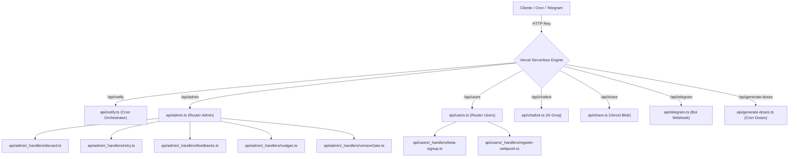
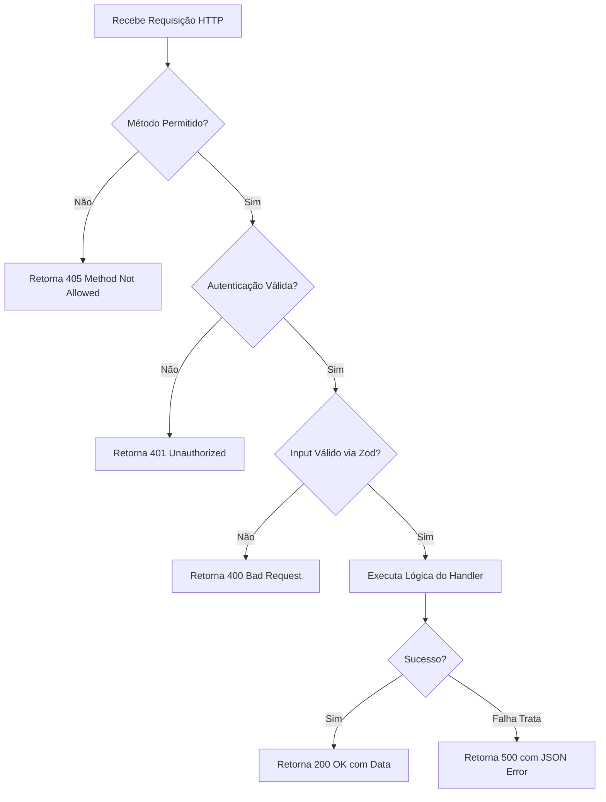

# Catálogo de API Endpoints

Este documento descreve a arquitetura, as convenções e os endpoints da camada de API do Dosiq. Toda a infraestrutura roda como Serverless Functions na plataforma Vercel.

---

## Visão Geral

A camada de API do Dosiq é implementada em TypeScript no diretório `api/`. As funções executam em ambiente Node.js ESM nativo da Vercel.

### Restrição de Orçamento de Funções (R-090)

No plano Vercel Hobby, existe um limite de 12 Serverless Functions por deploy. Cada arquivo TypeScript na raiz do diretório `api/` é contabilizado como uma função individual.

Para respeitar esse limite, a arquitetura utiliza o padrão de Roteadores Consolidados. Arquivos e utilitários dentro de subdiretórios iniciados por underline (`_`) não são contados pela Vercel.



### Ocupação Atual do Orçamento (7 / 12 Slot)

| Slot | Arquivo Entrypoint | Propósito Principal | maxDuration |
|---|---|---|---|
| 1 | `api/admin.ts` | Roteador de administração, DLQ, feedbacks, nudges e health | default |
| 2 | `api/users.ts` | Roteador de usuários (beta signup e registro WebPush) | default |
| 3 | `api/chatbot.ts` | Endpoint de assistente virtual IA via Groq SDK | default |
| 4 | `api/generate-doses.ts` | Cron de suporte para geração de instâncias de dose | 60s |
| 5 | `api/notify.ts` | Cron de despacho de notificações e outbox | 60s |
| 6 | `api/share.ts` | Upload e compartilhamento de relatórios PDF | default |
| 7 | `api/telegram.ts` | Webhook de mensagens e callbacks do Telegram | 10s |

---

## Autenticação e Segurança

A API emprega três estratégias de autenticação, dependendo da origem da requisição e do nível de privilégio exigido.

### Modos de Autenticação

1. **JWT Bearer (Supabase Auth)**: Usado por usuários autenticados e administradores. O token JWT é enviado no header `Authorization: Bearer <token>`. Para acessos administrativos, o `user.id` extraído é validado de forma estrita contra a variável `ADMIN_USER_ID`.
2. **Cron Secret**: Usado para autenticar execuções agendadas da Vercel ou serviços externos. Requer o header `Authorization: Bearer <CRON_SECRET>`.
3. **Telegram Bot Token**: Validação de chamadas de webhook enviadas pelos servidores do Telegram.

### Tabela de Permissões por Endpoint

| Endpoint | Modo de Auth | Chamador Autorizado | Regra / Guard de Segurança |
|---|---|---|---|
| `/api/notify` | Cron Secret | Vercel Cron / Scheduler | Valida `CRON_SECRET`. Nega se variável estiver ausente (fail-closed). |
| `/api/admin` | JWT Bearer | Administrador (`ADMIN_USER_ID`) | Compara `user.id` do JWT com `ADMIN_USER_ID` (ADR-091). Fail-closed se env ausente. |
| `/api/chatbot` | JWT Bearer | Usuário Autenticado | Valida JWT via Supabase Auth + Rate limit (5 req/min). |
| `/api/share` | JWT Bearer | Usuário Autenticado | Valida JWT + Limite de upload de 5MB por arquivo. |
| `/api/telegram` | Bot Token | Servidores Telegram | Valida existência do `TELEGRAM_BOT_TOKEN`. |
| `/api/generate-doses` | Cron Secret | Cron Externo / Vercel | Valida `CRON_SECRET`. Nega se variável estiver ausente (fail-closed). |
| `/api/users?action=beta-signup` | Pública | Qualquer Origem | Sem auth JWT. Protegido por rate limit por IP (5 req/min). |
| `/api/users?action=register-webpush` | JWT Bearer | Usuário Autenticado | Valida JWT via Supabase Auth. |

### Exemplo Real: Verificação de Acesso Admin

A validação de administrador é tratada pela função `verifyAdminAccess` no módulo central de autenticação do servidor:

```typescript
// server/utils/auth.ts
export async function verifyAdminAccess(authHeader: string | undefined): Promise<AdminAccessResult> {
  const { supabaseUrl, supabaseAnonKey, adminUserId } = readConfig();

  // Fail-closed: sem a variável ADMIN_USER_ID configurada, nega acesso.
  if (!adminUserId) {
    logger.error('ADMIN_USER_ID não configurada — todo acesso admin será NEGADO (fail-closed)');
    return { authorized: false, error: 'Acesso negado' };
  }

  if (!supabaseUrl || !supabaseAnonKey) {
    logger.error('Configuração do Supabase ausente na verificação de admin');
    return { authorized: false, error: 'Acesso negado' };
  }

  if (!authHeader || !authHeader.startsWith('Bearer ')) {
    return { authorized: false, error: 'Acesso negado' };
  }

  const token = authHeader.slice('Bearer '.length).trim();
  const supabase = createClient(supabaseUrl, supabaseAnonKey, {
    global: { headers: { Authorization: `Bearer ${token}` } }
  });

  try {
    const { data, error: authError } = await supabase.auth.getUser();
    const user = data?.user;

    if (authError || !user?.id) {
      logger.warn('Token inválido ou expirado na verificação de admin');
      return { authorized: false, error: 'Acesso negado' };
    }

    if (user.id !== adminUserId) {
      logger.warn('Tentativa de acesso admin por usuário não-admin', { userId: user.id });
      return { authorized: false, error: 'Acesso negado' };
    }

    return { authorized: true, userId: user.id };
  } catch (err) {
    logger.error('Erro na verificação de admin', err);
    return { authorized: false, error: 'Acesso negado' };
  }
}
```

### Exemplo Real: Guarda Fail-Closed para Cron Secret

A autenticação dos crons valida se a variável `CRON_SECRET` está configurada antes de comparar os valores:

```typescript
// api/notify.ts
const authHeader = req.headers['authorization'];
const cronSecret = process.env.CRON_SECRET;

// Bloqueia caso CRON_SECRET seja undefined para evitar bypass via 'Bearer undefined'
if (!cronSecret || authHeader !== `Bearer ${cronSecret}`) {
  logger.warn('Unauthorized cron attempt', { correlationId, authHeader });
  return res.status(401).json({ error: 'Unauthorized' });
}
```

---

## Catálogo de Endpoints

### `POST /api/notify`

Orquestrador de crons de notificação e reprocessamento da fila de outbox.

- **Métodos**: `GET`, `POST`
- **Autenticação**: Header `Authorization: Bearer <CRON_SECRET>`
- **Duração Máxima**: 60 segundos (`maxDuration = 60`)
- **Fuso Horário Base**: `America/Sao_Paulo`

#### Comportamento e Tarefas Agendadas

O endpoint executa em intervalos regulares e aciona rotinas com base na hora atual de São Paulo:

1. **Reminders (Minuto a Minuto)**: Verifica e dispara lembretes imediatos de doses pendentes.
2. **Outbox Cycle (Minuto a Minuto)**: Processa e drena notificações da tabela `notification_outbox`.
3. **Titration Alerts (Diário às 08:00)**: Dispara alertas de progressão de titulação.
4. **Stock Alerts & DLQ Retry (Diário às 10:00)**: Verifica estoques baixos e tenta reprocessar notificações pendentes da DLQ.
5. **Adherence Reports (Domingos entre 09:00 e 12:00)**: Gera relatórios semanais de adesão.
6. **Monthly Report (Dia 1 de cada mês às 10:00)**: Consolida o relatório mensal do paciente.

#### Formato da Resposta de Sucesso (`200 OK`)

```json
{
  "status": "ok",
  "executed": [
    "reminders",
    "outbox_cycle"
  ],
  "time": "14:30",
  "correlationId": "cron_1722269845000_a1b2c3"
}
```

#### Código Fonte Relevante

```typescript
// api/notify.ts
export default async function handler(req, res) {
  const correlationId = generateCorrelationId();
  const authHeader = req.headers['authorization'];
  const cronSecret = process.env.CRON_SECRET;

  if (!cronSecret || authHeader !== `Bearer ${cronSecret}`) {
    logger.warn('Unauthorized cron attempt', { correlationId, authHeader });
    return res.status(401).json({ error: 'Unauthorized' });
  }

  const token = process.env.TELEGRAM_BOT_TOKEN;
  if (!token) {
    return res.status(500).json({ error: 'Token missing' });
  }

  const bot = createNotifyBotAdapter(token);
  const notificationDispatcher = _createNotificationDispatcher(bot);
  const now = getRawNow();
  const spDate = getSaoPauloTime(now);

  try {
    const results = await _executeCronJobs(notificationDispatcher, bot, correlationId, spDate);
    return res.status(200).json({
      status: 'ok',
      executed: results,
      time: spDate.toLocaleTimeString('pt-BR', { hour: '2-digit', minute: '2-digit', hour12: false }),
      correlationId
    });
  } catch (error) {
    return res.status(500).json({ error: error.message, correlationId });
  }
}
```

---

### `GET | POST | PATCH | PUT /api/admin`

Roteador consolidado para operações administrativas, gerenciamento de DLQ, feedbacks de usuários, mensagens in-app (nudges) e controle de versão mínima.

- **Autenticação**: JWT Bearer + Verificação `ADMIN_USER_ID`
- **Sub-handlers em**: `api/admin/_handlers/`

#### Tabela de Roteamento de Sub-Recursos

| Recurso (`resource`) | Ação (`action`) | Método HTTP | Handler Responsável | Descrição |
|---|---|---|---|---|
| `dlq` | *(nenhuma)* | `GET` | Inline (`handleListDLQ`) | Lista notificações na DLQ com paginação e status |
| `dlq` | `retry` | `POST` | `_handlers/retry.ts` | Re-executa envio de notificação falhada no DLQ |
| `dlq` | `discard` | `POST` | `_handlers/discard.ts` | Marca notificação falhada como descartada |
| `feedbacks` | *(nenhuma)* | `GET` | `_handlers/feedbacks.ts` | Lista feedbacks recebidos com estatísticas |
| `feedbacks` | `resolve` | `POST` | `_handlers/feedbacks.ts` | Altera status de resolução de um feedback |
| `nudges` | *(nenhuma)* | `GET` | `_handlers/nudges.ts` | Lista mensagens in-app (nudges) configuradas |
| `nudges` | *(nenhuma)* | `POST` | `_handlers/nudges.ts` | Cria um novo nudge in-app com regras Zod |
| `nudges` | *(nenhuma)* | `PATCH` | `_handlers/nudges.ts` | Atualiza campos parciais de um nudge |
| `nudges` | *(nenhuma)* | `PUT` | `_handlers/nudges.ts` | Ativa ou desativa um nudge in-app |
| `health` | *(nenhuma)* | `GET` | Inline (`_routeHealth`) | Verifica acúmulo de mensagens na `notification_outbox` |
| `versionGate` | *(nenhuma)* | `GET` | `_handlers/versionGate.ts` | Retorna configurações de versão mínima do app |
| `versionGate` | *(nenhuma)* | `PATCH` | `_handlers/versionGate.ts` | Atualiza regras do kill switch de versão |

#### Estrutura do Handler Roteador

```typescript
// api/admin.ts
export default async function handler(req, res) {
  const adminUserId = process.env.ADMIN_USER_ID;

  if (!supabaseUrl || !supabaseServiceKey || !supabaseAnonKey || !adminUserId) {
    return res.status(500).json({ error: 'Server configuration error' });
  }

  const authResult = await verifyAdminAccess(req.headers['authorization']);
  if (!authResult.authorized) {
    return res.status(401).json({ error: authResult.error });
  }

  const { resource, action, scope } = req.query;

  if (resource === 'versionGate') return _routeVersionGate(req, res, supabase, adminUserId);
  if (resource === 'health') return _routeHealth(req, res, scope, supabase);
  if (resource === 'dlq') return _routeDlq(req, res, action);
  if (resource === 'feedbacks') return _routeFeedbacks(req, res, action);
  if (resource === 'nudges') return _routeNudges(req, res, action, supabase);

  return res.status(405).json({ error: 'Method or action not allowed' });
}
```

---

### `POST /api/chatbot`

Endpoint do assistente de saúde IA integrado ao Groq SDK.

- **Método**: `POST`
- **Autenticação**: Supabase JWT (usuário autenticado)
- **Modelo de IA**: `openai/gpt-oss-120b` (ou via env `GROQ_MODEL`)
- **Rate Limit**: 5 requisições por minuto por `user.id`

#### Esquema de Entrada (Zod)

```typescript
// api/chatbot.ts
const chatbotRequestSchema = z.object({
  message: z.string().min(1).max(500),
  history: z.array(
    z.object({
      role: z.enum(['user', 'assistant']),
      content: z.string()
    })
  ).optional().default([]),
  patientContext: z.string().max(4000).optional().default('')
});
```

#### Segurança e Caching de Prompts

O endpoint possui duas camadas adicionais de proteção:

1. **Filtro de Segurança Server-Side**: Analisa a mensagem com `CHATBOT_BLOCKED_PATTERNS`. Bloqueia solicitações de dosagem médica ou diagnósticos antes de enviar ao provedor de IA.
2. **Otimização de Caching do Groq**: Organiza as mensagens colocando as regras estáticas do sistema em primeiro lugar, promovendo reaproveitamento de cache de prompt no provedor.

```typescript
// api/chatbot.ts
if (isBlockedMessage(message)) {
  return res.status(422).json({
    error: 'Não posso recomendar dosagens, diagnósticos ou mudanças no tratamento. Consulte seu médico.',
    blocked: true
  });
}
```

---

### `POST /api/share`

Endpoint para upload e geração de links de compartilhamento de relatórios médicos em formato PDF.

- **Método**: `POST`
- **Autenticação**: Supabase JWT
- **Armazenamento**: Vercel Blob (`BLOB_READ_WRITE_TOKEN`)
- **Tamanho Máximo do PDF**: 5 MB (base64 ~7 MB)

#### Validação de Payload com Zod

```typescript
// api/share.ts
const shareRequestSchema = z.object({
  blob: z.string().min(1).refine(
    (val) => ((val.length * 3) / 4) <= 5 * 1024 * 1024,
    { message: 'Arquivo muito grande. Máximo de 5MB.' }
  ),
  filename: z.string().min(1).max(255).refine(
    (val) => /^[\w\-.\s]+\.pdf$/i.test(val),
    { message: 'Nome do arquivo deve terminar com .pdf' }
  ),
  expiresInHours: z.number().int().min(1).max(168).default(72)
});
```

#### Exemplo de Resposta (`200 OK`)

```json
{
  "success": true,
  "data": {
    "url": "https://blob.vercel-storage.com/reports/usr_123/1722269845-report.pdf",
    "cacheExpiresAt": "2026-08-01T14:30:00.000Z"
  }
}
```

---

### `POST /api/telegram`

Endpoint de Webhook que recebe eventos, comandos e callbacks do bot do Telegram.

- **Método**: `POST`
- **Autenticação**: Validação interna por `TELEGRAM_BOT_TOKEN`
- **Duração Máxima**: 10 segundos (`maxDuration = 10`)

#### Comandos Reconhecidos pelo Roteador Interno

- `/start`: Conexão de conta Dosiq ao Telegram.
- `/status`: Estado atual dos tratamentos e medições.
- `/estoque`: Consulta do saldo de medicamentos cadastrados.
- `/hoje`: Cronograma de tomadas do dia.
- `/proxima`: Próxima dose agendada.
- `/historico`: Histórico recente de adesão.
- `/ajuda`: Manual de uso do bot.
- `/registrar`: Registro rápido de dose tomada.
- `/adicionar_estoque`: Atalho de reposição de estoque.
- `/repor <Nome> <Qtd>`: Comando rápido de reposição.
- `/pausar [medicamento]`: Pausa protocolo de medicação.
- `/retomar [medicamento]`: Retoma protocolo pausado.

---

### `GET | POST /api/generate-doses`

Cron isolado responsável por instanciar registros na tabela `dose_instances` a partir dos protocolos ativos (ADR-051).

- **Métodos**: `GET`, `POST`
- **Autenticação**: Header `Authorization: Bearer <CRON_SECRET>`
- **Duração Máxima**: 60 segundos (`maxDuration = 60`)

#### Isolamento Arquitetural (ADR-051)

Este cron roda separado de `api/notify.ts` para garantir que eventuais lentidões ou falhas na geração de doses não atrasem o envio de notificações prioritárias.

```typescript
// api/generate-doses.ts
export default async function handler(req, res) {
  const authHeader = req.headers['authorization'];
  const cronSecret = process.env.CRON_SECRET;

  if (!cronSecret || authHeader !== `Bearer ${cronSecret}`) {
    return res.status(401).json({ error: 'Unauthorized' });
  }

  const startedAt = Date.now();
  try {
    const gen = await generateDoseInstances();
    const cleanup = await cleanupPausedProtocols();
    const sweep = await sweepMissedInstances();

    return res.status(200).json({
      success: true,
      processed: gen.processed,
      generated: gen.generated,
      cleaned: cleanup.cleaned,
      missed: sweep.missed,
      durationMs: Date.now() - startedAt
    });
  } catch (err) {
    return res.status(500).json({ error: 'Internal server error' });
  }
}
```

---

### `POST /api/users`

Roteador para ações de usuários que não justificam a criação de uma função serverless raiz.

- **Método**: `POST`
- **Sub-handlers em**: `api/users/_handlers/`

#### Tabela de Sub-Handlers

| Ação (`action`) | Autenticação | Handler Responsável | Descrição |
|---|---|---|---|
| `beta-signup` | Pública (Rate Limit IP) | `_handlers/beta-signup.ts` | Registro de e-mail na fila do beta. Inserção idempotente. |
| `register-webpush` | JWT Bearer | `_handlers/register-webpush.ts` | Registra e associa token de Push Web/Mobile ao usuário. |

#### Exemplo do Roteador

```typescript
// api/users.ts
import { handleBetaSignup } from './users/_handlers/beta-signup.js';
import { handleRegisterWebpush } from './users/_handlers/register-webpush.js';

const ROUTES = {
  'beta-signup': handleBetaSignup,
  'register-webpush': handleRegisterWebpush
};

export default async function handler(req, res) {
  if (req.method !== 'POST') {
    return res.status(405).json({ error: 'Method not allowed' });
  }

  const { action } = req.query;
  const routeHandler = action && Object.prototype.hasOwnProperty.call(ROUTES, action)
    ? ROUTES[action as string]
    : null;

  if (!routeHandler) {
    return res.status(404).json({ error: 'Action not found' });
  }

  return routeHandler(req, res);
}
```

---

## Convenções da API

Para manter a consistência entre todas as Serverless Functions, a API segue regras obrigatórias de resposta, tratamento de erros e resolução de pacotes.

### Formato Padrão de Resposta

Toda resposta da API deve utilzar objetos JSON com estrutura previsível.

#### Resposta Operacional Direta
```json
{
  "success": true,
  "data": { ... }
}
```

#### Resposta de Erro
```json
{
  "error": "Descrição clara do erro em português ou mensagem padronizada"
}
```

#### Resposta Padrão Paginações
```json
{
  "data": [ ... ],
  "total": 150,
  "page": 1,
  "pageSize": 20,
  "totalPages": 8
}
```

### Tratamento de Erros e Fluxo de Execução



### Regras Inegociáveis de Desenvolvimento

1. **Retorno Obrigatório de Status Code**: Sempre encadeie o status HTTP antes do payload. Use `res.status(code).json(body)`. Nunca utilize `.json()` isolado ou `.send()`.
2. **Proibição de `process.exit()`**: Nunca invoque `process.exit()` em código de API serverless. Erros devem ser lançados ou retornados em respostas HTTP adequadas.
3. **Resolução ESM com Extensão `.js` (R-282)**: A Vercel executa em ambiente Node.js ESM puro. Todos os imports relativos dentro de `api/` devem obrigatoriamente incluir a extensão `.js`, mesmo apontando para arquivos `.ts`.

---

## Como Adicionar um Novo Endpoint

Siga este checklist antes de criar qualquer nova rota na API do Dosiq.

### Checklist de Implementação

- [ ] **1. Contagem do Orçamento de Funções**: Execute o comando para verificar o número de Serverless Functions ativas:
  ```bash
  find api -maxdepth 1 -name "*.ts" | wc -l
  ```
- [ ] **2. Seleção de Arquitetura**:
  - Se houver 10 ou mais funções na raiz, **não crie** um novo arquivo em `api/`.
  - Adicione a nova funcionalidade como um sub-handler em `api/admin/_handlers/` ou `api/users/_handlers/`.
- [ ] **3. Criação do Handler**: Crie o arquivo do handler dentro de uma pasta com prefixo `_` (ex: `api/minha-domain/_handlers/acao.ts`).
- [ ] **4. Extensão de Import ESM**: Verifique se todos os imports de arquivos locais possuem a extensão `.js`.
- [ ] **5. Validação com Zod**: Defina e utilize um schema Zod para validar os dados recebidos em `req.body` ou `req.query`.
- [ ] **6. Autenticação e Guards**: Escolha a estratégia de auth apropriada (`verifyAdminAccess`, Supabase JWT ou `CRON_SECRET`).
- [ ] **7. Mapeamento no `vercel.json` (Opcional)**: Se desejar uma URL limpa para o roteador, adicione um rewrite no `vercel.json`:
  ```json
  {
    "source": "/api/users/minha-acao",
    "destination": "/api/users.ts?action=minha-acao"
  }
  ```
