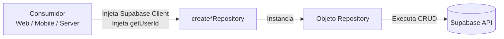
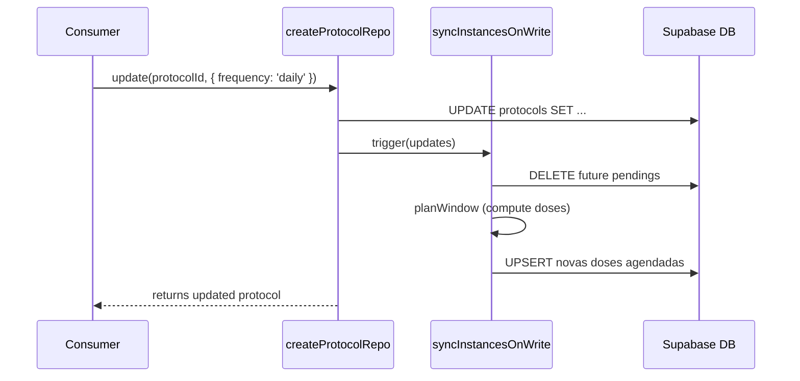

# Core Repositories do Dosiq

## Visão Geral e Filosofia

O pacote `@dosiq/core` abriga a camada de persistência da aplicação através de funções factory puras, isolando as regras de banco de dados das camadas de interface e serviços. 

O design adota estritamente o **Factory Pattern** (`create*Repository`). Em vez de importar o cliente do Supabase globalmente ou instanciar lógicas em arquivos distribuídos, os repositories exigem que as dependências sejam passadas na sua construção. Isso mantém os pacotes do core completamente agnósticos do ambiente de execução (browser, React Native ou Vercel Edge).

Por que adotamos este modelo?
- **Injeção de Dependência:** O frontend web passa o cliente Supabase gerado via SSR; o app mobile injeta o cliente nativo; os CRONs server-side injetam o `service_role_client`. O core atende todos sem recompilação.
- **Escopo Isolado de Usuário:** Ao injetar a promessa `getUserId`, a fábrica garante que todas as operações limitem a visibilidade aos dados do usuário autenticado, reforçando o Row Level Security (RLS) diretamente no nível do cliente de banco.
- **Testabilidade:** Mocar respostas de banco vira um exercício trivial de substituir a injeção do cliente.



## Factory Pattern — `create*Repository`

Toda fábrica de repositório recebe um objeto de configuração tipado, no mínimo com o cliente do Supabase e, na maioria das vezes, a função `getUserId`. A fábrica retorna um objeto literal contendo métodos tipados que englobam e envelopam as requisições, abstraindo operações como validação Zod inicial.

O código a seguir, extraído do `createMedicineRepository`, demonstra a estrutura canônica desta fábrica.

```typescript
// packages/core/src/repositories/createMedicineRepository.ts

import type { SupabaseClient } from '@supabase/supabase-js'
import type { Database } from '@dosiq/shared-data'

interface CreateMedicineRepositoryDeps {
  client: SupabaseClient<Database>
  getUserId: () => Promise<string>
  listSelect?: string
  detailSelect?: string
  listTransform?: (rows: unknown) => unknown
  detailTransform?: (row: unknown) => unknown
}

export function createMedicineRepository({
  client,
  getUserId,
  listSelect = '*',
  detailSelect = '*',
  listTransform = identity,
  detailTransform = identity,
}: CreateMedicineRepositoryDeps) {
  if (!client) throw new Error('createMedicineRepository: client é obrigatório')
  if (typeof getUserId !== 'function') {
    throw new Error('createMedicineRepository: getUserId deve ser função async')
  }

  return {
    async getById(id: string) {
      const userId = await getUserId()
      const { data, error } = await client
        .from('medicines')
        .select(detailSelect)
        .eq('id', id)
        .eq('user_id', userId)
        .single()

      if (error) throw error
      return detailTransform(data)
    }
    // ... (restante do arquivo)
  }
}
```

A fábrica captura as variáveis do construtor na sua closure. Quando o método `getById` é chamado, a função `getUserId()` é executada de forma tardia (lazy), recuperando a sessão atual do ambiente em que o repository está operando.

---

## Catálogo de Repositories

O core expõe 9 repositories principais. Abaixo, documentamos as responsabilidades, assinaturas de método e particularidades reais de cada um.

### `createDoseInstanceRepository`

Repositório que opera a máquina de estados (pending, taken, missed, skipped) do calendário de tomadas diárias (`dose_instances`).
Este é o único repositório que não exige `getUserId` na fábrica, pois o serviço gerenciador roda frequentemente como processo assíncrono varrendo tabelas de múltiplos usuários via `service_role`. Em consultas limitadas a um indivíduo, a segurança ocorre via passagem explícita do ID (como no método `getWindow`).

| Método | Argumentos de Entrada | Retorno (Saída) | Descrição |
|--------|-----------------------|-----------------|-----------|
| `upsertMany` | `Array<Record>` | `Array` inserido | Insere linhas ignorando duplicações em `(protocol_id, scheduled_for)`. |
| `wipeFuturePending` | `protocolId: string` | `void` | Remove APENAS instâncias pendentes do futuro. |
| `getWindow` | `userId`, `fromTs`, `toTs` | `Array` instâncias | Busca e pagina ocorrências de um usuário numa janela de tempo. |
| `countByStatus` | `userId`, `protocolId?`, datas | `Record` por status | Conta ocorrências exatas na janela filtrada, sem tráfego de dados cruzados. |
| `markMissedDueInstances` | `now?`, `pageSize?` | `number` alteradas | Converte instâncias pendentes vencidas para o status `missed`. |
| `markTaken` | `instanceId`, `logId` | `boolean` sucesso | Liga uma ocorrência pendente/atrasada ao log de medicamento efetivo. |

Exemplo da lógica em Javascript rodando varredura paginada que evita pulos de linha em ambientes concorrentes:

```typescript
// packages/core/src/repositories/createDoseInstanceRepository.ts

    async markMissedDueInstances({
      now = getServerTimestamp(),
      pageSize = 1000,
    }: { now?: Date | string; pageSize?: number } = {}) {
      const nowObj = parseISO(now)
      const nowIso = nowObj.toISOString()
      
      // Paginação por cursor (keyset em `id`) para evitar pular registros se 
      // mutações concorrentes ocorrerem em outras instâncias.
      const dueIds = []
      let lastId = null
      for (;;) {
        let query = client
          .from('dose_instances')
          .select('id, scheduled_for, tolerance_minutes')
          .eq('status', 'pending')
          .lt('scheduled_for', nowIso)
          .order('id', { ascending: true })
          .limit(pageSize)

        if (lastId) query = query.gt('id', lastId)
        // ... (restante do arquivo)
```

### `createStockRepository`

Gerencia leituras da sub-malha do estoque e coordena os acertos lógicos através de invocações RPC. O saldo de estoque no banco provém das entradas (achados ou compras) reduzidas pelo consumo FIFO (First-In, First-Out).

| Método | Argumentos de Entrada | Retorno (Saída) | Descrição |
|--------|-----------------------|-----------------|-----------|
| `getMedicinesWithStockOrActiveProtocol` | `void` | `Array` (medicamentos) | Traz medicamentos com tratamentos ativos ou saldo global remanescente (positivo). |
| `getStockSummaryMap` | `void` | `Record<string, number>` | Agrupa saldo disponível atual de todos os medicamentos mapeados. |
| `decreaseStock` | `medicineId`, `quantity`, `logId` | Dados RPC | Valida no Zod e chama `consume_stock_fifo` no Supabase via RPC. |
| `increaseStock` | `medicineId`, `quantity`, `options` | Dados RPC | Valida acréscimo e direciona a `apply_manual_stock_adjustment` ou log recovery. |
| `adjustToBalance` | `medicineId`, `newBalance`, `reason` | Objeto `delta` | Transpõe um ajuste manual ao saldo alvo desejado, acionando up/down no banco. |

```typescript
// packages/core/src/repositories/createStockRepository.ts

    async adjustToBalance(medicineId: string, newBalance: number, reason: string, notes?: string | null) {
      if (!reason) throw new Error('Motivo é obrigatório para ajuste manual')
      if (newBalance < 0) throw new Error('Saldo final não pode ser negativo')

      const current = await repo.getTotalQuantity(medicineId)
      // Evita o vazamento de dízimas na persistência
      const delta = cleanFloat(newBalance - (current ?? 0))

      if (delta === 0) return { delta: 0, before: current ?? 0, after: newBalance }

      if (delta > 0) {
        await repo.increaseStock(medicineId, delta, { reason, notes })
      } else {
        const { error } = await client.rpc('apply_manual_stock_adjustment', {
          p_medicine_id: medicineId,
          p_quantity_delta: delta,
          p_reason: reason,
          p_notes: notes ?? null,
        } as never)
        if (error) throw error
      }
      return { delta, before: current, after: newBalance }
    },
```

### `createProtocolRepository`

O principal gestor dos tratamentos do usuário. Controla a criação (start), pausa (pause) e alteração das posologias.

| Método | Argumentos de Entrada | Retorno (Saída) | Descrição |
|--------|-----------------------|-----------------|-----------|
| `getActive` | `date: string` | `Array` protocolos | Seleciona os regimes posológicos válidos e ativos em uma data específica. |
| `create` | `protocol: Record` | Protocolo final | Valida no Zod, persiste a configuração de tratamento e atualiza instâncias na máquina de estados de agendamento. |
| `update` | `id`, `updates` | Protocolo final | Modifica a posologia local, rebatendo também no futuro de tomadas projetado. |

A tabela de seleção padrão deste repository é extensa de propósito. Modificações de estrutura no Supabase devem observar os relacionamentos `medicine` e `treatment_plan`.

### `createProfileRepository`

Mantém as escolhas globais de perfil, onboarding e preferências de privacidade/dados do utilizador. As informações habitam a tabela `user_settings`.

| Método | Argumentos de Entrada | Retorno (Saída) | Descrição |
|--------|-----------------------|-----------------|-----------|
| `getProfile` | `void` | Objeto Perfil | Carrega os dados pessoais (nome, timezone) provendo defaults quando ausentes. |
| `updateProfile` | `input: Record` | Objeto Perfil | Executa Upsert (Create or Update) validado dos atributos editáveis. |
| `getStockTracking` | `void` | Preferência estoque | Checa as variáveis `stock_tracking_enabled` e seu timestamp de pausa. |
| `setStockTracking` | `enabled: boolean`, `options` | Preferência nova | Ativa/congela os consumos de estoque por-conta, definindo marcos temporais. |
| `deleteAccount` | `void` | Resposta RPC | Aciona `delete_user_account` verificando barreiras de exclusão (tratamentos ativos). |

```typescript
// packages/core/src/repositories/createProfileRepository.ts

    async setStockTracking(
      enabled: boolean,
      options: { freeze?: boolean } = {},
    ): Promise<StockTrackingPreference> {
      if (typeof enabled !== 'boolean') {
        throw new Error('setStockTracking: enabled deve ser boolean')
      }
      const freeze = options.freeze ?? true
      const userId = await getUserId()

      const { data, error } = await client
        .from('user_settings')
        .upsert(
          {
            user_id: userId,
            stock_tracking_enabled: enabled,
            stock_paused_at: enabled || !freeze ? null : getServerTimestamp(),
            updated_at: getServerTimestamp(),
          },
          { onConflict: 'user_id' },
        )
        .select(STOCK_TRACKING_COLUMNS)
        .single()
      
      if (error) throw error
      return {
        stock_tracking_enabled: data.stock_tracking_enabled ?? true,
        stock_paused_at: data.stock_paused_at ?? null,
      }
    }
```

### `createPurchaseRepository`

Regula registros de compras, associando preços unitários a medicamentos de forma complementar às views limitadas da base `stock`.

| Método | Argumentos de Entrada | Retorno (Saída) | Descrição |
|--------|-----------------------|-----------------|-----------|
| `getPurchasesByMedicine` | `medicineId: string` | `Array` compras | Retorna o histórico de aquisições embarcando saldo restante realístico do lote. |
| `createLiquidPurchase` | Configs e valores líquidos | `Array` lotes gerados | Desmembra uma garrafa/frasco líquido em compras separadas controlando decimais de valor. |
| `updatePurchase` | `id`, `input` | Compra | Modifica apenas as notas (nome, validade). Bloqueia deliberadamente mudança do número da aquisição de estoque. |

### `createBiomarkerRepository`

Centraliza toda coleta de dados de saúde passiva do titular (como aferição diária de pressão, peso corporal ou glicemia).

| Método | Argumentos de Entrada | Retorno (Saída) | Descrição |
|--------|-----------------------|-----------------|-----------|
| `list` | Opções filtro: data/tipo | `Array` biomarcadores | Agrega ocorrências métricas da timeline do usuário. |
| `getLatest` | `type?: string` | Marcador unitário | Busca com `limit(1)` o preenchimento mais moderno, provendo contexto a painéis da UI. |
| `create` | `biomarker: Record` | Marcador inserido | Injeta inferências como data e unidades base (`BIOMARKER_TYPE_UNITS`) persistindo novos sinais vitais. |

```typescript
// packages/core/src/repositories/createBiomarkerRepository.ts

    async getLatest(type?: string) {
      const userId = await getUserId()
      let q = client
        .from('biomarkers_log')
        .select(SELECT_COLS)
        .eq('user_id', userId)
        .order('measured_at', { ascending: false })
        .limit(1)

      if (type) q = q.eq('type', type)

      const { data, error } = await q
      if (error) throw error
      return data?.[0] || null
    },
```

### `createMedicineRepository`

Controla a lista local de medicamentos customizados (inventário visual) cadastrados no aparelho. Simples em CRUD, é operado pelo formulário visual do produto.

| Método | Argumentos de Entrada | Retorno (Saída) | Descrição |
|--------|-----------------------|-----------------|-----------|
| `getAll` | `void` | Lista Medicamentos | Recupera registros crus listados alfabeticamente. |
| `create` | `medicine: Record` | Medicamento instanciado | Persiste um comprimido/líquido novo amarrando ao `user_id`. |
| `update` | `id`, `updates` | Medicamento editado | Modifica propriedades da droga (concentração, unidade, tipo visual). |

### `createTreatmentPlanRepository`

Realiza os mapeamentos guarda-chuva ("Planos") aos quais as prescrições isoladas (medicamentos e protocolos) estão atrelados.

| Método | Argumentos de Entrada | Retorno (Saída) | Descrição |
|--------|-----------------------|-----------------|-----------|
| `getAll` | `void` | `Array` planos | Exibe grupos (ex. Cardíaco, Diabético) e puxa protocolos agregados dentro da sua relação de árvore. |
| `create` | `plan: Record` | Plano novo | Cria os guarda-chuvas visuais vazios sem hierarquia complexa. |
| `delete` | `id: string` | `void` | Deleta um painel agrupador. Os subjacentes são desatrelados, sem deleção em cascata dura dos remédios. |

### `createFeedbackRepository`

Repositório leve dedicado estritamente a salvar reports dos usuários direcionados ao canal do desenvolvedor.

| Método | Argumentos de Entrada | Retorno (Saída) | Descrição |
|--------|-----------------------|-----------------|-----------|
| `submitFeedback` | `feedback: Record` | Dados finais | Transita comentários, bugs ou relatos submetidos do client para a fila restrita de `feedbacks`. |

---

## syncInstancesOnWrite — O Padrão de Sincronização

A manutenção do agendamento diário (`dose_instances`) é reativa. 
A arquitetura proíbe que o frontend crie as instâncias isoladas na tabela — a inserção é controlada exclusivamente pelo servidor através do helper de sincronização local, `syncInstancesOnWrite`.

Sempre que um usuário cria, edita, pausa, ou altera a hora num tratamento (em `createProtocolRepository`), a chamada original dispara `syncInstancesOnWrite` passando o novo estado. 
A função é do tipo "best-effort" e, silenciosamente, apaga as instâncias geradas incorretas da próxima janela temporal e reestrutura os dias futuros (invocando o module logic `planWindow`). 

Isso impede dessincronia do client sem interromper uma inserção no servidor na falha local ocasional.



```typescript
// packages/core/src/repositories/createProtocolRepository.ts

async function syncInstancesOnWrite({
  client,
  protocol,
  updates,
}: {
  client: SupabaseClient<Database>
  protocol: { id: string; user_id: string; end_date?: string | null; [key: string]: unknown }
  updates: Record<string, unknown> | null
}) {
  try {
    if (!protocol?.id) return
    const repo = createDoseInstanceRepository({ client })

    // Se a mutação envolveu desativar o registro, pausa os pendentes futuros em vez de apagá-los
    if (updates && updates.active === false) {
      await repo.setPausedAt(protocol.id, getServerTimestamp())
      await repo.markAllFutureSkippedPaused(protocol.id)
      return
    }

    const isResume = updates && updates.active === true
    if (isResume) {
      await repo.setPausedAt(protocol.id, null)
      await repo.reactivateFuturePaused(protocol.id)
    }

    // Quaisquer mudanças críticas ativam regeneração estrutural da janela pendente
    const schedulingChanged = updates && SCHEDULING_FIELDS.some((f) => f in updates)
    if (schedulingChanged) await repo.wipeFuturePending(protocol.id)

    const shouldRegen = !updates || isResume || schedulingChanged
    if (shouldRegen) {
      const tz = await resolveUserTz(client, protocol.user_id)
      await planWindow({ /* invoca regeração matemática da janela... */ })
    }
  } catch {
    // Sincronização falha graciosamente em rede lazy (corrige-se via CRON)
  }
}
```

---

## Consumidores dos Repositories

O core desenha as fábricas para serem integradas a múltiplos executores distintos (os "Consumidores"). Abaixo estão os mapas de chamada encontrados nos pacotes:

| Consumidor | Ponto de Injeção de Dependência | Particularidades |
|------------|---------------------------------|------------------|
| **Web App (React/Vite)** | `const repo = create*Repository({ client: supabase, getUserId })` | O `supabase` vem do client inicializado em hooks unificados do `@shared/utils`. |
| **Mobile App (Expo)** | `const repo = create*Repository({ client: typedClient, getUserId })` | Consome instâncias nativas empacotando tokens nas chaves do dispositivo, e chama services via wrap explícito. |
| **Node.js (Server / CLI)** | `const repo = create*Repository({ client: supabaseServiceRole })` | Utiliza as bypass keys do administrador (Service Role). Como não há sessão para referenciar `getUserId`, contorna passagens usando loops em IDs gerados explícitos. |

---

## Anti-Patterns

- ❌ **Importar supabase diretamente no repositório**: Arquivos de pacote do `@dosiq/core/repositories` são puramente lógicos e agnósticos. É proibido instanciar o provedor localmente.
- ✅ **Receber Supabase como dependência**: Todos recebem `{ client }` no objeto construtor das functions factories.

- ❌ **Realizar query `select('*')` desnecessariamente densas em leituras globais**: Como em `createProfileRepository`, listar os campos completos fere o princípio de carregamento progressivo e derruba os tipos TS se interpretados cruamente.
- ✅ **Manter o escopo em lista de colunas específica para leituras recorrentes**.

- ❌ **Usar o construtor nativo Date() nos corpos do serviço e factory**:
- ✅ **Usar sempre os helpers `getServerTimestamp()` e `parseISO()` originários da pasta `@utils/dateUtils`**: Isso bloqueia mutações indevidas no banco baseadas no timezone flutuante do Vercel Edge Runtime.
