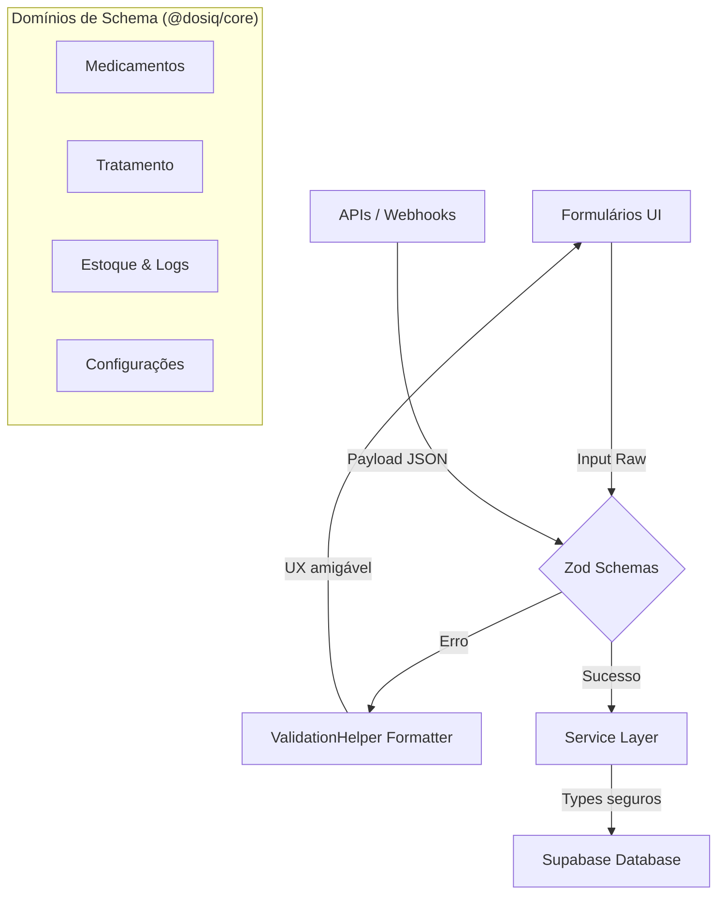

# Core Schemas e Validação

## Visão Geral

Os schemas do Dosiq formam a espinha dorsal de integridade de dados da aplicação. Eles definem as regras de validação em runtime para todas as entidades de negócio da área da saúde, utilizando a biblioteca Zod. Estes schemas residem no pacote `@dosiq/core` e garantem que dados malformados sejam bloqueados antes de atingirem o banco de dados.

A validação em runtime é estritamente necessária pois o TypeScript apenas garante tipos em tempo de compilação. Os dados que entram no sistema — seja via formulários no frontend, requisições de API de integrações (HealthSync) ou chamadas diretas ao cliente do Supabase — podem quebrar os contratos esperados. O Zod força a verificação estrutural e semântica real destes dados.

Além da validação em si, os schemas atuam como a fonte de verdade para a tipagem estática no monorepo. Usamos `z.infer<typeof Schema>` para derivar tipos TypeScript precisos. Desta forma, mantemos sincronia absoluta entre a validação de runtime e a verificação estática, evitando a duplicação de regras de negócio.



## zodSetup — Locale e Error Map

O arquivo `zodSetup.ts` configura o comportamento global de erros do Zod na aplicação. Ele existe para traduzir e simplificar mensagens de erro padrão do Zod, que costumam conter jargão técnico (ex: "Expected string, received null"), em textos amigáveis em português brasileiro (PT-BR). Isso melhora a experiência direta do usuário sem exigir lógica repetitiva nos componentes.

O comportamento utiliza o `customErrorMap` do Zod para interceptar códigos de erro específicos e reescrevê-los. Caso a regra de negócio caia fora dos casos customizados abordados pela interceptação, a configuração faz o fallback seguro para o locale em português padrão fornecido pela versão 4 do Zod. 

A importação deste arquivo ocorre no entry point da aplicação, garantindo que o Zod receba este mapa antes de qualquer validação. O uso explícito da extensão `.js` no import do locale evita erros `ERR_MODULE_NOT_FOUND` no ambiente serverless estrito do Node ESM na Vercel.

```typescript
// packages/core/src/zodSetup.ts
import { z } from 'zod'
// Extensão .js explícita exigida pelo Node ESM estrito (runtime Vercel)
import pt from 'zod/v4/locales/pt.js'

function friendlyMessage(issue: z.core.$ZodRawIssue) {
  switch (issue.code) {
    case 'invalid_type': {
      if (
        issue.input === undefined ||
        issue.input === null ||
        issue.input === ''
      ) {
        return 'Este campo é obrigatório'
      }
      if (issue.expected === 'number') {
        return 'Use apenas números'
      }
      return 'Valor inválido'
    }
    case 'too_small': {
      if (issue.origin === 'string') {
        return issue.minimum === 1
          ? 'Este campo é obrigatório'
          : `Use pelo menos ${issue.minimum} caracteres`
      }
      // ... (restante do arquivo)
```

| Código Zod | Situação | Mensagem Customizada |
| --- | --- | --- |
| `invalid_type` | Campo vazio ou null | "Este campo é obrigatório" |
| `invalid_type` | Número esperado | "Use apenas números" |
| `too_small` | String menor que 1 | "Este campo é obrigatório" |
| `invalid_format` | E-mail malformado | "E-mail inválido" |

## validationHelper — Utilitários de Validação

O `validationHelper.ts` fornece uma interface unificada para validação através da função `validateEntity`. O objetivo principal é padronizar como a camada de serviço invoca validações, empacotando os resultados do Zod (`safeParse`) num objeto Result (`{ success, data, errors, error }`).

Este encapsulamento impede a propagação de exceções (`parse()` puro) em fluxos que deveriam tratar falhas como regras de negócio rotineiras. O utilitário também hospeda validadores granulares como `isValidUUID` e conversores de erro (`mapErrorsToForm`), que transformam o formato de issues do Zod em um dicionário simples de chaves e valores focado na interface de formulários.

A classe customizada `ValidationError` acompanha o retorno quando ocorre falha, permitindo que a camada de resposta da API discrimine erros de validação clínica contra erros genéricos de infraestrutura (como falha no banco).

```typescript
// packages/core/src/schemas/validationHelper.ts
export function validateEntity(entityType: string, data: unknown, operation = 'create') {
  const validator = validationMap[entityType as EntityType]

  if (!validator) {
    return {
      success: false,
      error: new ValidationError(
        `Tipo de entidade desconhecido: ${entityType}`,
        [{ field: 'entity', message: `Tipo "${entityType}" não é suportado` }],
        entityType
      ),
    }
  }

  const validateFn = (validator as unknown as Record<string, ValidateFn | undefined>)[operation]

  if (!validateFn) {
    return {
      success: false,
      error: new ValidationError(
        `Operação "${operation}" não suportada para ${entityType}`,
        [{ field: 'operation', message: `Operação "${operation}" não disponível` }],
        entityType
      ),
    }
  }

  const result = validateFn(data)
  // ... (restante do arquivo)
```

| Helper | Input | Output | Uso Típico |
| --- | --- | --- | --- |
| `validateEntity` | Tipo de entidade, objeto | `{ success, data, errors }` | Recebimento de payloads no Backend API |
| `mapErrorsToForm` | Issues do Zod | `Record<string, string>` | Mostrar erros de validação em Inputs do React |
| `isValidUUID` | String | `boolean` | Verificação rápida de parâmetros na rota |
| `isValidISODate` | String | `boolean` | Verificação de query strings de datas |

## Schemas de Domínio Principal

Os schemas principais regem as regras fundamentais do aplicativo de saúde e recebem o maior nível de refinamento. Eles validam interações da tríade central da arquitetura: medicamento, protocolo (tratamento) e o log da dose tomada.

Para contornar o problema de valores vazios originados de formulários web, os campos numéricos e opcionais utilizam `z.preprocess`. Um campo vazio (`''`) é convertido em `null`, prevenindo que a coerção automática (`z.coerce.number`) transforme o vazio em zero, o que ativaria regras falsas de validação como falhas de positividade (`.positive()`).

O tipo TypeScript de cada domínio é extraído ao final da declaração através do utilitário `z.infer`. Isto é exportado e adotado pela interface dos services que realizam chamadas para salvar no Supabase.

### Medicine Schema (`medicineSchema.ts`)

Define o escopo de apresentação e as regras estáticas de um medicamento da prescrição do paciente. Os atributos gerenciam detalhes de densidade líquida e vida útil para controle biológico de validade após aberto.

| Campo | Tipo / Regra | Mensagem Específica |
| --- | --- | --- |
| `name` | string (min 2, max 200) | "O nome pode ter no máximo 200 caracteres" |
| `dosage_per_pill` | number (positive, max 10000) | "A dose parece muito alta. Verifique o valor" |
| `dosage_unit` | enum (DOSAGE_UNITS) | Fallback global PT-BR |
| `shelf_life_days` | int (positive) | "Validade após aberto deve ser um número inteiro de dias" |

**Enums em PT-BR (R-021):** 
`PRESENTATIONS`: `['comprimido', 'capsula', 'liquido', 'injetavel', 'pomada', 'spray', 'outro']`
`MEDICINE_TYPES`: `['medicamento', 'suplemento']`

```typescript
// packages/core/src/schemas/medicineSchema.ts
const medicineObject = z.object({
  name: z
    .string()
    .min(2, 'O nome precisa de pelo menos 2 caracteres')
    .max(200, 'O nome pode ter no máximo 200 caracteres')
    .trim(),

  presentation: z.enum(PRESENTATIONS).default('comprimido'),

  type: z.enum(MEDICINE_TYPES).default('medicamento'),

  dosage_per_pill: z.preprocess(
    (val) => (val === '' ? null : val),
    z.coerce
      .number()
      .positive('A dose deve ser maior que zero')
      .max(10000, 'A dose parece muito alta. Verifique o valor')
      .nullable()
      .optional()
  ),
  // ... (restante do arquivo)
})
```

### Protocol Schema (`protocolSchema.ts`)

Controla o plano terapêutico e a frequência de repetição dos alarmes. Envolve regras cruzadas no `superRefine` para amarrar atributos, exigindo unidades específicas (gotas/UI) apenas se o medicamento relacionado foi declarado como líquido na interface.

| Campo | Tipo / Regra | Mensagem Específica |
| --- | --- | --- |
| `frequency` | enum (FREQUENCIES) | "Frequência inválida. Opções: diário..." |
| `time_schedule` | array de HH:MM (regex) | "Horário deve estar no formato HH:MM" |
| `titration_status` | enum (estável/titulando...) | "Status de titulação inválido" |
| `end_date` | YYYY-MM-DD (regex) | Fallback PT-BR |

**Enums em PT-BR (R-021):** 
`FREQUENCIES`: `['diário', 'dias_alternados', 'semanal', 'personalizado', 'quando_necessário']`

```typescript
// packages/core/src/schemas/protocolSchema.ts
export const protocolCreateSchema = protocolSchema
  .refine(
    (data) => {
      if (data._medicineIsLiquid === true) {
        return !!data.intake_unit
      }
      return true
    },
    {
      message: 'Defina a unidade de tomada (gotas, ml, UI ou mg) para medicamentos líquidos.',
      path: ['intake_unit'],
    }
  )
  .refine(
    (data) => {
      if (data.end_date && data.start_date) {
        return parseLocalDate(data.end_date) >= parseLocalDate(data.start_date)
      }
      return true
    },
    {
      message: 'Data de término deve ser maior ou igual à data de início',
      path: ['end_date'],
    }
  )
```

### Stock Schema (`stockSchema.ts`)

Gerencia as regras para entradas de caixa (lotes comprados) e validações dimensionais do tempo, não permitindo compra no futuro e exigindo coerência lógica entre a data de validade da embalagem contra a data original da aquisição.

| Campo | Tipo / Regra | Mensagem Específica |
| --- | --- | --- |
| `quantity` | number (positive, max 10000) | "Quantidade parece estar muito alta." |
| `purchase_date` | YYYY-MM-DD (regex) | "Data de compra não pode ser no futuro" |
| `injection_container` | enum de containers físicos | Fallback PT-BR |

```typescript
// packages/core/src/schemas/stockSchema.ts
export const stockCreateSchema = stockSchema
  .refine(
    (data) => {
      if (!data.expiration_date) return true
      const purchase = parseLocalDate(data.purchase_date)
      const expiration = parseLocalDate(data.expiration_date)
      return expiration > purchase
    },
    {
      message: 'Data de validade deve ser posterior à data de compra',
      path: ['expiration_date'],
    }
  )
```

### Log Schema (`logSchema.ts`)

Guarda o registro individual das doses realizadas (instâncias tomadas do protocolo ou administrações independentes/sob demanda). Este modelo foca na integridade do `taken_at` limitando a medida para evitar inputs que apontem ao futuro da timezone local.

| Campo | Tipo / Regra | Mensagem Específica |
| --- | --- | --- |
| `taken_at` | datetime (ISO 8601) | "Data/hora não pode estar no futuro" |
| `quantity_taken` | number (max 1000) | "Quantidade máxima por registro é 1000" |

### User Profile Schema (`userProfileSchema.ts`)

Valida detalhes flexíveis do usuário final. Usa a técnica de z.union permitindo que `birth_date` receba strings vazias e materialize dados opcionais de forma segura, evitando erros precoces de validação no fluxo de onboarding.

| Campo | Tipo / Regra | Mensagem Específica |
| --- | --- | --- |
| `display_name` | string (min 2, max 200) | "Nome não pode ter mais de 200 caracteres" |
| `state` | enum (BRAZILIAN_STATES) | Fallback PT-BR |

### User Settings Schema (`userSettingsSchema.ts`)

Modela as opções globais de sistema para a conta, abrangendo principalmente preferências de notificações silenciadas (quiet hours) e configurações temporais de timezone IANA, essenciais para cálculo exato de alarmes cruzando o país.

| Campo | Tipo / Regra | Mensagem Específica |
| --- | --- | --- |
| `timezone` | enum (TIMEZONES_BR) | - |
| `notification_mode` | enum (realtime, digest_morning) | - |

## Schemas de Features Secundárias

O catálogo abaixo mapeia entidades suplementares do sistema que possuem escopo menor, mas mantêm o mesmo rigor de validação centralizado na biblioteca Zod.

| Schema | Arquivo | Propósito | Campos-Chave | Linhas |
| --- | --- | --- | --- | --- |
| `biomarkerLogSchema` | biomarkerLogSchema.ts | Registrar medidas fisiológicas. | `type`, `value`, `measured_at`, `context` | 188 |
| `emergencyCardSchema` | emergencyCardSchema.ts | Ficha offline de saúde crítica. | `emergency_contacts`, `allergies`, `blood_type` | 213 |
| `geminiReviewSchema` | geminiReviewSchema.ts | Reviews de código geradas por IA. | `commit_sha`, `file_path`, `status`, `category` | 430 |
| `costAnalysisSchema` | costAnalysisSchema.ts | Estrutura de dados para motor financeiro. | `unit_price`, `quantity`, `medicines` | 99 |
| `nudgeSchema` | nudgeSchema.ts | Banners informativos e prompts. | `title`, `body`, `action_type`, `target_view` | 162 |
| `adherencePatternSchema`| adherencePatternSchema.ts| Dados para cálculo de aderência. | `logs`, `protocols`, `grid` | 110 |
| `notificationSchema` | notificationSchema.ts | Base de alertas e disparos em tempo real. | `notification_type`, `status`, `body` | 72 |
| `notificationLogSchema` | notificationLogSchema.ts | Registro persistido dos alertas disparados. | `status`, `channels`, `telegram_message_id`| 35 |
| `feedbackSchema` | feedbackSchema.ts | Entradas de avaliação e bugs pelo usuário. | `subject`, `comment`, `rating` | 79 |
| `authSchema` | authSchema.ts | Validações básicas de credenciais. | `newPassword` | 43 |
| `criticalAuditEventSchema`| criticalAuditEventSchema.ts| Trilhas de auditoria para ações sensíveis. | `event`, `platform`, `actor`, `detail` | 54 |
| `reminderOptimizerSchema` | reminderOptimizerSchema.ts| Inputs para IA de reajuste de horários. | `suggestedTime`, `avgDeltaMinutes` | 38 |

### Detalhe: biomarkerLogSchema

Este schema utiliza um modelo genérico (shape único) que consegue abarcar glicemia, peso, pressão arterial e batimentos, prevendo evolução futura sem impacto ou migração na estrutura de banco de dados.

Possui lógicas avançadas de validação cruzada (`superRefine`), exigindo que o componente diastólico (`value_secondary`) exista somente e invariavelmente quando a aferição selecionada pertencer ao tipo fisiológico de Pressão Arterial.

```typescript
// packages/core/src/schemas/biomarkerLogSchema.ts
const applyPaRefine = <S extends typeof biomarkerObject>(schema: S) =>
  schema.superRefine((data: z.infer<typeof biomarkerObject>, ctx: z.RefinementCtx) => {
    if (data.type === 'pressao_arterial') {
      if (data.value_secondary == null) {
        ctx.addIssue({
          code: z.ZodIssueCode.custom,
          path: ['value_secondary'],
          message: 'Pressão arterial exige diastólica (value_secondary)',
        })
      }
    }
    // ... (restante do arquivo)
  })
```

### Detalhe: emergencyCardSchema

Armazena os perfis salva-vidas cruciais focados para intersecções offline (lock screen) durante falhas e emergências. Limita o volume de contatos (máximo 5) e alergias cadastradas para impedir overflows nas interfaces pequenas. Aplica verificação nativa rigorosa usando Regex para enquadrar os contatos aos padrões de prefixo e números da telefonia brasileira.

```typescript
// packages/core/src/schemas/emergencyCardSchema.ts
export const emergencyContactSchema = z.object({
  name: z
    .string()
    .min(2, 'Nome deve ter pelo menos 2 caracteres')
    .max(200, 'Nome não pode ter mais de 200 caracteres')
    .trim(),
  phone: z
    .string()
    .regex(
      /^(\+55\s?)?(\(?[1-9]{2}\)?\s?)?(9[0-9]{4}|[2-8][0-9]{3})[-\s]?[0-9]{4}$/,
      'Formato de telefone inválido. Use: (XX) XXXXX-XXXX ou +55 XX XXXXX-XXXX'
    ),
  // ... (restante do arquivo)
})
```

### Detalhe: geminiReviewSchema

Este documento apoia o subsistema autônomo Workflow Intelligence do repositório Dosiq, organizando as descobertas analíticas (reviews), falhas e comentários da inteligência artificial. Carrega atributos imensos para associar pull requests e commits, além do registro interno do status da issue na integração do Github.

```typescript
// packages/core/src/schemas/geminiReviewSchema.ts
export const geminiReviewSchema = z.object({
  pr_number: z.number().int().positive('Número do PR deve ser positivo'),
  commit_sha: z.string().min(1, 'Commit SHA é obrigatório'),
  file_path: z.string().min(1, 'Caminho do arquivo é obrigatório'),
  status: z
    .enum(REVIEW_STATUSES, { error: 'Status inválido' })
    .default('pendente'),
  category: z
    .enum(REVIEW_CATEGORIES, { error: 'Categoria inválida' })
    .nullable()
    .optional(),
  // ... (restante do arquivo)
})
```

## Padrões e Convenções

A definição dos schemas exige o seguimento irrestrito das convenções internas para assegurar manutenção segura.

1. **Enums sempre em português (R-021):** Para garantir o alinhamento com a regra R-021, todos os enums validados pelas entidades do core utilizam português nativo em vez do equivalente no idioma inglês (ex: `['diario', 'semanal']`). Essa ação diminui o custo computacional de conversores e facilita a leitura das queries via Supabase Dashboard.
2. **Padrão de Composição e Partials:** O objeto base do schema é construído num artefato isolado. O `createSchema` estende essa base com `superRefine` e regras de encerramento, enquanto o `updateSchema` invoca `.partial()` para relaxar a obrigatoriedade dos campos durante a injeção parcial de dados via API. É obrigatória a remoção/sobreposição de `.default()` em campos do modelo durante a criação do updateSchema para impedir que omissões acidentais disparem inserções default corrompendo cadastros no Supabase.
3. **Bloqueio do uso do `parse()`:** Serviços de backend da aplicação não devem utilizar a função `parse()` para lançar erros fatais no interpretador. É obrigatório o emprego do método `.safeParse()`, capturando falhas esperadas pelas validações para orquestrar os pacotes REST padronizados (ou objetos `{ success: false }`) corretamente na API.

| Anti-Pattern ❌ | Padrão Recomendado ✅ | Motivação |
| --- | --- | --- |
| `schema.parse(data)` | `schema.safeParse(data)` | Previne o rompimento repentino da request HTTP na Vercel |
| `type Medicamento = any` | `type Medicamento = z.infer<typeof schema>` | Aplica e acopla a tipagem gerada diretamente do Zod |
| `['daily', 'weekly']` | `['diário', 'semanal']` | Alinhamento obrigatório R-021 (UI e base em PT-BR) |

## Como Adicionar um Novo Schema

Quando você precisar introduzir uma nova entidade de negócio ou configuração global da área funcional, siga os critérios estabelecidos neste passo a passo de governança:

1. **Criação do Arquivo Base:** Adicione seu arquivo em `packages/core/src/schemas/`. Crie a regra central do novo domínio e adicione utilitários internos que operam sobre os atributos.
2. **Definição de Modos de Acesso:** Configure as derivações de operação. Todo arquivo deve prover versões separadas: a versão completa contendo os constraints do ID, a versão de registro inicial (`createSchema`) e uma ramificação opcional (`updateSchema`).
3. **Exportação Centralizada:** O schema gerado e as constantes (Enums de rótulo e arrays de regras) devem ser inseridos com nomenclatura exportada de forma explícita pelo agregador `packages/core/src/schemas/index.ts`. 
4. **Extração de Tipo:** Exporte a tipagem associada baseada no núcleo base através do uso estrito de `export type NomeDaEntidade = z.infer<typeof schemaBase>` garantindo que repositórios TypeScript obtenham segurança estrutural na compilação.
5. **Teste Obrigado:** Crie ou alinhe testes unitários na cobertura da camada em `apps/web/src/schemas/__tests__/` focando as entradas maliciosas ou subversivas, atestando que os refines implementados interceptam adequadamente o preenchimento ilógico.
