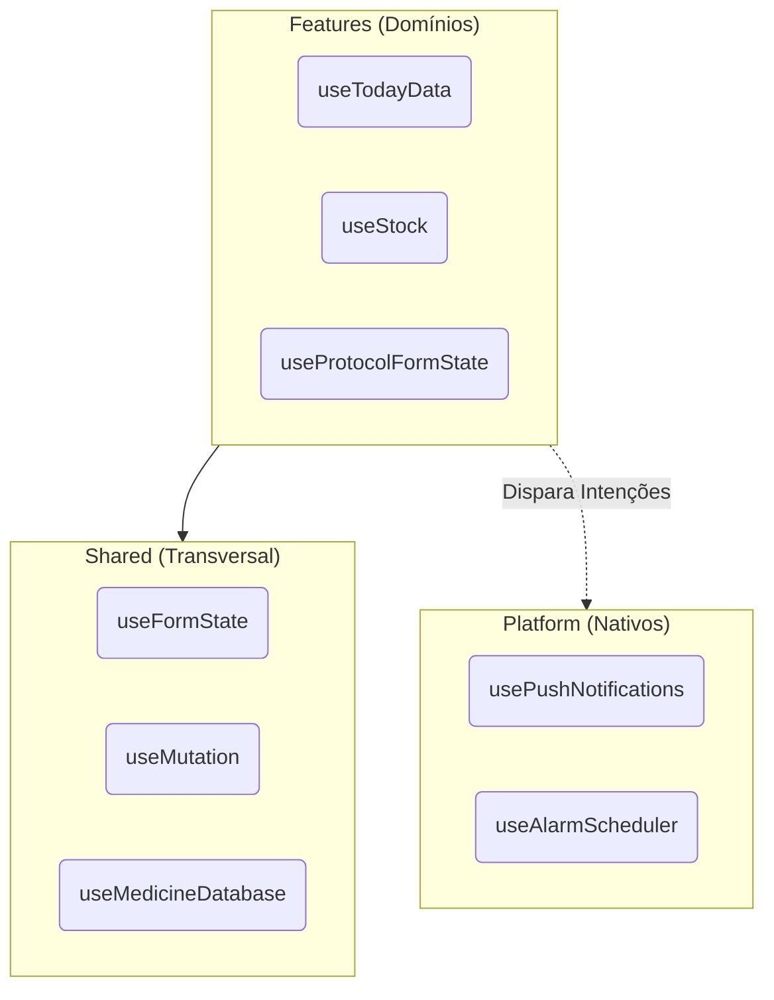
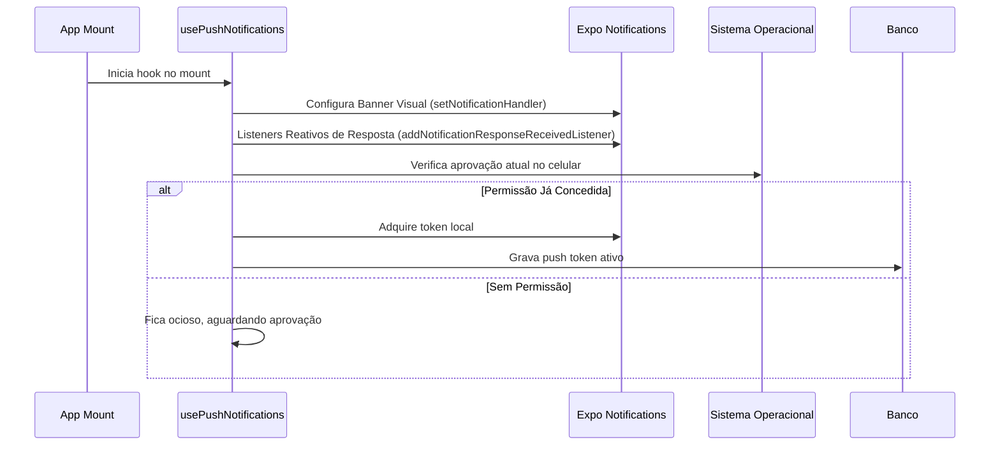

# 🪝 Referência de Hooks do Mobile

## Introdução

Este catálogo centraliza a documentação de todos os custom hooks do aplicativo React Native do Dosiq. A arquitetura do Dosiq divide os hooks em três camadas estritas de responsabilidade: hooks compartilhados (lógica transversal e de UI genérica), hooks de plataforma (integrações com o sistema operacional via código nativo) e hooks de features (lógica de negócio isolada por domínio).

O objetivo desta divisão é isolar a complexidade do estado global e do banco de dados, entregando APIs declarativas limpas para os componentes visuais. O código mobile deve lidar de forma suave com perda de conectividade e trocas de plano de fundo.

Por que essa separação importa? Hooks de feature não devem falar diretamente com APIs nativas de notificação. Da mesma forma, hooks compartilhados não conhecem regras de negócio específicas, como cálculos analíticos de estoque ou métricas de adesão.



**Convenções de nomenclatura:**
- Todo hook começa com o prefixo `use`.
- Hooks que buscam dados (leitura) retornam um objeto no formato `{ data, loading, error, stale, refresh }`.
- Hooks que alteram dados usam o sufixo `Mutation` (exemplo: `useMedicineMutation`) e retornam funções imperativas de execução.

---

## Hooks Compartilhados (`shared/hooks/`)

Os hooks em `shared` resolvem problemas estruturais de persistência, validação de interface e conectividade. Eles não importam código de domínios específicos para evitar dependências circulares na árvore de diretórios.

### `useFormState`

Gerencia o estado interno de formulários integrando diretamente a validação dinâmica de schemas Zod. O hook devolve uma API estável projetada para atuar em conjunto com os componentes visuais do app (como `FormInput` e `Select`).

O hook utiliza um `Symbol` interno chamado `NO_OVERRIDE` para garantir que o evento de perda de foco (`onBlur`) possa forçar uma coerção de tipo explícita antes de rodar o parse. Isso resolve um caso real em campos decimais PT-BR, que mantêm a string "0,437" na tela até o último milissegundo, mas precisam validar como um número real no momento exato do envio.

```typescript
// apps/mobile/src/shared/hooks/useFormState.tsx
export function useFormState(
  schema: ZodTypeAny, 
  { initialValues = EMPTY }: UseFormStateOptions = {}
) {
  // ...
  const handleBlur = useCallback(
    (field: string, valueOverride: unknown = NO_OVERRIDE) => {
      setTouched((prev) => (prev[field] ? prev : { ...prev, [field]: true }))
      const value = valueOverride === NO_OVERRIDE ? values[field] : valueOverride
      const msg = validateField(schema, field, value, { ...values, [field]: value })
      setErrors((prev) => {
        if (msg) return { ...prev, [field]: msg }
        if (!prev[field]) return prev
        const next = { ...prev }
        delete next[field]
        return next
      })
    },
    [schema, values],
  )
  // ...
}
```

**Exemplo prático em tela:**
```tsx
const form = useFormState(protocolCreateSchema, {
  initialValues: { name: '', active: true }
});

return (
  <FormInput 
    name="name" 
    value={form.values.name} 
    error={form.errors.name}
    onChange={form.handleChange} 
    onBlur={form.handleBlur} 
  />
);
```

| Retorno Principal | Descrição |
| --- | --- |
| `values` | Objeto contendo o estado atualizado do formulário inserido pelo usuário. |
| `errors` | Dicionário mapeando as chaves dos inputs com as respectivas mensagens de erro. |
| `validate` | Função imperativa que aciona a checagem cruzada total sobre todos os valores inseridos. |

### `useMedicineDatabase`

Faz o download, aplica cache local via `AsyncStorage` e expõe métodos de busca na base ANVISA para autocompletar formulários. 
Sua execução envolve duas etapas de hidratação contínua:
1. Ao montar na interface, exibe instantaneamente a lista do cache local.
2. Em background, ele analisa a diferença da versão remota em conjunto com o período de expiração (Time-To-Live de 7 dias) e baixa o novo repositório inteiro caso necessário, trocando o manifesto em memória.

Em caso de falha severa na rede, o fallback silencioso garante degradação graciosa. O formulário preserva as rotinas de cadastro, dispensando apenas a funcionalidade cosmética de autocompletar nomes farmacológicos.

```typescript
// apps/mobile/src/shared/hooks/useMedicineDatabase.ts
export function useMedicineDatabase({
  baseUrl = ANVISA_BASE_URL,
  ttlMs = TTL_MS,
}: UseMedicineDatabaseOptions = {}) {
  // Pré-normaliza o nome e o princípio ativo para poupar operações pesadas de RegEx
  const normalizedDatabase = useMemo(() => {
    if (!database) return null
    return database.map((med) => ({
      med,
      nName: normalizeText(med.name),
      nIngredient: normalizeText(med.activeIngredient),
    }))
  }, [database])
  
  // ...
}
```

| Método Exportado | Propósito |
| --- | --- |
| `search(query, limit)` | Filtra medicamentos buscando o termo no limite prefixado da matriz normalizada. |
| `getByName(name)` | Captura o registro completo quando exige confirmação nominal cirúrgica do cadastro. |
| `isReady` | Booleano reativo que desbloqueia a interface assim que o cache for consumido com sucesso. |

### `useMutation`

Cria um envelope impenetrável contra clique duplo do usuário e gerencia a lógica de espera nativa para operações de gravação, leitura severa e exclusões (Create/Update/Delete). 

Por que não fazer manualmente no componente? O engine Hermes (motor JavaScript do React Native) precisa de interrupções de segurança no encadeamento promissório sem quebrar o módulo inteiro (falta estrutural de `AbortController` isolado). Este hook acopla a requisição do serviço a um `Promise.race` forçado em 15.000 milissegundos. Se o backend estourar o tempo, o hook finaliza, provê feedback visual e resgata o estado. Adicionalmente, executa apagamento em lote dos caches paralelos afetados usando as `invalidateKeys`.

```typescript
// apps/mobile/src/shared/hooks/useMutation.ts
export function useMutation<TResult = unknown>({
  onSuccess,
  onError,
  invalidateKeys = [],
  timeoutMs = DEFAULT_TIMEOUT_MS,
}: UseMutationOptions<TResult> = {}) {
  // ... 
  // Limpeza massiva via AsyncStorage
  if (invalidateKeys.length > 0) {
    try {
      await AsyncStorage.multiRemove(invalidateKeys)
    } catch (cacheErr) {
      console.warn('[useMutation] invalidateKeys falhou:', cacheErr?.message)
    }
  }
}
```

### `useNotificationLog`

Recupera os registros de lembretes enviados no aparelho. Como a tabela matriz lida só com disparos nativos crus (IDs genéricos do serviço do banco de dados), ele executa um mapeamento condicional para enriquecer a exibição em tela unindo esses IDs nativos com os verdadeiros nomes dos medicamentos guardados localmente nos protocolos da linha do tempo. Também atrela os resultados diários a limpezas agendadas pelo horário (`getTodayLocal()`).

### Outros Hooks Compartilhados de Leitura Leve

- `useOnlineStatus`: Escuta os eventos globais disparados pelo rádio WiFi e celular do dispositivo usando o módulo `NetInfo`.
- `useUnreadBadgeCount`: Otimização visual para interface (desenhar as famosas "bolinhas vermelhas"). Em vez de baixar o registro inteiro pesado, apenas realiza um `AsyncStorage.getItem()` contrastando a data de última abertura, sendo muito mais suave na performance do aplicativo.
- `useUnreadNotificationCount`: Analisa a variação vetorial de dados para informar novos alertas baseado em uma janela de corte estrita (data `sent_at`).

---

## Hooks de Platform (`platform/*/`)

A plataforma concentra chamadas que interagem visceralmente com a camada Swift (iOS) e Kotlin (Android). Os recursos nativos dependem de estados que exigem respostas fora do ambiente React puro, o que adiciona regras de uso rígidas, especialmente de liberação de permissões do sistema.

### `usePushNotifications`

Prepara toda a orquestração para receber avisos baseados na nuvem. A política crítica deste hook (Register-Only) dita que ele **NUNCA** inicia solicitação agressiva ao usuário. Ele atua passivamente.

Se a base identificar pelo rastreador nativo que o usuário voluntariamente aprovou a permissão através do fluxo de intenção, o token criptográfico será criado e enviado de imediato ao banco de dados Supabase na nuvem. Também gerencia a navegação direcionada, traduzindo o "tap" em um link profundo para focar uma tela desejada, agindo com salvaguardas quando a janela é ativada do modo `cold start` profundo.



### `useAlarmScheduler`

Enquanto notificações comuns empurram avisos na tela silenciosamente pela nuvem, alarmes críticos de dosagem requerem execução em fundo (background tasks persistentes). Como SOs modernos aplicam censura enérgica a rotinas longas, o hook projeta a agenda garantindo que todas as instâncias essenciais pelas próximas 72 horas estão alinhadas no motor nativo. 

Adicionalmente, ele atrela as funções de auditoria crítica. Um alarme agendado que falha na criação nativa polui os relatórios analíticos de consistência de medicação. Este módulo inclui deduplicação segura (dedupe), opondo as instâncias em um mapeamento assíncrono para enviar relatórios apenas em cronogramas legitimamente modificados.

```typescript
// apps/mobile/src/platform/alarms/useAlarmScheduler.ts
export function useAlarmScheduler({ isAlarmEnabled, userId, protocols, tz }) {
  useEffect(() => {
    let cancelled = false

    async function run() {
      try {
        if (!isAlarmEnabled || !userId) {
          await alarmService.cancelAll() // OFF → limpa tudo da máquina nativa
          return
        }
        if (cancelled) return
        await syncAlarms({ userId, protocols, tz })
      } catch (err) {
        if (__DEV__) console.warn('[useAlarmScheduler] sync falhou', err?.message)
      }
    }

    run()
    return () => {
      cancelled = true
    }
  }, [isAlarmEnabled, userId, protocols, tz])
}
```

### `useAlarmEnabled` e `useAuth`

O `useAlarmEnabled` funciona como a única micro-loja (pub/sub) leve destinada a informar toda a árvore do React Native sem necessidade de gerência complexa, servindo de liga (wire) entre as opções da tela Configurações e a infraestrutura nativa do aplicativo.
Já o `useAuth` embrulha os ganchos base do provedor externo Supabase e emite atualizações robustas da sessão assim que o `onAuthStateChange` desponta conexões frescas ou perdas críticas de login.

---

## Hooks de Features

Cada domínio gerencia a si próprio utilizando os contornos providos pelas pastas de utilitários e serviços nativos. 

### Domínio: Dashboard

| Hook | Propósito | Retorno Principal |
| --- | --- | --- |
| `useTodayData` | Carrega todos os protocolos essenciais do período presente do calendário em fuso apropriado. | Traz os blocos de protocolos processados e os alertas iminentes com propriedades vitais de sincronia local. |

O `useTodayData` se destaca devido à lógica complexa de revalidação contextual na reabertura do aplicativo. Se o aplicativo passou horas fora da tela do usuário e o relógio cruzou a meia-noite, a verificação nativa da variável `localDay` obriga um descarte imediato dos dados desatualizados baseados na comparação do UTC e a nova requisição local (App State Reactivity).

```typescript
// apps/mobile/src/features/dashboard/hooks/useTodayData.ts
useEffect(() => {
  const handleStateChange = (nextState) => {
    if (
      nextState === 'active' && 
      dataRef.current?.localDay && 
      dataRef.current.localDay !== getTodayLocal(dataRef.current.timezone || 'America/Sao_Paulo')
    ) {
      load()
    }
  }
  const subscription = AppState.addEventListener('change', handleStateChange)
  return () => subscription.remove()
}, [load])
```

### Domínio: Medications (Medicamentos)

Ao realizar uma mutação em um item farmacêutico já atrelado a esquemas médicos em andamento, as chaves de interligação tornam-se críticas e agressivas para manter a integridade informacional.

| Hook | Função Direta |
| --- | --- |
| `useMedicines` | Consome todo o arquivo de medicamentos particulares e exibe, gerenciando as métricas TTL do aparelho para mitigar uso intensivo de rede sem aviso prévio. |
| `useMedicineMutation` | Agrega modificadores. Destaca a necessidade vital de invalidação maciça nos dados compartilhados com os blocos Today (Dashboard), Protocols (Tratamentos) e Stock (Estoque). |

```typescript
// apps/mobile/src/features/medications/hooks/useMedicineMutation.ts
const mutationUpdate = useMutation({
  invalidateKeys: [
    MEDICINES_CACHE_KEY,
    PROTOCOLS_CACHE_KEY,
    TREATMENTS_CACHE_KEY,
    TODAY_CACHE_KEY,
    STOCK_CACHE_KEY,
  ],
  onSuccess: () => show('Medicamento atualizado', { variant: 'success' }),
})
```

### Domínio: Treatments (Tratamentos)

Reúne `useProtocols`, `usePlanProtocols`, `useProtocolFormState` e `useProtocolFormSubmit`.
Os formulários clínicos envolvem cálculos intensos focados na densidade médica e fracionamento orgânico das tomadas da agenda e horários semanais. 

**Anatomia do Pre-fill (Modo Edição)**:
Usamos a flag estrita nativa do modo estático no hook form state para preencher dados complexos durante carregamento para evitar que re-renders paralelos apaguem alterações em memória inseridas velozmente.

```typescript
// apps/mobile/src/features/treatments/hooks/useProtocolFormState.ts
useEffect(() => {
  if (!editId || prefilled || !existing) return
  const prefill = buildPrefill(existing, todayIso)
  startTransition(() => {
    form.reset(prefill)
    if (existing.medicine) setMedicine(existing.medicine)
    setPlanField({
      mode: 'select',
      planId: existing.treatment_plan_id ?? null,
      inline: null,
    })
    setPrefilled(true)
  })
}, [editId, prefilled, existing, todayIso, form])
```

### Domínio: Stock (Estoque)

O modelo de cache em `useStock` emprega separação matemática no estágio local, cortando chamadas exaustivas e garantindo o comportamento visual imediato (PO-9 Rule).

A divisão condensa os itens entre o grupo "Ativo" (estoque fluente em protocolo em execução que gasta dosagem real) e o grupo "Inativo" (sobrou material em estoque na gaveta, mas a prescrição médica foi totalmente finalizada há duas semanas).

```typescript
// apps/mobile/src/features/stock/hooks/useStock.ts
const union = [...(state.data.active || []), ...(state.data.inactive || [])]
const refinedActive = union.filter(isInActivePeriod)

const refinedInactive = union.filter(
  item => !isInActivePeriod(item) && (item.totalQuantity ?? 0) > 0,
)
```

### Domínio: History (Histórico)

O hook central `useHistoryData` engessa e blinda o rastreamento das aderências a tratamentos isolados na janela retrospectiva de 30 dias. Conforme as regras base estruturais (ADR-054), quaisquer medições biológicas associadas na timeline (glicemia, pulso) precisam ser agressivamente depuradas antes dos números finais servirem de KPI formal exibido nos indicadores visuais, mantendo o cálculo intacto para o paciente.

---

## Padrões Recorrentes 

### Padrão 1: Listagem Contínua e Cache Local Otimista (Offline-First)

Toda leitura do aplicativo que carrega dados essenciais adota a sequência garantidora contra travamento por internet ausente e provê feedback rápido e limpo:
1. O hook ativa a bandeira `loading` e carrega.
2. Interpela em background os repositórios reais da rede.
3. Se finalizado com êxito, atualiza os painéis locais através da string formatada em cache pelo `AsyncStorage` junto com um medidor horário (timestamp da requisição original).
4. Caso a tentativa falhe com timeout de conexão (rede morta no aparelho), força a reabertura do arquivo anterior JSON parseado no local.
5. Emite a variável booleana extra `stale` para acender no rodapé dos blocos em tela uma fita avisando a defasagem temporal sutil para clareza orgânica.

### Padrão 2: FormState e Proteções Estruturais

A arquitetura não confia nos limites da UI. Como teclados locais e regiões forçam pontuações erráticas em entradas milimétricas de densidade molecular em fármacos contínuos (ex: o usuário escreve vírgula ao invés de ponto decimal americano em dosagens via ML ou MG), a camada utilitária dos hooks de criação implementa coerções destrutivas sobre os tipos string isoladas nativamente convertendo à aritmética antes de disparar `safeParse` da camada pura em pacotes do núcleo central Zod, eliminando falsos positivos na formatação.

---

## Anti-Patterns Evitados e Condenados

### ❌ Anti-Pattern 1: Ignorar Cleanup em Eventos Nativos
Ao acoplar verificações baseadas em `AppState.addEventListener`, o dev simplesmente ignora o fechamento correto do listener assim que o componente perde vida em tela. No Android isso produz vazamentos agressivos de memória no consumo primário.
**Correção Definitiva ✅**: O componente retorna impreterivelmente o `subscription.remove()` durante os hooks integrados nos modais do Dashboard e Alarmes sem contestações em todos os eventos subscritos.

### ❌ Anti-Pattern 2: Invocar Diálogos Críticos Indevidos (Requisições no Launch)
Inserir pedidos da tela modal nativa do iOS requisitando chaves de notificação agressiva enquanto o hook base nativo se prepara sem qualquer comando físico voluntário acionado no toque real do paciente no momento crítico de necessidade.
**Correção Definitiva ✅**: O `usePushNotifications` escaneia somente a licença silenciosamente no boot e atua de maneira isolada sem perturbar o sistema geral do SO base, relegando a verificação à botões em contextos focados no interior das guias médicas.

### ❌ Anti-Pattern 3: Invalidações Omissas em Mutações
O dev corrige os nomes nas receitas de uma medicina genérica via UI sem lembrar de apagar os caches transversais locais na tela de agenda e controle de estoque, deixando painéis corrompidos até o dia virar as 24 horas fixas no contador e acionar limpeza pesada.
**Correção Definitiva ✅**: Uso intransigente das matrizes de `invalidateKeys` nativas embarcadas dentro dos pacotes do utilitário `useMutation` limpando os estoques atrelados globalmente instantaneamente durante confirmações sadias no servidor da nuvem, apagando falsos remanescentes com agilidade.
