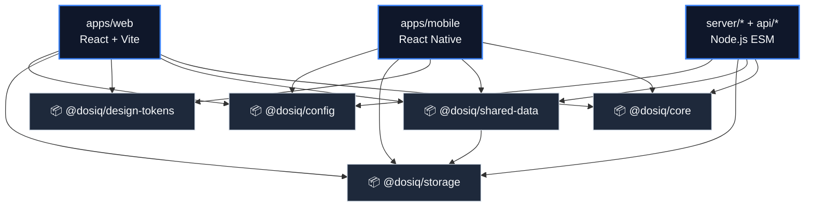
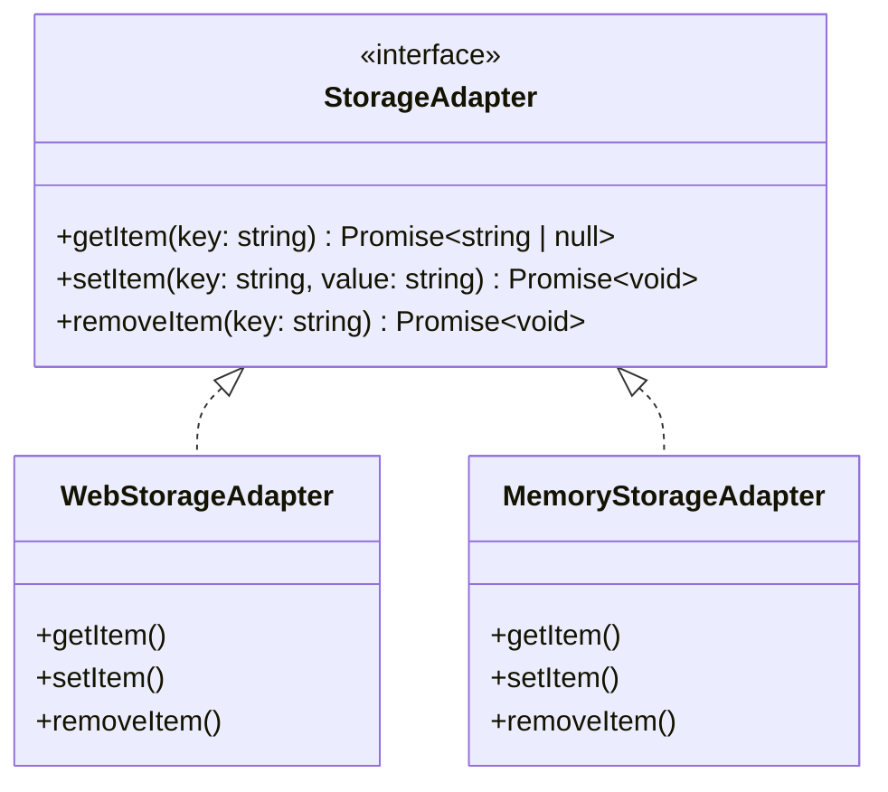

# 📦 Pacotes Menores

Esta documentação detalha a arquitetura, o propósito e os padrões de implementação dos pacotes de utilitários do monorepo Dosiq. Enquanto o pacote `@dosiq/core` abriga a lógica de negócio pura, estes "pacotes menores" fornecem infraestrutura e contratos agnósticos de plataforma, consumidos pelas aplicações web, mobile e pelo servidor (bot, APIs serverless, notificações).

## Visão Geral

Os pacotes menores resolvem o problema de compartilhamento de infraestrutura sem violar a regra de não acoplamento do core. Eles adotam a Inversão de Dependência (Dependency Inversion), fornecendo contratos (interfaces e factories) para que cada plataforma injete a implementação nativa (como `localStorage` na web ou `AsyncStorage` no mobile).



Por que mantê-los separados do `@dosiq/core`? O core contém as regras de negócios da saúde (aderência, estoque, esquemas). Um pacote como `@dosiq/storage` precisa tratar exclusivamente de abstração de I/O, enquanto `@dosiq/design-tokens` é puramente estrutural de UI. Manter as responsabilidades distintas evita vazamento de escopo e ciclos de dependência.

## @dosiq/design-tokens

O pacote de design tokens é a base visual do projeto. Seu propósito é codificar o *Sanctuary Design System* como estruturas de dados JavaScript puras (zero CSS, zero componentes React), garantindo que tanto a web quanto o aplicativo mobile consumam os exatos mesmos valores de cores, espaçamentos, tipografia e bordas.

### Paleta de Cores (`colors.ts`)

A paleta de cores é estruturada em torno de valores HSL convertidos para hex ou rgba nativos, organizados semanticamente por uso (brand, status, background, glow effects).

```typescript
// packages/design-tokens/src/colors.ts

const brandColors = {
  primary: '#ec4899',
  primaryLight: '#f472b6',
  primaryDark: '#db2777',
  primaryBg: '#fdf2f8',
  primaryHover: '#be185d',
}

const statusColors = {
  success: '#10b981',
  successLight: '#34d399',
  successBg: '#ecfdf5',
  // ... (restante do arquivo)
}
```

A distinção crítica aqui são os efeitos de glow (brilho) e glassmorphism. Valores como `glow.cyan` (`0 0 10px rgba(6, 182, 212, 0.5)`) usam a sintaxe CSS de `box-shadow` e são lidos nativamente pela web. O cliente mobile deve mapear essas opacidades e cores para as APIs nativas de sombra, convertendo o formato.

| Token Object | Exemplo de Valor | Uso Típico |
|---|---|---|
| `colors.brand` | `#ec4899` (primary) | Botões principais, indicadores de ação. |
| `colors.status` | `#10b981` (success) | Banners, badges de medicamento tomado. |
| `colors.glow` | `0 0 10px rgba(...)` | Efeitos de neon e elevação na interface web. |
| `colors.state` | `rgba(236, 72, 153, 0.1)` | Fundo para botões em estado `:hover` ou `:active`. |

### Spacing (`spacing.ts`)

O sistema de espaçamento adota uma escala baseada em uma grade de `4px` (mapeada em unidades `rem`), derivando da escala clássica do Tailwind.

```typescript
// packages/design-tokens/src/spacing.ts

const spaceScale = {
  0: '0',
  px: '1px',
  '0.5': '0.125rem', // 2px
  1: '0.25rem',      // 4px
  '1.5': '0.375rem', // 6px
  2: '0.5rem',       // 8px
  // ... (restante do arquivo)
}

const componentSpacing = {
  card: {
    padding: '0.75rem',
    paddingSm: '0.5rem',
    paddingLg: '1rem',
    gap: '0.5rem',
    borderRadius: '0.75rem',
  },
  // ... (restante do arquivo)
}
```

O consumo nativo mobile requer a conversão de `rem` para pixels no próprio cliente. Um token de `0.5rem` é traduzido multiplicando o valor numérico pelo tamanho base (16), resultando em `8px`.

### Tipografia (`typography.ts`)

Define famílias tipográficas, escalas de tamanho (`rem`), alturas de linha (line-heights) e pesos para a interface de usuário.

```typescript
// packages/design-tokens/src/typography.ts

const fontFamilies = {
  primary:
    "system-ui, -apple-system, BlinkMacSystemFont, 'Segoe UI', Roboto, 'Helvetica Neue', Arial, sans-serif",
  mono: "'SF Mono', Monaco, Consolas, 'Liberation Mono', 'Courier New', monospace",
}

const fontSizes = {
  xs: '0.75rem',
  sm: '0.875rem',
  base: '1rem',
  lg: '1.125rem',
  // ... (restante do arquivo)
}
```

### Radii (`radii.ts`)

Define os limites visuais (border-radius, larguras de borda, stroke para SVGs).

```typescript
// packages/design-tokens/src/radii.ts

const radiusScale = {
  none: '0',
  sm: '0.125rem',
  md: '0.375rem',
  lg: '0.5rem',
  full: '9999px',
  circle: '50%',
  // ... (restante do arquivo)
}
```

## @dosiq/storage

O pacote de storage abstrai o I/O local (persistência de dados chave-valor) utilizando o padrão Strategy. A interface define os contratos assíncronos e o pacote fornece implementações injetáveis. Isso impede que o core ou outros pacotes compartilhem dependências diretas de `window.localStorage` (exclusivo do navegador) ou `AsyncStorage` (exclusivo do React Native).



### Contrato: `StorageAdapter`

Qualquer mecanismo de cache ou persistência precisa apenas receber um objeto que obedeça a este contrato. O método `assertStorageAdapter` verifica o duck-typing na fábrica.

```typescript
// packages/storage/src/contracts.ts

export interface StorageAdapter {
  getItem(key: string): Promise<string | null>
  setItem(key: string, value: string): Promise<void>
  removeItem(key: string): Promise<void>
}
```

### Implementações Injetáveis

O pacote disponibiliza implementações prontas. Por exemplo, a implementação web faz o wrapper da interface de objeto Storage do navegador transformando-a em métodos assíncronos estritos.

```typescript
// packages/storage/src/webStorage.ts

export function createWebStorageAdapter(storage: WebStorageLike): StorageAdapter {
  if (!storage) throw new Error('Web storage provider is required')

  const adapter: StorageAdapter = {
    async getItem(key: string) {
      return storage.getItem(key)
    },
    async setItem(key: string, value: string) {
      storage.setItem(key, value)
    },
    async removeItem(key: string) {
      storage.removeItem(key)
    },
  }

  assertStorageAdapter(adapter)
  return adapter
}
```

| Adapter | Ambiente | Persistente? | Uso Típico |
|---|---|---|---|
| `WebStorageAdapter` | Navegador (`localStorage`) | Sim | PWA (Sessão auth, queries). |
| `MemoryStorageAdapter` | Node.js / Testes | Não | Testes unitários (Map em memória). |
| `JsonAdapter` (função) | Híbrido | Sim | Helpers assíncronos (`setJSON`, `getJSON`). |

## @dosiq/shared-data

O mais complexo dos pacotes menores, engloba os tipos do banco de dados (gerados pelo Supabase CLI), a infraestrutura do cache SWR customizado, a injeção do cliente de banco e as fábricas dos repositórios compartilhados de infraestrutura (logs e sessões).

### `database.types.ts`

O arquivo `database.types.ts` é o coração da segurança de tipos de ponta a ponta do Dosiq. É um artefato gerado de 55KB exportando os esquemas do PostgreSQL em tipos do TypeScript. Absolutamente todos os services de manipulação de dados e interfaces UI de leitura dependem desta assinatura estrutural para validar os dados retornados e inferir colunas disponíveis.

A geração ocorre no repositório de backend ou via CLI apontada para o projeto Supabase, unificando a verificação de runtime via Zod com o tipo estático.

### Query Cache (`query-cache/`)

Motor de cache SWR agnóstico e sem React, desenhado para cachear queries de banco em persistência local via `StorageAdapter`.

```typescript
// packages/shared-data/src/query-cache/createQueryCache.ts

export function createQueryCache({
  storage,
  logger = null,
  staleTime = 30_000,
  maxEntries = 200,
  persistKey = 'dosiq_query_cache',
}: {
  storage?: StorageAdapter
  logger?: CacheLogger | null
  staleTime?: number
  maxEntries?: number
  persistKey?: string
} = {}) {
  if (!storage) throw new Error('createQueryCache: storage adapter is required')
  return _buildCache({ storage, logger, staleTime, maxEntries, persistKey, setJSON, getJSON })
}
```

O arquivo chave aqui é o `cacheKeys.ts`, onde todas as strings que invalidam dados estão centralizadas. Utilizar strings avulsas como chave do cache é um antipadrão proibido; todas devem advir deste dicionário para evitar inconsistências nas revalidações.

### Supabase Factories

Para consumir o Supabase, as aplicações não utilizam singletons ou configurações hardcoded. O shared-data provê o `createSupabaseDependencies`, uma factory que amarra as chaves públicas injetadas à implementação local do `createClient` e ao mecanismo de storage da plataforma (para persistência de autenticação).

```typescript
// packages/shared-data/src/supabase/createSupabaseDependencies.ts

export function createSupabaseDependencies({
  url,
  anonKey,
  authStorage,
  detectSessionInUrl = false,
  createClientImpl,
}: CreateSupabaseDependenciesOptions) {
  const supabase = createClientImpl(url, anonKey, {
    auth: {
      storage: authStorage,
      persistSession: true,
      autoRefreshToken: true,
      detectSessionInUrl,
    },
  })

  return { supabase }
}
```

### Repositórios Compartilhados

Repositórios essenciais à infraestrutura comum, que acoplam a regra de banco aos logs e à gestão do usuário, são definidos em `services/`. Diferem dos repositórios do `@dosiq/core` pois interagem diretamente com detalhes específicos do provedor e tabelas de log (ex: `createNotificationLogRepository`). O design injeta o cliente instanciado para acesso isolado.

## @dosiq/config

Pacote dedicado à gestão da configuração pública. Ele valida as variáveis de ambiente necessárias (como as credenciais do Supabase) em nível de inicialização das plataformas. Segue estritamente o princípio de falha rápida (fail-fast) ao certificar o contrato antes de propagar os valores, independentemente da origem (seja via `import.meta.env` ou `process.env`).

### Fluxo de Validação e Fábrica

O fluxo começa definindo as entradas parciais provindas da plataforma. Em seguida, a factory executa a validação por duck-typing explícito (via `assertPublicAppConfig`), retornando a config garantida e limpa.

```typescript
// packages/config/src/createPublicAppConfig.ts

export function createPublicAppConfig(input: PublicAppConfigInput): PublicAppConfig {
  const config = {
    supabaseUrl: input.supabaseUrl as string,
    supabaseAnonKey: input.supabaseAnonKey as string,
    detectSessionInUrl: Boolean(input.detectSessionInUrl ?? true),
    appEnv: input.appEnv ?? 'development',
  }

  assertPublicAppConfig(config)
  return config
}
```

No módulo de contratos, o `assertPublicAppConfig` varre as propriedades aplicando as exigências de formato:

```typescript
// packages/config/src/contracts.ts

export function assertPublicAppConfig(config: PublicAppConfigCandidate | null | undefined) {
  if (!config) throw new Error('Config object is required')

  if (!config.supabaseUrl) {
    throw new Error('Missing supabaseUrl in public config')
  }

  // URL must start with https
  if (typeof config.supabaseUrl !== 'string' || !config.supabaseUrl.startsWith('https://')) {
    throw new Error('supabaseUrl must be a valid HTTPS URL')
  }
  
  // ... (restante do arquivo)
}
```

## Tabela Comparativa

A matriz abaixo exibe o propósito e o consumo da infraestrutura agnóstica dos pacotes menores. 

| Pacote | Arquivos | Runtime Alvo | Consumidores | Função Principal |
|---|---|---|---|---|
| `@dosiq/design-tokens` | 7 | Web, Mobile | PWA, App Nativo | Fonte única de verdade para variáveis de design. |
| `@dosiq/storage` | 6 | Universal | PWA, Shared-Data | Abstração injetável de persistência de chave e valor. |
| `@dosiq/shared-data` | ~12 | Universal | PWA, Mobile, Bot | Tipos do BD, motor unificado de Query Cache e Auth. |
| `@dosiq/config` | 5 | Universal | PWA, Mobile, Bot | Definição rigorosa e parser de chaves injetáveis. |
