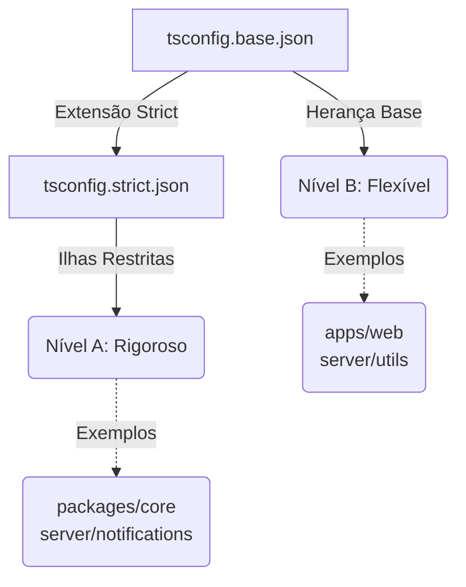
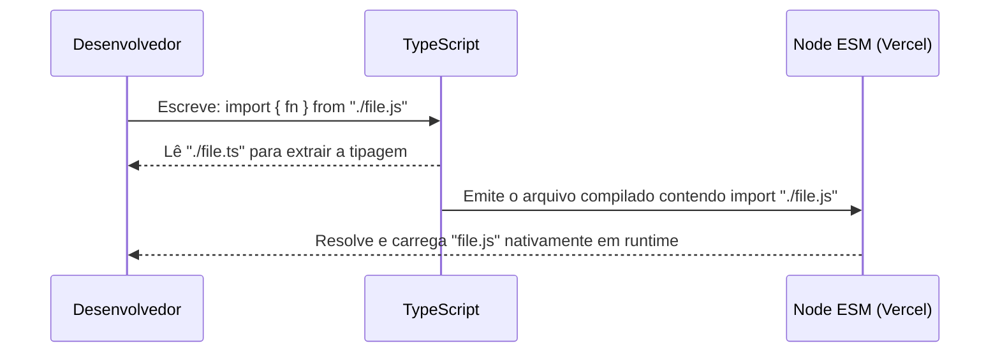
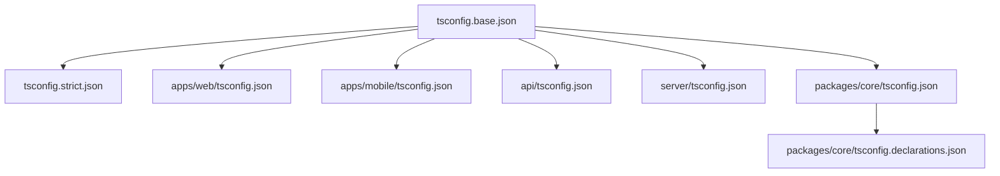

# Padrões TypeScript e Strict Islands

O projeto Dosiq concluiu a migração integral para TypeScript durante o épico 040. Este documento define as regras arquiteturais de tipagem do monorepo.

O repositório combina módulos de alta segurança com código legado flexível. Para gerenciar isso sem paralisar o desenvolvimento, adotamos a estratégia de "Strict Islands". Nós garantimos a segurança máxima no código central enquanto mantemos o restante do código operacional.

## Visão Geral do Regime TypeScript

Nossa filosofia de tipagem é pragmática: aplicamos regras restritas onde possível e permitimos flexibilidade onde é necessário. O monorepo opera 100% em TypeScript. Contudo, nem todo código compartilha o mesmo rigor de verificação.

A configuração global do projeto desabilita o modo estrito por padrão. Nós fazemos isso no arquivo `tsconfig.base.json`, que atua como fundação para todos os pacotes.

```json
// tsconfig.base.json
{
  "compilerOptions": {
    "target": "es2022",
    "module": "esnext",
    "moduleResolution": "bundler",
    "strict": false,
    "isolatedModules": true,
    "noEmit": true
  }
}
```

A propriedade `strict: false` evita que código antigo ou em transição quebre a compilação global. O `moduleResolution: "bundler"` delega a resolução de extensões para ferramentas modernas como Vite.

Em contraste, as áreas críticas do sistema adotam o modo `strict: true` através de uma configuração especializada. Nós agrupamos essas áreas restritas dentro de um conceito chamado "Ilhas Rigorosas".



## Strict Islands: Nível A vs Nível B

A arquitetura TypeScript do Dosiq divide o código em dois níveis de rigor.

O Nível A engloba os arquivos analisados com a configuração strict completa. O compilador bloqueia tipos implicitos (any) e exige verificação de nulos. Usamos o Nível A para regras de negócio vitais e novos serviços. 

O arquivo `tsconfig.strict.json` ativa as flags necessárias e define as pastas protegidas através da propriedade `include`.

```json
// tsconfig.strict.json
{
  "extends": "./tsconfig.base.json",
  "compilerOptions": {
    "strictNullChecks": true,
    "noImplicitAny": true
  },
  "include": [
    "packages/core/src/types/**/*",
    "packages/core/src/repositories/**/*",
    "packages/core/src/services/**/*",
    "packages/core/src/schemas/**/*",
    "server/notifications/**/*",
    "apps/web/src/shared/hooks/**/*",
    "apps/mobile/src/shared/hooks/**/*"
  ]
}
```

Qualquer arquivo listado neste bloco `include` deve passar por regras de validação inflexíveis.

O Nível B abrange arquivos com flexibilidade controlada. Este código tolera a presença pontual de tipos `any`. Usamos comentários `// TODO(040-strict)` para documentar dívidas técnicas conhecidas nestes arquivos:

```typescript
// Exemplo de marcação de dívida técnica em arquivo Nível B
const data = response.body as any // TODO(040-strict): tipar com VercelRequestBody<NotifyPayload>
```

| Nível | Nível de Rigor | Diretórios Exemplares |
|-------|----------------|-----------------------|
| A | Strict Completo | `packages/core/src/services`, `server/notifications` |
| B | Flexível Controlado | `apps/web`, `server/utils`, `server/bot` |

A regra de manutenção é simples. Chamamos isso de política "on-touch": se um desenvolvedor modificar um arquivo de Nível B, ele deve corrigir os erros de tipagem daquele escopo. Novos arquivos nascem obrigatoriamente compatíveis com o Nível A.

## A Catraca de Erros (`strict-island.sh`)

O arquivo `scripts/strict-island.sh` implementa uma catraca de dívida técnica. Uma catraca é um mecanismo que permite o fluxo em apenas uma direção. No nosso caso, o número de erros TypeScript tolerados só pode diminuir.

O script divide o repositório em buckets específicos e conta os erros de tipagem em cada um. A separação por workspace garante que melhorias em um pacote não mascarem a piora de outro.

Veja como o script mapeia os arquivos do Nível A:

```bash
# Exemplo retirado de: scripts/strict-island.sh
A_SRC='^(packages/core/src/(types|repositories|services|schemas)|server/notifications|apps/web/src/shared/hooks|apps/mobile/src/shared/hooks)/'
```

Em seguida, ele valida se um determinado bucket ultrapassa seu teto configurado:

```bash
# Exemplo retirado de: scripts/strict-island.sh
check_ceiling() { # label count max
  if [ "$2" -gt "$3" ]; then
    echo "❌ CATRACA ESTOURADA — $1: $2 > teto $3"
    FAIL=1
  else
    echo "✅ $1: $2 (teto $3)"
  fi
}
```

Nós aplicamos regras extras para separar falhas de código funcional de falhas de testes, como demonstrado nesta seção para o Core e o Server:

```bash
# Exemplo retirado de: scripts/strict-island.sh
# Buckets testes A por território
AT_OUT=$(printf '%s\n' "$OUT" | grep -E "$A_SRC" | grep -E "$TESTS" || true)
check_ceiling "testes A core"        "$(printf '%s\n' "$AT_OUT" | grep -c '^packages/core/' || true)" "$MAX_A_TESTS_CORE"
check_ceiling "testes A server/notifications" "$(printf '%s\n' "$AT_OUT" | grep -c '^server/notifications/' || true)" "$MAX_A_TESTS_SERVER"
```

Cada bucket possui um teto máximo permitido. Toda vez que um desenvolvedor corrige tipos falhos, ele deve reduzir o teto correspondente no script no mesmo pull request. Os tetos nunca podem subir. Quando um teto chega a zero, o bucket inteiro migra definitivamente para o Nível A.

Este script roda no processo de Integração Contínua (CI). Um pull request que viola o teto atual do bucket resulta em falha imediata no processo.

Veja o resultado de uma execução real do script localmente:

```bash
# Output gerado pelo ./scripts/strict-island.sh
✅ fonte nível A strict-limpa
✅ B packages/*: 0 (teto 0)
✅ B apps/web: 37 (teto 37)
✅ B apps/mobile: 0 (teto 0)
✅ B server/*: 36 (teto 36)
✅ testes A core: 0 (teto 0)
✅ testes A server/notifications: 0 (teto 0)
✅ testes A hooks web: 0 (teto 0)
✅ testes A hooks mobile: 0 (teto 0)
✅ server/api sem import relativo extensionless
✅ testes programa api: 0 (teto 0)
✅ testes programa server: 0 (teto 0)
✅ testes programa mobile: 0 (teto 0)
✅ ratchet OK (todos os buckets dentro dos tetos)
```

Se o script indicar falha no seu código, não suba o teto. Revise suas mudanças. Corrija a tipagem ausente ou repare a violação strict que você introduziu.

## Imports ESM e Extensão .js (R-282)

Nossos módulos Vercel operam sob o padrão ECMAScript Modules (ESM) nativo. O Node.js exige resoluções de caminho explícitas no formato ESM puro.

O problema central surge da compilação. O TypeScript traduz arquivos `.ts` para `.js`. Entretanto, imports relativos de módulos não podem omitir a extensão do arquivo final. Se você importar algo sem extensão, o servidor da Vercel retornará um erro `ERR_MODULE_NOT_FOUND` em produção.

Esta regra afeta os diretórios `server/` e `api/`. Ela também cobre os pacotes do monorepo que exportam código bruto sem uso de bundler, como o `shared-data` e o `storage`. 

```typescript
// Exemplo retirado de: api/notify.ts

// ❌ ANTI-PATTERN: Ocultar extensão (quebra no ambiente Node ESM da Vercel)
import { createLogger } from '../server/bot/logger';
import { getServerTimestamp } from '../server/utils/dateUtils';
import { dispatchNotification } from '../server/notifications/dispatcher/dispatchNotification';

// ✅ CORRETO: Incluir a extensão .js obrigatoriamente
import { createLogger } from '../server/bot/logger.js';
import { getServerTimestamp } from '../server/utils/dateUtils.js';
import { dispatchNotification } from '../server/notifications/dispatcher/dispatchNotification.js';
```

Por que importamos `.js` se o arquivo físico no repositório é `.ts`? O TypeScript reconhece a declaração e sabe encontrar o arquivo `.ts` correspondente durante o desenvolvimento, assumindo que ele compilará para o `.js` nomeado.



O código empacotado pelo Vite (como `apps/web`) não sofre desta exigência. O bundler cuida da resolução estática durante o processo de build da aplicação React.

Para não poluir o ambiente de desenvolvimento, desativamos o alerta padrão do linter para importações não resolvidas nesses pacotes. O validador do ESLint não compreende o mapeamento transparente que o TypeScript realiza de `.js` para `.ts`.

```javascript
// Exemplo retirado de: eslint.config.js
{
  // O resolver node do import-x não mapeia .js -> .ts
  files: ['packages/*/src/**/*.{ts,tsx}'],
  rules: {
    'import-x/no-unresolved': 'off',
  },
}
```

O próprio compilador (`tsc`) e o script de catraca garantem que a importação aponta para um arquivo válido no disco.

## Narrowing no Core (R-286)

O pacote `@dosiq/core` possui um requisito estrito para validação de erros de retorno. Nós implementamos respostas baseadas no padrão de união discriminada (Discriminated Unions). 

Funções frequentemente retornam objetos combinados indicando sucesso ou falha, similar ao padrão Result em Rust.

O problema ocorre porque consumidores de código Nível B não possuem `strictNullChecks` ativo. Se usarem `!resultado.success`, o compilador TypeScript pode ignorar falhas silenciosamente — o narrowing não funciona corretamente sem strict, e tipos incorretos passam pela ramificação condicional sem erro.

A solução oficial do projeto exige a verificação explícita do valor booleano. Use sempre `=== false` ou `=== true` para estreitar tipos (narrowing) dentro do domínio do pacote core.

```typescript
// Exemplo retirado de: packages/core/src/services/doseLogService.ts

// ❌ ANTI-PATTERN: Negação booleana simples no consumidor flexível
const validation = validateLogCreate(logData) as CreateValidationResult
if (!validation.success) {
  throw new Error(`Erro: ${validation.errors}`)
}

// ✅ CORRETO: Comparação estrita de tipo exigida pelo R-286
const validation = validateLogCreate(logData) as CreateValidationResult
if (validation.success === false) {
  throw new Error(`Erro de validação: ${formatValidationError(validation.errors)}`)
}
```

Esta prática garante consistência na verificação de tipos independente de qual aplicativo no monorepo chame a função. O estreitamento ocorre perfeitamente mesmo em diretórios onde o `strict` ainda está desligado.

## Hierarquia de TSConfig

O projeto adota uma herança de configurações baseada em escopo e necessidades de compilação. Cada ferramenta tem suas regras próprias.

O `tsconfig.base.json` define a infraestrutura global e desliga o `strict`. O `tsconfig.strict.json` ativa o `strict` e mapeia os pacotes.

Por que cada workspace possui seu próprio `tsconfig.json` se podemos usar apenas dois centrais? Porque pacotes precisam de resoluções de módulo distintas e paths isolados. O backend Vercel requer compilação Node e acesso a bibliotecas do sistema, enquanto o frontend requer compilação para navegador e esconde o sistema de arquivos.

Por exemplo, o PWA React possui dezenas de atalhos de diretório que não fazem sentido no backend:

```json
// Exemplo retirado de: apps/web/tsconfig.json
{
  "extends": "../../tsconfig.base.json",
  "compilerOptions": {
    "types": ["vite/client"],
    "paths": {
      "@/*": ["./src/*"],
      "@features/*": ["./src/features/*"],
      "@shared/*": ["./src/shared/*"],
      "@services/*": ["./src/services/*"],
      "@schemas/*": ["./src/schemas/*"],
      "@utils/*": ["./src/utils/*"],
      "@design-tokens/*": ["../../packages/design-tokens/src/*"],
      "@dosiq/core/*": ["../../packages/core/src/*"]
    }
  },
  "include": ["src"]
}
```



A tabela abaixo mostra as responsabilidades isoladas de cada arquivo na arquitetura:

| Configuração | Estende | Sobrescritas Principais |
|--------------|---------|-------------------------|
| `tsconfig.base.json` | N/A | Define `moduleResolution: "bundler"`, `target: "es2022"` e `strict: false`. |
| `tsconfig.strict.json` | `base` | Ativa `strictNullChecks` e define as ilhas restritas em `include`. |
| `apps/web/tsconfig.json` | `base` | Adiciona arrays de `paths` com alias `@features/`, `@shared/`. |
| `api/tsconfig.json` | `base` | Adiciona `exclude: ["node_modules", "admin/_handlers"]`. |
| `packages/core/tsconfig.json` | `base` | Restringe o scope para a pasta `src` interna do pacote. |
| `packages/core/tsconfig.declarations.json` | `core` | Emite apenas declarações `.d.ts` via `emitDeclarationOnly: true`. Usado no pipeline de build do core. |

## Guia do Contributor

Nós adotamos este checklist como parte do fluxo oficial do Dosiq. Antes de submeter um Pull Request, revise os pontos de controle técnico:

- [ ] Identifique o nível da alteração. O arquivo que você tocou está listado no Nível A ou no Nível B? Se estiver no Nível B, tente corrigir o `// TODO(040-strict)` se o custo for baixo.
- [ ] Execute `./scripts/strict-island.sh` localmente e garanta que o resultado foi "ratchet OK". Se algum número estourar, ajuste o código ou reduza o teto no próprio script.
- [ ] Verifique as importações. Edições em `server/` ou `api/` exigem a extensão `.js` ao final do import de arquivos locais.
- [ ] Para retorno no pacote `@dosiq/core`, utilize sempre `=== false` para ativar o narrowing de objetos de resposta na camada consumidora.
