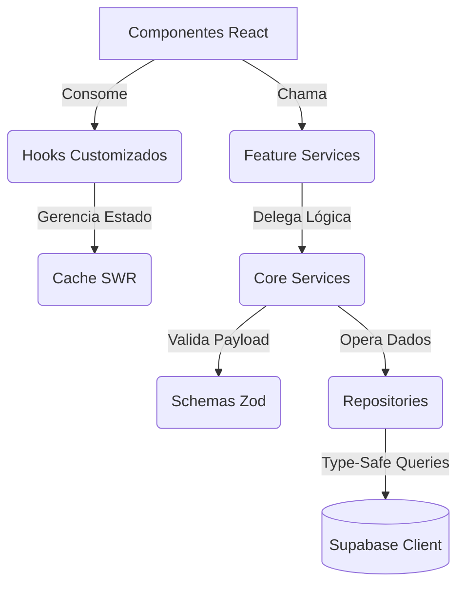
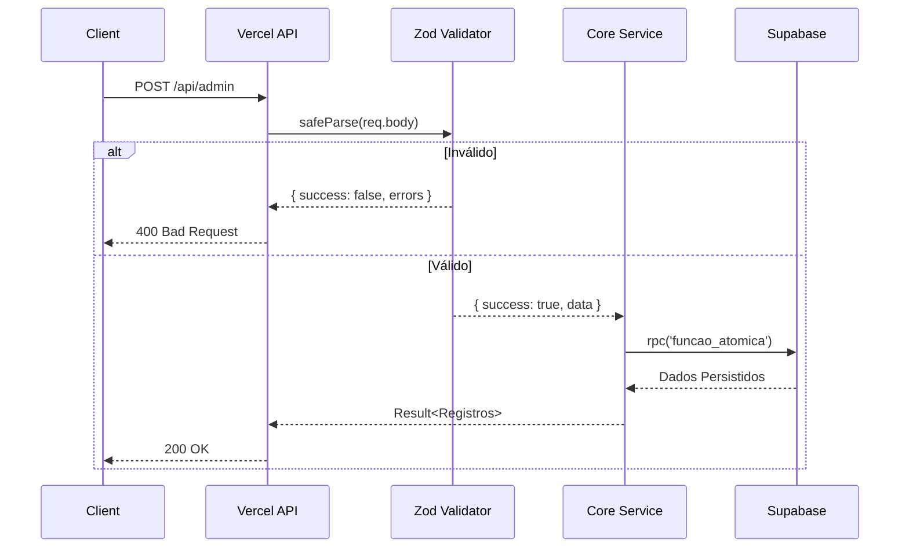

# Padrões de Tipagem e TypeScript

## Introdução

Este documento consolida os padrões práticos de TypeScript adotados no Dosiq. O projeto completou a migração 100% TypeScript no épico 040 e adota uma arquitetura de strict islands (nível A estrito vs. nível B flexível) mantida via `scripts/strict-island.sh`.

O objetivo principal da nossa tipagem é garantir segurança de runtime e refatoração confiável, minimizando o volume de anotações manuais desnecessárias. Privilegiamos inferência limpa, validação robusta nas bordas com o Zod, e processos de narrowing idiomáticos. Use este documento como referência ao implementar novos serviços, componentes ou integração de API.



## Tipando Services

Os serviços encapsulam a lógica de negócio pura do domínio. No Dosiq, serviços adotam o padrão de discriminated unions (conhecido na base como tipo `Result<T>`) para mapear sucessos e falhas de forma previsível. Esta abordagem impede o lançamento de exceções durante o fluxo normal da aplicação, transferindo o controle do erro para quem consumiu o serviço.

### O Padrão Result

As assinaturas das funções de serviço retornam um objeto contendo uma propriedade discriminadora `success` de valor booleano. Quando falha, o objeto expõe os erros estruturados da validação; quando tem sucesso, entrega os dados finais.

Veja o modelo canônico extraído diretamente das dependências de registro do core:

```typescript
// packages/core/src/services/doseLogService.ts

interface ValidationError {
  field: string
  message: string
}

interface ValidatedLog {
  protocol_id?: string | null
  medicine_id: string
  taken_at: string
  quantity_taken: number
  notes?: string | null
  injection_site?: string | null
  [key: string]: unknown
}

type CreateValidationResult =
  | { success: true; data: ValidatedLog }
  | { success: false; errors: ValidationError[] }

type UpdateValidationResult =
  | { success: true; data: Partial<ValidatedLog> }
  | { success: false; errors: ValidationError[] }
```

### Narrowing Correto no Core (R-286)

Os serviços estruturais do pacote `@dosiq/core` fornecem infraestrutura para pacotes de aplicativos que muitas vezes operam em camadas legadas ou menos restritas (fora da strict island). Para garantir o refinamento do tipo de modo infalível, a regra global **R-286** estabelece que comparações contra `success` não podem ser falsy checks (`!result.success`). Elas exigem equiparação de igualdade literal com o valor `false`.

```typescript
// ✅ CORRETO (Narrowing Seguro)
if (result.success === false) {
  return handleValidationErrors(result.errors)
}
const dados = result.data

// ❌ PROIBIDO no Core
if (!result.success) { ... } // Comporta-se mal em consumidores não-strict se o result for undefined
```

### Feature Services (Web/Mobile)

Camadas focadas em apresentação, construídas dentro das interfaces web ou mobile, ingerem a lógica pura do core e orquestram cálculos adicionais.

O exemplo a seguir ilustra um serviço manipulando chaves mapeadas com inferência nativa baseada na hora registrada:

```typescript
// apps/web/src/features/adherence/services/adherencePatternService.ts
import { validateAnalyzeAdherencePatternsInput } from '@schemas/adherencePatternSchema'
import { getSaoPauloTime, parseISO, formatLocalDate } from '@utils/dateUtils'

/**
 * Pré-processa protocolos para mapear time_schedule por dia da semana
 * Retorna um mapa: { dayIndex: { periodIndex: count } }
 */
function preprocessProtocolsExpected(protocols: any[]) {
  const expectedMap: Record<number, Record<number, number>> = {}

  for (let day = 0; day < 7; day++) {
    expectedMap[day] = { 0: 0, 1: 0, 2: 0, 3: 0 }
  }

  protocols.forEach((protocol) => {
    if (!protocol.time_schedule || protocol.time_schedule.length === 0) return

    const daysOfWeek = getDaysOfWeekForProtocol(protocol.frequency)
    daysOfWeek.forEach((dayIndex) => {
      protocol.time_schedule.forEach((timeStr: string) => {
        const [hour] = timeStr.split(':').map(Number)
        const periodIndex = getPeriodIndex(hour)
        expectedMap[dayIndex][periodIndex] += 1
      })
    })
  })

  return expectedMap
}
```

## Tipando Hooks

Os hooks do Dosiq ficam em `shared/hooks`. Eles expõem interfaces tipadas que abstraem detalhes internos como revalidação automática de cache (SWR) e gerenciamento de estado local.

### Retorno Explícito vs Inferência Embutida

Hooks essenciais precisam declarar a própria interface de retorno explicitamente. Ao fixar o objeto devolvido numa interface robusta, o TypeScript reporta desvios estruturais com mensagens de erro precisas já no arquivo fonte do hook.

```typescript
// apps/web/src/shared/hooks/useCachedQuery.ts
import { useState, useCallback, useRef } from 'react'
import { webQueryCache } from '@shared/platform/query-cache/webQueryCache'

type Fetcher<T> = () => Promise<T>

export interface UseCachedQueryOptions<T> {
  enabled?: boolean
  staleTime?: number
  initialData?: T | null
  onSuccess?: (result: T) => void
  onError?: (err: unknown) => void
}

export interface UseCachedQueryResult<T> {
  data: T | null | undefined
  isLoading: boolean
  isFetching: boolean
  error: unknown
  refetch: () => Promise<T | undefined>
  refresh: () => Promise<T | undefined>
}

/**
 * Hook para executar queries com cache SWR utilizando engine customizada
 */
export function useCachedQuery<T>(
  key: string | null | undefined,
  fetcher: Fetcher<T> | null | undefined,
  options: UseCachedQueryOptions<T> = {}
): UseCachedQueryResult<T> {
  const { enabled = true, staleTime, initialData } = options
  const [data, setData] = useState<T | null | undefined>(initialData)
  const [isLoading, setIsLoading] = useState(false)
  const [isFetching, setIsFetching] = useState(false)
  const [error, setError] = useState<unknown>(null)
  
  // A execução real e gerenciamento das Refs de cache SWR prossegue aqui...
  
  return {
    data,
    isLoading,
    isFetching,
    error,
    refetch: async () => undefined,
    refresh: async () => undefined
  }
}
```

O emprego dos tipos parametrizados `<T>` viabiliza o isolamento de instâncias na chamada do componente, garantindo que o retorno seja lido consistentemente como a resposta original da query.

## Tipando Repositories

Os repositórios (`packages/core/src/repositories`) concentram o contato cru com a rede e lidam primariamente com instruções diretas para o banco de dados Supabase. Utilizamos o Factory Pattern, permitindo montar diferentes instâncias ajustando os objetos devolvidos.

### Factory Pattern com Generics

Cada factory recebe o `client` do Supabase e uma função `getUserId` para resolver o contexto do usuário. Parâmetros opcionais como `listSelect` e `listTransform` permitem customizar a query e o formato de retorno por plataforma.

```typescript
// packages/core/src/repositories/createMedicineRepository.ts
import type { SupabaseClient } from '@supabase/supabase-js'
import type { Database } from '@dosiq/shared-data'
import { validateMedicineCreate, validateMedicineUpdate } from '../schemas/medicineSchema'

const identity = <T,>(x: T) => x

interface ValidationError {
  field: string
  message: string
}

function formatValidationError(errors: ValidationError[]) {
  const msg = errors.map((e) => `${e.field}: ${e.message}`).join('; ')
  return new Error(`Erro de validação: ${msg}`)
}

interface CreateMedicineRepositoryDeps {
  client: SupabaseClient<Database>
  getUserId: () => Promise<string>
  listSelect?: string
  detailSelect?: string
  listTransform?: (rows: unknown) => unknown
  detailTransform?: (row: unknown) => unknown
}

/**
 * Cria um repositório CRUD de medicamentos parametrizado por plataforma.
 */
export function createMedicineRepository({
  client,
  getUserId,
  listSelect = '*',
  detailSelect = '*',
  listTransform = identity,
  detailTransform = identity,
}: CreateMedicineRepositoryDeps) {
  
  return {
    async getById(id: string) {
      const userId = await getUserId()
      const { data, error } = await client
        .from('medicines')
        .select(detailSelect)
        .eq('id', id)
        .eq('user_id', userId)
        .single()

      if (error) throw error
      return detailTransform(data)
    },
    // Métodos create, update, e delete fluem pelo mesmo padrão...
  }
}
```

Com isso, cada plataforma customiza o `select` das queries (reduzindo dados trafegados) e aplica transforms no retorno sem alterar o repositório base.

## Tipando Schemas Zod

Toda entrada não-confiável sofre saneamento obrigatório com a biblioteca Zod, definida centralizadamente nas bibliotecas núcleo do monorepo. Para maximizar consistência, criamos arrays literais bloqueados com `as const`.

### Constantes Fixas e Enums Idiomáticos (R-021)

Valores catalogados que serão gravados no banco de dados residem diretamente em português brasileiro no Zod. Isso reduz a proliferação de dicionários de tradução na aplicação consumidora.

```typescript
// packages/core/src/schemas/medicineSchema.ts
import { z } from 'zod'

export const DOSAGE_UNITS = ['mg', 'mcg', 'g', 'mg/ml', 'ui/ml', 'ui', 'un'] as const
export const MEDICINE_TYPES = ['medicamento', 'suplemento'] as const
export const PRESENTATIONS = [
  'comprimido',
  'capsula',
  'liquido',
  'injetavel',
  'pomada',
  'spray',
  'outro',
] as const

// Formato canônico que alimenta validação em runtime e compilação TS
export const medicineSchema = z.object({
  id: z.string().uuid(),
  user_id: z.string().uuid(),
  type: z.enum(MEDICINE_TYPES),
  presentation: z.enum(PRESENTATIONS),
  dosage_unit: z.enum(DOSAGE_UNITS),
})

// Tipagem gerada a partir do Zod serve como modelo (Single Source of Truth)
export type Medicine = z.infer<typeof medicineSchema>
```

### Mapas de Erro Centrais: O Arquivo zodSetup.ts

O arquivo `zodSetup.ts` intercepta os erros do Zod e os traduz para mensagens claras em português, exibidas diretamente nos formulários.

```typescript
// packages/core/src/zodSetup.ts
import { z } from 'zod'
import pt from 'zod/v4/locales/pt.js'

function friendlyMessage(issue: z.core.$ZodRawIssue) {
  switch (issue.code) {
    case 'invalid_type': {
      if (issue.input === undefined || issue.input === null || issue.input === '') {
        return 'Este campo é obrigatório'
      }
      if (issue.expected === 'number') {
        return 'Use apenas números'
      }
      return 'Valor inválido'
    }
    // Lógicas de tamanho (too_small, too_big) continuam aqui
    default:
      return null
  }
}

const ptLocale = pt().localeError

z.config({
  customError: (issue) => {
    const friendly = friendlyMessage(issue)
    if (friendly) return friendly
    // O fallback utiliza o mapeamento global gerado pela importação V4
    return ptLocale(issue) 
  },
})
```

## Tipando Componentes React

Props são definidas inline nos argumentos da função para componentes simples, ou como `interface` separada quando o componente usa `forwardRef` ou é reutilizado em vários contextos. Event handlers usam os tipos nativos do React (`MouseEventHandler`, `ChangeEventHandler`, etc.).

```tsx
// apps/web/src/shared/components/ui/Button.tsx
import type { ReactNode, MouseEventHandler } from 'react'
import './Button.css'

export default function Button({
  children,
  variant = 'primary',
  size = 'md',
  onClick,
  disabled = false,
  type = 'button',
  className = '',
}: {
  children?: ReactNode
  variant?: string
  size?: string
  onClick?: MouseEventHandler<HTMLButtonElement>
  disabled?: boolean
  type?: 'button' | 'submit' | 'reset'
  className?: string
}) {
  return (
    <button
      type={type}
      className={`btn btn-${variant} btn-${size} ${className}`}
      onClick={onClick}
      disabled={disabled}
    >
      {children}
    </button>
  )
}
```

Definir Props inline mantém o contrato de tipos junto ao componente, facilitando a leitura e manutenção.

## Tipando Supabase Client

O Supabase CLI gera automaticamente os tipos TypeScript das tabelas PostgreSQL. O resultado é exportado pelo pacote `@dosiq/shared-data` como o tipo `Database`. Ao criar o client com `SupabaseClient<Database>`, todas as queries passam a ter autocompletar e verificação de tipos para nomes de tabelas e colunas.

```typescript
// apps/web/src/shared/utils/supabase.ts
import { createClient } from '@supabase/supabase-js'
import type { Database } from '@dosiq/shared-data' 

const supabaseUrl = import.meta.env.VITE_SUPABASE_URL
const supabaseAnonKey = import.meta.env.VITE_SUPABASE_ANON_KEY

// Todas as chamadas para table('X').select('Y') agora verificarão a tipagem nativa SQL
export const supabase = createClient<Database>(supabaseUrl, supabaseAnonKey, {
  auth: {
    persistSession: true,
    autoRefreshToken: true,
    detectSessionInUrl: true,
  },
})
```

Para utilitários isolados ou funções do projeto, o cliente injetado reflete esse encapsulamento para preservar o contexto.

```typescript
// packages/core/src/services/resolveUserTz.ts
import type { SupabaseClient } from '@supabase/supabase-js'
import type { Database } from '@dosiq/shared-data'
import { DEFAULT_TIMEZONE } from '../schemas/userSettingsSchema'

export async function resolveUserTz(
  client: SupabaseClient<Database>, 
  userId: string | null | undefined
): Promise<string> {
  if (!userId) return DEFAULT_TIMEZONE
  
  const { data, error } = await client
    .from('user_settings')
    .select('timezone')
    .eq('user_id', userId)
    .maybeSingle()
    
  if (error || !data?.timezone) return DEFAULT_TIMEZONE
  return data.timezone
}
```

## Tipando Rotas API (Vercel Serverless)

Endpoints de resposta em ambientes como Vercel ou middlewares Node.js exigem definições para solicitações sem estado predefinido. A regra **R-282** fixa importações com terminação `.js` obrigatória. Para a arquitetura Serverless, estipulamos tipagens formais dos métodos e a execução em cascata protegida pelo validator Zod.



Exemplo de handler real do projeto:

```typescript
// api/admin.ts
import type { VercelRequest, VercelResponse } from '@vercel/node'
import { handleListFeedbacks } from './admin/_handlers/feedbacks.js'

/**
 * Handler central do endpoint admin (GET /api/admin)
 */
export default async function handler(req: VercelRequest, res: VercelResponse) {
  if (req.method === 'GET') {
    return handleListFeedbacks(req, res)
  }
  return res.status(405).json({ error: 'Method not allowed' })
}
```

## Anti-Patterns e Erros Comuns

Esta seção lista erros recorrentes encontrados em code reviews e suas correções.

| Anti-Pattern | Correção | Por que corrigir? |
|--------------|----------|-------------------|
| `any` genérico silenciando erro | `unknown` com asserção guardada | Eliminar a tipagem quebra o contrato estrito entre componentes. O runtime processará exceções mascaradas. |
| Negar sucesso na raiz `!result.success` | `result.success === false` | Previne bugs fantasma derivados da ausência literal da chave em consumidores relaxados do Monorepo. Exigência R-286. |
| Asserção extrema via `as Entity` | Extrator `z.infer` | `as Entity` é um fechar de olhos para o formato original que transita na conexão, comprometendo os tipos reais se o banco alterar. |
| Imports sem a terminação `.js` em server | Anexar ex: `import { x } from './x.js'` | Plataformas Node ignoram resolução estrita em sistemas de módulo ES (ESM), quebrando a infraestrutura de serverless de imediato. (R-282) |

### Exemplo de Refatoração: Payload Destrutivo vs Inferência Segura

❌ **PROIBIDO (Ignora validação e cega verificação estrutural)**
```typescript
const payload = req.body as CreateProtocolPayload
await protocolRepo.create(payload)
```

✅ **CORRETO (Validação Zod como gate obrigatório + narrowing R-286)**
```typescript
const validation = protocolSchema.safeParse(req.body)
if (validation.success === false) {
  return res.status(400).json({ errors: validation.error })
}

// Após o narrowing, validation.data é tipado como Protocol
await protocolRepo.create(validation.data)
```
