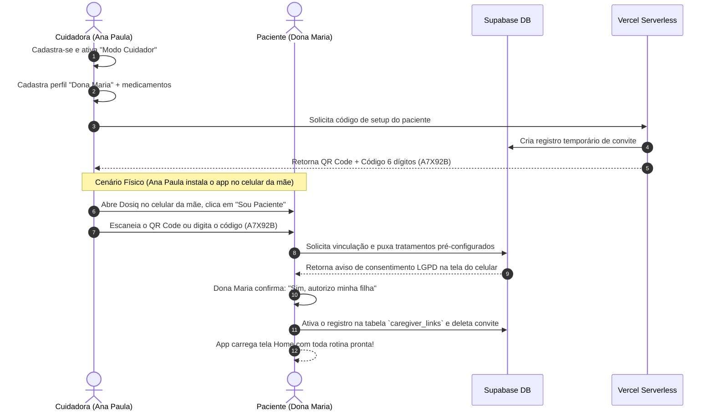

# Plano de Implementação — Modo Cuidador Híbrido Multidispositivo (Dosiq 2026)

Este documento apresenta o plano estratégico, a arquitetura técnica e o design de experiência (UX) para o **Modo Cuidador (Multi-device & Multi-role)** no ecossistema Dosiq. 

Seguindo o feedback do PO, este design inverte a polaridade tradicional da saúde digital: **a carga cognitiva e configuração inicial iniciam-se no Cuidador (filha)**, reduzindo a fricção e as barreiras de letramento digital do Paciente (idoso/dona Maria), mantendo total conformidade com a LGPD e soberania do paciente através de consentimento explícito e revogabilidade imediata.

---

## 👥 Persona & Cenário Prático (Value Prop)

*   **A Cuidadora (Ana Paula, filha):** Cadastra-se no Dosiq, ativa o Modo Cuidador e realiza toda a configuração inicial da mãe (nome, medicamentos, posologia com base na receita).
*   **A Paciente (Dona Maria, 67 anos):** Recebe o aplicativo já completamente configurado no seu celular através da leitura de um QR Code ou inserção de um código de 6 dígitos. Ela apenas registra as doses tomadas de forma simples.

---

## 📐 Matriz de Recursos & Superfícies (Modelo Binário)

Eliminamos granularidades de acesso. O modelo de permissões é estritamente **binário e focado em responsabilidades distintas**:

| Recurso | App Nativo (Paciente) | Painel Web (Cuidador) | App Nativo (Cuidador) |
| :--- | :--- | :--- | :--- |
| **Visualizar Agenda** | ✅ Sim | ✅ Sim | ✅ Sim |
| **Registrar Dose** | ✅ Sim (Check-in físico) | ✅ Sim (Check-in remoto) | ✅ Sim (Apoio presencial/remoto) |
| **Cadastrar/Editar Medicamentos** | ❌ Não (Desabilitado) | ✅ Sim (Administração total) | ✅ Sim (Administração total) |
| **Ajustar Estoque** | ✅ Sim (Sinaliza que acaba) | ✅ Sim (Ajuste bruto) | ✅ Sim (Ajuste bruto) |
| **Revogar Acesso** | ✅ Sim (Soberania) | ❌ Não | ❌ Não |

---

## 🔗 Novo Fluxo de Vinculação "Cuidador ➔ Paciente" (Zero Fricção & LGPD)

O fluxo inverte a ativação técnica: o cuidador faz a gestão e o paciente ativa a execução em seu dispositivo com consentimento prévio.



### Detalhes das Abordagens de Instalação/Setup
*   **Cenário Presencial (Ideal):** A filha instala o Dosiq no celular da mãe, escolhe a opção "Sou Paciente", aponta a câmera para o QR Code gerado no seu próprio celular (ou digita o código de 6 dígitos) e confirma o consentimento da mãe.
*   **Cenário Remoto:** A filha envia um link único via WhatsApp da mãe: `dosiq.app/link?code=A7X92B`. Ao clicar, se o app já estiver instalado, ele auto-configura e exibe o consentimento. Se não, orienta o download e carrega o código na primeira abertura.
*   **Revogação Soberana (LGPD):** A qualquer momento, na tela de Configurações do App da Dona Maria, ela pode clicar em **"Revogar Acesso do Cuidador"**. Isso deleta a linha de relacionamento no Supabase de forma imediata e permanente, fazendo com que o app dela volte a funcionar de forma local isolada, barrando o acesso do cuidador via RLS do banco de dados.

---

## ⚡ Motor de Notificações Híbrido (Dual-Alert & Custo R$0)

Para manter a cota de 1.000 conversas gratuitas por mês da Meta Cloud API (WhatsApp Business), adotaremos um sistema inteligente de **Push-First** no paciente e **WhatsApp/Telegram de Segurança** para o cuidador.

*   **08:00 (Hora da Dose):** Dispara o **Push Nativo** no celular da Dona Maria.
*   **08:15 (15 min de atraso):** Dispara um Push Sonoro mais insistente (*Nagging*) no celular da mãe.
*   **08:30 (30 min de atraso):** A dose não foi registrada. O Cron Job no backend detecta o atraso e dispara um **WhatsApp/Telegram para a cuidadora (Ana Paula)**:
    *   *"Olá Ana Paula! Dona Maria ainda não registrou o medicamento Losartana 50mg agendado para as 08:00. Que tal dar uma ligadinha para ela?"*
*   **Fidelidade do Status:** Se a filha ligar e a mãe confirmar que tomou, a filha pode clicar no botão **"Confirmar Dose"** no seu próprio WhatsApp ou Painel Web/App, registrando remotamente a dose da mãe. O celular da mãe atualiza em tempo real.

---

## 🛠️ Arquitetura Técnica & Banco de Dados

### 1. Modelagem das Tabelas (Supabase PostgreSQL)

```sql
-- Convites/códigos de setup temporários
CREATE TABLE caregiver_invites (
  code CHAR(6) PRIMARY KEY,
  patient_profile_id UUID NOT NULL, -- Perfil de paciente criado temporariamente
  created_at TIMESTAMPTZ DEFAULT now() NOT NULL,
  expires_at TIMESTAMPTZ NOT NULL
);

-- Tabela principal de vínculos ativos
CREATE TABLE caregiver_links (
  id UUID PRIMARY KEY DEFAULT gen_random_uuid(),
  patient_id UUID REFERENCES auth.users(id) ON DELETE CASCADE NOT NULL,
  caregiver_id UUID REFERENCES auth.users(id) ON DELETE CASCADE NOT NULL,
  notification_channel TEXT DEFAULT 'whatsapp' CHECK (notification_channel IN ('whatsapp', 'telegram', 'both', 'none')),
  created_at TIMESTAMPTZ DEFAULT now() NOT NULL,
  UNIQUE(patient_id, caregiver_id)
);
```

### 2. Segurança no Banco (Row-Level Security - RLS)

Os repositórios em `@dosiq/core` compartilharão a mesma lógica sem duplicações de código no PWA ou Native, pois as políticas RLS filtram automaticamente os dados com base no usuário autenticado.

**Exemplo de Política RLS na tabela `protocols` (Tratamentos):**

```sql
ALTER TABLE protocols ENABLE ROW LEVEL SECURITY;

-- Paciente lê seus próprios tratamentos
CREATE POLICY "patient_read_protocols" ON protocols
  FOR SELECT USING (auth.uid() = user_id);

-- Cuidador lê os tratamentos do paciente vinculado
CREATE POLICY "caregiver_read_protocols" ON protocols
  FOR SELECT USING (
    EXISTS (
      SELECT 1 FROM caregiver_links 
      WHERE caregiver_links.caregiver_id = auth.uid() 
        AND caregiver_links.patient_id = protocols.user_id
    )
  );

-- O cuidador possui direito de escrita por padrão (modelo binário de gestão)
CREATE POLICY "caregiver_write_protocols" ON protocols
  FOR ALL USING (
    EXISTS (
      SELECT 1 FROM caregiver_links 
      WHERE caregiver_links.caregiver_id = auth.uid() 
        AND caregiver_links.patient_id = protocols.user_id
    )
  );
```

---

## 🧩 Integração Monorepo: Consistência "@dosiq/core"

1.  **`createCaregiverRepository.js` [NEW]** em `packages/core/src/repositories/`:
    *   `createPatientProfile(patientData)`: Criador do perfil temporário pelo cuidador.
    *   `generateSetupCode(profileId)`: Retorna o código de 6 dígitos/QR Code.
    *   `linkDevice(code, patientUserId)`: Vincula o ID físico do dispositivo do paciente e dispara tela de consentimento.
    *   `revokeLink(patientUserId, caregiverUserId)`: Destrói o vínculo.
2.  **Roteador de Webhooks Único:**
    *   Criaremos o endpoint serverless único `api/webhooks.js` que gerenciará as chamadas da Meta Cloud API (WhatsApp) e do Bot do Telegram, otimizando o consumo de slots (max 12 functions) da Vercel.

---

## 📋 Plano de Verificação (QA Gate)

### Testes Automatizados (Vitest no Monorepo)
*   **`createCaregiverRepository.test.js`**:
    *   [ ] Testar fluxo completo de criação de perfil, token, leitura e ativação do vínculo.
    *   [ ] Validar que após revogação, o RLS bloqueia o acesso do cuidador instantaneamente.

### Verificação Manual (Smoke PO)
*   [ ] **Cenário 1 (Setup por QR Code):** Cuidadora cria perfil no app/web ➔ gera QR Code ➔ Abre o app do paciente ➔ Escaneia QR Code ➔ Confirma consentimento ➔ Confirma sincronia instantânea da lista de medicamentos pré-configurados.
*   [ ] **Cenário 2 (WhatsApp Onboarding do Cuidador):** A filha clica em "Ativar Alertas" na Web/App ➔ Envia mensagem padrão `Ativar Alertas Dona Maria` para o bot ➔ Recebe confirmação de alertas habilitados ➔ Simula atraso de 30 min da mãe e confirma recebimento do lembrete de emergência.
