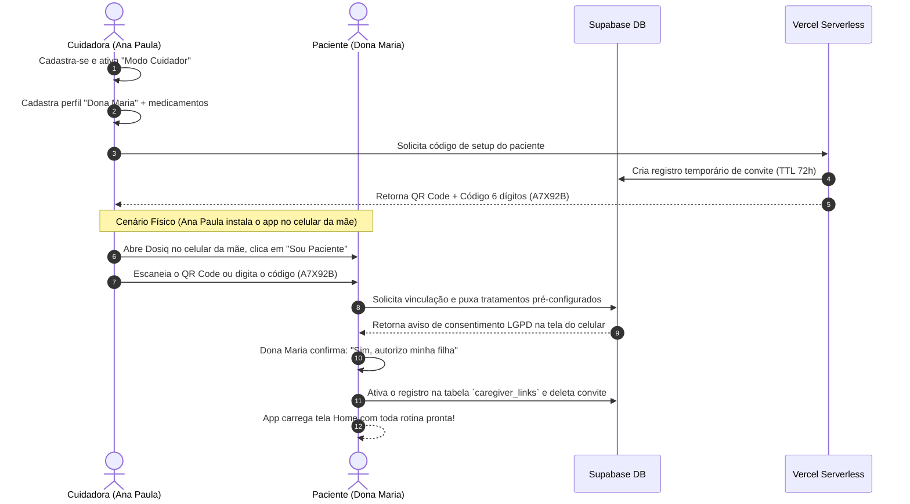

# Plano de Implementação — Modo Cuidador Híbrido Multidispositivo (Dosiq 2026)

> **Versão:** 1.1 — Revisão de 30/05/2026  
> **Changelog v1.0→v1.1:** C-02 (Médico Observador), C-03 (cuidador profissional N pacientes), C-04 (edge cases), C-05 (deeplink universal), C-06 (tabela de alertas), C-07 (TTL/rate-limiting em invites).

Este documento apresenta o plano estratégico, a arquitetura técnica e o design de experiência (UX) para o **Modo Cuidador (Multi-device & Multi-role)** no ecossistema Dosiq. 

Seguindo o feedback do PO, este design inverte a polaridade tradicional da saúde digital: **a carga cognitiva e configuração inicial iniciam-se no Cuidador (filha)**, reduzindo a fricção e as barreiras de letramento digital do Paciente (idoso/dona Maria), mantendo total conformidade com a LGPD e soberania do paciente através de consentimento explícito e revogabilidade imediata.

---

## 👥 Personas & Cenários (Value Prop)

### Cenário 1 — Familiar (Filha cuida da mãe)
*   **A Cuidadora (Ana Paula, filha):** Cadastra-se no Dosiq, ativa o Modo Cuidador e realiza toda a configuração inicial da mãe (nome, medicamentos, posologia com base na receita).
*   **A Paciente (Dona Maria, 67 anos):** Recebe o aplicativo já completamente configurado no seu celular através da leitura de um QR Code ou inserção de um código de 6 dígitos. Ela apenas registra as doses tomadas de forma simples.

### Cenário 2 — Cuidador Profissional (N Pacientes)
*   **O Cuidador (Roberto, enfermeiro):** Cadastra-se no Dosiq com perfil profissional. Gerencia **3-5 pacientes** simultaneamente no seu próprio celular/computador. Cada paciente é um perfil independente com switch via dropdown na barra superior.
*   **Os Pacientes:** Cada um recebe link de instalação individual. Cada vínculo é independente com consentimento LGPD separado.

### Cenário 3 — Médico Observador (Acompanhamento clínico)
*   **O Médico (Dr. Carlos):** Acessa `dosiq.app/doctor/dashboard` (web desktop). Vê lista dos pacientes que lhe deram acesso. Para cada paciente: adesão 7d, último medicamento tomado, score de risco. **Leitura apenas — não registra doses nem edita medicamentos.**
*   **Valor:** Antes da consulta, Dr. Carlos já sabe se Dona Maria está aderindo ou não. Elimina o "tomo tudo direitinho, doutor" e fornece dados objetivos.

---

## 📐 Matriz de Recursos & Permissões (Modelo por Role)

O modelo de permissões usa **3 roles com responsabilidades distintas**:

| Recurso | Paciente | Cuidador (Gestor) | Médico (Observador) |
| :--- | :--- | :--- | :--- |
| **Visualizar Agenda** | ✅ Sim | ✅ Sim | ✅ Sim |
| **Registrar Dose** | ✅ Sim (Check-in físico) | ✅ Sim (Check-in remoto/presencial) | ❌ Não |
| **Cadastrar/Editar Medicamentos** | ❌ Não (Desabilitado) | ✅ Sim (Administração total) | ❌ Não |
| **Ajustar Estoque** | ✅ Sim (Sinaliza que acaba) | ✅ Sim (Ajuste bruto) | ❌ Não |
| **Dashboard de Adesão** | ✅ Sim (própria) | ✅ Sim (do paciente vinculado) | ✅ Sim (read-only, real-time) |
| **Receber alertas de atraso** | — | ✅ Push/WhatsApp/Telegram | ❌ Não (vê no dashboard) |
| **Revogar Acesso** | ✅ Sim (Soberania LGPD) | ❌ Não | ❌ Não |
| **Gerenciar N Pacientes** | ❌ N/A | ✅ Sim (multi-perfil) | ✅ Sim (web dashboard) |

> **Nota sobre o Médico Observador:** Este NÃO é o Portal Clínico B2B do backlog trigger-gated (B02). É uma versão mínima: link read-only com token, sem login do médico, sem prontuário. O B02 completo permanece trigger-gated.

---

## 🔗 Fluxo de Vinculação "Cuidador ➔ Paciente" (Zero Fricção & LGPD)

O fluxo inverte a ativação técnica: o cuidador faz a gestão e o paciente ativa a execução em seu dispositivo com consentimento prévio.



### Detalhes das Abordagens de Instalação/Setup

*   **Cenário Presencial (Ideal):** A filha instala o Dosiq no celular da mãe, escolhe a opção "Sou Paciente", aponta a câmera para o QR Code gerado no seu próprio celular (ou digita o código de 6 dígitos) e confirma o consentimento da mãe.
*   **Cenário Remoto:** A filha envia um **deeplink universal** via WhatsApp da mãe: `https://dosiq.app/invite/A7X92B`. Ao clicar:
    *   **Se app instalado:** Abre diretamente no fluxo de vinculação com código pré-preenchido.
    *   **Se app NÃO instalado:** Redireciona para App Store/Play Store. Após instalação, o deeplink é preservado e carrega o código na primeira abertura.
    *   **Implementação:** Universal Links (iOS) + App Links (Android) + fallback para página web de instrução. Spec existente em [EXEC_SPEC_DEEPLINK_UNIVERSAL_LINKS_WEB_BANNER.md](../backlog-native_app/EXEC_SPEC_DEEPLINK_UNIVERSAL_LINKS_WEB_BANNER.md).
*   **Cenário Multi-Paciente (Cuidador Profissional):** Após vincular o primeiro paciente, o cuidador pode criar novos perfis (dropdown "+" na barra superior), gerar novos códigos de convite, e alternar entre pacientes via seletor. Cada paciente = vínculo independente com consentimento LGPD separado.
*   **Revogação Soberana (LGPD):** A qualquer momento, na tela de Configurações do App da Dona Maria, ela pode clicar em **"Revogar Acesso do Cuidador"**. Isso deleta a linha de relacionamento no Supabase de forma imediata e permanente, fazendo com que o app dela volte a funcionar de forma local isolada, barrando o acesso do cuidador via RLS do banco de dados.

---

## 🔔 Tabela de Eventos & Alertas para o Cuidador

| Evento | Delay | Canal | Template |
|--------|-------|-------|----------|
| Dose atrasada | 30 min após `scheduled_for` | Push nativo + WhatsApp/Telegram | "Dona Maria ainda não registrou Losartana 50mg (08:00). Que tal ligar?" |
| Dose perdida (não registrada) | Ao marcar `status='missed'` | Push nativo | "Dona Maria perdeu a dose de Losartana 50mg ontem às 22:30." |
| Estoque crítico (<3 dias) | Ao detectar no cron de estoque | Push + WhatsApp/Telegram | "Estoque de Losartana de Dona Maria acaba em 2 dias." |
| Receita vencendo | 7 dias antes de `prescription_end` | Push nativo | "Receita de Losartana de Dona Maria vence em 7 dias." |
| Adesão semanal baixa (<50%) | No digest semanal (domingo 20h) | WhatsApp/Telegram | "Adesão de Dona Maria esta semana: 42%. Que tal conversar com ela?" |
| Vinculação revogada | Imediato | Push nativo | "Dona Maria revogou seu acesso de cuidador." |

---

## ⚡ Motor de Notificações Híbrido (Dual-Alert & Custo R$0)

Para manter a cota de 1.000 conversas gratuitas por mês da Meta Cloud API (WhatsApp Business), adotaremos um sistema inteligente de **Push-First** no paciente e **WhatsApp/Telegram de Segurança** para o cuidador.

*   **08:00 (Hora da Dose):** Dispara o **Alarme Nativo Persistente** no celular da Dona Maria (não push comum — alarme full-screen via AlarmManager/Critical Alerts).
*   **08:15 (15 min de atraso):** Dispara Alarme Sonoro mais insistente (*Nagging*) no celular da mãe.
*   **08:30 (30 min de atraso):** A dose não foi registrada. O Cron Job no backend detecta o atraso e dispara um **WhatsApp/Telegram para a cuidadora (Ana Paula)**:
    *   *"Olá Ana Paula! Dona Maria ainda não registrou o medicamento Losartana 50mg agendado para as 08:00. Que tal dar uma ligadinha para ela?"*
*   **Fidelidade do Status:** Se a filha ligar e a mãe confirmar que tomou, a filha pode clicar no botão **"Confirmar Dose"** no seu próprio WhatsApp ou Painel Web/App, registrando remotamente a dose da mãe. O celular da mãe atualiza em tempo real.

---

## 🛠️ Arquitetura Técnica & Banco de Dados

### 1. Modelagem das Tabelas (Supabase PostgreSQL)

```sql
-- Convites/códigos de setup temporários
CREATE TABLE caregiver_invites (
  code CHAR(6) PRIMARY KEY,
  caregiver_user_id UUID NOT NULL REFERENCES auth.users(id), -- Quem criou o convite
  patient_profile_id UUID NOT NULL, -- Perfil de paciente criado temporariamente
  created_at TIMESTAMPTZ DEFAULT now() NOT NULL,
  expires_at TIMESTAMPTZ NOT NULL,  -- TTL de 72h (renovável)
  attempts INT DEFAULT 0,           -- Rate-limiting: max 5 tentativas
  CONSTRAINT max_attempts CHECK (attempts <= 5)
);

-- Tabela principal de vínculos ativos
CREATE TABLE caregiver_links (
  id UUID PRIMARY KEY DEFAULT gen_random_uuid(),
  patient_id UUID REFERENCES auth.users(id) ON DELETE CASCADE NOT NULL,
  caregiver_id UUID REFERENCES auth.users(id) ON DELETE CASCADE NOT NULL,
  role TEXT DEFAULT 'manager' CHECK (role IN ('manager', 'observer')),
  notification_channel TEXT DEFAULT 'whatsapp' CHECK (notification_channel IN ('whatsapp', 'telegram', 'both', 'none')),
  created_at TIMESTAMPTZ DEFAULT now() NOT NULL,
  UNIQUE(patient_id, caregiver_id)
);
```

**Notas sobre segurança de `caregiver_invites`:**
- **TTL:** Convites expiram em 72h (`expires_at`). Cron job limpa expirados diariamente.
- **Rate-limiting:** Máximo 5 tentativas de resgate por código. Após 5 falhas, código invalidado.
- **Geração de código:** Alfanumérico uppercase (sem O/0/I/1 para evitar confusão), 6 dígitos = 14.7M combinações.
- **Limpeza:** Convite é deletado imediatamente após vinculação bem-sucedida.

### 2. Segurança no Banco (Row-Level Security - RLS)

Os repositórios em `@dosiq/core` compartilharão a mesma lógica sem duplicações de código no PWA ou Native, pois as políticas RLS filtram automaticamente os dados com base no usuário autenticado.

**Exemplo de Política RLS na tabela `protocols` (Tratamentos):**

```sql
ALTER TABLE protocols ENABLE ROW LEVEL SECURITY;

-- Paciente lê seus próprios tratamentos
CREATE POLICY "patient_read_protocols" ON protocols
  FOR SELECT USING (auth.uid() = user_id);

-- Cuidador (manager) lê e escreve nos tratamentos do paciente vinculado
CREATE POLICY "caregiver_manage_protocols" ON protocols
  FOR ALL USING (
    EXISTS (
      SELECT 1 FROM caregiver_links 
      WHERE caregiver_links.caregiver_id = auth.uid() 
        AND caregiver_links.patient_id = protocols.user_id
        AND caregiver_links.role = 'manager'
    )
  );

-- Médico (observer) apenas lê os tratamentos do paciente vinculado
CREATE POLICY "observer_read_protocols" ON protocols
  FOR SELECT USING (
    EXISTS (
      SELECT 1 FROM caregiver_links 
      WHERE caregiver_links.caregiver_id = auth.uid() 
        AND caregiver_links.patient_id = protocols.user_id
        AND caregiver_links.role = 'observer'
    )
  );
```

---

## 🛡️ Edge Cases & Resiliência

| Edge Case | Tratamento |
|-----------|-----------|
| **Cuidador deleta o app** | Vínculo persiste no Supabase. Se cuidador reinstalar + logar, reconecta automaticamente. Paciente continua funcionando normalmente (standalone). |
| **Paciente troca de celular** | Ao logar com mesma conta no novo celular, vínculo com cuidador persiste via Supabase. App do paciente carrega dados do servidor. |
| **Cuidador perde acesso ao telefone** | Paciente pode revogar acesso no app (soberania LGPD). Cuidador pode relogar em outro device. |
| **Dois cuidadores para o mesmo paciente** | `UNIQUE(patient_id, caregiver_id)` — cada vínculo é independente. Paciente pode ter filha (manager) + enfermeira (manager) + médico (observer). |
| **Código expirado** | App mostra "Código expirado. Peça um novo código ao seu cuidador." Cuidador gera novo código em 1 toque. |
| **Cuidador desvinculado pelo paciente** | Push nativo para cuidador: "Dona Maria revogou seu acesso." Dados do paciente não são mais acessíveis via RLS. |
| **Paciente sem internet** | Doses registradas localmente em `AsyncStorage`. Sync automático ao reconectar. Cuidador vê status "offline" no dashboard. |

---

## 🧩 Integração Monorepo: Consistência "@dosiq/core"

1.  **`createCaregiverRepository.js` [NEW]** em `packages/core/src/repositories/`:
    *   `createPatientProfile(patientData)`: Criador do perfil temporário pelo cuidador.
    *   `generateSetupCode(profileId)`: Retorna o código de 6 dígitos/QR Code.
    *   `linkDevice(code, patientUserId)`: Vincula o ID físico do dispositivo do paciente e dispara tela de consentimento.
    *   `revokeLink(patientUserId, caregiverUserId)`: Destrói o vínculo.
    *   `listLinkedPatients(caregiverId)`: [NEW] Retorna lista de pacientes vinculados (para multi-perfil).
    *   `getPatientDashboard(patientId)`: [NEW] Retorna dados agregados para dashboard do médico observador.
2.  **Roteador de Webhooks Único:**
    *   Criaremos o endpoint serverless único `api/webhooks.js` que gerenciará as chamadas da Meta Cloud API (WhatsApp) e do Bot do Telegram, otimizando o consumo de slots (max 12 functions) da Vercel.
    *   **Nota:** Esse roteador é uma refatoração significativa — requer exec spec própria (ver PHASE_7).

---

## 📋 Plano de Verificação (QA Gate)

### Testes Automatizados (Vitest no Monorepo)
*   **`createCaregiverRepository.test.js`**:
    *   [ ] Testar fluxo completo de criação de perfil, token, leitura e ativação do vínculo.
    *   [ ] Validar que após revogação, o RLS bloqueia o acesso do cuidador instantaneamente.
    *   [ ] Testar rate-limiting em `caregiver_invites` (>5 tentativas = código invalidado).
    *   [ ] Testar expiração de convite (TTL 72h).
    *   [ ] Testar vinculação de múltiplos pacientes para cuidador profissional.
    *   [ ] Testar que médico observador NÃO consegue escrever dados (RLS `role='observer'`).

### Verificação Manual (Smoke PO)
*   [ ] **Cenário 1 (Setup por QR Code):** Cuidadora cria perfil no app/web ➔ gera QR Code ➔ Abre o app do paciente ➔ Escaneia QR Code ➔ Confirma consentimento ➔ Confirma sincronia instantânea da lista de medicamentos pré-configurados.
*   [ ] **Cenário 2 (Setup Remoto via Deeplink):** Cuidadora gera link ➔ Envia via WhatsApp ➔ Paciente clica ➔ App abre com código pré-preenchido (ou redireciona para Store) ➔ Confirma consentimento ➔ Tudo configurado.
*   [ ] **Cenário 3 (Multi-Paciente):** Cuidador profissional vincula 3 pacientes ➔ Verifica switch de perfil ➔ Dados isolados entre pacientes.
*   [ ] **Cenário 4 (Médico Observador):** Médico acessa dashboard web ➔ Vê adesão do paciente ➔ Confirmar que NÃO consegue registrar dose nem editar medicamentos.
*   [ ] **Cenário 5 (WhatsApp Alertas):** Simula atraso de 30 min ➔ Confirma recebimento do lembrete de emergência no WhatsApp/Telegram do cuidador.
