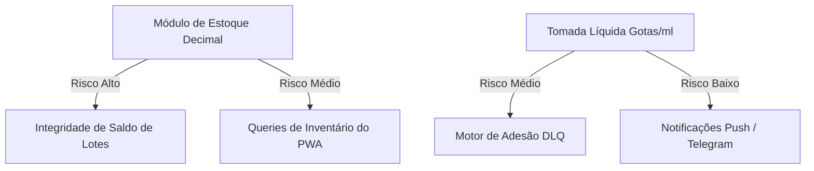

# Epic Draft — Arquitetura de Apresentações Líquidas e Frações de Volume

Este documento atua como especificação técnica de longo prazo e guia permanente de engenharia para o desenvolvimento do próximo épico focado no suporte nativo a **Apresentações Líquidas (Xaropes, Gotas, Soluções Orais e Suspensões)** no ecossistema **Dosiq**.

Ele detalha a transição conceitual de unidades discretas para volumes contínuos, fornecendo a modelagem de dados PostgreSQL/Supabase, as fórmulas físicas, o fluxo de UX/UI para Web/Mobile, o comportamento do bot do Telegram e a estratégia de migração segura de dados históricos.

---

> **⚠️ Revisão (2026-05-29) — alinhamento com o refactor `dose_instances` e schema real (ADR-052).** Ler antes das seções abaixo:
> - **Colunas de dose JÁ são `numeric`** (`medicine_logs.quantity_taken`, `dose_instances.expected_dose`, `protocols.dosage_per_intake`, verificado em prod). A **dose fracionada (2,5 ml, 0,75 ml) já cabe sem migration de coluna.** Os `ALTER` deste draft que continuam válidos são só os de **estoque** (`current_volume_ml`, `drops_per_ml`, `total_volume_ml`) e **definição** (`is_liquid`), não os de dose.
> - **Nomes de tabela reais:** `medicine_logs` (não `dose_logs`/`dose_log`), `stock` (não `stock_items`/`purchases`). O decremento fracionado deve espelhar o `consume_stock_fifo` existente (RPC), não um trigger paralelo solto — avaliar estender o RPC atual vs. criar um unit-aware.
> - **Parede de unidade compartilhada:** este épico e o de diabetes ([draft](./draft_plan_diabetic_support.md)) batem na **mesma** parede (dose+estoque+display na `dosage_unit`). É **uma** fundação. **Sequência (ADR-052): líquidos ANTES de diabetes** — líquidos exercita a unidade sem biomarcadores/TTL/SaMD.
> - **Adesão por razão já é unit-agnóstica** no refactor (`Σaplicado/Σesperado` por medicamento). O que falta é o decremento de estoque unit-aware + `formatDoseUnit` por unidade (ADR-046) + revisar o cap Zod 100 (R-022, pill-specific).
> - **Pré-requisito:** refactor `dose_instances` aterrissado (Fases 2-4). Os seams da Fase 3 (ADR-052) preparam a leitura.

---

## 🔍 1. O Problema e Descoberta Arquitetural

Atualmente, o Dosiq funciona sob um modelo linear de **unidades discretas e inteiras** (ex: `-1 comprimido` no estoque). Contudo, apresentações líquidas exigem a coexistência de três grandezas independentes que não se alinham de forma linear:

* **Concentração do Medicamento:** Expressa em razão de massa por volume (ex: `20 mg / ml`, `100 mg / ml`, `50 mcg / gota`).
* **Volume da Tomada (Física):** Quantidade física consumida a cada dose pelo paciente, medida em volume contínuo ou contagem de gotas (ex: tomar `2,5 ml` ou `15 gotas`).
* **Volume de Embalagem (Estoque):** Unidade física de embalagem contendo volume total fechado (ex: `1 frasco de 100 ml`).

### O Gargalo Atual no Saldo
No modelo atual, se o usuário toma `2,5 ml` de um xarope cadastrado em um frasco de `100 ml`, o sistema deduz o saldo de forma inteira (`-1 frasco`), o que induz o usuário a acreditar que seu estoque zerou instantaneamente. A baixa real deve ser contínua e fracionada: deduzir `2,5 ml` do volume restante interno do frasco ativo (reduzindo-o para `97,5 ml`).

---

## 🛠️ 2. Fórmulas Matemáticas e Engine de Conversão

O motor lógico compartilhado (`packages/core/src/utils/doseUnit.js`) precisará estender as regras de cálculo para processar decimais e mapear razões métricas.

### A. Conversão de Gotas para Mililitros
Quando a dose for prescrita em gotas, o sistema converterá para mililitros antes de calcular a carga ativa e abater o volume do estoque:

$$VolumeDeBaixa(ml) = \begin{cases} 
Dose(ml) & \text{se tomada especificada em ml} \\
\frac{Dose(gotas)}{drops\_per\_ml} & \text{se tomada especificada em gotas} 
\end{cases}$$

> *Nota:* O fator padrão de mercado (`drops_per_ml`) é **`20 gotas = 1 ml`**, mas o sistema permitirá personalização por medicamento (ex: gotas de suspensão lipídica que possuem densidade diferente).

### B. Cálculo da Carga Ativa Consumida (Princípio Ativo)
O sistema multiplicará o volume físico consumido pela razão de concentração para exibir a equivalência de massa na UI e nos relatórios de adesão:

$$\text{Massa Ativa (mg)} = VolumeDeBaixa(ml) \times \text{Concentração (mg/ml)}$$

* **Exemplo A (ml):** Tomada de `2,5 ml` de Paracetamol `20 mg/ml` $\rightarrow$ $2,5 \times 20 = 50$ mg de ingrediente ativo.
* **Exemplo B (gotas):** Tomada de `15 gotas` de Dipirona `500 mg/ml` (com `drops_per_ml = 20`):
  * $Volume = \frac{15}{20} = 0,75$ ml
  * $Ativo = 0,75 \text{ ml} \times 500 \text{ mg/ml} = 375$ mg de ingrediente ativo.

---

## 🛢️ 3. Modelagem de Dados (PostgreSQL / Supabase)

Para persistir essas grandezas decimais de forma precisa, utilizaremos campos do tipo `numeric(10, 2)` (evitando imprecisões de ponto flutuante de campos `real`/`float`) e criaremos colunas de rastreamento contínuo.

### A. Tabela `medicines` (Metadados do Produto)
```sql
-- Extensão para suportar os tipos líquidos
ALTER TABLE medicines
ADD COLUMN is_liquid BOOLEAN DEFAULT FALSE,
ADD COLUMN package_volume_ml NUMERIC(10, 2) DEFAULT NULL, -- ex: 100.00 ml
ADD COLUMN drops_per_ml INTEGER DEFAULT 20;               -- fator de conversão de gotas
```

### B. Tabela `purchases` / `stock_items` (Lotes do Estoque)
```sql
-- Rastreamento interno do volume fluido de cada lote comprado
ALTER TABLE stock_items
ADD COLUMN total_volume_ml NUMERIC(10, 2) DEFAULT NULL,   -- ex: 100.00 (volume inicial do frasco)
ADD COLUMN current_volume_ml NUMERIC(10, 2) DEFAULT NULL; -- ex: 97.50 (volume líquido restante)
```

### C. Estratégia de Abatimento FIFO por Lote (SQL Trigger)
Quando um registro de dose (`dose_logs`) for inserido, um trigger ou stored procedure fará o abatimento fracionado dos lotes de estoque associados ao usuário por ordem de validade (FIFO):

```sql
CREATE OR REPLACE FUNCTION deduct_liquid_stock()
RETURNS TRIGGER AS $$
DECLARE
  v_remaining_deduction NUMERIC(10, 2);
  v_current_lot RECORD;
  v_deducted NUMERIC(10, 2);
BEGIN
  -- Verifica se o medicamento associado é líquido
  IF EXISTS (SELECT 1 FROM medicines WHERE id = NEW.medicine_id AND is_liquid = TRUE) THEN
    -- Calcula o volume necessário para a dose em ml
    v_remaining_deduction := NEW.volume_consumed_ml;

    -- Loop FIFO sobre os lotes de estoque disponíveis (ordenados por expiração)
    FOR v_current_lot IN 
      SELECT id, current_volume_ml 
      FROM stock_items 
      WHERE medicine_id = NEW.medicine_id AND current_volume_ml > 0
      ORDER BY expiration_date ASC NULLS LAST, created_at ASC
    LOOP
      EXIT WHEN v_remaining_deduction <= 0;

      IF v_current_lot.current_volume_ml >= v_remaining_deduction THEN
        -- O lote atual cobre toda a dedução restante
        UPDATE stock_items 
        SET current_volume_ml = current_volume_ml - v_remaining_deduction
        WHERE id = v_current_lot.id;
        
        v_remaining_deduction := 0;
      ELSE
        -- O lote atual cobre apenas parte (zera o lote e passa para o próximo)
        v_remaining_deduction := v_remaining_deduction - v_current_lot.current_volume_ml;
        
        UPDATE stock_items 
        SET current_volume_ml = 0
        WHERE id = v_current_lot.id;
      END IF;
    END LOOP;
  END IF;
  RETURN NEW;
END;
$$ LANGUAGE plpgsql;
```

---

## 🎨 4. Fluxo de Experiência do Usuário (UX/UI)

### A. Cadastro de Medicamento (PWA & Mobile)
Ao selecionar que o medicamento é líquido ou escolher a unidade `'mg/ml'` ou `'mcg/ml'`:
1. **Ativação Dinâmica:** O formulário expande a seção "Propriedades do Líquido".
2. **Novos Campos:**
   * **Volume Comercial (ml):** Input numérico (ex: `100` ml, `15` ml).
   * **Concentração Ativa:** Input numérico e select de razão (ex: `20` no valor, `mg/ml` na unidade).
   * **Conversor de Gotas (Opcional):** Toggle "Cadastrar dose em gotas" que abre o fator `drops_per_ml` (pré-preenchido com `20`).

### B. Wizard de Tratamento (Criação de Protocolo)
* **Passo de Dosagem (Tomada):**
  * O sistema detecta o tipo de medicamento. O campo de input passa a se chamar **"Volume por dose"** (com sufixo `ml`) ou **"Quantidade de Gotas"** (com sufixo `gotas`), dependendo da preferência configurada no medicamento.
  * **Micro-Hint Dinâmico:** Conforme o usuário preenche a tomada (ex: `5 ml`), um texto elegante aparece abaixo: `✨ Corresponde a 100 mg de princípio ativo.`
* **Passo de Estoque (Inventário Inicial):**
  * Em vez de perguntar "Quantidade (comprimidos)", pergunta **"Quantidade de Frascos"** (ex: `2 frascos`).
  * O sistema faz a conta de volume em segundo plano: `2 frascos × 100 ml = 200 ml no inventário`.

### C. Painel de Estoque (Detalhamento do Saldo)
* O indicador visual exibe o saldo de forma granular e textual:
  * **Visualização Principal:** `1,5 frasco` ou `150 ml restantes`.
  * **Consumo Diário Estimado:** `Resta para aproximadamente 30 dias` (calculado dividindo o volume total restante pelo volume consumido por dia).

---

## 🤖 5. Integração com o Bot do Telegram

O bot receberá mensagens enriquecidas e suportará confirmação de doses contínuas:

1. **Lembrete Personalizado:**
   * Mensagem: `"🔔 Hora do seu Ibuprofeno! Tomar 2,5 ml (50 mg) agora."`
   * Gotas: `"🔔 Hora da sua Dipirona! Tomar 15 gotas (375 mg) agora."`
2. **Ações Rápidas ("Tomei"):**
   * Ao clicar em "Tomei", a requisição envia o payload contendo o volume fracionado (`2.5`). A API debita do banco de dados exatamente `2.5` mililitros, disparando o trigger de inventário.
3. **Alerta de Frasco Vazio:**
   * Se o saldo do frasco atual cair abaixo da dose prescrita, a notificação avisa: `"⚠️ Seu frasco ativo está no fim (restam apenas 1,5 ml). Lembre-se de abrir um novo frasco!"`

---

## 🚦 6. Estratégia de Retrocompatibilidade e Migração de Dados

Para garantir uma implantação em produção sem interrupção de serviço (zero-downtime):

1. **Campos Opcionais (`Nullable`):** Todas as novas colunas no banco de dados devem aceitar valores nulos (`NULL`) ou possuir defaults coerentes (`FALSE` para `is_liquid`).
2. **Tratamento no Core:** O motor do pacote compartilhado tratará qualquer registro legado onde `is_liquid IS NULL` como medicamento sólido padrão (comportamento linear discreto de comprimidos).
3. **Conversão Segura de Unidades Existentes:** Se houver no banco medicamentos legados criados com a unidade `ml` ou `gotas` de forma antiga, rodaremos uma migração de dados de backfill para preencher `package_volume_ml` baseado nas compras registradas ou definir `is_liquid = TRUE` de forma inteligente:

```sql
-- Backfill seguro: se o medicamento já tem unidade 'gotas' ou 'ml', marca como líquido
UPDATE medicines
SET is_liquid = TRUE,
    drops_per_ml = 20
WHERE dosage_unit IN ('ml', 'gotas');

-- Inicializa o estoque líquido existente com base nas quantidades físicas compradas
UPDATE stock_items s
SET total_volume_ml = m.package_volume_ml,
    current_volume_ml = m.package_volume_ml * s.quantity
FROM medicines m
WHERE s.medicine_id = m.id AND m.is_liquid = TRUE AND s.current_volume_ml IS NULL;
```

---

## ⚠️ 7. Mapeamento de Risco, Impacto e Dificuldade

Abaixo está mapeada a complexidade técnica e o raio de impacto de cada componente afetado pelo desenvolvimento deste épico.

### A. Tabela de Esforço e Complexidade por Módulo

| Módulo / Camada | Nível de Dificuldade | Principais Riscos e Desafios | Tempo Estimado |
| :--- | :--- | :--- | :--- |
| **Banco de Dados & RLS** | **Alta** | Suporte a saldo decimal (`numeric`), baixa FIFO fracionada no Supabase e concorrência em triggers. | 1.5 dia |
| **Lógica Core (`packages/core`)** | **Média** | Regras de conversão matemática `ml` $\times$ `mg/ml` $\rightarrow$ `mg`. Testes de borda em arredondamento. | 0.5 dia |
| **PWA Web Form & Wizard** | **Média-Alta** | Gerenciar o estado dinâmico do formulário no Step 2/3 com inputs e validações de volume. | 1.0 dia |
| **Mobile App Screens** | **Média-Alta** | Layouts responsivos em React Native para novos inputs condicionais do Onboarding/Medicamentos. | 1.0 dia |
| **Bot do Telegram** | **Média** | Parsing de inputs decimais vindos de botões em linha e mensagens com renderização mista. | 0.5 dia |
| **Total Estimado** | **Alta** | **Aproximadamente 4.5 dias de engenharia contínua.** | — |

### B. Mapeamento de Impacto e Blast Radius (Raio de Destruição)



1. **Risco de Underflow de Lotes de Estoque:**
   * *Risco:* Triggers de dedução contínua podem gerar saldos negativos decimais (ex: `-0.01 ml`) devido a erros de precisão matemática.
   * *Mitigação:* Usar o tipo SQL `numeric(10,2)` no Postgres de forma estrita em vez de `real`/`double precision` e impor uma check constraint `current_volume_ml >= 0`.
2. **Impacto no Motor de Adesão (DLQ):**
   * *Risco:* O DLQ calcula o cumprimento de doses baseado na dedução total. Se a dose tomada diferir por dízimas decimais do estoque deduzido, podem ocorrer inconsistências.
   * *Mitigação:* Truncar cálculos de tomadas para 2 casas decimais em todas as validações lógicas.
3. **Complexidade de Transição de UX:**
   * *Risco:* Apresentar campos de "gotas" e "ml" no mesmo formulário pode confundir usuários idosos ou crônicos habituados a comprimidos.
   * *Mitigação:* Desenvolver micro-copywriting explicativo e ilustrações dinâmicas indicando visualmente um frasco ao selecionar `'mg/ml'`.
